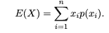
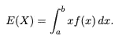
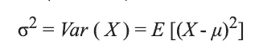
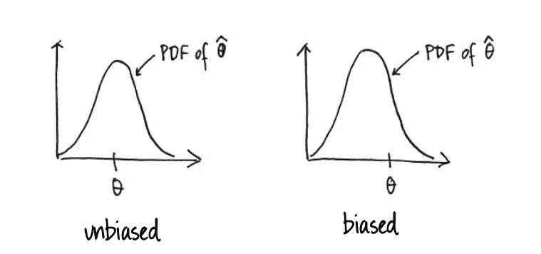
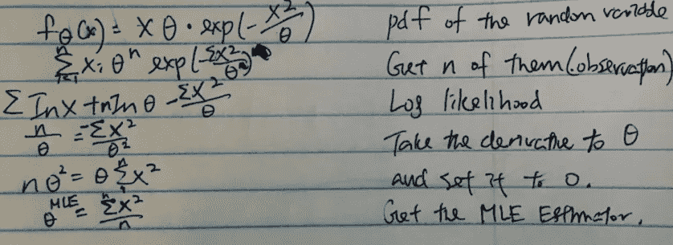
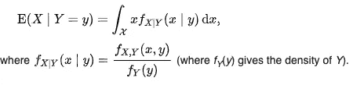
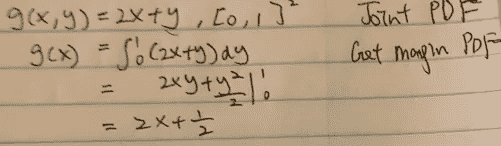
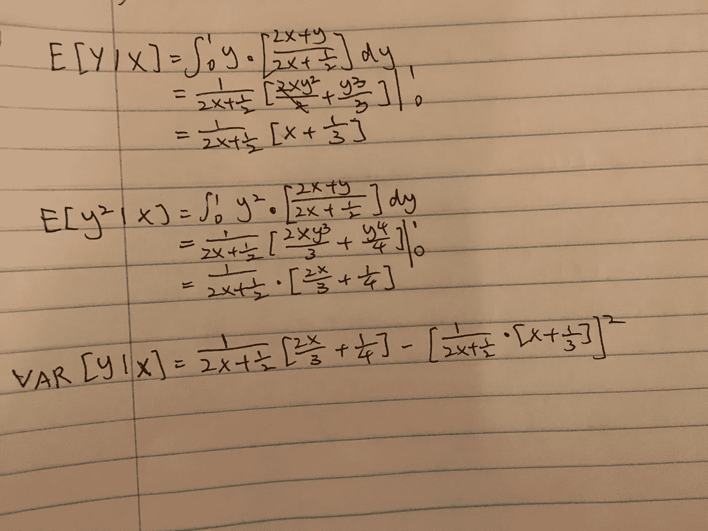

# 从零到精通的期望和差异

> 原文：<https://towardsdatascience.com/estimation-of-expectation-and-variance-from-zero-to-mastery-4a6e8a2038cf?source=collection_archive---------22----------------------->

## 直觉和数学理解从随机变量到贝叶斯统计

# 介绍

期望和方差是一个基本而又重要的话题。为了解决统计问题和理解机器学习，数据科学家必须深入理解这一主题。

让我们做一个快速测试来检查你的理解。

1.  你如何从 PDF 或 CDF 中得到期望和方差？
2.  如果 PDF 或 CDF 没有明确定义，还有什么其他方法？
3.  什么是渐近方差？我们如何计算它，为什么它很重要？
4.  给定我们的特征，目标变量的条件期望和条件方差是什么？如何应用于线性回归？
5.  期望和方差如何应用于贝叶斯统计？

Photo from Escape Adulthood

# 基本形式和意义

## 预期

直观上，期望是随机变量的大量独立实现的平均值。假设 X 是我们对日降雪量的观测值，我们想估计平均降雪量。所以我们在 X 上观察了 n 个数据点，得到一个平均值——**μ。**

当我们得到一个分布时，我们将所有事件的值相加——x 表示一个概率。

The expectation from PMF for discrete random variables

The expectation from PDF for continuous random variables

## 差异

方差衡量每个数据点与平均值之间的差异。

当样本量接近无限大时，可以解释为**1/观察次数*总和(每次观察值-均值)**

记住方差还有另一种形式，你可能已经遇到过了。下面是推导过程

Derivation of another form of variance

这两个公式本质上是一样的。

# 采样离散

记住，给定样本，统计是任何可计算的东西。如果用和上面一样的公式得到样本量小的样本方差，结果会有偏差。这意味着它没有足够好地逼近潜在的人口方差。所以你需要将有偏方差乘以 **n/(n-1)** 得到无偏样本方差。

> 无偏样本方差= **1/(观察次数-1)*总和(每个观察值-平均值)**

## 渐近方差

一、**渐近**是什么意思？在统计学中，它只是意味着接近无穷大的极限。这是中心极限定理的核心，当 ***样本量增加*** 时，基础样本分布越来越接近总体参数，我们说它最终将接近正态分布，呈钟形，对称形式，两边都有尾部。

也就是说，渐近方差仅仅意味着方差是基于样本数量接近无穷大的假设而近似得到的。

# 估计

当我们的总体分布未知时，我们估计基本分布的参数。然而，得到一个平均值并不容易，因为如果基础分布不稳定，它并不总是最好的选择。

这里有一些有用的方法来得到一个好的估计。

## 最大似然估计

最大似然估计是统计学中最重要的估计方法。该方法旨在找到描述观测数据的最可能的参数。要做到这一点，我们只需对我们的 pdf 取一个关于参数的偏导数，并将其设置为零。如果求导太难，有一个叫做**对数似然法**的技巧，我们只需对函数的自然对数求导，就能得到局部最大值。

这里有一个例子，你观察 x，发现他们遵循一个 x*θ*e^(-x /θ的 pdf，并带有一个参数θ，你想找到一个估计量，最好地描述了基础数据。所以你取了 n 个样本，对对数似然性求导。通过以下计算，您发现最能描述基础数据的估计量是 sum(Xi )/n

Example of MLE

以下是一些负面属性:

1.  计算复杂性。上面的例子只有一个参数。如果有多个呢？有时分布有太多的参数，对它求导是很昂贵的。
2.  对损坏的数据不是很健壮。由于最大似然估计是基于求导，我们可能无法达到全局最大值。

## **达美尔法**

如果我们需要求一些样本的渐近方差怎么办？如果我们的样本量很大就好了，我们可以用中心极限定理来推导它们。然而，如果我们的样本量不够大，而我们仍然想估计我们人口的潜在分布，该怎么办呢？如果我们连一个定义明确的 PDF 都没有，那么我们甚至不能用 MLE 来估计我们的分布呢？

它叫德尔塔法，利用 [**泰勒**](https://en.wikipedia.org/wiki/Taylor_series) **逼近**从中心极限定理得到类似的渐近结果。我不会在这里过多地谈论泰勒级数，但它是一种用微分来逼近基本函数的方法。德尔塔的方法也是如此。它对我们的参数求导，并近似具有正态分布特性的另一种形式的方差。

## 费希尔信息

在多元假设检验中，我们希望检验期望和方差是否都等于我们提出的参数。如果我们想找出方差的方差呢？费希尔信息给你一个均值和方差之间的协方差矩阵。有两种计算方法。

1.  似然函数的二阶导数的期望值为负
2.  似然函数的一阶导数的方差

## 矩法

这个[方法](https://en.wikipedia.org/wiki/Method_of_moments_(statistics))允许你计算任意顺序的统计数据。比如计算 E[X ]和 E[X]可以让你同时得到期望和方差。此外，您可以将兴趣参数从一种方式映射到另一种方式。

## m 估计

这种方法非常灵活。m 估计可用于估计给定𝑥的𝑌的均值、中值和分位数，甚至无需假设统计模型。

# 条件性和线性回归

## 总期望定律

> E(X) = E(E[X|Y ])

一个简单的例子可以说明这个规律。假设你去买杂货。每次旅行花费多少取决于你去的是好市多(P = 0.4)还是沃尔玛(P=0.6)。平均来说，你在好市多花了 100 美元，在沃尔玛花了 80 美元。然后，您希望找出食品杂货成本的期望值，计算结果为 100 * 0.4+80 * 0.6 = 88 美元。

## 条件期望和条件方差

这个主题对于推导回归函数至关重要。它解释了为什么我们的函数是 Y = a+bx，它是极小值。

假设你预测给定 X 的 Y，你推导出 **f(x，y)= 2X+Y** 存在于[0，1]的样本空间中，给定 X 的 Y 的条件期望是什么？预测 Y 周围的可变性呢？

Conditional expectation of X given Y

这里我们确实需要理解**贝叶斯规则**来推导给定 y 的 X 的条件 pdf。如果你需要复习一下，我将在本文的结尾谈到它。

但首先，你需要找到**边际 PDF** ，它可以很容易地从关于 y 的联合 PDF 中整合出来。

要找到条件期望和条件方差，需要进行以下推导。

# 贝叶斯统计

## 介绍

比方说，如果下雪，我们在一天中以 0.2 的概率去杂货店，如果不下雪，以 0.6 的概率去杂货店。一天下雪的概率是 0.1。然后我们问自己，假如那天我们决定呆在家里，下雪的概率有多大？

## 例子

在贝叶斯统计中，我们结合我们的新观察来更新先验，以获得后验分布。假设我们从一袋 4 枚硬币中挑选一枚，他们的偏好分别是 0.2，0.4，0.6，0.8。你随机选一枚硬币，然后扔出去。结果是六分之三的头着地。给定这些信息，你将如何更新硬币袋的偏差？

## 它与方差有什么关系？

这个想法是**标准差捕捉不确定性，从而给我们关于后验分布的信息。**这个意义上的先验可以用 Jeffrey 的先验代替，它取 Fisher 信息的平方根。如果没记错的话，费雪信息只是基于 MLE 计算方差的另一种方式。

# 评论

下次当有时要求你计算一个基本分布的期望或方差时，你要澄清一些假设:数据的函数是可计算的吗？我们的样本量是多少？我们的数据是假设正态分布的吗？我们假设任何条件吗？它是用来做什么的？这些问题将帮助你理解如何正确地计算它。