# 估计器、损失函数、优化器——最大似然算法的核心

> 原文：<https://towardsdatascience.com/estimators-loss-functions-optimizers-core-of-ml-algorithms-d603f6b0161a?source=collection_archive---------7----------------------->

为了理解机器学习算法如何从数据中学习以预测结果，理解训练算法所涉及的基本概念是必不可少的。

我假设你有基本的机器学习知识，也有概率和统计的基本知识。如果没有，请浏览我之前的帖子[这里](/machine-learning-basics-part-1-a36d38c7916)和[这里](/machine-learning-probability-statistics-f830f8c09326)。这篇文章涉及到一些理论和数学，所以请耐心听我说，一旦你读到最后，当我们把这些点联系起来的时候，它会变得完全有意义。


[source](https://www.mtsd.k12.nj.us/domain/1249)

# 评估者

**估计**是一个统计术语，用于在给定一些数据的情况下，找到未知参数的一些估计值。点估计是试图对某些感兴趣的量提供单一的最佳预测。

感兴趣的数量可以是:

*   单一参数
*   参数向量，例如线性回归中的权重
*   整体功能

## 点估计量

为了区分参数的估计值和它们的真实值，参数`**θ**`的点估计值用`**θˆ**` **表示。**设`**{x(1) , x(2) ,..x(m)}**`为`**m**` 独立同分布的数据点。那么点估计量是数据的任何函数:

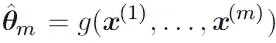

点估计量的这个定义是非常通用的，它允许估计量的设计者有很大的灵活性。虽然几乎任何函数都可以作为估计量，但好的估计量是其输出接近生成训练数据的真实基本θ的函数。

点估计也可以指输入和目标变量之间关系的估计，称为函数估计。

## 函数估计

这里我们试图预测一个给定输入向量 x 的变量 y .我们假设有一个函数`**f(x)**`描述了 y 和 x 之间的近似关系.例如

我们可以假设`**y = f(x) + ε**`，其中`**ε**` 代表`**y**` 中从`**x**`不可预知的部分。在函数估计中，我们感兴趣的是用模型或估计`**fˆ**`来近似`**f**` 。函数估计真的就跟估计一个参数`**θ**`一样；函数估计量`**fˆ**`简单来说就是函数空间中的点估计量。例如:在多项式回归中，我们要么估计一个参数`***w***` ，要么估计一个从`***x***` 到`**y**`的函数映射。

# 偏差和方差

偏差和方差衡量估计量中两种不同的误差来源。偏差
测量函数或参数与真实值的预期偏差。另一方面，方差提供了对任何特定数据采样都可能导致的与预期估计值的偏差的度量。

## 偏见

估计量的偏差定义为:

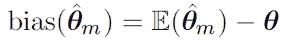

其中期望值是对数据(被视为来自随机变量的样本)的期望值，而`***θ***`是用于定义数据生成分布的`***θ***`的真实基础值。

一个估计量`**θˆm**`被称为是无偏的，如果`**bias(θˆm) = 0**`，这意味着
即`**E(θˆm) = θ**`。

## 方差和标准误差

估计量的方差`**Var(θˆ)**`，其中随机变量是训练集。或者，方差的平方根被称为标准误差，标为标准误差`**SE(ˆθ)**`。估计量的方差或标准误差提供了一种方法，可以衡量我们从数据中计算出的估计值在从基础数据生成过程中独立地对数据集进行重新采样时会如何变化。

> *正如我们可能希望估计量显示低偏差一样，我们也希望它具有相对较低的方差。*

讨论了估计量的定义之后，现在让我们来讨论一些常用的估计量。

## 最大似然估计量

最大似然估计可以定义为从样本数据中估计参数(如均值或方差)的方法，使得获得观测数据的概率(似然性)最大化。

考虑一组从真实但未知的数据生成分布`**Pdata(x)**`中独立抽取的`**m**` 示例`**X = {x(1), . . . , x(m)}**`。设`**Pmodel(x; θ)**`是由`**θ**`索引的相同空间上的概率分布的参数族。换句话说，`**Pmodel(x; θ)**`将任何配置`**x**`映射到估计真实概率`**Pdata(x)**`的实数。
然后`**θ**`的最大似然估计量定义为:

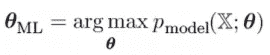

因为我们假设例子是同分布的，所以上面的等式可以写成乘积形式:

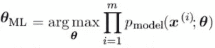

由于各种原因，这种产品在许多情况下可能不方便。比如容易出现数值下溢。同样，为了找到这个函数的最大值/最小值，我们可以对这个函数 w.r.t `**θ**`求导，并使其等于 0。因为我们这里有产品的术语，我们需要应用链式法则，这对于产品来说是相当麻烦的。为了获得更方便但等价的优化问题，我们观察到取似然的对数并不改变其 arg max，而是方便地将乘积转换成和，并且由于 log 是严格递增的函数(自然对数函数是[单调变换](http://en.wikipedia.org/wiki/Monotone_transformation))，它不会影响`***θ***`的结果值。

所以我们有:

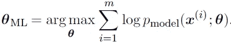

## 两个重要属性:一致性和效率

**一致性:**随着训练样本的数量趋近于无穷大，参数的最大似然估计收敛于参数的真值。

**效率**:一种测量我们有多接近真实参数的方法是通过期望均方误差，计算估计和真实参数值之间的平方差，其中期望超过来自数据生成分布的`**m**`训练样本。该参数均方误差随着`**m**` 的增加而减小，并且对于`**m**` 大的情况，[克莱姆-拉奥](https://en.wikipedia.org/wiki/Cram%C3%A9r%E2%80%93Rao_bound)下界表明没有一致的估计量具有比最大似然估计量更低的均方误差。

> 出于一致性和效率的原因，最大似然法通常被认为是机器学习的首选估计方法。

当示例的数量足够少以产生过拟合行为时，可以使用诸如权重衰减之类的正则化策略来获得最大似然的有偏版本，其在训练数据有限时具有较小的方差。

## 最大后验概率估计

遵循贝叶斯方法，允许先验影响点估计的选择。该图可用于根据经验数据获得未观察量的点估计。MAP 估计选择最大后验概率的点(或在连续θ的更常见情况下的最大概率密度):

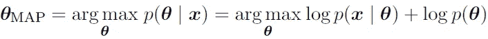

其中在右手边，`**log p(x|θ)**`是标准对数似然
项，`**log p(θ)**`对应于先验分布。

与完全贝叶斯推理一样，MAP 贝叶斯推理的优势在于
利用了先验带来的、在
训练数据中找不到的信息。这些附加信息有助于减少
标测点估计值的差异(与最大似然估计值相比)。然而，这是以增加偏差为代价的。

# 损失函数

在大多数学习网络中，误差被计算为实际输出`***y***` 和预测输出`***ŷ***`之差。用于计算该误差的函数被称为损失函数，也称为成本函数。

> 到目前为止，我们的主要焦点是通过 MLE 或 MAP 进行参数估计。我们之前讨论它的原因是 MLE 和 MAP 都提供了导出损失函数的机制。

让我们看看一些常用的损失函数。

**均方误差(MSE):** [均方误差](https://math.tutorvista.com/statistics/mean-squared-error.html)是最常见的损失函数之一。MSE 损失函数广泛用于**线性回归**中作为性能度量。要计算 MSE，您需要将预测值和实际值之间的差异进行平方，然后在整个数据集内进行平均。

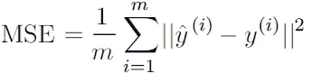

其中,`***y(i)***`是实际预期输出,`***ŷ(i)***`是模型预测。

> 机器学习中使用的许多成本函数，包括 MSE，都可以从 MLE 中导出。

为了了解我们如何从 MLE 或 MAP 中导出损失函数，这里涉及到一些[数学](https://jhui.github.io/2017/01/05/Deep-learning-Information-theory/)，您可以跳过它，进入下一部分。

## 从最大似然法导出均方误差

线性回归算法学习取一个输入`**x**` 并产生一个输出值`***ŷ***`。选择从`**x**` 到`***ŷ***`的映射以最小化均方误差。但是我们如何选择 MSE 作为线性回归的标准呢？让我们从最大似然估计的角度来解决这个问题。我们现在不再产生单一的预测`***ŷ***`，而是将模型视为产生条件分布`**p(y|x)**`。

我们可以将线性回归问题建模为:

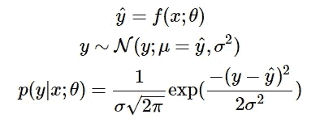

我们假设`**y**` 为正态分布，其中`***ŷ***`
为分布的平均值，方差固定为用户选择的某个常数`**σ²**` 。对于许多应用来说，正态分布是一个明智的选择。在事先不知道实数的分布形式的情况下，正态分布是一个很好的默认选择。

现在回到前面定义的对数可能性:

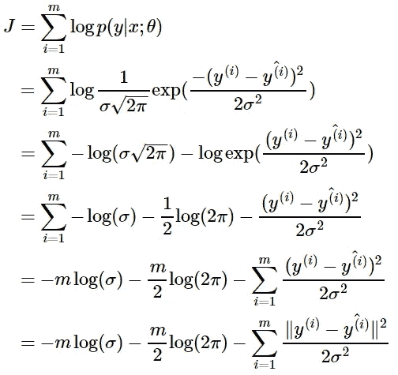

其中`***ŷ(i)***`是对第 I 个输入`**x^(i)**`的线性回归的输出，`**m**` 是训练样本的数量。我们看到前两项是常数，因此最大化对数似然意味着最小化 MSE，如下所示:

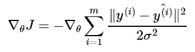

我们立即看到，最大化相对于`***θ***`的对数似然产生了与最小化均方误差相同的参数估计`***θ***`。这两个标准具有不同的值，但最优位置相同。这证明了使用 MSE 作为最大似然估计程序的合理性。

**交叉熵损失(或对数损失):**交叉熵度量两个概率分布之间的散度，如果交叉熵大，则意味着两个分布之间的差异大，而如果交叉熵小，则意味着两个分布彼此相似。

交叉熵被定义为:

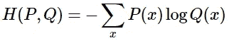

其中 *P* 是真实标签的分布， *Q* 是模型预测的概率分布。*还可以看出，交叉熵损失也可以从 MLE 中导出*[](https://jhui.github.io/2017/01/05/Deep-learning-Information-theory/)**，我不会用更多的数学来烦你。**

*让我们进一步简化我们的模型:*

*   *n——观察次数*
*   *M —可能的类别标签数量(狗、猫、鱼)*
*   *y —一个二进制指示符(0 或 1)表示分类标签`***C***` 是否是正确的分类用于观察`***O***`*
*   *p —模型预测的观察概率*

## ***二元分类***

*在二进制分类中(M=2)，公式等于:*

*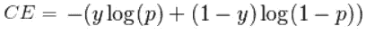*

*在二进制分类的情况下，将每个预测概率与实际的类输出值(0 或 1)进行比较，并计算分数，该分数基于与期望值的距离来惩罚该概率。*

## *形象化*

*下图显示了给定真实观测值(y= 1)的可能测井曲线损失值的范围。随着预测概率接近 1，测井曲线损失缓慢下降。然而，随着预测概率的降低，测井曲线损失迅速增加。*

*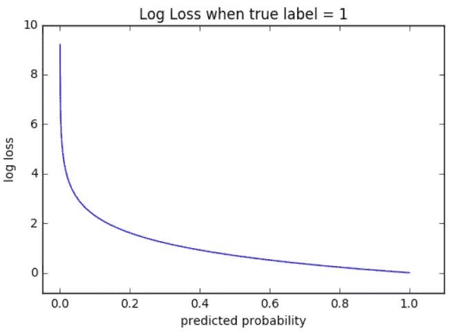*

*对数损失惩罚这两种类型的错误，但特别是那些有把握和错误的预测！*

## ***多级分类***

*在多类分类(M>2)中，我们取观测值中每个类预测的测井损失值的总和。*

*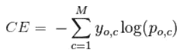*

*二元或两类预测问题的交叉熵实际上被计算为所有示例的平均交叉熵。Log Loss 使用负 Log 来提供一个简单的比较指标。之所以采取这种方法，是因为正对数数字< 1 returns negative values, which is confusing to work with when comparing the performance of two models. See [这个](/understanding-binary-cross-entropy-log-loss-a-visual-explanation-a3ac6025181a)帖子详细讨论了交叉熵损失。*

## *ML 问题和相应的损失函数*

*让我们看看机器学习模型中常用的输出层和损失函数有哪些:*

## *回归问题*

*预测一个实值量的问题。*

*   ***输出层配置**:一个带线性激活单元的节点。*
*   ***损失函数**:均方误差(MSE)。*

*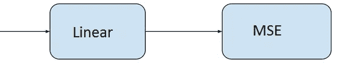*

## *二元分类问题*

*把一个例子归为两类中的一类的问题。这个问题被设计成预测一个例子属于第一类的可能性，例如，你给这个类赋值 1，而给另一个类赋值 0。*

*   ***输出层配置**:一个带 s 形激活单元的节点。*
*   ***损失函数**:交叉熵，也称对数损失。*

*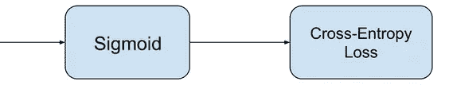*

## *多类分类问题*

*把一个例子归为两类以上的问题。这个问题被设计成预测一个例子属于每一类的可能性。*

*   ***输出层配置**:使用 softmax 激活功能的每个类一个节点。*
*   ***损失函数**:交叉熵，也称对数损失。*

*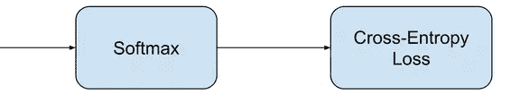*

*讨论了估计量和各种损失函数之后，让我们理解优化器在 ML 算法中的作用。*

# *优化者*

*为了最小化预测*误差或损失*，模型在经历训练集的示例时，更新模型参数`***W***`。这些误差计算在绘制`***W***` 时也被称为**成本函数绘制** `***J(w)***`，因为它决定了模型的成本/惩罚。因此最小化误差也称为最小化成本函数。*

*但是你具体是怎么做的呢？使用**优化器**。*

> *优化器用于更新权重和偏差，即模型的内部参数，以减少误差。*

*最重要的技术和我们如何训练和优化我们的模型的基础是使用**梯度下降**。*

# *梯度下降:*

*当我们绘制成本函数`***J(w) vs w***`时。它表示如下:*

*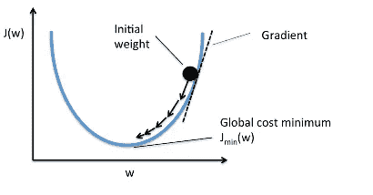*

*从曲线中可以看出，存在一个参数值`***W***` ，其成本`***Jmin***`最小。现在我们需要找到一种方法来达到这个最低成本。*

*在梯度下降算法中，我们从随机模型参数开始，计算每次学习迭代的误差，不断更新模型参数，以更接近产生最小成本的值。*

*重复直到最小成本:{*

*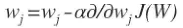*

*}*

*在上面的等式中，我们在每次迭代后更新模型参数。方程的第二项计算每次迭代时曲线的斜率或梯度。*

*成本函数的梯度被计算为成本函数`***J***` 相对于每个模型参数`***Wj***` *，* `***j***`取特征数量`**[1 to n]**`的值。`***α***`，*阿尔法*，是学习率，或者说我们希望以多快的速度向最小值移动。如果`*α*`太大，我们可以超调。如果`***α***`太小，意味着学习的步骤很小，因此模型观察所有示例所花费的总时间会更多。*

*梯度下降有三种方式:*

***批量梯度下降:**使用所有的训练实例来更新每次迭代中的模型参数。*

***小批量梯度下降:**小批量梯度下降不是使用所有的例子，而是将训练集分成更小的称为“b”的批量。因此，小批量“b”用于在每次迭代中更新模型参数。*

***随机梯度下降(SGD):** 在每次迭代中仅使用单个训练实例更新参数。训练实例通常是随机选择的。当有成千上万或更多的训练实例时，随机梯度下降通常是优化成本函数的首选，因为它比批量梯度下降收敛得更快。*

*其他一些常用的优化器:*

## *阿达格拉德*

*[Adagrad](http://www.jmlr.org/papers/volume12/duchi11a/duchi11a.pdf) 专门针对单个特征调整学习率:这意味着数据集中的一些权重将具有不同于其他权重的学习率。这对于缺少大量输入示例的稀疏数据集非常有用。不过，Adagrad 有一个主要问题:随着时间的推移，自适应学习率往往会变得非常小。下面的一些其他优化程序试图消除这个问题。*

## *RMSprop*

*RMSprop 是由 Geoffrey Hinton 教授在他的神经网络课上开发的 Adagrad 的特殊版本。不是让所有的梯度累积动量，而是只在一个固定的窗口中累积梯度。RMSprop 类似于 Adaprop，它是另一种优化器，旨在解决 Adagrad 留下的一些问题。*

## *圣经》和《古兰经》传统中）亚当（人类第一人的名字*

*[Adam](https://arxiv.org/abs/1412.6980) 代表自适应矩估计，是使用过去梯度计算当前梯度的另一种方式。亚当还利用了[动量](http://ruder.io/optimizing-gradient-descent/index.html#momentum)的概念，将先前梯度的分数添加到当前梯度中。这个优化器已经变得相当普遍，并且实际上被接受用于训练神经网络。*

*我刚刚简要介绍了这些优化器，请参考[这篇](/types-of-optimization-algorithms-used-in-neural-networks-and-ways-to-optimize-gradient-95ae5d39529f)文章，了解关于各种优化器的详细分析。*

****我希望现在你明白当你写的时候下面发生了什么:****

```
*# loss function: Binary Cross-entropy and optimizer: Adam
**model.compile(loss='binary_crossentropy', optimizer='adam')** **or**# loss function: MSE and optimizer: stochastic gradient descent
**model.compile(loss='mean_squared_error', optimizer='sgd')***
```

**感谢阅读。**

## *参考资料:*

*[1][https://www.deeplearningbook.org/contents/ml.html](https://www.deeplearningbook.org/contents/ml.html)*

*[2][https://machine learning mastery . com/loss-and-loss-functions-for-training-deep-learning-neural-networks/](https://machinelearningmastery.com/loss-and-loss-functions-for-training-deep-learning-neural-networks/)*

*[https://blog.algorithmia.com/introduction-to-optimizers/](https://blog.algorithmia.com/introduction-to-optimizers/)*

*[4][https://jhui . github . io/2017/01/05/Deep-learning-Information-theory/](https://jhui.github.io/2017/01/05/Deep-learning-Information-theory/)*

*[5][https://blog . algorithm ia . com/introduction-to-loss-functions/](https://blog.algorithmia.com/introduction-to-loss-functions/)*

*[https://gombru.github.io/2018/05/23/cross_entropy_loss/](https://gombru.github.io/2018/05/23/cross_entropy_loss/)*

*[7][https://www . kdnugges . com/2018/04/right-metric-evaluating-machine-learning-models-1 . html](https://www.kdnuggets.com/2018/04/right-metric-evaluating-machine-learning-models-1.html)*

*[8]https://rohanvarma.me/Loss-Functions/*

*[9]http://blog.christianperone.com/2019/01/mle/*