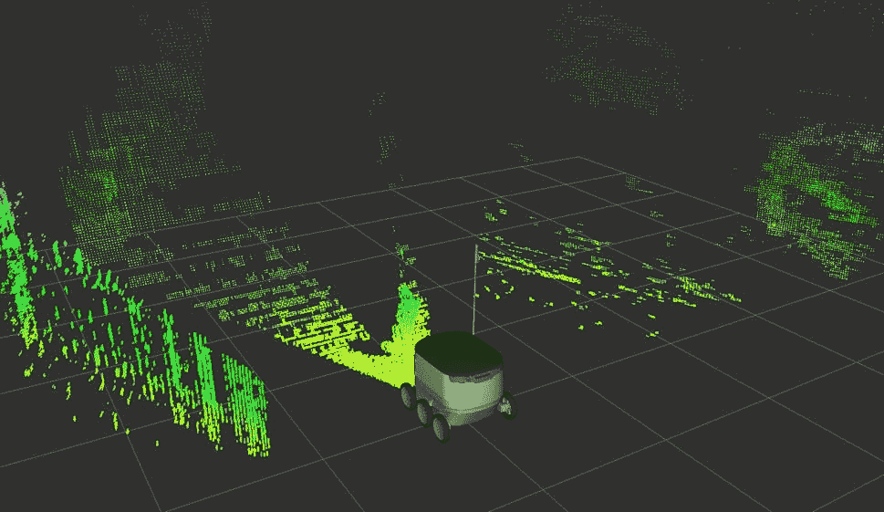
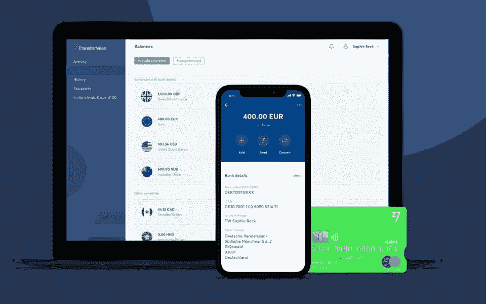
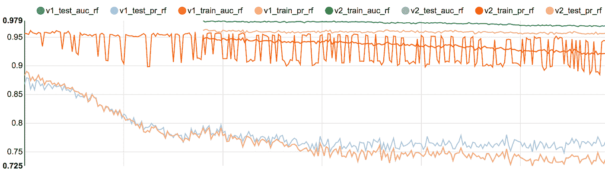
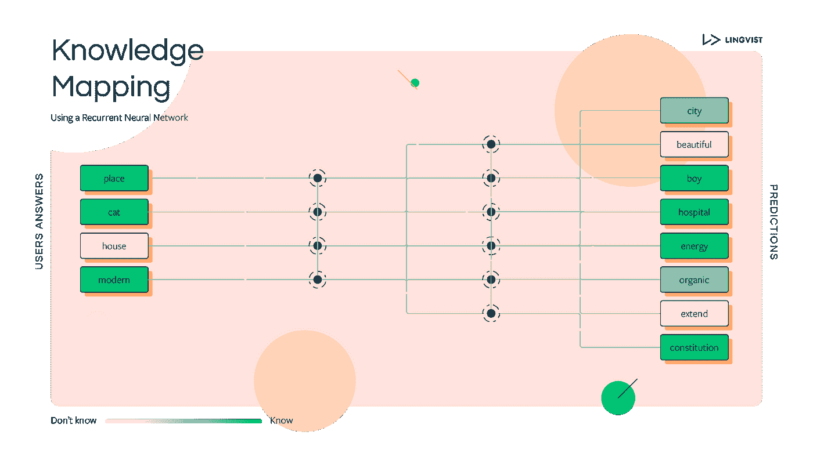
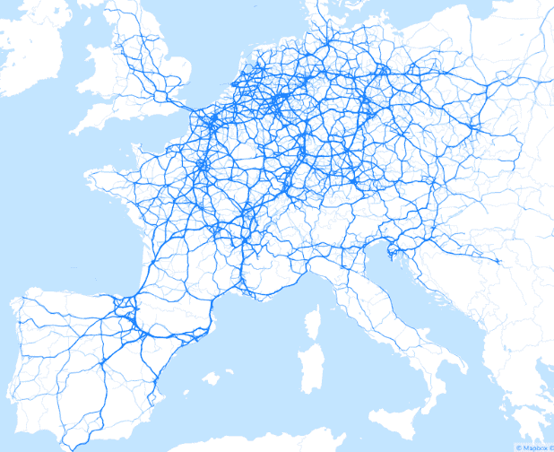
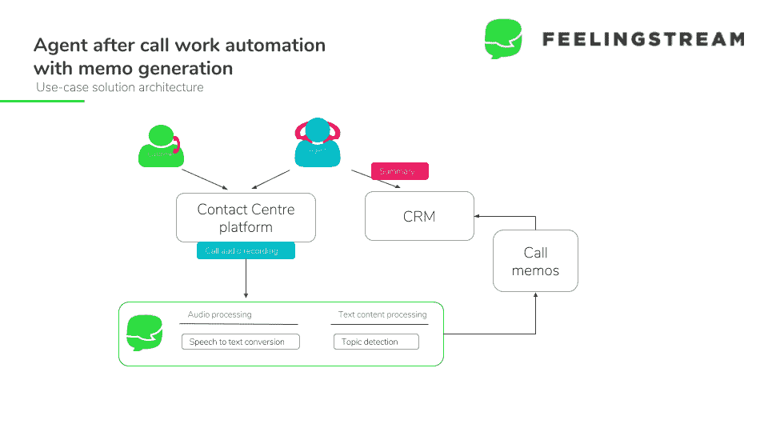
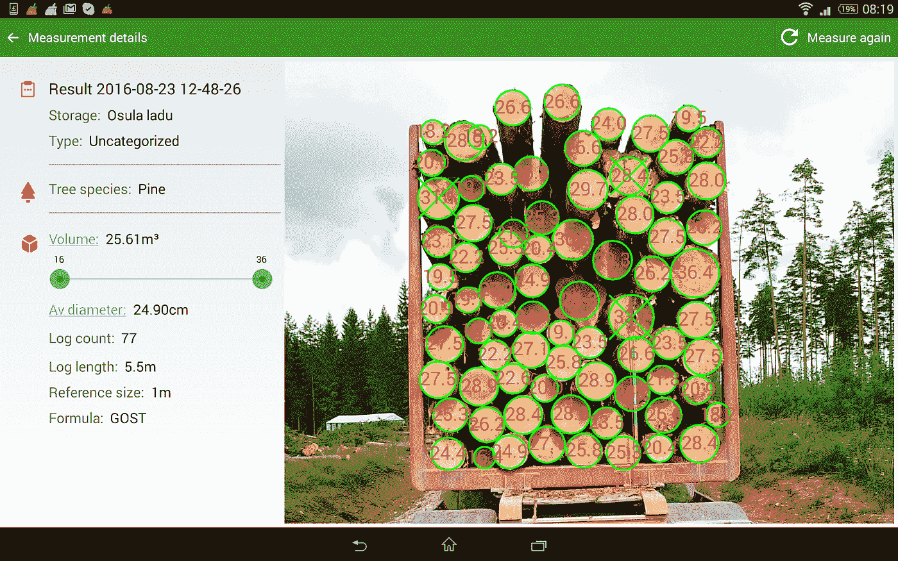
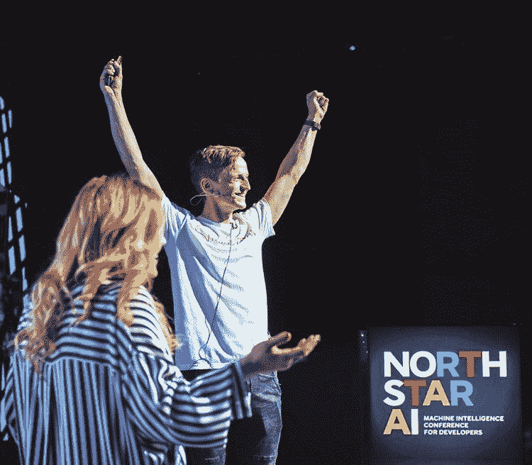

# 爱沙尼亚:全球创业公司和人工智能应用的跳板

> 原文：<https://towardsdatascience.com/estonia-a-springboard-for-global-startups-and-ai-applications-d4d66598656b?source=collection_archive---------22----------------------->

## 人工智能正在席卷全球。爱沙尼亚在人工智能生态系统中处于什么位置？爱沙尼亚企业为人工智能做好准备了吗？

我们知道，与小公司相比，亚马逊、百度、脸书和谷歌等科技巨头拥有人工智能优势，如收集海量数据、接触顶级人才、对 R&D 的巨额投资。然而，人工智能提供的可能性不仅仅是为最大的公司和最大的经济体保留的。

爱沙尼亚正在寻找吸引国际人才和投资的方法；另一方面，它的面积小，资源有限，这就要求公共行政和政府有效地工作。难怪在爱沙尼亚，政府和公司都注意到了人工智能技术解决当前人口和经济挑战的潜力，因为人工智能仅在北欧对 GDP 的影响预计就相当可观:[占 GDP 的 9.9%(1.8 万亿)。](https://www.pwc.ch/en/publications/2017/pwc_global_ai_study_2017_en.pdf)

**爱沙尼亚今天在人工智能准备方面处于什么位置？**

在欧洲，人工智能的准备程度非常高，但即使是最先进的国家也落后于美国的人工智能前沿。然而，欧洲捕捉人工智能全部潜力的能力在不同国家之间差异很大。根据欧洲人工智能生态系统的[地图，四个国家在推动欧洲人工智能生态系统方面表现突出——英国、法国、德国和西班牙——并且以拥有欧洲最具活力和最成熟的人工智能景观而闻名。](http://www.francedigitale.org/wp-content/uploads/2018/10/FranceDigitale_RolandBerger_EUAI.pdf)

根据罗兰·贝格和法国数字公司的研究，爱沙尼亚拥有从人工智能应用中受益的良好先决条件，并正在成为欧洲有影响力的人工智能玩家。

尽管欧盟人工智能应用的领导者是 67%人工智能创业公司的所在地，爱沙尼亚和其他北欧和波罗的海国家显示了密度动态，即每人口规模的创业公司数量很高。

与主导者和其他致力于人工智能战略的政府相比，爱沙尼亚认为自己是初创公司和人工智能应用的人工智能实施领导者。

**例如，到** 2020 年，爱沙尼亚政府已经在公共服务领域推出了 50 种不同的人工智能应用，该国最知名的规模化企业(Taxify、TransferWise、Pipedrive)以及早期人工智能初创公司(Sixfold、AlphaBlues、Feelingstream)已经转向数据和机器学习，以最大限度地提高其产品交付。

与此同时，爱沙尼亚并没有让人工智能狂潮和需要快速实施的人工智能妥协**数据隐私和安全。**爱沙尼亚计划确保人工智能应用程序的安全，以保护其人民和私人数据。爱沙尼亚希望成为根据隐私和安全要求开发人工智能应用的地方。

**AI 实现的时代**

技术专家李开复在他的书《人工智能的超能力》中认为“人工智能研究的许多困难但抽象的工作已经完成，现在是企业家卷起袖子开始将算法转化为可持续业务的时候了。”

**目前哪些爱沙尼亚公司正在实施这一技术？**

但首先你可能会问，是什么让一个创业公司变成了“AI 创业公司”。对于这篇文章，我们将人工智能的生产者和使用者都称为“人工智能初创公司”。很难计算爱沙尼亚创业公司和公司的总数，因为人工智能不是一种单一的技术，而是由各种元素组成。

在这篇文章中，我们将研究 13 个人工智能公司的例子，从早期创业公司到成熟的规模化公司，并展示一些政府人工智能应用程序，这些应用程序使用数据和机器学习来重塑产品，实现自动化，另一方面，展示一些更具变革性的公司，这些公司利用数据创建了新的商业模式。

**星舰科技**

[Starship](https://www.starship.xyz/) 打造了世界上第一个随时随地为你服务的包裹递送机器人。

星际飞船机器人是先进的设备，可以在半径 3 公里(2 英里)的范围内运送物品。他们的交付平台将开启一个即时、不定期交付的新时代，同时显著降低运输成本。为了让机器人尽可能安全和自主，机器人必须了解他们在哪里，周围世界正在发生什么——人类、汽车、骑自行车的人、障碍物——并预测接下来会发生什么。为了实现这一点，Starship 开发了一种软件，可以处理来自摄像机、雷达和其他传感器的输入，以实时做出驾驶决策。他们还分析历史数据，以明确了解如何进一步改进机器人。

Source: Starship Technologies

**Taxify** (自 2019 年 3 月 7 日起更名为 Bolt)

爱沙尼亚出生的 Taxify 已经成为世界上发展最快的独角兽，在超过 25 个国家拥有超过 1500 万乘客。Taxify 使用数据和尖端技术来了解数百万人如何在城市中移动，并利用这种洞察力来改善城市交通。这意味着接近 10 亿个峰值请求，数十万兆字节的数据，数十亿个坐标。Taxify 开发实时机器学习来改善产品、运营和决策制定，例如预测驾驶时长、为乘坐定价、优化营销活动等。

数据科学和机器学习有助于 Taxify 预测乘客在任何时间、任何地点拥有适量车辆的需求，预先计算价格并提高效率，方法是帮助乘客根据城市中数百万次之前完成的行程找到最佳的上车地点，然后根据动态的加权城市图为司机生成到达这些地点的最佳路线。这些只是他们的数据驱动解决方案的一些例子。

Source: Taxify (Bolt)

**传送式**

[TransferWise](https://transferwise.com/) 是一家新型金融公司，面向在世界各地旅行、生活和工作的个人和企业。这是最公平、最简单的跨境理财方式。

TransferWise 的客户每月转账超过 30 亿笔，其中每一笔转账都由多个机器学习模型即时评分。机器学习在其业务中被用于许多领域。例如，检测欺诈行为和洗钱企图，优化业务流程以降低成本，预测各种客户行为以促进公司发展。

Source: TransferWise

**验证**

[Veriff](https://veriff.me/) 是超能力者在线身份验证。无论您是出租房屋、呼叫出租车司机还是在线购物，您信任的负责您的房屋、安全或财产的人都可以在几秒钟内通过各种平台安全、无缝地进行验证。

Veriff 中机器学习的核心应用是自动化和欺诈检测:从在图像中查找文档到读出所有数据，再到检测许多不同类型的欺诈企图。世界上有超过 3200 种不同的文档类型，这使得产品的自动化成为一个真正的挑战。

验证的过程要经历几个步骤。这一过程中的每一步都需要自动完成，以获得最佳的客户体验和最低的成本，但不能牺牲质量。Veriff 的机器学习团队正是这样做的:在可能的时候自动做出决定，在需要更彻底的检查时委托给人眼。

莫内塞

爱沙尼亚人 Norris Koppel 于 2015 年推出了新银行公司 [Monese](https://monese.com/eu/) ，这是英国和欧洲最受欢迎和最受信任的银行服务之一，也是英国第一家仅支持移动设备的银行。与 Monzo 和 Starling Bank 后来针对千禧一代或早期采用者的做法不同，Monese 的做法与众不同。 [Monese](https://monese.com/) 让移民(或任何人)在不需要英国地址的情况下，在几分钟内开立一个英国银行账户，这在当时是任何一家大型商业银行都不会做的。

人工智能在摩纳哥的主要焦点是安全。作为一家负责任的公司，Monese 希望保护他们的客户免受金融欺诈，并将非法交易的风险降至最低。为了准确地做到这一点，他们建立了智能计算机系统来分析客户的个人资料数据、交易序列和社会关系。使用人工智能检测欺诈性交易对他们的业务产生了巨大的积极影响。

除了安全性，Monese 还使用人工智能在客户入职过程中自动分析文件扫描。首先，评估扫描的质量，然后增强原始图像，最后，从扫描的文档中读取重要的文本字段。未来，我们计划开发自己的算法，将文档图片与视频自拍图像进行匹配，以检测假身份证和打击身份盗窃。

Source: Monese

**管道驱动**

[Pipedrive](https://www.pipedrive.com/) 是一款销售 CRM 工具，最初是 2010 年在爱沙尼亚一家车库里的一家小公司。现在，该公司已经扩展到全球 170 多个国家，拥有超过 75，000 名客户。

Pipedrive 将人工智能用于其业务需求和帮助客户预测其销售成功的目的。Pipedrive 为此建立了一个专门的人工智能团队。例如，基于他们在 Pipedrive 中进行的活动，他们知道他们的潜在试用客户转化为付费客户的可能性有多大。此外，他们还建立了一个客户流失模型，预测客户是否会停止使用 Pipedrive 软件。这两个模型都为销售和营销团队提供了可操作的见解，使他们能够更好地与客户互动。对于客户，Pipedrive 正在实施基于人工智能的解决方案，以预测他们的销售成功和收入。由于销售在很大程度上是基于沟通，他们现在正致力于利用人工智能方法来提取见解和提高效率。

An example of a prediction model evaluation metrics over time. Source: Pipedrive

**林奎斯特**

爱沙尼亚核物理学家设计的 Lingvist 可以大大减少学习一门语言的时间。Lingvist 正在开发技术，利用机器学习将学习速度提高 10 倍。他们的第一步是将这项技术应用于语言学习。

林奎斯特正在使用人工智能来模拟人们学习时大脑中发生的事情。他们的记忆是如何工作的。他们是如何学习和遗忘的。他们如何创建模式来有效地使用他们的知识。Lingvist 的高级机器学习算法会学习你需要练习哪些单词，以及什么时候该练习新单词。每个人的体验完全不同。

AI 帮助我们理解人们知道什么和不知道什么，而不用直接问他们。这有助于使学习内容非常个性化，并非常精确地匹配用户级别。林奎斯特称之为知识图谱技术，它的最终目标是让每个人都能学得更多、更快、更聪明。

Source: Lingvist

**六倍**

[六重](https://sixfold.com/)帮助世界上一些最大的生产商实时了解他们的出货量。对于每个这样的托运人，Sixfold 跟踪属于数百个不同承运人的数千辆卡车，并将其组合成一个可操作的数据流。Sixfold 让托运人和他们的最终客户持续获得信息-检测每批货物的状态，预测交付 eta，并就即将到来的延迟和其他问题发出警报。

Sixfold 使用数据科学来构建从几十个实时数据源中推断有用信息的解决方案，例如确定装运的当前状态和预测卡车司机的休息行为。

Source: Sixfold

**感觉流**

[Feelingstream](https://www.feelingstream.com/) 是一个企业 SaaS 平台，帮助销售经理从现有客户对话中捕捉销售潜力信号，包括电话、网络请求、支持票、电子邮件、聊天等，并将它们转化为新的销售线索。他们分析语音和文本数据，为员工提供近乎实时的行动或建议。大型服务提供商(如银行、电信、运输、公用事业等)可以利用这些信息来提高保留率和销售业绩。Feelingstream 为北欧语言开发了一个独特的平台，使用人工智能来预测销售潜力和客户服务的流失风险。

Source: Feelingstream

**Timbeter**

虽然木材是使用最先进的机械和硬件来切割的，但是测量和管理木材仍然是中世纪的事情。 [Timbeter](http://www.timbeter.com/) 提供了一种解决方案，让您可以借助智能设备快速准确地测量木材，并以数字形式管理所有数据。Timbeter 使用光学检测来测量每根原木的数量、体积和直径，这是供应链管理中最重要的信息。

Timbeter 已经收集并将继续收集来自木材行业和现有客户的数据。这些数据用于指导机器如何检测日志。通过机器学习的数据，我们实现人工智能来测量图片上的日志。

Source: Timbeter

**北极星艾**

为了支持 AI 在组织和企业中的实施，爱沙尼亚领先的 AI 专家在 2017 年推出了独立的非营利性[北极星 AI](https://aiconf.tech/) 。他们聚集了世界和北欧的领先技术公司，为每年 3 月在塔林举行的世界上最高质量的机器学习技术活动铺平了道路。

目标是刺激人工智能在该地区的采用，并教育人们了解人工智能提供的机会，并为他们提供与机器合作的必要技能。通过汇集人工智能的从业者，并专注于数据科学和机器学习的现实应用，北极星人工智能打算降低开发人员、工程师、首席技术官、数据驱动的初创公司创始人和产品经理的准入门槛。

北极星人工智能年会将于 2019 年 3 月 7 日举行，这是一次机器学习会议，内容质量高，重点关注人工智能和数据的现实应用。

Source: North Star AI

阿尔法布鲁斯

AlphaBlues 正在开发虚拟客户助理，帮助银行和电信公司在他们的网站上提供全天候的客户支持聊天，使用我们的产品理解人类语言。该公司是首批将人工智能虚拟助手和实时聊天无缝集成到连贯解决方案中的公司之一。一个专有的内部开发的 NLP 引擎和虚拟助理平台(AlphaAI)与一个用于人工代理的实时聊天产品(AlphaChat)捆绑在一起。这使得将客户旅程完全自动化为一个流程—从使用虚拟助理访问网站到与人工代理聊天。符合 GDPR 标准的解决方案还支持构建语音操作的虚拟助理。该解决方案已经被几家银行和电信公司采用。

**Proekspert**

Proekspert 是爱沙尼亚领先的全面工业 IT 解决方案提供商。在工业环境中，数据科学分为三大类:生产优化、维护和产品改进及质量的高级解决方案。然而，为了做到这三点，支持生产和产品的数据架构必须是合理的。因此，作为第一步，Proekspert 为客户提供支持，帮助他们正确收集数据。只有在此之后，他们才会提供以下功能:

*   生产优化本质上意味着更好的规划。他们使用车间数据来提供关于车间生产流程的预测性决策支持，如果条件允许的话，还提供规范性决策支持。离散制造的周期时间，尤其是在高度多样化的产品组合环境中，具有高度的相互依赖性和模式，超出了传统生产经理的工具包(如电子表格)的能力。相反，他们使用梯度提升树等建模技术来识别这些模式，并为更准确的规划提供可操作的见解。
*   设备故障和停工期是生产成本的明显驱动因素。根据从设备中收集的数据，他们识别出正在经历退化或其他异常行为的部件、组件或整套设备。这将转化为设备故障和 MTBF 时间的概率模型，进而用作维护计划的输入。我们监控的数据往往符合高速度(振动数据)、高容量(多维时间序列)和多样性(振动与测试设备的文本日志)的大数据标准。
*   产品和质量改进。如果生产的设备已经部署到客户处并收集数据，Proekspert 将为制造商提供关于设备使用方式(如使用模式)、性能(效率)和故障原因的洞察支持。与大多数人工智能解决方案一样，它可以归结为模式检测和分类、聚类或异常检测。这些结果可以用来洞察更好的生命周期支持计划，也可以作为工程和设计的输入，以构建更好的产品。

**政府 AI 应用:**

国家机构每天收集大量数据，政府正在提高国家分析公共数据的能力。**经济事务部**和**爱沙尼亚统计局**之间正在进行的合作将为政府和私营部门的实时、实用和合乎道德的数据应用奠定基础。

例如，人工智能应用程序可以通过分析卫星图片来有效地检测结冰的道路，或者提供更好的工作匹配，或者提供预先计算的税收的**电子税务**系统。

每年，爱沙尼亚大约 95%的纳税申报是以电子方式提交的。纳税人使用安全 ID 登录系统，在预先填写的表格中查看他们的数据，进行任何必要的更改，并批准申报表。该过程通常需要 3 到 5 分钟。自 2015 年以来，甚至一键报税也成为可能——系统中已经存在的数据将与计算结果一起显示给用户，然后用户所要做的就是点击确认按钮。所有这一切只需要不到一分钟的时间。

**数据和 AI 帮助维持一个小政府**

凭借其在公共和私人领域采用人工智能的当前发展，爱沙尼亚有潜力成为欧洲人工智能生态系统中更具影响力的参与者。为了支持欧盟层面的人工智能应用，并吸引世界各地的人工智能初创公司，爱沙尼亚旨在满足数据可用性、数据安全交换、公共数据访问和人工智能友好法规的标准，以支持爱沙尼亚全球人工智能应用的开发。