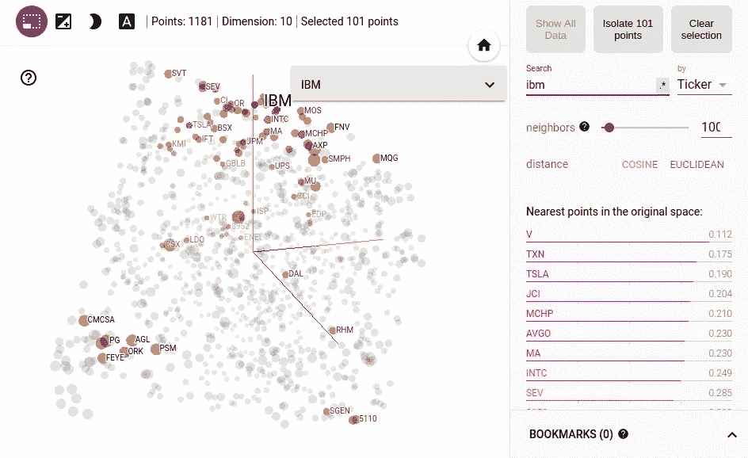
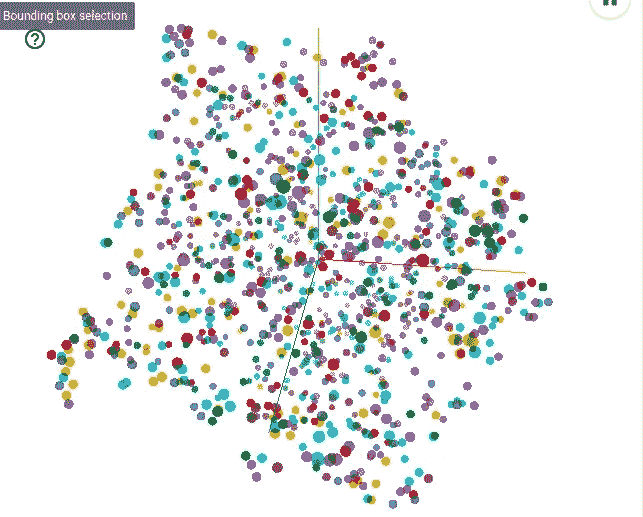
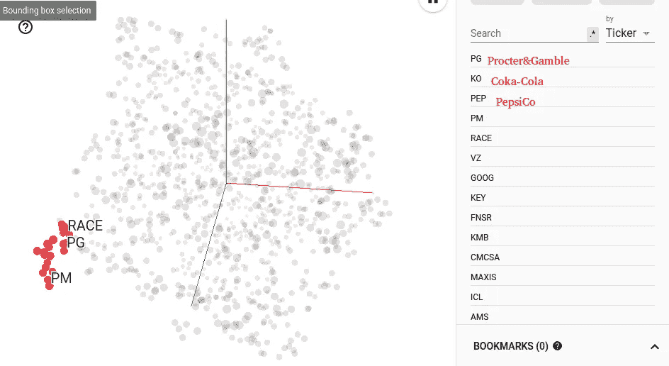
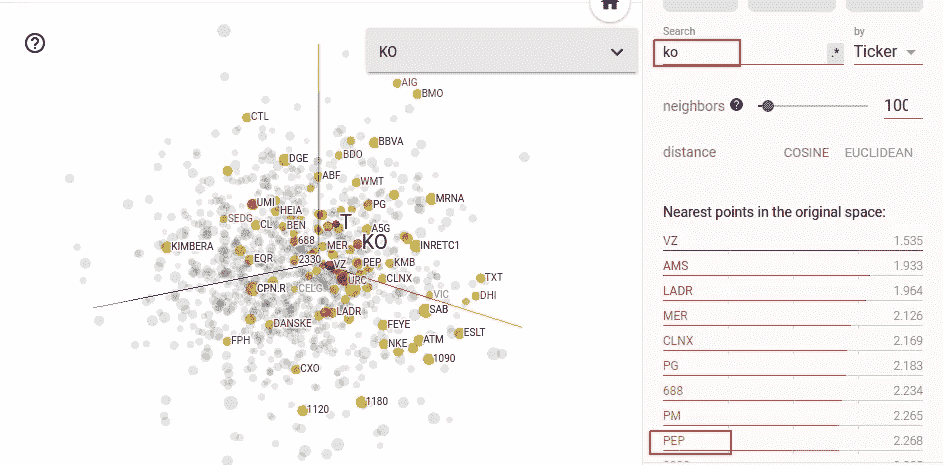
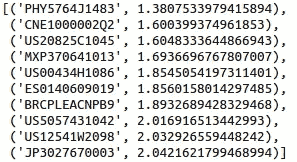

# ETF2Vec:我试图从 ETF 持股中提取叙事的故事

> 原文：<https://towardsdatascience.com/etf2vec-my-story-about-trying-to-extact-narrative-from-etf-holdings-5a5f355ce3c4?source=collection_archive---------27----------------------->

IBM closest neighbours

这个世界被嵌入模型所占据。Word2vec，图像到矢量等等。在最近关于[从科学论文中提取知识的新闻之后](/using-unsupervised-machine-learning-to-uncover-hidden-scientific-knowledge-6a3689e1c78d)，我决定将模型应用到金融领域。

在我开始之前，我必须承认:我没有学到多少知识，但还是学到了很多东西。

# 抓取 ETF 持仓

起初，我需要关于 ETF 投资组合的信息。由于不愿意为 efdb.com 这样的数据库付费，我决定直接从 ETF 网站上删除信息。

有很多 ETF 提供商，所以我研究了其中一些:

1.  **贝莱德(1，5 trln)** :所有信息都在同一个页面上，投资组合持股可以作为单独的 csv 文件下载，选定日期的历史持股也是可用的。
2.  **Vanguard (1，1 bln):** 不可下载。csv 文件，所有控股在单独的标签与下一个/上一个按钮。非常不方便报废。
3.  **景顺(200 bln)** :很难获得 ETF 的名单。
4.  **富达(14 bln)** :目前最差的抓取网站:多个标签，投资组合在单独的弹出窗口中，持股每月更新一次，没有。csv 文件。

我还没有全部检查过，但是我打赌没有一个供应商有任何类型的 API 可以下载。毕竟，贝莱德是一个明显的赢家:规模最大(约 800 只 ETF，涵盖了全球几乎所有值得交易的东西)，使用起来最舒适。对于爬虫，我使用了 [selenium](https://selenium-python.readthedocs.io) 和[多处理](https://docs.python.org/3.4/library/multiprocessing.html?highlight=process)库。

截至 2019 年 7 月 7 日，我下载了 792 个单独的 ETF 持股。他们在这里是。

# 准备数据

过滤的问题如下:

1.  有些 ETF 尽管名称不同，但本质上是一样的。例如，AGGG 和阿格是一样的:前者用美元，后者用欧元。
2.  多只 ETF 是债券 ETF，债券发行数量大于权益持有数量。这很自然，因为一个典型的公司有一种可交易的股票(暂且不考虑优先)，但可能有几十种不同到期日的债券发行。因此，我决定将资产范围仅限于股票。
3.  我限制了权重至少为 2%的 ETF 的数量。有很多 ETF 跟踪像标准普尔 500 或罗素 2000 这样的大型指数，很明显，指数中的股票之间存在最低限度的联系。
4.  最后，我将 universe 限定为 ETF，毕竟过滤后至少有 10 项资产。最终设置-146 ETF。

# ETF2Vec 模型

我使用 pytorch [教程](https://pytorch.org/tutorials/beginner/nlp/word_embeddings_tutorial.html)中提供的最简单的模型，名称略有变化:

在通常的 word2vec 中，句子中的单词和单词上下文被推送到模型中，以找到任何相关的内容。在我这里，ETF 持仓量是单词，不同的 ETF 代表句子。单词由 ISIN 号识别([详见](https://en.wikipedia.org/wiki/International_Securities_Identification_Number)维基百科)，对每个安全都是唯一的。

寻找邻居的算法是基于 ETF 中资产的权重。我使用权重作为概率，通过 *numpy.random.choice()* 进行选择

*etf_list* 具有 dic 的 dic 列表形式:[ETF_1:{'ISIN':[]，'权重':[]，'部门':[]，'跑马灯':[]}，…]。

为了防止过度拟合，我决定在每个时期使用不同的集合。由于概率是与权重联系在一起的，所以它们没有大的变动，但仍然给数据增加了一些变化。

我在 146 个 ETF 中有 1181 个资产，生成了 2153 个样本，这意味着平均每个资产在每个时期出现 1.82 次。这意味着许多股票只出现一次。

嵌入空间= 10，上下文大小= 10

在大约 100 个历元之后，训练误差停止减少。

# 虚拟化

我在漂亮的谷歌分析工具中可视化了一切:[https://projector.tensorflow.org](https://projector.tensorflow.org)

为了映射数据，我创建了矢量嵌入和元矢量(扇区和股票信息)。

起初，我预计来自一个行业的公司会以某种方式组合在一起，但最终的情况却截然不同。

Universe of ETF holdings. Each circle — stock.

尽管资产分配看似混乱，但股票的分组似乎部分符合逻辑:可口可乐与百事可乐和宝洁被归为一类。

但是，尽管看起来关系密切，可口可乐和百事可乐在原始向量空间中的关系并不密切。

# 向量数学

嵌入最有趣的部分是向量数学。所以，我研究的最初目的是检验如果把可口可乐中的百事可乐去掉，或者把通用和麦当劳加在一起会发生什么？

可口可乐-百事可乐=能源股

好吧，结果绝非无聊:康菲石油公司、中石化和马尼拉电力公司。这三只股票都与能源有关。

# 结论和要点

我认为嵌入模型可以应用于金融领域。谁知道呢，如果这个模型包含更多的数据，我们会遇到什么呢？

此外，我还学到了很多关于从网上搜集数据和 ETF 提供商对他们网站的态度。