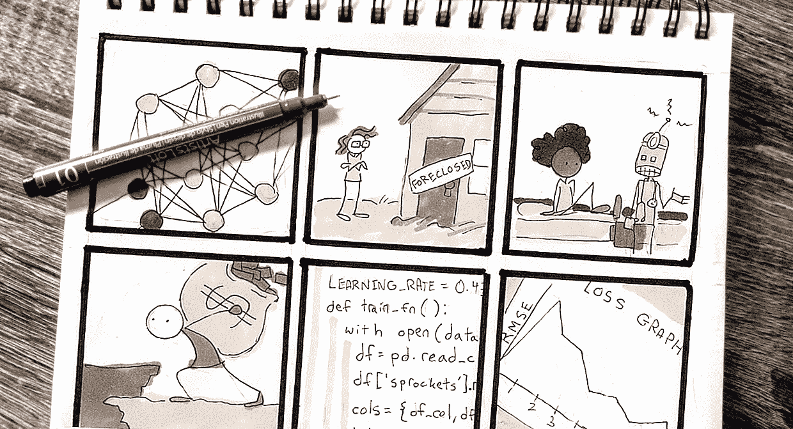

# 机器学习的伦理故事板

> 原文：<https://towardsdatascience.com/ethical-storyboarding-for-machine-learning-7c5b5a031173?source=collection_archive---------15----------------------->

[A comic-style storyboard with scenes of technical ML content and human-machine interactions]

## 想象我们在自己生活的系统中构建的系统

机器学习正以梯度下降的方式进入越来越多的地方，随着它的到来，对熟练的 ML 从业者的需求越来越多，对我们对社会的基本假设的挑战也越来越大。事实是，ML 正迅速地深深融入我们的世界，以至于无法将工程和伦理问题彼此分开，为了在它所创造的浪潮中生存下来，我们将需要一支[员工队伍](https://medium.com/swlh/my-fellow-engineers-it-is-time-for-the-greatest-invention-of-all-f738d8394998)，他们敏锐地意识到它的工作如何通过[波及到周围的世界](https://arstechnica.com/tech-policy/2017/12/bitcoins-insane-energy-consumption-explained/)。有什么地方比教室更能提高这种意识呢？

今年春天，我在米尔斯学院(Mills College)共同教授谷歌(Google)新的[应用机器学习强化训练营](https://edu.google.com/computer-science/applied-computing-series/intensive.html)的试点课程，该项目将所有不同专业和背景的大学毕业生聚集在一起，向他们介绍广泛的基础机器学习技术。谷歌非常慷慨地给了我一些灵活性，让我尝试一些教授工程学和伦理学的综合方法，就像一个调整良好的神经网络的输出一样，结果令人震惊。

## 目前的技术水平

当我在斯坦福大学读工程本科时，我们被要求参加两门“工程公民”课程，通过一点自我反思来完善我们的技术知识。

其中一项要求是*专业写作*研讨会，这是一门课程的仓促而不幸的一个单元的事后想法，主要是评论我们数字设计实验室的家庭作业。课堂时间主要集中在陈述我们的观点时礼仪的重要性，我们写作的首要标准是足够的自我克制，以避免咒骂我们的教授(平均分数低得惊人)。另一项要求是*社会科技*，我们可以报名参加斯坦福大学*社会科技*系的任何一门课程。这些课程非常抽象，在某种程度上非常正式，这让习惯于应用工程内容的学生感觉他们被困在了一篇关于学术界的洋葱文章的深处。我们是傲慢、饥渴的工程本科生，在一场学术装腔作势的飓风中忽略了这个主题的严重性。快进十年——我们 STEM 课堂的教学和技术已经有了巨大的进步，然而...

在我们的 ML 训练营开始时，我很欣慰地看到谷歌已经屏蔽了一个致力于“ML 公平和偏见”主题的早期单元。酷！这是一个很好的开始，但是有些事情仍然困扰着我:这只是另一个专业写作研讨会。事实是，在 ML 入门课上，关于偏见的一个单元就像悲剧发生后的思考和祈祷——听起来不错，但却放弃了我们系统地治愈问题的责任。

## 让我们谈谈综合方法论

我们修改本课程道德单元背后的主要原则是，它应该是工程过程中反复出现的*持续呈现的*方面，就像我们对待调试和测试一样。研究显示了[将“测试优先”练习整合到基础 CS 作业中的价值](https://doi.org/10.1145/1508865.1508921)，我们希望在 ML 课程中采用“偏见优先”的方法也能得到类似的结果:当学生在工程背景下探索和运用数据集时，他们也应该发展一种反射，从伦理角度分析他们的解决方案。

我们本学期达成的是一份“伦理故事板”工作表:一份写作练习，要求学生具体描述在给定数据源上训练的 ML 算法的积极和消极后果，然后根据他们的分析，头脑风暴不同的方法来改变他们的设计。这些问题旨在总结一些我们认为有原则、有能力的工程师应该具备的特定行为:

*   从一开始就把你的项目可能带来的负面影响牢记在心，而不是在所有技术工作完成后把它们掩盖起来或者口头上说说
*   头脑风暴解决跨越工程过程的多个维度的问题，而不仅仅是技术层面的问题
*   感到安全地讨论负面的、可能使项目停止的问题，同时也加入到推动团队前进的对话中。

*每当*学生遇到新的数据集，他们都被要求填写这张工作表。在早期，当学生们都在处理相同的数据时，我们也在这个书面作业之后进行课堂讨论，听取学生对练习的汇报。这些早期讨论的主要作用之一是强调持续反思和迭代的重要性，而不是将手头的伦理问题“工程化”(对工程课程的广泛调查[发现这是一个反复出现的问题](https://doi.org/10.1007/s11948-004-0030-8))。我们*真的不希望*学生学会应用技术创可贴来“解决”偏见。这可能是一个人从这个练习中得到的最危险的收获，教练应该格外注意解决这个问题。

## 道德故事板工作表

这里展示的是发给我们学生的工作表，其中填写了一个玩具示例，以展示在机器学习入门课程中学生所期望的内容形式和水平。

*   描述您的**数据集**

> 我们选择了 MNIST 手写数字数据库([http://yann . le Cun . com/exdb/mnist)/](http://yann.lecun.com/exdb/mnist/)，这是一个收集了 60000 幅手写阿拉伯数字图像的数据库。

*   写一个一段话的故事，描述一个虚构的人被一个用该数据训练的模型**正面影响**

> Riley 是一名医生，他将大部分时间花在病人身上，想办法将数据输入到他们的诊所已经签约使用的任何当前电子医疗记录软件中。在最新的更新之后，他们决定改用自由格式的笔记软件，让他们可以在平板电脑上以任何喜欢的形式写下医疗记录，并使用 MNIST 训练的带有数字识别的 OCR，使这些记录可以搜索和复制。现在，他们可以更专注于满足客户的需求，而不必再去理解一个新的复杂的用户界面！

*   描述至少两个**偏见的来源**在你的故事中特定的模型可能有

> 经过研究，我们发现 MNIST 数据集是由人口普查局员工和高中生的笔迹汇编而成的(我们找不到任何一个群体的进一步人口统计信息)。虽然数据集中代表了数百名不同的作家，但在职医疗从业者和 MNIST 所代表的不同人群之间的笔迹完全有可能存在实质性差异。此外，因为大多数 MNIST 的 ML 基准测试孤立地使用数据集，所以不清楚字母字符或标记的引入是否会使 MNIST 训练的网络不太准确

*   描述至少一种我们可以**修改模型**来减轻这种偏差
    *例如，当设计我们的模型来解释其输入数据中的固有偏差时，我们能做什么？*

> 我们可以在正常的识别网络上使用一个分类器来确定一个区域可能是一个数字还是一个单词，并使用该信息来加权从 OCR 模型输出的最终字符类别概率。我们不清楚如何通过单独改变我们的软件来解决糟糕的手写识别问题——这似乎需要对训练数据本身进行更深入的改变。

*   描述至少一种我们可以**修改数据集**以减轻这种偏差的方法
    *例如，如果我们再次收集这些数据，我们可以做哪些不同的事情？*

> 我们可以确保从医生的笔迹中建立 OCR 数据集，并确保笔迹包括我们在普通医疗记录中可能看到的所有字母、数字和符号。

*   描述至少一种方法，我们可以**修改模型周围的环境**以减轻这种偏见
    *例如，在使用该模型的社会系统中，我们可以采取什么样的人类实践或政策来保护人们？*

> 我们可以制定一个严格的记录发布政策，这样，每当数据从医生的手写笔记转移到药房或其他专家时，都会有人审查数据，以确保所有相关记录都包括在发布中，并且从这些记录中复制和粘贴的所有数字都是准确的。

*   写一个一段话的故事，描述一个虚构的人受到用该数据训练的模型的负面影响

> 泰勒是莱利的病人之一，在他们 20 岁生日后开始经历局灶性癫痫发作。Riley 给他们开了最大剂量为 3000 毫克/天的抗癫痫仿制药左乙拉西坦，但 OCR 失败将 3 解释为 8，药剂师没有发现。泰勒患上了急性药物中毒，在急诊室呆了一夜，现在除了一般保险费和未偿还的学生贷款外，还有惊人的医疗债务要偿还。

## 实际上，工作表

我们在学期初介绍了这个工作表，在玩玩具线性回归示例后不久，但在它们处理任何真实数据之前。他们分成三人一组，浏览了 [Kaggle](https://www.kaggle.com/datasets) 上的可用内容，并为他们能找到的最有趣的数据集填写了一个故事板。他们的工作从微妙和令人不寒而栗(就像一家因种族主义引发的食品安全担忧而背负过多财务负担的民族餐馆)到歇斯底里的滑稽(就像一名初出茅庐的大麻吸食者被劝阻不再吸毒，原因是对一种名为“*草莓芝士蛋糕*”的强力菌株的不当建议)。

我们发现，可以理解的是，学生们对这个练习有着令人难以置信的不同舒适度:一些学生对“故事”的要求做出了恐慌的反应，而另一些学生则很难弄清楚如何将技术上深奥的数据集与现实生活中的故事联系起来。几乎所有的学生都需要澄清提示，要求学生修改他们的技术被使用的社会背景。回想起来，对于这项作业的未来迭代，最重要的改进可能是在全班同学面前写一个示例故事板，风格很像一个新编程技术的现场编码会议。让学生在老师打字时填写细节，这种*疯狂的 Libs* 风格，可以给这个教学组件增加一个有趣的互动维度。

我们还看到，学生对偏见缓解问题的早期回答往往从非常笼统的挥手到“快速解决”类型的解决方案，尽管随着他们的工作变得更加实际，他们的工作在整个学期都有所改善。我们认为，在课堂讨论之外，对这些故事板进行专门的一对一支持和指导是非常有价值的。

我们发现这张工作表的一个有益用途不仅仅是它的伦理维度，它还是一个诊断工具，用来识别那些在将技术点连接成更大、更实用的*画面方面有困难的学生。要求他们在数据集、他们正在学习的技术工具和现实生活中的用例之间建立一个具体的映射，为我们提供了一些发现和填补空白的机会。这种设计思维的练习在本学期晚些时候被证明是重要的，当时学生们开始了他们的自我指导的最终项目:我们发现，由于这种道德框架是他们第一次头脑风暴与 ML 有关的任何事情，他们中的许多人本能地使用它作为开始构思他们项目内容的一种手段。*

## 我们的未来取决于反思

在加拿大，大多数获得工程学位的毕业生都会参加工程师召唤 [*仪式*](http://www.ironring.ca/)，在仪式上，他们会背诵一段强调他们职业的社会责任的文章，并获赠一枚终生携带的铁环。这些戒指提醒着他们的社会责任，当然，它们并不比一个独立的 ML 偏见单元，或者一个学期的工程伦理，甚至是一个充满伦理工作表的调查课程更好。尽管如此，我发现他们身上有一些美丽的东西:他们是一种持久的、持续的存在，既是一件因我们的成就而自豪地佩戴的珠宝，也是一种沉重的负担，提醒我们我们的工作如何在我们的世界中反弹。这种情绪是我们希望通过课程传达的核心内容。

我们并不把这个工作表及其相关的教学方法作为伦理工程教育的规范解决方案——它甚至可能不像*的*那样是一个合适的解决方案。相反，我们分享它是为了激发你在自己的技术课程中采用更多道德内容的兴趣；说服你*将* ***做*** *与**紧密结合。该研究的作者支持测试优先的 CS 作业，他们发现虽然它没有实质性地影响学生的项目成绩，但它确实显著提高了他们测试代码的能力。这对教授第一学期的编程没有价值，但对成为一名全面发展的软件工程师更有价值。正如他们所说:*

> *如果课程可以从一开始就让学生“受测试影响”，我们相信他们很可能会意识到测试是编程不可或缺的一部分，在他们的学术和职业生涯中受益匪浅。*

*多么美妙的感悟！让我们试着让学生也受到道德的感染。对于那些在你的课程中受到启发去做类似事情的人，对于那些已经在我们前面做类似工作的人，我的心在歌唱——让我们开始一场关于这个的对话，让我们大声说出来。*

*Naomi Alterman 是一名自由职业的计算机科学教育家和软件工程师，她喜欢和人们讨论思考问题的方法。如果你也这样做，你应该给她写封短信，她会很高兴的。她的联系方式可以在 www.nlalterman.com*的*找到，她的推特账号是[*@ uhohnaomi*](https://twitter.com/uhohnaomi)*