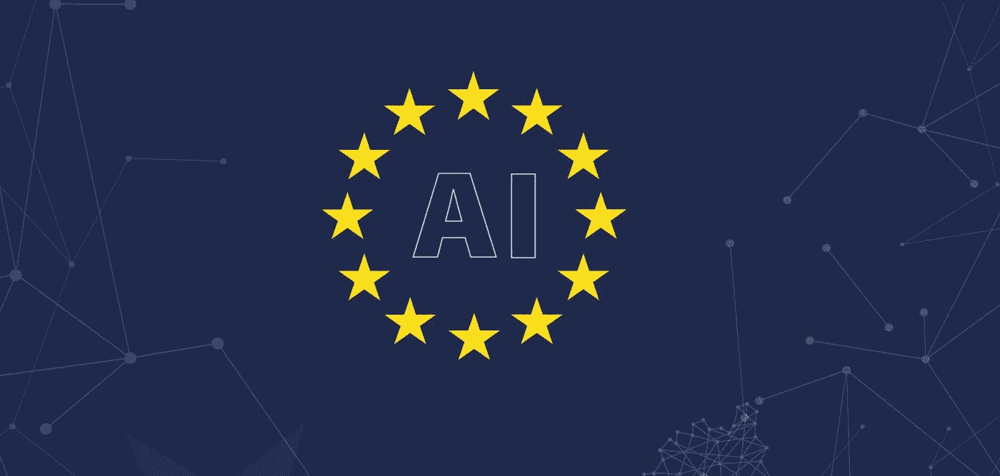
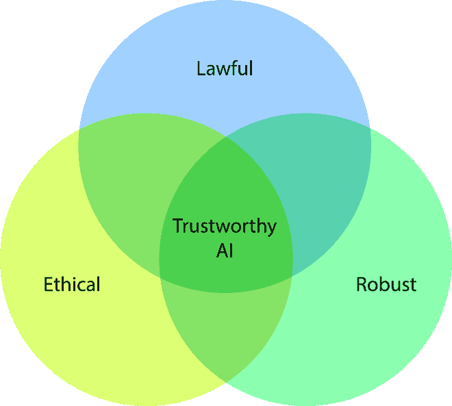

# “可信人工智能的道德准则”总结

> 原文：<https://towardsdatascience.com/ethics-guidelines-for-trustworthy-ai-summarised-1c86174e788b?source=collection_archive---------26----------------------->

2019 年 4 月 8 日，欧盟人工智能高级别专家组(HLEG)发布了他们的可信人工智能道德准则，基于 2018 年 12 月发布的“道德准则草案”收到的 500 多条建议。

在这篇博客中，我想帮助你理解这份文件是什么，为什么它对我们很重要，以及我们如何利用它。

# **什么事？**

“道德准则草案”是一份咨询文件，描述了“可信人工智能”的组成部分，这是一个合法、道德和强大的人工智能品牌。如标题所示，这篇文档关注可信人工智能的伦理方面。它确实提到了对强大人工智能的一些要求，并在较小程度上提到了围绕人工智能的法律，但明确表示这不是一个政策文件，也没有试图就人工智能的法律合规性提供建议。HLEG 的另一项任务是编写第二份文件，向欧盟委员会(European Commission)提供人工智能政策建议，该文件将于 2019 年晚些时候发布。

该文件分为三章；

1.  伦理原则、相关价值观及其在人工智能中的应用
2.  可信 AI 应满足的七个要求
3.  一个非详尽的评估列表，用于操作可信赖的人工智能

这个结构从最抽象的开始，到具体的信息结束。也有机会对评估列表进行试点和反馈，以帮助塑造本文档的未来版本，该版本将于 2020 年到期。[在此登记您的兴趣。](https://ec.europa.eu/futurium/en/ethics-guidelines-trustworthy-ai/register-piloting-process-0#Top)

# **这有什么关系？**

我以英国公民的身份写这篇文章，为伦敦的一家公司工作。考虑到英国退出欧盟和英国(可能)退出欧盟，我们有理由问这份文件是否仍然与我们相关。TL；博士，是的。但是为什么呢？

可信的人工智能必须显示三个特征，即合法、道德和健壮。

伦理人工智能延伸到法律之外，因此对于欧盟成员国来说，它并不比那些独立的国家更具有法律强制力。可信人工智能的道德成分意味着该系统与我们的价值观一致，而我们在英国的价值观反过来也与欧洲其他地区紧密一致，这是我们地理位置接近和数十年文化共享的结果。在某种程度上，美国可能也是如此，他们与欧洲分享很多电影、音乐和文学。这份文件中列出的道德价值观仍然引起英国公众的共鸣，这份文件是实施这些价值观的最佳和最有用的指南。

合法的人工智能不是本文的重点，但它是可信人工智能的重要组成部分。该文件提到了几部欧盟法律，如《欧盟宪章》和《欧洲人权公约》，但它没有明确表示合法的人工智能需要遵守欧盟法律。可信的人工智能可以在这个框架中实现本地相关的法律。可以说，遵守欧盟法律是最明智的选择，根据国家统计局的统计数据，2018 年第四季度英国 45%的贸易是与欧盟[1]进行的。如果欧盟成员国的人民和企业只想购买符合欧盟法律的值得信赖的人工智能，他们就成为了一种经济力量，而不是法律要求。我们可以在美国看到同样的模式，商业建筑服务符合 GDPR，一项他们不必遵守的法律，以获取对他们重要的市场。

最后一个组成部分，健壮的人工智能，描述了在其整个运行寿命中以及面对敌对攻击时，在可能面临的各种情况下继续以期望的方式运行的平台。如果我们在原则上同意可信人工智能的合法和道德组成部分，并接受不可预测或敌对的攻击可能挑战其中任何一个，那么第三个组成部分，健壮的人工智能，在逻辑上就变得必要了。

# **什么是值得信赖的人工智能？**

可信的人工智能由三个部分组成:这是合法的、合乎道德的、稳健的。

当我们的价值观超越政策时，合法的人工智能可能不道德。道德人工智能可能不健全，即使有最好的意图，不良行动的结果出乎意料或作为敌对攻击的结果。健壮的人工智能可能既不道德也不合法，例如，如果它被设计来进行歧视，健壮将只能确保它可靠地进行歧视，并抵制将其推翻的企图。

这篇文档聚焦于可信人工智能的伦理方面，我也将在这个总结中关注。

# **什么是伦理 AI？**

该文件在第一章(第 12-13 页)中概述了四项道德原则，它们是:

*   尊重人类自主
*   预防伤害
*   公平
*   可解释性

这四个原则在第二章《实现可信任的人工智能》中进行了扩展，将它们转化为七个要求，这些要求也提到了健壮性和合法性方面。他们是；

“算法、数据和设计流程”(第 19 页)必须针对内部和外部**可审计性**进行设计，无需泄露知识产权或商业模式，而是增强可信度。**负面**影响的最小化和报告与人工智能系统相关的风险成比例，记录和报告人工智能系统的潜在负面影响(第 20 页)并保护那些报告合法问题的人。当上述两点发生冲突**时，可以基于证据和逻辑推理做出权衡**，如果没有可接受的权衡，则不应使用人工智能系统。当负面影响发生时，应向个人提供适当的**补偿**。

# **评估可信人工智能**

转到最具体的指导，第三章提供了实现可信人工智能的评估列表。这是一个非详尽的问题列表，其中一些问题不适合某些人工智能应用的上下文，而其他问题出于同样的原因需要扩展。列表中的所有问题都不应该靠直觉来回答，而应该通过实质性的循证研究和逻辑推理来回答。

该指南预计，伦理原则之间会有紧张的时刻，需要做出权衡，例如，预测性警务可能一方面让人们免受伤害，但另一方面却侵犯了隐私和自由。在这些点上需要相同的基于证据的推理，以理解哪里的收益大于成本，哪里不适合采用人工智能系统。

# **总之**

这并不是 HLEG 项目的结束。我们可以预计，2019 年晚些时候，同一个小组将提出政策建议，这可能会为我们提供合法人工智能的未来要求的有力指示，我们还将看到 2020 年可信人工智能评估框架的新迭代。

这份文件代表了最全面和具体的建设道德人工智能的指导方针，通过补充重叠的合法性和健壮性方面来扩展这意味着什么。它的有用性超越了受欧盟法律约束的国家，总结了欧盟以外的国家所共有的道德价值观，并提供了一个框架，在该框架中，特定地点的法律可以在必要时进行切换。

[1]资料来源:国家统计局——英国出口总额 1657.52 亿英镑，其中 745.68 亿英镑出口到欧盟——英国贸易的 44.98%(四舍五入为 45%)出口到欧盟。

*原载于 2019 年 4 月 24 日*[*http://blog.soprasteria.co.uk*](https://blog.soprasteria.co.uk/2019/04/24/ethics-guidelines-for-trustworthy-ai-summarised/)*。*