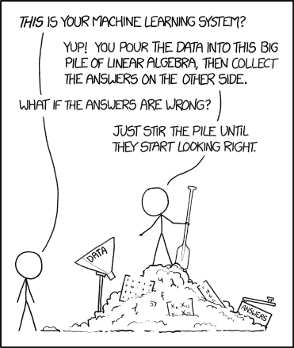
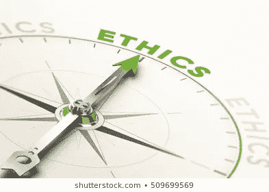
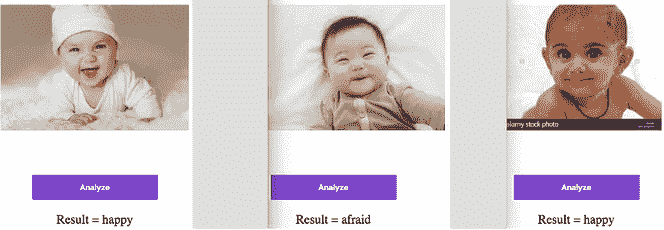
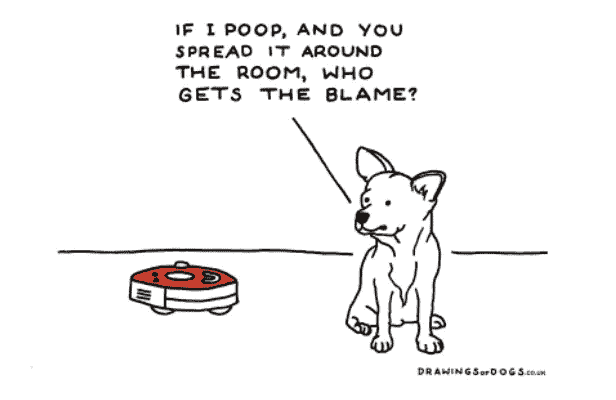

# 人工智能伦理指南

> 原文：<https://towardsdatascience.com/ethics-of-ai-a-comprehensive-primer-1bfd039124b0?source=collection_archive---------3----------------------->

## 探索人工智能伦理问题的 3 集系列

*But what is RIGHT? And is that enough? (Image:* [*Machine Learning, XKCD*](https://xkcd.com/1838/)*)*

# 不要惊慌

> 对任何对人工智能伦理感兴趣的人来说,《人工智能伦理搭便车指南》是一本必读的书。这本书的写作风格和精神启发了许多科幻作家。作者的目标不仅仅是一部有趣的短片，而是整个系列。”

听起来差不多！猜猜是谁写了这篇胡言乱语的评论？

一种机器学习算法。 [OpenAI 的 GPT2](https://openai.com/blog/better-language-models/) 语言模型被训练来预测文本。它庞大、复杂，需要在昂贵的计算机上对大量数据进行数月的训练；但是一旦这样做了，就很容易使用了。一个提示(“人工智能伦理的搭便车指南”是一个”)和一点点监管就让我用一个[小版本的 GPT2](https://gpt2.apps.allenai.org/?text=The cat sat on the) 生成了这篇胡言乱语的评论。

这篇课文有一些明显的错误，但它是通向未来的一扇窗户。如果人工智能可以产生类似人类的输出，它也可以做出类似人类的决定吗？剧透:是的，它可以，它已经是了。但是***类人*** 就足够好了吗？在一个机器产生类似人类的输出并做出类似人类的决定的世界里,**信任**会发生什么？我能相信一辆自动驾驶汽车看到我了吗？我能相信处理我的住房贷款的算法是公平的吗？我们能相信急诊室里的人工智能足以为我们做出生死抉择吗？作为技术人员，我们必须反过来问自己:**我们如何才能让算法系统值得信赖？** [进入伦理道德](https://www.ethicalsystems.org/content/trust)。为了理解更多，我们需要一些定义、一个框架和许多例子。我们走吧！

# 构建指南针

为了开始探索人工智能的伦理，让我们首先简单地考察一下任何以软件为中心的技术背景下的伦理。其他技术(如生物技术)的伦理同样重要，但超出了本书的范围。

> 伦理的定义是:*支配个人或团体行为或行动的道德原则。*

换句话说，帮助确定什么是好的或正确的“规则”或“决策路径”。鉴于此，有人可能会说，技术伦理只是用来决定其“行为”的一套“规则”或“决策路径”。毕竟，技术不总是为了好的或正确的结果吗？

软件产品，当设计和测试良好时，确实通过这样一组规则或决策路径，为可预测的输入达到可预测的输出。通常以序列图或用户故事的形式出现在一些设计文档中。但是团队如何确定什么是好的或正确的结果，以及对谁而言？它是普遍有益还是只对某些人有益？在某些语境下好，在其他语境下不好吗？它对某些标准来说是好的，但对其他标准来说就不那么好了吗？这些讨论，由团队选择的问题和答案是至关重要的！这就是伦理。在创造技术的过程中，它失去了中立的地位。它不再仅仅是达到目的的另一种手段，而是成为其创造者的观点、意识和道德决心的活的化身。因此，技术(或产品)的伦理始于其创造和创造者的伦理。

# 为人工智能寻找“正北”

到目前为止，我们理解伦理，我们理解为什么技术不是中立的，我们隐约理解这有影响。但我们如何将这一点应用于人工智能，其中从输入到输出的路径既不可见也不明显；其中输出不是确定的，而仅仅是一个预测。在人工智能中，特别是机器学习(目前实际上可以大规模实施的人工智能的子集)，丢失的数据，丢失的输入，丢失的决策路径，丢失的讨论都与预测的“质量”有关。不管预测的“质量”如何，选择使用预测对最终结果的“质量”有影响。最终结果的“质量”关系到它对人类影响的“质量”。其中“质量”意味着道德质量，而不是零缺陷软件。**换句话说，人工智能的伦理在于其预测的伦理质量、由此得出的最终结果的伦理质量以及它对人类的影响的伦理质量。**

> 伦理也被定义为:*处理对与错的纪律，以及人类的道德义务和责任。*

道德品质可以在这个定义的背景下理解。人工智能及其创造者的道德义务是什么？它如何声明自己的道德义务和责任？它在多大程度上满足了对他人的道德义务和责任？

> 我喜欢问**算法系统的输出、结果和影响有多正确、多公平、多公正？**它能在多大程度上，以及在多大程度上，确定并宣布它在哪些情况下是正确、公平和公正的，以及在哪些情况下不是。它能控制如何和在哪里使用它吗？失去对这一背景的控制意味着什么？对这些负责构成了人工智能开发者的道德义务和责任。

# 为什么这很重要？

虽然这听起来很老套，但人工智能有潜力“改变世界”。鉴于[人工智能主流化](https://www.technologyreview.com/s/612582/data-that-illuminates-the-ai-boom/)令人眼花缭乱的步伐，感谢[可访问的计算能力](/list-of-deep-learning-cloud-service-providers-579f2c769ed6)和[开源](https://opensource.com/article/18/5/top-8-open-source-ai-technologies-machine-learning) [机器学习库](https://medium.com/syncedreview/fastai-1-0-for-pytorch-theres-nothing-better-out-there-4d123728224b)，很容易看到这种变化将是快速和大规模的。任何为速度和规模而建造的东西都需要对其影响进行严格的检查，因为无意识的伤害也会在规模上发生。再加上人工智能可能造成“伤害”的独特方式，这种紧迫性是实实在在的。除此之外，再加上个人(考虑一下:非国家恶意行为者)可以越来越容易地大规模部署最先进的机器学习系统，这种紧迫性就会袭来。

那么，人工智能会造成哪些“危害”，这些危害在大范围内会产生什么影响？凯特·克劳福德在她的 2017 年 NeurIPS 演讲中提供了思考这个问题的框架。总结一下:

> 当一个预测或最终结果对个人建立其正当人格的能力产生负面影响(代表性的损害)，导致或独立影响他们获取资源的能力(分配的损害)时，就造成了“损害”。

个人的人格就是他们的身份。换句话说，在机器学习系统中错误地表示或未能表示个体的身份是一种伤害。此后，这个系统做出的任何决定，对那个人来说，也是一种伤害。将她对代表伤害的定义扩展到所有相关的人，我认为不能在个人面前准确地代表系统也是一种伤害。技术及其创造者的道德义务要求他们努力减轻所有这些伤害。因此需要人工智能的伦理。

对我们来说，将伦理考虑应用于个人或个人情况是很自然的。例如，当我们受到不公平的对待时，我们会很快发现！但是，在更大、更复杂的环境中，当我们与他们相距两步时，将这一点应用于其他人是极其困难的。我打赌这是不可能的。不是一个人，不是一个人。但是作为一个团体，我们必须。

# 绘制地形图

贯穿两种伦理学定义的是统称为“人工智能伦理学”的问题。指出预测或最终结果的伦理质量或它们对人类的直接和间接影响的问题。我将它们归纳为如下几类:

*   **在“AI 是什么”(即数据集、模型和预测)的领域里:**
    1 .偏见与公平
    2。问责和补救
    3。透明度、可解释性和可解释性
*   **在“人工智能做什么”的领域中，问题是:** 1。安全
    2。人机交互
    3。网络安全和恶意使用
    4。隐私、控制和代理(或缺乏隐私、控制和代理，即监控)
*   **在“AI 影响什么”的领域中，问题涉及:** 1。自动化、失业、劳动力趋势
    2。对民主和民权的影响
    3。人与人之间的互动
*   **在“人工智能可能是什么”的领域中，问题与来自类似人类的认知能力的威胁和对奇点的担忧有关，控制一直到围绕机器人权利(类似于人权)的辩论。对于这篇博客，我将完全避开这个领域。**

# 人工智能是什么

虽然有些人愿意相信[有感知能力的人工智能正在快速接近](https://www.theverge.com/2018/11/27/18114362/ai-artificial-general-intelligence-when-achieved-martin-ford-book)，甚至超越人类的智力并获得从知识到智慧的能力，[在很大程度上不是](https://slashdot.org/story/18/12/26/1647213/artificial-general-intelligence-is-nowhere-close-to-being-a-reality)。鉴于此，假设当我说“AI”时，我指的是一个由学习者(模型)组成的机器学习系统，在给定一组输入(数据)的情况下，它能够学习*某些东西*并使用该学习来*推断*其他东西(预测)。(*注:在统计学中“推断”和“预测”是两回事；但是机器学习社区可以互换使用它们，或者在某些情况下对训练数据使用预测，对测试或新数据使用推断。总而言之，人工智能是数据、模型和预测。源自数据、模型或预测中的问题的伦理问题属于“人工智能是什么的伦理”范畴。*

Dataset Bias in Facial Emotion Recognition (Image: [Personal Project](https://github.com/nalinicommits/nbonfastai/blob/nbsonfastai/nbs/dl1/nb-predicthumanemotions-deployingwebapp.ipynb))

人工智能领域的许多伦理研究、新闻和对话都与偏见有关。这是理所当然的，因为未能识别或纠正这种偏见会导致不公平的结果。这也是人工智能研究人员认为可以量化并在代码中固定的东西。那么什么是偏见，它从何而来，又是如何渗透到机器的智能中的呢？它如何影响结果的公平性？鉴于存在偏见，算法是一个黑箱，我们如何让他们负责？正在进行哪些努力来打开黑匣子，使算法系统透明和可解释？即将在第 2 部分推出！

# 人工智能做什么

Image: [Drawings of Dogs](http://drawingsofdogs.co.uk/products)

使用机器学习机制构建的应用程序将技术与人类的交互提升到了一个全新的水平。自主机器人，即不需要人类实时或频繁指令的机器人(如汽车、无人机、吸尘器、twitter 机器人等)。)影响和改变我们的运营环境。它们间接地改变了我们的行为。人类会适应。有人可能会说他们也能适应这些新的操作环境。例如，当汽车问世时，人类适应了道路上新的交战“规则”。然而，汽车也带来了限速、路标、交通法、安全法规和其他制衡措施，以确保安全和顺畅的技术-人类互动。随着人工智能应用充斥我们的世界，研究人员认识到迫切需要评估对人类安全的影响，人类对自主机器人的感知和互动，对我们的隐私、尊严和代理感的影响。我们将在第 3 部分进行更多的探索。

# 人工智能有什么影响

技术产品通常会引发二阶和三阶后果，这些后果起初并不总是显而易见的。尤其是当产品超出了它们最初的意图和受众，达到了一刀切模式悲惨失败的规模时。随着社交媒体影响世界各地的民主制度，我们看到这种情况正在发生，像脸书、T2、谷歌和 T4 的推特都在努力控制他们的算法和他们平台上的大规模游戏。有了人工智能，二阶和三阶后果不仅仅限于应用程序或平台，而且还延伸到其他领域。在第 3 部分，我将探讨人工智能如何影响就业，以及在许多情况下如何加剧机会和收入的不平等。我还将探讨它如何影响人与人以及人与社会的互动。随着真人和自动机器人之间的界限开始在网上变得模糊，随着人类受到大量“信息”的轰炸，通常是虚假的，信任的概念以及因此而产生的安全性是如何被动摇的。请继续关注第三部分。

## 额外资源

*   [道德的定义(韦氏词典)](https://www.merriam-webster.com/dictionary/ethic)
*   [伦理学的定义(牛津英语词典)](https://en.oxforddictionaries.com/definition/ethics)
*   [数学毁灭的武器(凯西·奥尼尔著)](https://weaponsofmathdestructionbook.com/)
*   [人工智能道德入门套件(Rachel Thomas，Fast.ai 联合创始人)](https://www.fast.ai/2018/09/24/ai-ethics-resources/)
*   [技术实践中的伦理(马库拉应用伦理中心，SCU)](https://www.scu.edu/ethics-in-technology-practice/)
*   [走向伦理人工智能(Eirini Malliaraki 的批判性阅读清单)](https://medium.com/@eirinimalliaraki/toward-ethical-transparent-and-fair-ai-ml-a-critical-reading-list-d950e70a70ea)

这是探索人工智能伦理的三部分系列的第一部分。 [*第二部分，此处可用*](/the-hitchhikers-guide-to-ai-ethics-part-2-what-ai-is-c047df704a00) *，潜进什么是艾的伦理。* [*第三部分，此处可用*](https://medium.com/@naliniwrites/the-hitchhikers-guide-to-ai-ethics-part-3-what-ai-does-its-impact-c27b9106427a) *，着眼于人工智能做什么和人工智能影响什么的伦理。*

*非常感谢* [*雷切尔·托马斯*](https://twitter.com/math_rachel)*[*卡蒂克·杜赖萨米*](https://www.linkedin.com/in/karthik-duraisamy-66705025/) *和* [*斯里拉姆·卡拉*](https://twitter.com/skarra) *对初稿的反馈。一个大声喊出来也给这个领域所有牛逼的人，* [*其中很多都是女性*](https://lighthouse3.com/100-brilliant-women-in-ai-ethics-you-should-follow-in-2019-and-beyond/) *。他们是我的英雄。**