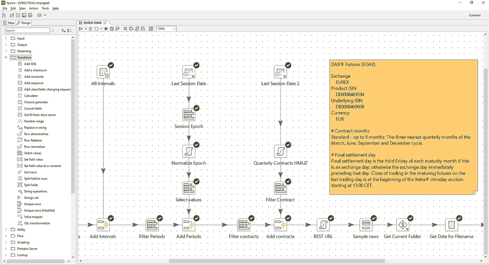

# 数据科学中的 ETL 和 DI:在金融市场数据仓库中的应用

> 原文：<https://towardsdatascience.com/etl-and-di-in-data-science-usage-in-financial-markets-data-warehouses-21df4e1ebb42?source=collection_archive---------15----------------------->

我开始从事量化交易的回溯测试已经有几个月了。最初，所有的焦点都集中在核心活动上:策略和应该使用哪些回溯测试引擎，但是一旦项目开始滚动，其他现实世界的小挑战就需要注意了。

系统和专业的方法回溯测试的努力不仅需要机器学习、统计分析和数据分析的花哨活动，还需要数据仓库阶段的一点简陋的脚手架和管道。

在我之前的文章 [*如何存储金融市场数据用于回溯测试*](/how-to-store-financial-market-data-for-backtesting-84b95fc016fc) 中，我讨论了回溯测试所使用的检索策略。使用传统的实际仓库术语，如果我们在那篇文章中讨论了数据拾取挑战，那么在本文中我们将讨论数据存放策略。

将数据供应和输入到您的数据仓库涉及数据分析业务中不太光彩但同样相关的方面:保持原始数据流动，因为没有适当质量的数据输入，任务注定会失败。

# 内部与外部提供商

基本上有两种方法可以遵循:

1.  与第三方数据馈送供应商签订合同，并根据需要使用他们的 API。将会有集成成本，但是您不需要构建、提供或操作您自己的数据仓库。
2.  将不同来源的数据储存在您自己的数据仓库中。将会有集成成本，加上与构建、维护和操作您的数据仓库相关的成本。

虽然第一个选项应确保一致和高质量的数据(前提是您选择高质量的数据馈送提供商)，但它有几个局限性:

1.  高质量的饲料很贵——大型投资公司使用的高质量饲料确实非常贵。这将限制你可以获得的资产数量，也可能限制你在其他领域或市场探索策略的创造力。数据馈送成本会危及项目预算，而项目预算可以分配给更有价值的资源和活动。
2.  当天的第三方数据馈送通常有时间限制。虽然有理由怀疑回溯测试遥远时间的日内数据的好处(市场在发展，人们对算法交易在过去几年的影响有共识)，但测试长期策略总是一个好主意。原因是，只有在你计算大量数据的情况下，才能获得关于特定日内策略在市场机制中表现的见解，因为市场机制可能会持续数年。在你的策略中不去面对或分析市场机制的影响将会带来灾难性的后果，所以你依赖的数据越多越好。
3.  第三方数据馈送中的期货和期权合约可能不会按结算日期分割。虽然大多数策略可能希望关注一个累计的连续期货合约——这在现实世界中并不存在，但它是一个方便的回溯测试的人工制品——但你可能会对评估不同结算日期的合约的差异、趋势或成交量峰值感兴趣。在这种情况下，找到符合这一要求的第三方数据馈送供应商可能会很困难。
4.  为分析引擎来回移动大型数据集可能会对性能产生影响，尽管当前的网络性能(尤其是在云服务中)会使这成为一个小问题。
5.  某些第三方供应商对客户针对服务的请求数量施加限制；这种限制通常与服务的成本有关，我们已经讨论过了。

使用第三方供应商的好处显而易见。它简化并外部化了持续输入和存储大量数据的问题，提供了一个一致的 API，该 API 通常会增加额外的财务数据。一个高质量的第三方数据源还将提供股票现金资产的价格分割和股息信息，一些供应商还提供基本面数据。

相反，从长远来看，构建自己的数据仓库可能会降低成本，前提是有足够的资源来快速构建。缺点显而易见:

1.  开发时间会更长。你将不得不处理几个数据源和延迟的时间提供者，该项目将需要定制和辅助开发，以确保你可以覆盖所有的资产和市场，你想以后分析。
2.  您仍然需要一次性历史数据来预配置您的数据仓库。如前所述，使用长历史数据集进行计数是相关且必需的。如果你今天就开始积累数据，至少在一两年后才会有用。
3.  你需要适当的在线硬件资源。可能是问题较少的问题，因为云平台现在是一种商品，大量的存储和计算能力可以以相当便宜的价格作为服务购买。
4.  您需要适当的操作程序来确保监控和数据质量。虽然您可能认为一旦平台开发完成就不会有任何问题，但是零维护项目是不存在的。必须定义一个适当的操作计划——它可以很简单，但必须存在——为此，您需要身边有熟练的资源。当你决定寻求内部解决方案时，这可能是你面临的主要障碍。

主要的优势基本上是潜在的项目整体价值收益(您的项目将有肌肉*和数据*)和潜在的成本节约。作为数据仓库的所有者还有一个优势，那就是可以完全控制存储什么以及如何利用它，并且可以对计算密集型的回溯测试场景产生重大影响。

毫无疑问，关键因素是成本。仅仅是构建自己的数据仓库或使用外部提供商的决定并不能决定成本:总体节省或成本很大程度上取决于可用的团队和资源。

总的来说，根据我的经验，建立和维护你自己的数据仓库可以提供可观的成本节约*当且仅当*已经有可用的资源来建立和维护这个项目。最后，集成第三方提要并不像人们想象的那样简单，仍然需要某种临时存储库，因此构建自己的数据存储库并不困难。

相反，如果您的项目使用标准的回溯测试软件，并且您的资源缺乏处理企业级数据仓库项目的经验，那么明智的做法是不要插手。这种情况在行业中很常见，因为人们倾向于关注和专注于回测软件。购买外部数据馈送的主要优势可能是它将操作需求降至最低。

> 为金融市场数据构建数据仓库并不是火箭科学——金融市场中的数据模型极其简单和一致——但正如生活中任何严肃的事情一样，它肯定需要团队中有技能和经验的资源。它提出了开发、部署和操作任务，虽然性质上并不复杂，但仍需要妥善处理。

# 我们的生产级平台之旅

在我们的项目中，我们决定构建自己的定制解决方案。原因是:

1.  现有入门级回溯测试工具执行标准统计分析的功能较差。
2.  现有的回溯测试工具在定性(而非定量)或其他基于人工智能的分析中缺乏功能。
3.  现有回溯测试工具 API 和语言的陡峭学习曲线。
4.  处理大型日内数据集时的性能问题。

我们的项目需求很快从孤立的测试、想法和概念演变成一个旨在获得生产级解决方案的正式项目。

这种演变的原因是，当第一次回溯测试活动开始时，很明显准备数据和策略的开销比预期的要高得多。在验证结果时，我们还发现了许多导致对结果缺乏信心的操作问题。即使在纯定量领域——现有的回溯测试解决方案大放异彩——开销也非常高。

我们发现需要一个具有数据管理、数据集成、调试、数据流、作业调度、图表、报告和验证功能的适当的框架环境。这些组件并不构成实际分析和测试的一部分，但它们对生产力有着巨大的影响，如此之大，以至于它们可以单独决定任务的成败。从长远来看——定量业务无疑是一个非常漫长的旅程——这样的环境将提供巨大的回报，并能够快速测试、验证、抛弃和采用战略。

# 为什么数据集成(DI)和提取-转换-加载(ETL)简化了集成并提供了进一步的分析可靠性

正如上一段所讨论的，从项目的早期阶段就可以清楚地看出，需要一个明确的解决方案来解决数据管理、集成、调试、制图、报告和验证等问题。

在评估了几个备选方案(包括 Jupyter 笔记本电脑等数据科学中的经典选项)后，结论很明显:所有这些解决方案都是为起草、评估和原型制作小概念而构建的。绝不是说，它们可以用来构建任何大型项目所需的协作、开发和生产环境。

在对所需的主要组件进行快速评估和起草后，我们发现一个好的解决方案是利用现有的数据集成平台(它基本上进一步扩展了 ETL —提取转换加载—概念)来处理所有基本任务，并提供一个成熟的流程、作业、转换、调试和报告环境。

虽然数据集成不参与实际的回溯测试分析，但它将简化构建解决方案所需的不同流程和工作的编排；在我们的项目中，它已经被证明是一个非常有效和有用的伙伴。

Flow excerpt to provision EUREX Futures intraday data: the visual approach mixed with lightweight custom Java code lead to full implementation of the data provisioning project leg in just two weeks. Easy to maintain, monitor and self-documented.

数据集成(DI)平台(有几种，包括商业的和开源的)将提供成熟的、企业级的和可扩展的框架来处理数据处理需求。这种基本级别的集成和操作在任何涉及长期处理多个数据源的项目中都是一个不变的需求，金融市场也不例外。

> 与流行的观点相反，数据集成平台的主要好处与避免或最小化定制编码无关；它们涉及有效地自我记录流程，并在开发和生产环境中为流程和作业框架提供适当的调试、调度、监控和报告工具。这些要点是真正的关键优势。

在我们的案例中，我们决定使用 Hitachi Vantara 作为我们的数据集成解决方案，它可以通过使用 Java 自定义类轻松扩展，学习曲线也非常容易。我并不是在推销这个解决方案，而是利用其中一个，结果可能与其他解决方案一样好。我们发现 Hitachi Vantara 在资源方面有点庞大，但它具有良好的性能和与 Java 的出色集成——这一点与我们的情况相关，因为我们团队的 Java 技能很强，并且部分 AI 分析正在用 Java 进行原型开发。

采用该解决方案后，我们设法在两周左右的时间内解决了所有主要的数据供应问题，包括学习曲线和平台安装。我们发现它是一个非常有用的工具，对于开发和生产环境都是如此，并且它代表了加速项目的巨大支持。

# 摘要

量化交易需要大数据集来测试、训练和评估。它既与长期历史记录相关，也与评估不同市场机制的策略相关，还能不断向我们的存储库提供新数据。这就需要一个数据仓库或一个外部数据源来按需提供数据。

我们可以为想要评估的资产和市场购买订阅服务。这将提供一种更容易的方法来检索数据，但如果市场数量很大，并且我们利用高质量的数据，这可能会很昂贵。如果您的项目缺乏企业级数据集成项目的实践经验，这可能是明智的选择。

构建您自己的存储库并不复杂，如果您的项目按时使用正确的资源，这可能是一个好主意。在这种情况下，内部数据仓库只需付出非常有限的努力，就可以实现显著的节约。在朝着这个方向发展的情况下，利用数据集成平台被证明是有帮助的，可以简化开发和生产环境，并增加我们的数据分析和流程的可信度。