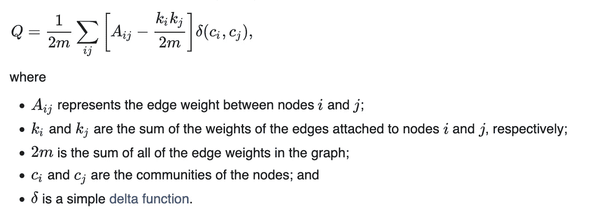
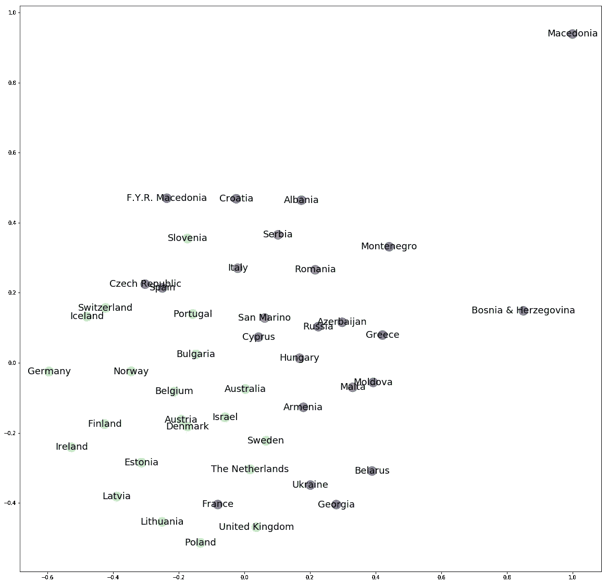
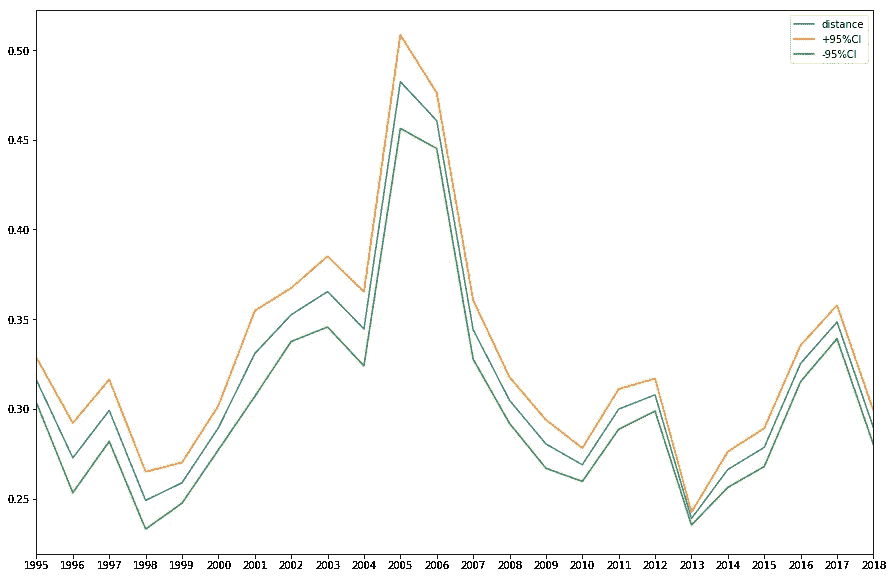
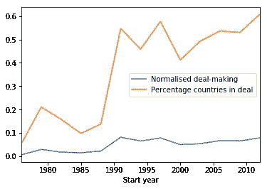
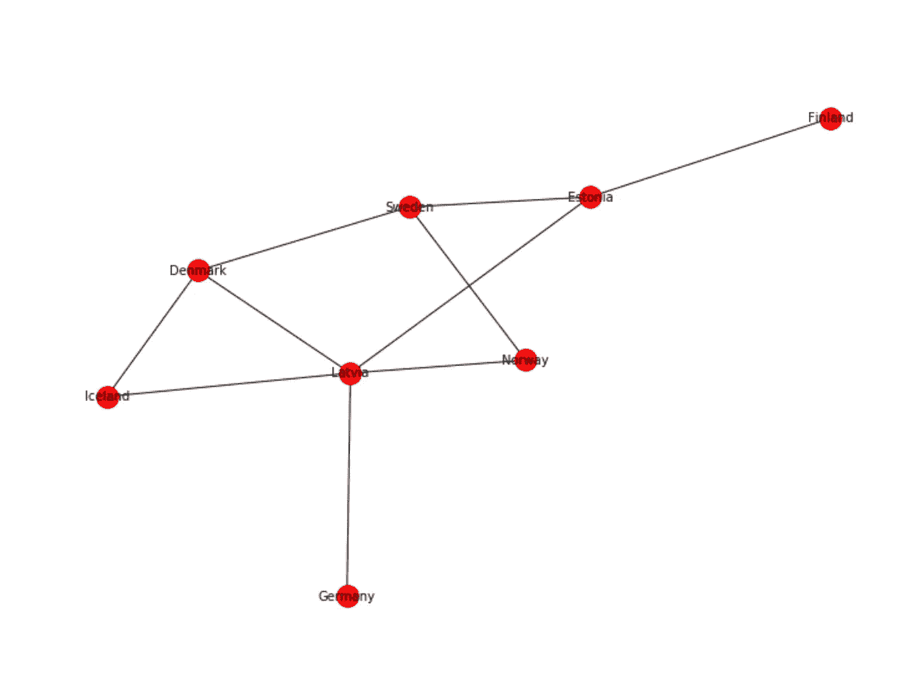
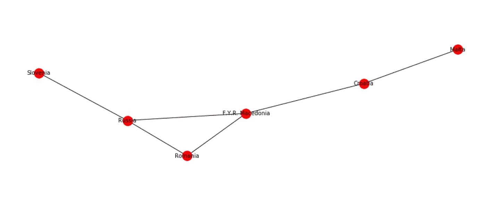
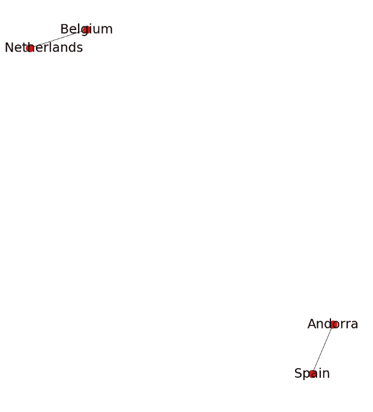

# 欧洲电视网、蒙特卡洛分析和战术投票的检测

> 原文：<https://towardsdatascience.com/eurovision-monte-carlo-analysis-and-the-detection-of-tactical-voting-8d5fe04acb99?source=collection_archive---------19----------------------->

## 这些年来，欧洲电视网如何变得更具战术性，但也更平衡。

# 欧洲电视网颂歌

对于那些不知道的人，我敢打赌，欧洲电视网歌曲大赛是一年一度的音乐比赛，在这场比赛中，一个(松散的)联盟团体(主要是)欧洲国家在电视直播中相互合作，为对方推荐一首获胜的歌曲。在 X 因素的风格，竞争是由选民电话决定的。

每个国家都给他们的前 10 个选择打分，分值范围从[1，2，3，4，5，6，7，8，10，12]。非零分值只能给一次(例如，法国只能给一个国家打 12 分)。

很长一段时间以来，欧洲电视网一直是我罪恶的快乐。我作为第三种文化的孩子在非洲、欧洲和亚洲长大。欧洲电视网对流行文化的奇异融合，其接受和开放的自由氛围，结合其对竞争、地缘政治和阴谋耳语的脚踏实地的帮助，一直对我有吸引力。除了纯粹的娱乐价值，我一直认为它是大多数多边主义尝试的一个相当有代表性的模拟:有价值，混乱，不可避免的战略。

不仅如此，数据科学的时机已经成熟。事实证明我不是唯一这么想的人。预测比赛结果是卡格尔组织的第一次[比赛。更幸运的是，Data World 的优秀人员](https://superheroadventuresindatascience.com/forecast-eurovision-voting-the-very-first-kaggle-data-science-competition/)[维护了竞赛历史上所有国家发出和收到的投票的最新数据](https://data.world/datagraver/eurovision-song-contest-scores-1975-2018)。

# 研究问题:战略投票变得“更糟”了吗？

让多边类比再持续一会儿，直到我让它死去，欧洲电视网并不是没有派系和诽谤者。近年来，越来越多的人(主要来自西欧国家)抱怨说，竞争现在基本上是一场战略投票集团(主要包括西欧和东欧)的游戏，其中东欧大量的后苏联小国意味着，很久以前的传统赢家(见爱尔兰，自 20 世纪 70 年代开始以来，仍然是“最多胜利”的纪录保持者)几乎没有获胜的机会。这种争论甚至导致了 2006 年对分数分配方法的审查，该审查引入了一个比大众投票更“客观”的评委小组来代表 50%的分数授予标准。

出现的问题是:

*1。)欧洲电视网有策略投票吗？*

*2。)这些年来，战略投票的数量增加了吗？*

Git hub 代码库可以在这里找到:【https://github.com/InternetGareth/EuroVision 

# 探索数据

在深入研究之前，最好先看看数据的结构。首先，看起来数据不仅包括决赛的投票，还包括多轮比赛(四分之一决赛、半决赛等)的投票。这一点值得后面分析的时候记住。

Imported DataFrame

需要记住的第二个问题是，对于所有年份，但特别是如果分析仅限于最终结果，国家的数量和值将会逐年变化。

The total countries in the final changes each year

最后，只是为了确认一下，数据捕捉到了比赛的任意点数方案:{0，1–8，10，12 }

# 网络分析

我采用的第一种方法是将所有数据导入 Python 中的 Networkx 包，并应用一些基本的[社区检测](https://en.wikipedia.org/wiki/Community_structure)。投票的数据框架可以表示为一个网络，其中节点是竞争中的国家，边是国家之间给予和接受的投票。给定这些参数，我们可以认为这个网络是双向和加权的。

## 社区检测

一旦数据是这种格式，我决定尝试一些社区检测，看看是否确实有一些基于地理的投票块。在这个例子中，我使用了 [Louvain 模块性](https://en.wikipedia.org/wiki/Louvain_Modularity)作为我的检测算法。本质上，该算法试图根据最大化“社区”内的边与“社区”外的边的密度比的标准来优化社区及其成员的数量。

Modularity: Objective function to maximize in Louvain community detection Source: [https://en.wikipedia.org/wiki/Louvain_Modularity](https://en.wikipedia.org/wiki/Louvain_Modularity)

以下是过去 5 年投票(2013–2018)中所有比赛阶段(半决赛、决赛等)的分析结果:

Community detection for 2013–2018, all competition stages

看起来有一些关于东方和西方正在进行投票的看法是真实的。两个最大的社区是:

*   *绿色:*主要是西欧/北欧国家。
*   *蓝色:*主要是巴尔干/东欧国家。

## 使用 Jaccard 指数检测社区变化

因此，我们有一些证据表明，在过去几年里，各国确实倾向于整体投票。我的下一步是试图想出一种方法来跟踪这些块是否随时间而改变。我选择使用一个 Jaccard 指数来比较社区如何随着时间的推移保持一致性。Jaccard 指数是一个非常简单的指标:它是两个集合的交集:(A∩B)/A∪B。对于像国家列表这样直接的东西，它让我很好地了解了这些社区随着时间的推移有多相似。具体来说，我编写了一个算法:

1.  每年检测到的社区(基于当年和前 3 年所有国家之间的投票总数)
2.  对于每个社区，将其与去年的“最佳”匹配进行比较(比较时 Jaccard 最高的社区)
3.  对于所有匹配，计算当年的平均加权 Jaccard 分数

然后，该值将告诉我投票群体/社区随时间保持一致的程度，以及是否有投票行为发生巨大变化的年份。结果如下。请注意，因为 Lauvain 算法通过查找局部解来优化速度，所以每次运行它都会产生稍微不同的结果。为了解决这一问题，每年重复检测 50 次，并给出每个加权平均 Jaccard 指数的 95%置信区间:

Weighted average Jaccard Index between detected voting communities (current year compared to previous year)

这告诉我们，在 2004-2006 年间，发生了一些事情，从根本上“动摇”了参与竞争的投票群体。事实证明，对此有一个很好的解释；2004 年以前，只有进入决赛的国家才能投票选出冠军。2004 年后，[改变了这种做法](https://en.wikipedia.org/wiki/Voting_at_the_Eurovision_Song_Contest)，允许那些没有进入决赛的国家仍然可以投票。因此，我们似乎是解释战略投票的一部分:通过向退出的国家开放竞争投票，投票“社区”自 2004 年以来发生了显著变化。

# 使用蒙特卡罗分析深入研究策略投票

我现在知道有不同的选民群体，他们在 2004 年经历了一次重新洗牌。然而，为了让投票真正具有“战略性”，人们会期望它是对等的:即各国一直相互投票。幸运的是， [Derek Gatherer (2004)](http://jasss.soc.surrey.ac.uk/9/2/1.html) 有一篇很棒的论文，描述了一种基于[蒙特卡罗方法](https://en.wikipedia.org/wiki/Monte_Carlo_method)的检测策略投票的方法。该方法采取以下步骤:

1.  **选择一个时间段**(例如 5 年)

**2。对于每一年，计算一个国家给另一个国家的所有可能点的无偏概率密度函数。**这相对容易:所有非零点数类别都有 1 / (N-1)次机会，其中 N 是投票国家的数量。零点类别将有(N-10)/N 次机会。其中 10 是非零点类别的数量。

Example probability distribution for votes given in year 2000

**3。对这些年的投票进行蒙特卡洛模拟**,计算一个国家在该时间段内给予一个国家的总票数的概率分布。同样，这只是一个从每年的分布中随机抽样和合并总点数的问题。以下是 2000 年至 2005 年期间 2000 次运行模拟的示例。正如我们所料，这是严重倾斜到零，因为大多数国家不会使削减赢得积分。平均而言，在 2000 年至 2005 年期间，你可以期望从任何其他国家收到总共约 2.3 张选票。

Frequency distribution of total votes given by a country to another county: Mont Carlo Simulation for years 2000 to 2005

**4。与实际投票模式进行比较:**如果实际投票数在分布的 5%范围内，则投票被视为“偏袒”。如果对方国家投桃报李，投票被认为是“战略性的”。

# 结果

使用上述方法，我能够发现国家之间的战略投票，以及它们多年来的变化。下图显示了(I)标准化交易率(战略关系)，定义为(交易总数/可能的交易总数)和(I)战略关系国家的百分比。

本质上，这是对同一趋势的两种度量，但是将它们分开考虑是有用的。

% Countries in deals , and the rate of deal making

更仔细地观察其自身轴上的交易达成率，我们可以更清楚地看到，随着时间的推移，交易达成率大幅增加(测量的趋势与交易中国家的百分比非常相似):

因此，我们现在知道，这些年来，不仅投票群体发生了显著变化，而且互惠投票(即策略投票)似乎也在增加。那么，西方各州的抱怨是正确的吗？嗯…是也不是…

# 映射投票社区

那么这些战略联盟是谁呢？有必要绘制一些样本，让我们了解谁在与谁合作。以下是使用蒙特卡罗方法发现的战略联盟，以 5 年为增量:

## 1995 年至 2000 年

Cyprus and Greece have each other’s back in the late 1990s

As do the infamous Scandinavian / Northern voting block

The beginnings of the eastern voting block emerge

## 2000 年至 2005 年

The Balkans get strategic: an opening up of voter eligibility increases volume of strategic alliances, where regional solidarity encourages the growth of a new voting block in Eastern Europe.

And some countries forget to join the party….

## 2005 年至 2010 年

The web of alliances gets more complex as the years go by, but is still defined by centers in Scandinavia, Eastern Europe, and the Balkans

And the U.K. wonders why it never wins any more…

# 结论

**2004 年投票规则的变化对竞争产生了重大影响:竞争**变得更具战略性，但这可能更多地是由于 2004 年投票规则的修订，该修订将更多的地区团结带入了投票中(而不是东方国家的任何阴谋活动！).

**战略性投票增加:**这些年来，战略性投票一直在增加，在 2004 年修订规则之前，这种趋势一直呈上升趋势。它似乎也没有受到引入“客观”评判小组的影响。

**然而，这更多的是其他国家在西方玩自己的游戏:**值得注意的是，抱怨这一点的国家(大多是年龄较大的西欧选手)*发明了*战略投票的游戏:特别是斯堪的纳维亚投票区，还有英国-马耳他-爱尔兰的联系。

我将留给你们关于欧洲电视网的许多教训的最后一个想法，这在目前看来是恰当的。值得记住的是，人们通常会认为一些国家相对实力的下降并不是绝对的实力“下降”,而是世界其他国家崛起的成功故事。