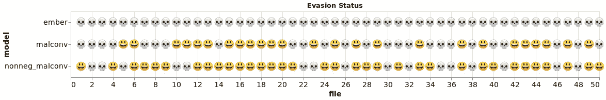
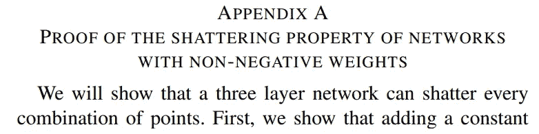
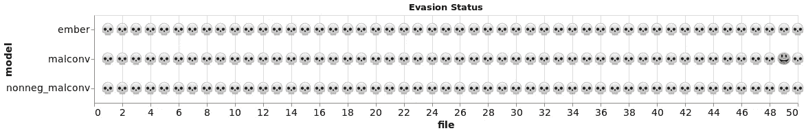
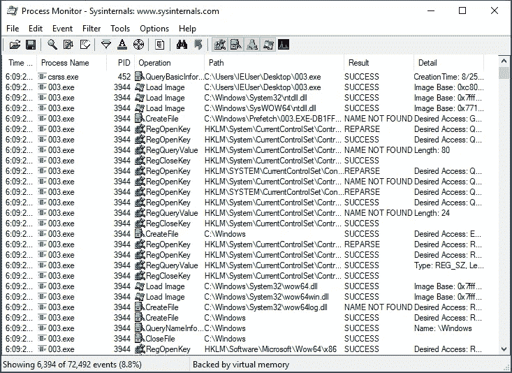
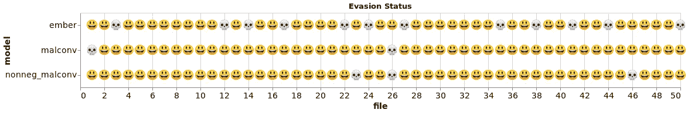
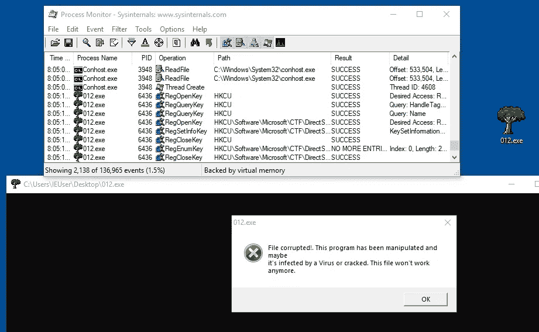
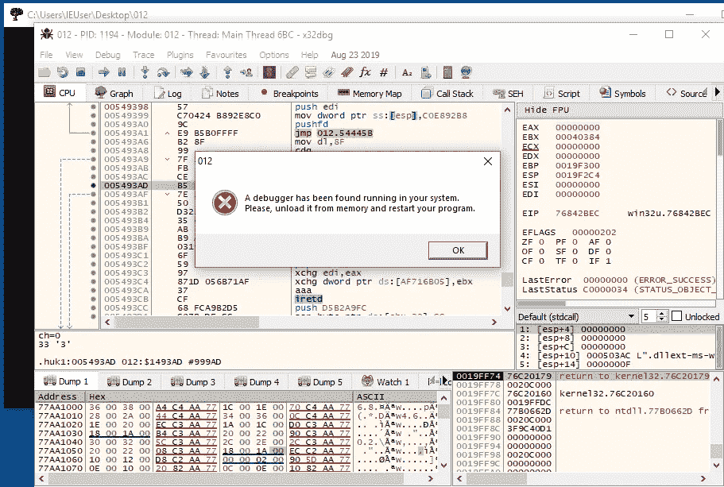
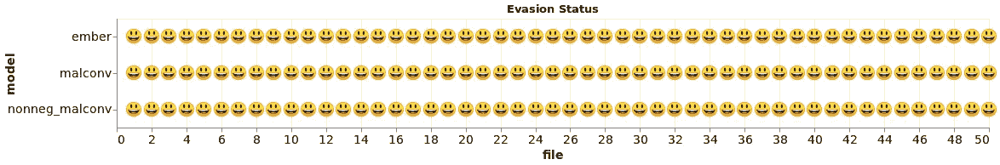

# 规避机器学习恶意软件分类器

> 原文：<https://towardsdatascience.com/evading-machine-learning-malware-classifiers-ce52dabdb713?source=collection_archive---------8----------------------->

## 为了乐趣和利益！

# 介绍

在这篇文章中，我将详细介绍我在今年 DEFCON AI Village 上宣布的[机器学习静态规避比赛](https://www.endgame.com/blog/technical-blog/machine-learning-static-evasion-competition)中获胜时使用的技术。比赛的目标是获得 50 个恶意的 Windows 可移植可执行(PE)文件，以逃避三个[机器学习恶意软件分类器](https://github.com/EndgameInc/malware_evasion_competition)的检测。这些文件不仅需要躲避检测，而且还必须保持它们原来的功能和行为。

本次比赛由[残局](https://www.endgame.com/)、[MRG-艾菲塔斯](https://www.mrg-effitas.com/)和 [VM-Ray](https://www.vmray.com/) 赞助。比赛非常有趣，获胜后会有一份令人敬畏的[奖品](https://www.nvidia.com/en-us/titan/titan-rtx/)！

# 了解你的敌人

这是一场白盒竞赛；这意味着我可以完全访问所有的模型参数和源代码。因此，首先要做的是打开模型，看看引擎盖下发生了什么。

## 马尔康夫

第一个模型是在 Windows 可执行文件的原始字节上训练的神经网络。MalConv 是在 PyTorch 中实现的，如果您已经熟悉神经网络，那么[代码](https://github.com/endgameinc/malware_evasion_competition/blob/master/MalConv.py)相对简单明了:

文件作为表示文件字节的整数序列(0–255)传递给 MalConv。MalConv 内部的嵌入层将每个字节映射到一个数字向量。向量序列然后可以由附加的神经网络层处理。该模型输出两个数字，表示输入为良性和恶意的概率。

已经有大量关于躲避 MalConv 的文献了。最简单的攻击是在可执行文件的末尾添加一些好看的东西。这是一个特别好的技巧，因为当恶意软件执行时，添加的数据(也称为覆盖)不会加载到内存中。因此，我们可以在不改变文件功能的情况下，在覆盖层中放置任何我们想要的东西。MalConv 寻找良性和恶意字节模式，以便做出决定。覆盖攻击的目的是用与良性文件相关的模式将其淹没。

## 非负 MalConv

第二个模型实际上与第一个模型相同，但赋予各层的权重不同。顾名思义，非负 MalConv 在训练期间被约束为具有非负权重矩阵。这样做的目的是防止像 MalConv 那样的小攻击。当操作得当时，非负权重使得二元分类器单调；这意味着添加新内容只会增加恶意得分。这将使规避模型变得非常困难，因为大多数规避攻击都需要向文件中添加内容。对我来说幸运的是，非负 MalConv 的这个实现有一个微妙但关键的缺陷。

非负防御仅对具有代表样本恶意性的单一输出分数的二元分类器有效。这个版本将输出分成两个分数:一个是恶意的，一个是良性的。然后，softmax 函数将分数转换为每个类别的概率。这种结构使得非负权重的训练毫无意义。附加内容仍然可以将良性分数任意推高。随着良性分数升高，softmax 功能会降低恶意分数，即使存在相同数量的恶意内容。所以所有针对 MalConv 的攻击在这里也会起作用。

如果你对更多的数学细节感兴趣，看看这篇[论文](http://ci.louisville.edu/zurada/publications/chor-zur-tnnls.pdf)的附录 A。作者证明了具有非负权重的 softmax 网络就其可以学习的内容而言本质上等价于无约束网络。这就是为什么一个适当的防御必须使用单一输出；我们不希望网络学会寻找良性内容。

Excerpt from paper: [http://ci.louisville.edu/zurada/publications/chor-zur-tnnls.pdf](http://ci.louisville.edu/zurada/publications/chor-zur-tnnls.pdf)

## 余烬

[Ember](https://github.com/endgameinc/ember) 实际上是一个由 Endgame 维护的数据集。随着数据集而来的是一个经过训练的基准模型(我也称之为 Ember)。Ember 是一个 [lightgbm](https://lightgbm.readthedocs.io/en/latest/Python-Intro.html) 模型(一组增强的决策树),根据从 Windows PE 文件解析的几个特征进行训练。

Ember 特性解析的源代码位于[这里](https://github.com/endgameinc/ember/blob/master/ember/features.py)。查看所有特征是如何被解析的对于精心设计攻击非常有用。提取的特征包括:

*   字节直方图
*   字节熵
*   截面信息(名称、大小、熵、属性)
*   导入表库和条目
*   导出的函数
*   一般文件信息(各种东西的大小和数量)
*   标题信息(机器、架构、链接器、版本等。)
*   字符串(关于文件中字符串的各种统计信息)
*   数据目录(名称、大小、虚拟地址)

数字特征按原样使用，而[散列技巧](https://scikit-learn.org/stable/modules/feature_extraction.html#feature-hashing)用于将其余特征(如部分名称)转换成数字向量。乍一看，Ember 看起来更难糊弄。许多功能与文件的结构或我们无法改变的特征有关。记住，我们必须在保持原有功能的同时躲避检测！

Ember 的漏洞在于，一些功能可以被攻击者任意控制。lightgbm 模型在整个树集合的多个位置使用这些特征。我们可以通过操纵特征来利用模型的复杂性，以便沿着导致规避的路径推动决策。

# 准备

竞赛代码附带了一个脚本，用于针对一个文件运行所有三个模型。我修改了脚本来评估恶意软件的整个目录，并使用[牛郎星](https://altair-viz.github.io/index.html)来添加一个有趣的视觉记分牌:

Initial scan of original malware files.

头骨表情符号代表一个模型检测到了恶意软件，而快乐的脸代表一种逃避。有趣的是，49 号文件已经避开了 MalConv，所以我们可以免费得到 1 分！

# 规划

在花了几分钟弄清楚如何用表情符号进行策划后，我决定是时候考虑如何应对这场比赛了。棘手的部分是找到同时影响所有三个模型的有效操作，或者至少影响一个模型，但不会对其他模型发出危险信号。我决定将重点放在有希望同时影响所有三个模型的攻击上。

## 覆盖层

如上所述，PE 文件可以附加任意内容。这些额外的字节被称为覆盖，当 Windows 执行文件时，它们不会被加载到内存中。因此，在这里添加字节不会改变恶意软件的功能。

## 松弛空间

除了覆盖之外，在每个部分的末尾还有空间来添加额外的字节。PE 部分需要与内存量的 2 次方对齐。当实际内容没有填满整个空间时，该部分被填充。可执行文件不会访问这部分内存，所以我们也可以自由地改变这个空间。

## 新章节

除了向现有部分添加字节，我们还可以创建新的部分。新的部分不会破坏文件的功能，因为在现有的代码中没有对它们的引用。这给了我们足够的空间来添加任何我们想要的内容。

## 聚焦功能

因为 MalConv 模型将所有东西都视为字节(没有结构上下文)，所以对他们来说，我们只需关注用他们认为是良性文件的模式来压倒他们的决定。然而，余烬的特征结构要求我们实际考虑可能阻碍它的细节。

我们可以操作的最明显的特征是字节直方图和字节熵。字节直方图只是计算文件中每个字节值的归一化频率。因为我们可以添加包含任何内容的部分，所以将字节分布强制为我们想要的任何目标分布是微不足道的。

我们也有体面的控制部分信息功能。我们可以通过使用松弛空间来改变截面的熵。我们也可以改变部分的名称，这可以把我们带到 Ember 决策树的不同分支。

最后，字符串特性也非常容易被操纵。同样，因为我们可以添加包含任何内容的新部分，所以我们可以根据自己的需要调整字符串统计。

# 亲爱的

以上所有修改都可以使用 Ember 用来解析特性的同一个库来完成: [lief](https://github.com/lief-project/LIEF) 。LIEF 项目非常棒，我绝对推荐你去看看。我用它来解析恶意软件，进行修改，并重建 PE 文件；挺神奇的！

这里有一个简短的演示，展示了修改 PEs 是多么容易:

一般的工作流程是:解析 PE，进行任何修改，构建新的 PE，保存到磁盘。

# 验证虚拟机

我还安装了 Windows 虚拟机来进行逆向工程。重要的是观察被改变的文件，以确保它们的行为与原始恶意软件相同。每当我需要一个废弃的 Windows 虚拟机，我就从[这里](https://developer.microsoft.com/en-us/microsoft-edge/tools/vms/)拿一个。

Watching the Procmon output of an altered file being executed.

# 攻击时间

我的计划是从简单开始，然后根据需要增加复杂性。新的部分似乎是最有希望的攻击途径，因为它为我们提供了对 Ember 的功能以及文件的原始字节进行重大更改的能力。我编写了下面的函数，以便添加一个节并用一个常数值填充它:

我在每个部分添加之后都重新构建了 PE，这样 lief 就可以为我处理所有的寻址。也可以手动分配地址。

作为一个实验，我在每个文件中添加了一个包含 100，000 个常量字节的新部分，并在迭代常量(0–255)时监控了规避率。几个不同的值都成功了，但是值 169 (0xA9)引起了最多的逃避:

Evasion success from adding a section filled with 100,000 0xA9’s to each file.

这个简单的攻击摧毁了两个神经网络模型。如果我们没有发现非负模型中的错误，这个结果应该会提醒我们。单调分类器不应该受这个简单加法的影响。

恩伯勇敢地面对这种幼稚的攻击。我必须想出一个更聪明的方法来改变它的分数。

## 融入其中

接下来，我去了微软的下载页面，抓取了一份随机的良性可执行文件([下载链接](https://download.microsoft.com/download/a/c/1/ac1ac039-088b-4024-833e-28f61e01f102/NETFX1.1_bootstrapper.exe))。我运行了该文件的模型，以确认其得分非常低。我的计划是模仿这个文件中已知的好的特征，希望引起对 Ember 的回避。

我在文件上运行了命令行实用程序字符串。该实用程序从二进制文件中解析出所有可打印的字符串。我发现一大块字符串似乎包含微软的最终用户许可协议(EULA)。我抓取了这一部分，并将其保存到一个文本文件中。

显然，一些最常见的 Windows PE 文件碰巧是由微软制作的。因此，当训练恶意软件分类器时，训练集很可能有一堆标记为良性的 Microsoft 文件。我的想法是利用这种可能性，从我下载的文件中添加一些东西到我们的恶意软件中。像微软 EULA 这样的东西可能会出现在许多良性文件中。这应该使字符串统计、字节分布和熵更像一般的良性文件。

我编写了下面的函数，从保存的文件中读入字符串，并将它们放在我们的恶意 PEs 的一个新部分中:

我利用这次攻击向每个文件添加了 75 个新的部分(竞争对手有一个文件大小的限制，我必须遵守这个限制)。我还加入了之前的攻击来维持我们在 MalConv 的逃避。新的结果很有希望:

Evasion results from combined “String Attack” and “Constant Attack”.

## 最后润色

我只剩下几个文件可以逃避了。经过进一步分析，这些文件中有几个被打包了。我的操作打乱了他们的拆包程序，因此破坏了功能。

更糟糕的是，至少有一个文件似乎有代码来检测它是否被篡改过:

This file has code to check itself for tampering…

我的第一个想法是在调试器中打开文件，修补汇编指令，检查篡改。不幸的是，该文件也有反调试代码，基本的反调试程序无法绕过。

The file also has anti-debug mechanisms.

我感觉自己很快就要掉进一个危险的兔子洞，所以我后退一步，仔细考虑了一下。

幸运的是，防篡改机制只检查 PE 中加载到内存中的部分。因此，虽然我不能添加新的部分，我应该仍然能够操纵覆盖！

我已经看到我的字符串攻击没有强大到足以在这些文件上欺骗 ember。我需要一种不同的方法来找出什么内容应该添加到覆盖图，以引起规避。我求助于我的*简单的第一个*座右铭，并编写了以下代码来系统地尝试每个字节值的条带，如果它们降低了 Ember 的分数，就将它们添加到文件中。这以贪婪的方式继续下去，直到文件被回避或者变得太大。

我用 Ember 替换了另外两个模型，并使用相同的方法添加所需的字节来避开这些模型。同样，因为我向覆盖图中添加了字节，所以打包、功能或防篡改检查都没有受到影响！我回去对所有文件进行了攻击，发现它能够普遍导致规避。

Perfect Score!

# 结论

通过相对简单的修改，所有 50 个文件都躲过了恶意软件分类器的检测。幸运的是，所有的模型都有可以被利用的漏洞。如果非负 MalConv 模型被正确地实现，一个完美的分数甚至是不可能的。

读者可能已经熟悉了[最近的发现](https://skylightcyber.com/2019/07/18/cylance-i-kill-you/)一个简单的方法来规避一个众所周知的基于机器学习的反病毒产品。虽然没有一个竞争分类器是生产系统，但这些结果应该作为对基于机器学习的恶意软件检测器的设计者的警告。很难找到一组能够区分良性和恶意文件，同时在敌对威胁模式下相对安全的功能。正如这里看到的，小细节真的很重要！

再次感谢[残局](https://www.endgame.com/)、[MRG-艾菲塔斯](https://www.mrg-effitas.com/)和 [VM-Ray](https://www.vmray.com/) 带来了一场有趣且相当愉快的比赛。希望我们看到更多的 InfoSec 公司进入这一审查级别，并参与更广泛的机器学习/安全社区。

