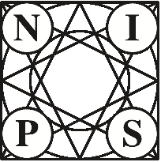
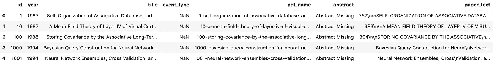
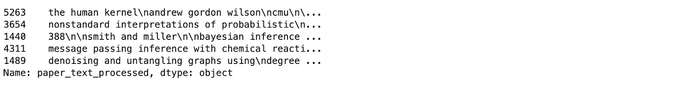
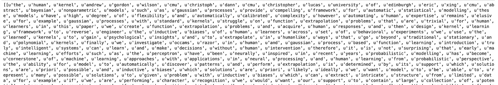
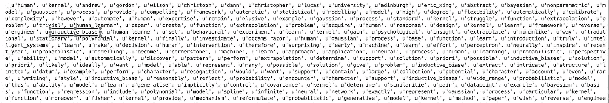
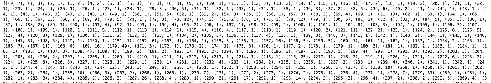
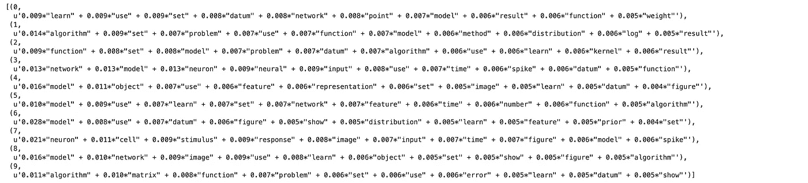
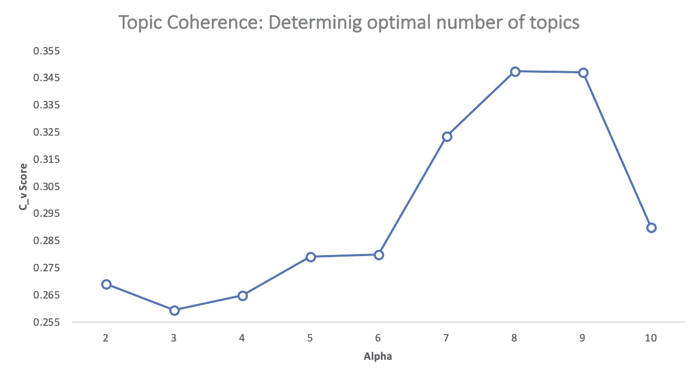
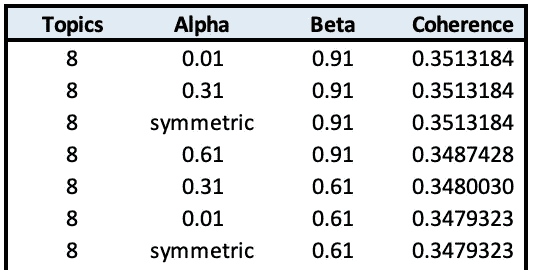
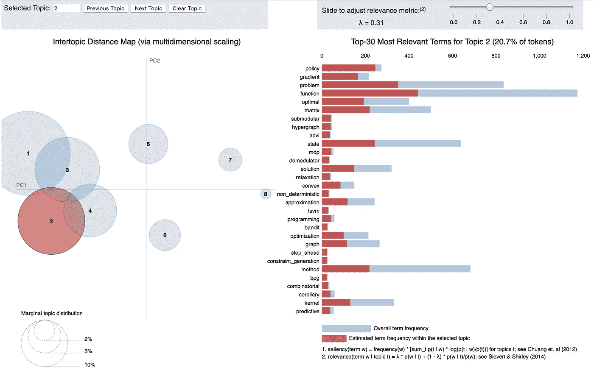

# 评估主题模型:潜在狄利克雷分配(LDA)

> 原文：<https://towardsdatascience.com/evaluate-topic-model-in-python-latent-dirichlet-allocation-lda-7d57484bb5d0?source=collection_archive---------0----------------------->


## [**深度剖析**](https://medium.com/towards-data-science/in-depth-analysis/home)

## 构建可解释主题模型的分步指南

**前言:**本文旨在提供潜在主题的综合信息，不应被视为原创作品。这些信息和代码通过一些在线文章、研究论文、书籍和开源代码被重新利用

在之前的[文章](/end-to-end-topic-modeling-in-python-latent-dirichlet-allocation-lda-35ce4ed6b3e0)中，我介绍了主题建模的概念，并通过使用 *Gensim* 实现，在 python 中使用潜在的 Dirichlet 分配(LDA)方法来开发您的第一个主题模型。

基于这种理解，在本文中，我们将更进一步，概述通过主题一致性度量来定量评估主题模型的框架，并使用 *Gensim* 实现来共享 python 中的代码模板，以实现端到端的模型开发。

# 为什么要评估主题模型？


[**https://tinyurl.com/y3xznjwq**](https://tinyurl.com/y3xznjwq)

我们知道，概率主题模型，如 LDA，是文本分析的流行工具，提供了语料库的预测和潜在主题表示。然而，有一个长期的假设，即这些模型发现的潜在空间通常是有意义和有用的，并且由于其无监督的训练过程，评估这些假设是具有挑战性的。此外，有一个没有黄金标准的主题列表来与每个语料库进行比较。

然而，同样重要的是确定一个经过训练的模型客观上是好是坏，以及有能力比较不同的模型/方法。要做到这一点，就需要一个客观的质量衡量标准。传统上，并且仍然对于许多实际应用来说，为了评估是否已经学习了关于语料库的“正确的东西”，使用隐含知识和“目测”方法。理想情况下，我们希望在一个可以最大化和比较的单一指标中捕获这些信息。

让我们大致了解一下评估中常用的方法:

**眼球模型**

*   前 N 个单词
*   主题/文档

**内在评估指标**

*   捕获模型语义
*   主题可解释性

**人类的判断**

*   什么是主题

**外部评估指标/任务评估**

*   模型擅长执行预定义的任务吗，比如分类

自然语言是杂乱的，模糊的，充满了主观的解释，有时试图清除模糊会使语言变成一种不自然的形式。在本文中，我们将探讨更多关于主题一致性的内容，主题一致性是一种内在的评估标准，以及如何使用它来定量地证明模型选择的合理性。

# 什么是话题连贯？

在理解话题连贯性之前，我们先来简单看一下困惑度。困惑度也是一种内在的评估度量，广泛用于语言模型评估。它捕捉了一个模型对它以前没有见过的新数据有多惊讶，并作为一个拒不接受的测试集的归一化对数似然性来衡量。

专注于对数似然部分，您可以将困惑度量视为测量一些新的看不见的数据给定之前学习的模型的可能性。也就是说，模型在多大程度上代表或再现了保留数据的统计数据。

然而，最近的研究表明，预测可能性(或等价地，困惑)和人类的判断往往不相关，甚至有时略有反相关。

> 针对困惑进行优化可能不会产生人类可解释的主题

这种困惑测量的限制成为更多工作的动机，试图模拟人类的判断，从而*主题连贯性。*

主题连贯性的概念将许多测量方法结合到一个框架中，以评估由模型推断的主题之间的连贯性。但在此之前…

**什么是话题连贯？**

主题连贯性测量通过测量主题中高得分单词之间的语义相似度来对单个主题评分。这些度量有助于区分语义上可解释的主题和统计推断的工件。但是…

**什么是连贯？**

如果一组陈述或事实相互支持，就说它们是连贯的。因此，一个连贯的事实集可以在涵盖所有或大部分事实的上下文中进行解释。连贯事实集的一个例子是“这项运动是一项团队运动”，“这项运动是用球进行的”，“这项运动需要巨大的体力”

# 一致性度量

让我们快速看一下不同的一致性度量，以及它们是如何计算的:

3.  *******C_uci*** 测度是基于滑动窗口和给定顶词的所有词对的逐点互信息(PMI)****
4.  *******C_umass*** 基于文档同现计数、一前分割和对数条件概率作为确认度量****
5.  *******C_npmi*** 是使用归一化逐点互信息(npmi)的 C_uci 一致性的增强版本****
6.  *******C_a*** 基于上下文窗口、顶部单词的成对比较以及使用归一化逐点互信息(NPMI)和余弦相似度的间接确认测量****

****当然，主题模型评估的概念和连贯性测量还有很多。但是，请记住本文的长度和目的，让我们将这些概念应用到开发一个至少比使用默认参数更好的模型中。此外，我们将重新利用已经可用的在线代码来支持这一练习，而不是重新发明轮子。****

# ****模型实现****

****完整的代码可以从 GitHub 上的 [Jupyter 笔记本中获得](https://github.com/kapadias/medium-articles/blob/master/natural-language-processing/topic-modeling/Evaluate%20Topic%20Models.ipynb)****

1.  ****加载数据****
2.  ****数据清理****
3.  ****短语建模:二元语法和三元语法****
4.  ****数据转换:语料库和词典****
5.  ****基础模型****
6.  ****超参数调谐****
7.  ****最终模型****
8.  ****可视化结果****

# ******加载数据******

********

****对于本教程，我们将使用 NIPS 会议上发表的论文数据集。NIPS 会议(神经信息处理系统)是机器学习社区最负盛名的年度活动之一。CSV 数据文件包含从 1987 年到 2016 年(29 年！).这些论文讨论了机器学习中的各种主题，从神经网络到优化方法，等等。****

****让我们从查看文件的内容开始****

```
**import zipfile
import pandas as pd
import os

# Open the zip file
with zipfile.ZipFile("./data/NIPS Papers.zip", "r") as zip_ref:
    # Extract the file to a temporary directory
    zip_ref.extractall("temp")

# Read the CSV file into a pandas DataFrame
papers = pd.read_csv("temp/NIPS Papers/papers.csv")

# Print head
papers.head()**
```

********

# ******数据清理******

****因为这个分析的目标是执行主题建模，所以我们将只关注每篇论文的文本数据，而忽略其他元数据列****

```
**# Remove the columns
papers = papers.drop(columns=['id', 'title', 'abstract', 
                              'event_type', 'pdf_name', 'year'], axis=1)

# sample only 100 papers
papers = papers.sample(100)

# Print out the first rows of papers
papers.head()**
```

******移除标点符号/小写字母******

****接下来，让我们对 paper_text 列的内容进行简单的预处理，使它们更易于分析，并得到可靠的结果。为此，我们将使用正则表达式删除所有标点，然后将文本小写****

```
**# Load the regular expression library
import re

# Remove punctuation
papers['paper_text_processed'] = papers['paper_text'].map(lambda x: re.sub('[,\.!?]', '', x))

# Convert the titles to lowercase
papers['paper_text_processed'] = papers['paper_text_processed'].map(lambda x: x.lower())

# Print out the first rows of papers
papers['paper_text_processed'].head()**
```

********

******分词并进一步清理文字******

****让我们把每个句子标记成一个单词列表，去掉标点符号和不必要的字符。****

```
**import gensim
from gensim.utils import simple_preprocess

def sent_to_words(sentences):
    for sentence in sentences:
        yield(gensim.utils.simple_preprocess(str(sentence), deacc=True))  # deacc=True removes punctuations

data = papers.paper_text_processed.values.tolist()
data_words = list(sent_to_words(data))

print(data_words[:1][0][:30])**
```

********

# ****短语建模:二元和三元模型****

****二元模型是在文档中频繁出现的两个词。三元模型是三个经常出现的词。我们例子中的一些例子有:“back_bumper”、“oil_leakage”、“maryland_college_park”等。****

****[Gensim 的短语模型](https://radimrehurek.com/gensim/models/phrases.html)可以构建和实现二元模型、三元模型、四元模型等。短语的两个重要参数是最小计数和阈值。****

> ****这些参数的值越高，单词就越难组合。****

```
**# Build the bigram and trigram models
bigram = gensim.models.Phrases(data_words, min_count=5, threshold=100) # higher threshold fewer phrases.
trigram = gensim.models.Phrases(bigram[data_words], threshold=100)  

# Faster way to get a sentence clubbed as a trigram/bigram
bigram_mod = gensim.models.phrases.Phraser(bigram)
trigram_mod = gensim.models.phrases.Phraser(trigram)**
```

******移除停用词，制作二元模型，并使其词条化******

****模型准备好了。让我们定义函数来删除停用词，制作三元模型和词汇化，并按顺序调用它们。****

```
**# NLTK Stop words
import nltk
nltk.download('stopwords')
from nltk.corpus import stopwords

stop_words = stopwords.words('english')
stop_words.extend(['from', 'subject', 're', 'edu', 'use'])

# Define functions for stopwords, bigrams, trigrams and lemmatization
def remove_stopwords(texts):
    return [[word for word in simple_preprocess(str(doc)) if word not in stop_words] for doc in texts]

def make_bigrams(texts):
    return [bigram_mod[doc] for doc in texts]

def make_trigrams(texts):
    return [trigram_mod[bigram_mod[doc]] for doc in texts]

def lemmatization(texts, allowed_postags=['NOUN', 'ADJ', 'VERB', 'ADV']):
    """https://spacy.io/api/annotation"""
    texts_out = []
    for sent in texts:
        doc = nlp(" ".join(sent)) 
        texts_out.append([token.lemma_ for token in doc if token.pos_ in allowed_postags])
    return texts_out**
```

****让我们按顺序调用函数。****

```
**!python -m spacy download en_core_web_sm
import spacy

# Remove Stop Words
data_words_nostops = remove_stopwords(data_words)

# Form Bigrams
data_words_bigrams = make_bigrams(data_words_nostops)

# Initialize spacy 'en' model, keeping only tagger component (for efficiency)
nlp = spacy.load("en_core_web_sm", disable=['parser', 'ner'])

# Do lemmatization keeping only noun, adj, vb, adv
data_lemmatized = lemmatization(data_words_bigrams, allowed_postags=['NOUN', 'ADJ', 'VERB', 'ADV'])

print(data_lemmatized[:1][0][:30])**
```

********

# ****数据转换:语料库和词典****

****LDA 主题模型的两个主要输入是词典(id2word)和语料库。让我们创造它们。****

```
**import gensim.corpora as corpora

# Create Dictionary
id2word = corpora.Dictionary(data_lemmatized)

# Create Corpus
texts = data_lemmatized

# Term Document Frequency
corpus = [id2word.doc2bow(text) for text in texts]

# View
print(corpus[:1][0][:30])**
```

********

****Gensim 为文档中的每个单词创建一个唯一的 id。上面显示的产生的语料库是(word_id，word_frequency)的映射。****

****例如，上面的(0，7)意味着，单词 id 0 在第一个文档中出现了七次。同样，单词 id 1 出现三次，依此类推****

# ****基础模型****

****我们拥有训练基本 LDA 模型所需的一切。除了语料库和词典，您还需要提供主题的数量。除此之外，alpha 和 eta 是影响主题稀疏性的超参数。根据 Gensim 文档，两者都默认为 1.0/num_topics prior(我们将对基本模型使用默认值)。****

> ******chunksize** 控制在训练算法中一次处理多少个文档。增加块大小将会加快训练速度，至少只要文档块容易放入内存。****
> 
> ******通道**控制我们在整个语料库上训练模型的频率(设置为 10)。通行证的另一个词可能是“时代”。迭代在某种程度上是技术性的，但本质上它控制了我们对每个文档重复特定循环的频率。将“遍数”和“迭代数”设置得足够高很重要。****

```
**# Build LDA model
lda_model = gensim.models.LdaMulticore(corpus=corpus,
                                       id2word=id2word,
                                       num_topics=10, 
                                       random_state=100,
                                       chunksize=100,
                                       passes=10,
                                       per_word_topics=True)**
```

******查看 LDA 模型中的主题******

****上面的 LDA 模型是用 10 个不同的主题构建的，其中每个主题是关键字的组合，并且每个关键字对主题有一定的权重。****

****您可以使用*LDA _ model . print _ topics()\*查看每个主题的关键字以及每个关键字的权重(重要性)****

```
**from pprint import pprint

# Print the Keyword in the 10 topics
pprint(lda_model.print_topics())
doc_lda = lda_model[corpus]**
```

********

******计算模型复杂度和一致性分数******

****让我们计算基线一致性分数****

```
**from gensim.models import CoherenceModel

# Compute Coherence Score
coherence_model_lda = CoherenceModel(model=lda_model, texts=data_lemmatized, dictionary=id2word, coherence='c_v')
coherence_lda = coherence_model_lda.get_coherence()
print('Coherence Score: ', coherence_lda)**
```

*******连贯性得分:0.301*******

# ****超参数调谐****

****首先，让我们区分模型超参数和模型参数:****

> ******模型超参数**可视为机器学习算法的设置，由数据科学家在训练前进行调整。例如随机森林中的树的数量，或者在我们的例子中，主题的数量 K****
> 
> ******模型参数**可以被认为是模型在训练期间学习的内容，例如给定主题中每个单词的权重****

****现在我们已经有了默认 LDA 模型的基线一致性分数，让我们执行一系列敏感性测试来帮助确定以下模型超参数:****

1.  ****主题数量(K)****
2.  ****狄利克雷超参数α:文档主题密度****
3.  ****狄利克雷超参数β:词主题密度****

****我们将按顺序执行这些测试，通过保持其他参数不变，一次执行一个参数，并在两个不同的验证语料库集上运行它们。我们将使用 ***C_v*** 作为我们选择的性能比较指标****

```
**# supporting function
def compute_coherence_values(corpus, dictionary, k, a, b):

    lda_model = gensim.models.LdaMulticore(corpus=corpus,
                                           id2word=dictionary,
                                           num_topics=k, 
                                           random_state=100,
                                           chunksize=100,
                                           passes=10,
                                           alpha=a,
                                           eta=b)

    coherence_model_lda = CoherenceModel(model=lda_model, texts=data_lemmatized, dictionary=id2word, coherence='c_v')

    return coherence_model_lda.get_coherence()**
```

****让我们调用这个函数，并在主题、alpha 和 beta 参数值的范围内迭代它****

```
**import numpy as np
import tqdm

grid = {}
grid['Validation_Set'] = {}

# Topics range
min_topics = 2
max_topics = 11
step_size = 1
topics_range = range(min_topics, max_topics, step_size)

# Alpha parameter
alpha = list(np.arange(0.01, 1, 0.3))
alpha.append('symmetric')
alpha.append('asymmetric')

# Beta parameter
beta = list(np.arange(0.01, 1, 0.3))
beta.append('symmetric')

# Validation sets
num_of_docs = len(corpus)
corpus_sets = [gensim.utils.ClippedCorpus(corpus, int(num_of_docs*0.75)), 
               corpus]

corpus_title = ['75% Corpus', '100% Corpus']

model_results = {'Validation_Set': [],
                 'Topics': [],
                 'Alpha': [],
                 'Beta': [],
                 'Coherence': []
                }

# Can take a long time to run
if 1 == 1:
    pbar = tqdm.tqdm(total=(len(beta)*len(alpha)*len(topics_range)*len(corpus_title)))

    # iterate through validation corpuses
    for i in range(len(corpus_sets)):
        # iterate through number of topics
        for k in topics_range:
            # iterate through alpha values
            for a in alpha:
                # iterare through beta values
                for b in beta:
                    # get the coherence score for the given parameters
                    cv = compute_coherence_values(corpus=corpus_sets[i], dictionary=id2word, 
                                                  k=k, a=a, b=b)
                    # Save the model results
                    model_results['Validation_Set'].append(corpus_title[i])
                    model_results['Topics'].append(k)
                    model_results['Alpha'].append(a)
                    model_results['Beta'].append(b)
                    model_results['Coherence'].append(cv)

                    pbar.update(1)
    pd.DataFrame(model_results).to_csv('./results/lda_tuning_results.csv', index=False)
    pbar.close()**
```

# ****调查结果****

****让我们从确定主题的最佳数量开始。下表列出了两个验证集的主题数量的一致性分数 C_v，以及固定的 alpha = 0.01 和 beta = 0.1****

********

****随着一致性分数似乎随着主题数量的增加而增加，在变平或大幅下降之前，选择 CV 最高的模型可能更有意义。在这种情况下，我们选择 K=8****

****接下来，我们要选择最佳的α和β参数。虽然有其他复杂的方法来处理选择过程，但对于本教程，我们选择 K=8 时产生最大 C_v 得分的值****

********

> ****阿尔法=0.01****
> 
> ****β= 0.9****
> 
> ****K=8****

****这大约产生。比基线得分提高了 17%****

# ****最终模型****

****让我们使用上面选择的参数来训练最终的模型****

```
**num_topics = 8

lda_model = gensim.models.LdaMulticore(corpus=corpus,
                                           id2word=id2word,
                                           num_topics=num_topics, 
                                           random_state=100,
                                           chunksize=100,
                                           passes=10,
                                           alpha=0.01,
                                           eta=0.9)**
```

# ****可视化主题****

```
**import pyLDAvis.gensim_models as gensimvis
import pickle 
import pyLDAvis

# Visualize the topics
pyLDAvis.enable_notebook()

LDAvis_data_filepath = os.path.join('./results/ldavis_tuned_'+str(num_topics))

# # this is a bit time consuming - make the if statement True
# # if you want to execute visualization prep yourself
if 1 == 1:
    LDAvis_prepared = gensimvis.prepare(lda_model, corpus, id2word)
    with open(LDAvis_data_filepath, 'wb') as f:
        pickle.dump(LDAvis_prepared, f)

# load the pre-prepared pyLDAvis data from disk
with open(LDAvis_data_filepath, 'rb') as f:
    LDAvis_prepared = pickle.load(f)

pyLDAvis.save_html(LDAvis_prepared, './results/ldavis_tuned_'+ str(num_topics) +'.html')

LDAvis_prepared**
```

********

# ****结束语****

****我们从理解为什么评估主题模型是必要的开始。接下来，我们回顾了现有的方法，并触及了主题一致性的表面，以及可用的一致性度量。然后，我们使用 Gensim 实现构建了一个默认的 LDA 模型，以建立基线一致性得分，并回顾了优化 LDA 超参数的实用方法。****

****希望这篇文章能够揭示潜在的主题评估策略，以及其背后的直觉。****

******参考文献:******

1.  ****[http://qpleple.com/perplexity-to-evaluate-topic-models/](http://qpleple.com/perplexity-to-evaluate-topic-models/)****
2.  ****[https://www . Amazon . com/Machine-Learning-probability-Perspective-computing/DP/0262018020](https://www.amazon.com/Machine-Learning-Probabilistic-Perspective-Computation/dp/0262018020)****
3.  ****[https://papers . nips . cc/paper/3700-reading-tea-leaves-how-humans-interpret-topic-models . pdf](https://papers.nips.cc/paper/3700-reading-tea-leaves-how-humans-interpret-topic-models.pdf)****
4.  ****[https://github . com/matti lyra/pydataberlin-2017/blob/master/notebook/evaluationunsupervisedmodels . ipynb](https://github.com/mattilyra/pydataberlin-2017/blob/master/notebook/EvaluatingUnsupervisedModels.ipynb)****
5.  ****[https://www . machine learning plus . com/NLP/topic-modeling-gensim-python/](https://www.machinelearningplus.com/nlp/topic-modeling-gensim-python/)****
6.  ****[http://SVN . aksw . org/papers/2015/WSDM _ 话题 _ 评价/public.pdf](http://svn.aksw.org/papers/2015/WSDM_Topic_Evaluation/public.pdf)****
7.  ****[http://palmetto.aksw.org/palmetto-webapp/](http://palmetto.aksw.org/palmetto-webapp/)****

****感谢阅读。*如果您有任何反馈，请对本文发表评论，在*[*LinkedIn*](https://www.linkedin.com/in/shashankkapadia/)*上给我发消息，或者给我发电子邮件(shmkapadia[at]gmail.com)*****

*****如果你喜欢这篇文章，请访问我的其他文章*****

****[](/end-to-end-topic-modeling-in-python-latent-dirichlet-allocation-lda-35ce4ed6b3e0) [## Python 中的主题建模:潜在狄利克雷分配(LDA)

### 如何开始使用 Python 中的 LDA 进行主题建模

towardsdatascience.com](/end-to-end-topic-modeling-in-python-latent-dirichlet-allocation-lda-35ce4ed6b3e0) [](/building-blocks-text-pre-processing-641cae8ba3bf) [## 构建块:文本预处理

### 本文是关于自然语言处理的后续文章的第二篇。这一系列…的目的

towardsdatascience.com](/building-blocks-text-pre-processing-641cae8ba3bf) [](/introduction-to-language-models-n-gram-e323081503d9) [## 语言模型简介:N-Gram

### 本文是关于自然语言处理的第三篇文章。这一系列…的目的

towardsdatascience.com](/introduction-to-language-models-n-gram-e323081503d9)****