# 评估机器学习算法

> 原文：<https://towardsdatascience.com/evaluating-a-machine-learning-algorithm-81746c947ad3?source=collection_archive---------24----------------------->

## “下一步做什么？”的工具箱

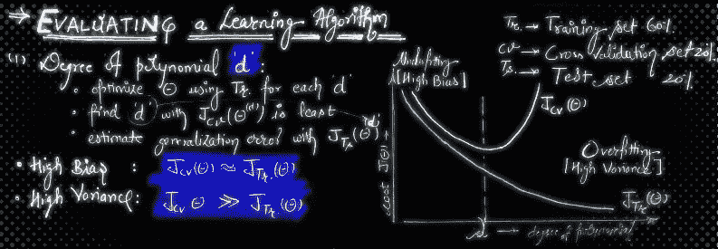

随着易于使用的机器学习库的丰富，应用它们并在大多数情况下实现 80%以上的预测准确率通常是很有吸引力的。但是，**‘下一步该怎么办？’**这个问题困扰着我，也可能困扰着其他有抱负的数据科学家。

我在 Coursera 上**“机器学习——斯坦福在线”**的课程期间，**吴恩达教授**帮我顺利通过。我希望这篇简要介绍了他在一次讲座中的解释的文章能够帮助我们许多人理解“调试或诊断学习算法”的重要性。

首先，让我们说出所有的可能性或**‘下一步尝试什么？’**当假设在其预测中出现不可接受的大误差，或者需要改进我们的假设时:

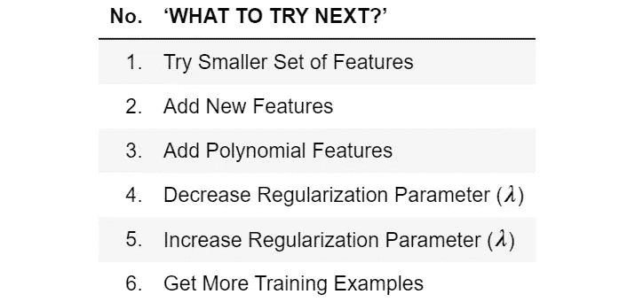

*我们将再次访问该表，做出明智的选择，并创建我们的* ***工具箱*** *。*

上述诊断将基本上帮助我们找到**偏差方差权衡**。
让我们用一个简单的图来简单地形象化这个概念，来说明*过拟合*(高方差)和*欠拟合*(高偏差)。

# 偏差方差权衡

*从根本上说,“最佳模型”的问题是在偏差和方差之间找到一个最佳平衡点。这里有一个链接，链接到杰克·范德普拉斯在《Python 数据科学手册》中解释的[偏差方差权衡](https://jakevdp.github.io/PythonDataScienceHandbook/05.03-hyperparameters-and-model-validation.html#The-Bias-variance-trade-off)。*

以下代码可视化了我们的假设在多项式的不同*次上的拟合。
请注意，*过拟合*和*欠拟合*也可以在不同的*正则化参数*和*训练集大小*上可视化。*

> *源代码:* [*Scipy 讲义*](https://scipy-lectures.org/packages/scikit-learn/auto_examples/plot_bias_variance.html#bias-and-variance-of-polynomial-fit)

```
%matplotlib inline
import numpy as np
import matplotlib.pyplot as pltdef generating_func(x, err=0.5):
    return np.random.normal(10 - 1\. / (x + 0.1), err)from sklearn.pipeline import make_pipeline
from sklearn.linear_model import LinearRegression
from sklearn.preprocessing import PolynomialFeaturesn_samples = 8np.random.seed(0)
x = 10 ** np.linspace(-2, 0, n_samples)
y = generating_func(x)x_test = np.linspace(-0.2, 1.2, 1000)titles = ['d = 1 (under-fit; high bias)',
          'd = 2',
          'd = 6 (over-fit; high variance)']
degrees = [1, 2, 6]fig = plt.figure(figsize=(9, 3.5))
fig.subplots_adjust(left=0.06, right=0.98, bottom=0.15, top=0.85, wspace=0.05)for i, d in enumerate(degrees):
    ax = fig.add_subplot(131 + i, xticks=[], yticks=[])
    ax.scatter(x, y, marker='x', c='k', s=50)model = make_pipeline(PolynomialFeatures(d), LinearRegression())
    model.fit(x[:, np.newaxis], y)
    ax.plot(x_test, model.predict(x_test[:, np.newaxis]), '-b')ax.set_xlim(-0.2, 1.2)
    ax.set_ylim(0, 12)
    ax.set_xlabel('house size')
    if i == 0:
        ax.set_ylabel('price')ax.set_title(titles[i])

fig.savefig('graph-Images/bias-variance.png')
```

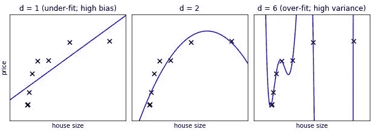

# 验证曲线

## 1.变化的模型复杂性

> *源代码:* [*Scipy 讲义*](https://scipy-lectures.org/packages/scikit-learn/auto_examples/plot_bias_variance.html#bias-and-variance-of-polynomial-fit)

生成更大的数据集

```
from sklearn.model_selection import train_test_split

n_samples = 200
test_size = 0.4
error = 1.0

# randomly sample the data
np.random.seed(1)
x = np.random.random(n_samples)
y = generating_func(x, error)

# split into training, validation, and testing sets.
x_train, x_test, y_train, y_test = train_test_split(x, y, test_size=test_size)

# show the training and validation sets
plt.figure(figsize=(6, 4))
plt.scatter(x_train, y_train, color='red', label='Training set')
plt.scatter(x_test, y_test, color='blue', label='Test set')
plt.title('The data')
plt.legend(loc='best');
```

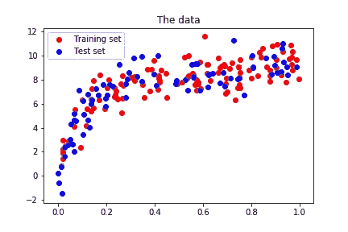

绘制不同模型复杂性的验证曲线

```
from sklearn.model_selection import validation_curve

degrees = np.arange(1, 21)

model = make_pipeline(PolynomialFeatures(), LinearRegression())

# The parameter to vary is the "degrees" on the pipeline step
# "polynomialfeatures"
train_scores, validation_scores = validation_curve(
                 model, x[:, np.newaxis], y,
                 param_name='polynomialfeatures__degree',
                 param_range=degrees,
                 cv = 5)

# Plot the mean train error and validation error across folds
plt.figure(figsize=(6, 4))
plt.plot(degrees, validation_scores.mean(axis=1), lw=2,
         label='cross-validation')
plt.plot(degrees, train_scores.mean(axis=1), lw=2, label='training')

plt.legend(loc='best')
plt.xlabel('degree of fit')
plt.ylabel('explained variance')
plt.title('Validation curve')
plt.tight_layout()
```

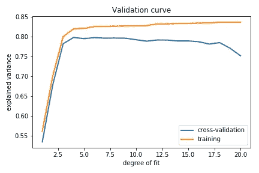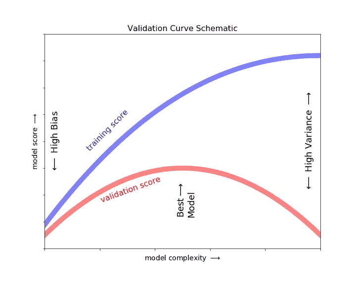

Image Source: [Python Data Science Handbook by Jake VanderPlas](https://jakevdp.github.io/PythonDataScienceHandbook/05.03-hyperparameters-and-model-validation.html)

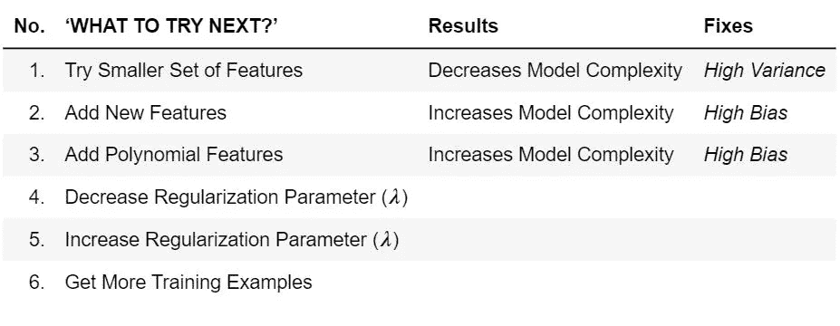

## 2.变化正则化参数

> *生成数据集和绘制不同正则化参数的验证曲线不在本讨论范围内。还感兴趣吗？请参考杰克·范德普拉斯的* [*Python 数据科学手册*](https://jakevdp.github.io/PythonDataScienceHandbook/05.06-linear-regression.html#Regularization)

我们知道，基函数(多项式特征、高斯特征等)的引入。)到我们的线性回归中使得模型更加灵活。

但是，它会带来风险吗？
是的，答案是 ***过拟合***

**原因**:我们的模型过于灵活，无法捕捉训练数据集中的异常值或极值。
**解决方案**:正规化

**正则化**是一种回归形式，它将模型参数惩罚或约束或正则化为零。

*   当我们有很多特征时，这种方法很有效，每个特征都对我们的预测有所贡献。
*   因此，我们保留了所有的特征，但是减少了参数的大小或值。

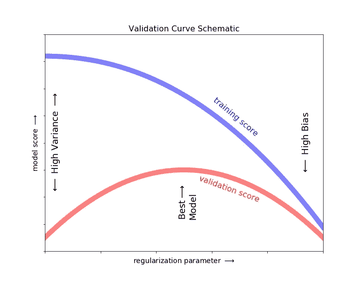

Image Source Code: [Python Data Science Handbook by Jake VanderPlas](https://jakevdp.github.io/PythonDataScienceHandbook/05.03-hyperparameters-and-model-validation.html)

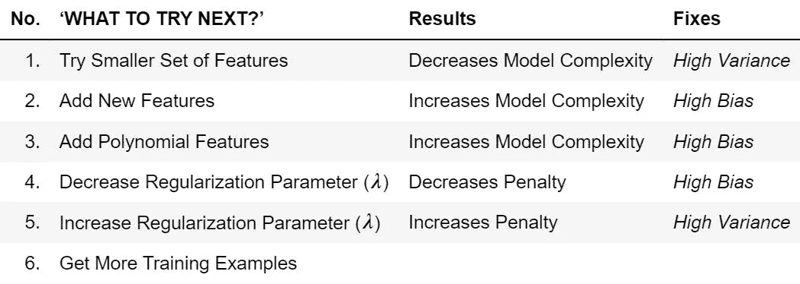

# 学习曲线

> *源代码:* [*Scipy 讲义*](https://scipy-lectures.org/packages/scikit-learn/auto_examples/plot_bias_variance.html#bias-and-variance-of-polynomial-fit)

针对*固定模型复杂性*(d = 1 和 d = 15)，随着样本数量的增加，绘制训练和测试误差图

```
# A learning curve for d = 1, 15
for d in [1, 15]:
    model = make_pipeline(PolynomialFeatures(degree=d), LinearRegression())from sklearn.model_selection import learning_curve
    train_sizes, train_scores, validation_scores = learning_curve(
        model, x[:, np.newaxis], y,
        train_sizes=np.logspace(-1, 0, 20),
        cv = 5)# Plot the mean train error and validation error across folds
    plt.figure(figsize=(6, 4))
    plt.plot(train_sizes, validation_scores.mean(axis=1),
            lw=2, label='cross-validation')
    plt.plot(train_sizes, train_scores.mean(axis=1),
                lw=2, label='training')
    plt.ylim(bottom=-.1, top=1)plt.legend(loc='best')
    plt.xlabel('number of train samples')
    plt.ylabel('explained variance')
    plt.title('Learning curve (degree=%i)' % d)
    plt.tight_layout()plt.show()
```

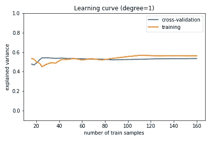

**固定模型复杂度(d = 1)的可变样本量—高偏差估计量:**

*   它*欠拟合*数据，因为训练和验证分数都很低，或者学习曲线已经收敛到一个较低的分数。
*   我们可以预期，添加更多的训练数据不会有所帮助
*   重温*‘下一步尝试什么？’*工作台修复*偏高*

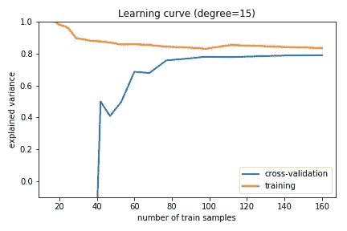

**固定模型复杂性(d = 15)的可变样本量—高方差估计量:**

*   由于训练分数远高于验证分数，因此*过度拟合*数据。
*   随着我们向这个训练集添加更多的样本，训练分数将继续降低，而交叉验证分数将继续增加，直到它们在中间相遇。
*   我们可以预期，添加更多的训练数据将会有所帮助。

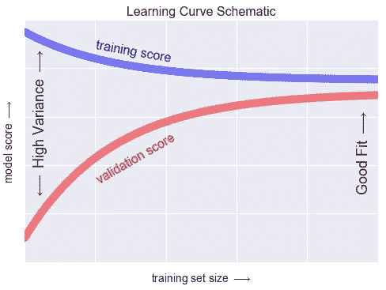

Image Source Code: [Python Data Science Handbook by Jake VanderPlas](https://jakevdp.github.io/PythonDataScienceHandbook/05.03-hyperparameters-and-model-validation.html)

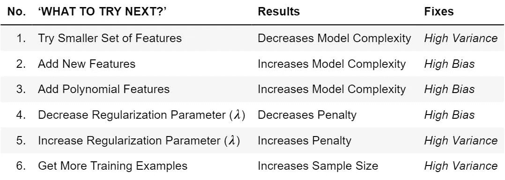

正如我所承诺的，这里有我们的 ***工具箱——“下一步尝试什么？”*** *它与验证和学习曲线一起，将帮助我们做出明智的决策。*

# 参考

*   Coursera 的“**机器学习—斯坦福在线**”讲座，主讲人**吴恩达教授**
*   杰克·范德普拉斯的《Python 数据科学手册》
*   [犀利的讲稿](https://scipy-lectures.org/packages/scikit-learn/index.html)

感谢您的阅读！如果你觉得这有帮助或者没有帮助，请在评论中告诉我。
如果此文对您有帮助， [*分享一下*](https://medium.com/@eklavyasaxena/evaluating-a-machine-learning-algorithm-81746c947ad3?source=friends_link&sk=7dd263e10bfbff45638f219c3ddaad80) 。

访问 Jupyter 笔记本— [点击此处](https://nbviewer.jupyter.org/github/eklavyasaxena/Evaluating-a-Machine-Learning-Algorithm/blob/master/Evaluating-a-Machine-Learning-Algorithm.ipynb)

**领英**

[](https://linkedin.com/in/EklavyaSaxena) [## Eklavya Saxena -东北大学-马萨诸塞州波士顿| LinkedIn

### 东北大学精通数据科学的研究生，在以下领域有 2 年以上的工作经验

linkedin.com](https://linkedin.com/in/EklavyaSaxena) 

**GitHub**

[](https://github.com/eklavyasaxena/Evaluating-a-Machine-Learning-Algorithm) [## eklavyasaxena/评估机器学习算法

### 工具箱——“下一步要做什么？”有了大量易于使用的机器学习库，它经常吸引…

github.com](https://github.com/eklavyasaxena/Evaluating-a-Machine-Learning-Algorithm)