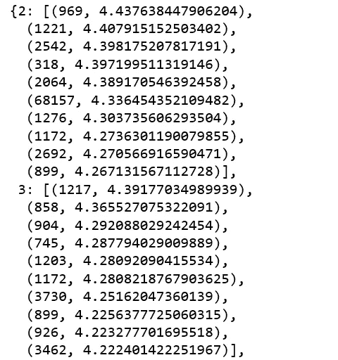

# 基于错误和基于排名的真实推荐系统评估

> 原文：<https://towardsdatascience.com/evaluating-a-real-life-recommender-system-error-based-and-ranking-based-84708e3285b?source=collection_archive---------6----------------------->

Photo credit: Pixabay

## 推荐系统旨在根据用户的偏好发现并推荐用户可能感兴趣的项目

推荐系统是当今机器学习中最有价值的应用之一。亚马逊将其 35%的收入归功于其推荐系统。

评估是研究和开发任何推荐系统不可或缺的一部分。根据你的业务和可用的数据，有很多方法可以评估一个推荐系统。今天我们将尝试几个。

# 评级预测

在我的上一篇帖子 re: [构建和测试带惊喜的推荐系统](/building-and-testing-recommender-systems-with-surprise-step-by-step-d4ba702ef80b)中，惊喜围绕着各种机器学习算法来预测用户对项目的评分(即评分预测)。它要求用户给予 ***明确的*** 反馈，比如要求用户在购买后给一本书打 0 到 10 颗星的分数。然后我们用这些数据来建立用户的兴趣档案。这样做的问题是，不是每个人都愿意留下评级，所以数据往往是稀疏的，就像我们之前看到的这个[图书穿越数据集](http://www2.informatik.uni-freiburg.de/~cziegler/BX/):

Figure 1

大多数推荐系统试图预测如果用户对相应的书籍进行评级，他们会在其中放入什么。如果有太多的“南”，推荐者就没有足够的数据来理解用户喜欢什么。

然而， ***显性*** 评级是伟大的，如果你能说服你的用户给你评级。所以，如果你有奢侈的数据和用户评分，那么评价指标应该是*或者 ***MAE*** 。让我们展示一个带有惊奇库的 Movielens 数据集的例子。*

*ratings_prediction.py*

**

# *顶级的*

*从在线购物网站到视频门户网站，前 N 名推荐系统无处不在。它们向用户提供他们可能感兴趣的 N 个项目的排序列表，以鼓励浏览和购买。*

*亚马逊的推荐系统之一是“前 N 名”系统，它向个人提供一个顶级结果列表，如下所示:*

**

*Figure 2*

*亚马逊给我的“前 N 名”推荐包括 9 页，第一页有 6 个项目。一个好的推荐系统应该能够识别某个用户感兴趣的一组 N 个项目。因为我很少在亚马逊买书，我的“Top-N”差得很远。换句话说，我可能只会点击或阅读我的“前 N 名”列表中的一本书。*

*以下脚本为测试集中的每个用户产生了前 10 个推荐。*

*top-N.py*

*下面是我们预测的用户 Id 2 和用户 Id 3 的前 10 名。*

**

*Figure 3*

## *命中率*

*让我们看看我们的 10 大推荐有多好。为了评估 top-10，我们使用命中率，也就是说，如果用户对我们推荐的前 10 名中的一个进行了评级，我们就认为它是“命中”。*

*计算单个用户命中率的过程:*

*   *在培训数据中查找该用户历史记录中的所有项目。*
*   *有意删除其中一项(留一项交叉验证)。*
*   *使用所有其他项目来为推荐者提供信息，并要求提供前 10 项推荐。*
*   *如果被删除的项目出现在前 10 个推荐中，那么它就是成功的。如果没有，那就不算成功。*

*HitRate.py*

**

*系统的整体命中率是命中数除以测试用户数。它衡量我们能够推荐删除评级的频率，越高越好。*

*非常低的命中率仅仅意味着我们没有足够的数据来处理。就像亚马逊的点击率对我来说会非常低，因为它没有足够的我的图书购买数据。*

## *按评级值列出的命中率*

*我们也可以通过预测的评分值来分解命中率。理想情况下，我们希望预测用户喜欢的电影，所以我们关心高评分值而不是低评分值。*

*RatingHitRate.py*

**

*我们的命中率细分正是我所希望的，评分 5 的命中率远远高于 4 或 3。越高越好。*

## *累积命中率*

*因为我们关心更高的评级，所以我们可以忽略低于 4 的预测评级，以计算> = 4 的评级的命中率。*

*CumulativeHitRate.py*

**

*越高越好。*

## *平均交互点击排名*

*前 N 名推荐系统排名评估的常用指标，仅考虑第一个相关结果出现的位置。我们会因为推荐一个用户排名靠前而不是靠后的项目而得到更多的信任。越高越好。*

*AverageReciprocalHitRank.py*

**

*你的第一个现实生活中的推荐系统很可能是低质量的，你为新用户准备的成熟的推荐系统也是如此。但是，这仍然比没有推荐系统好得多。推荐系统的目标之一是我们在推荐系统中学习用户/新用户的偏好，以便他们可以开始从系统接收准确的个性化推荐。*

*然而，如果你刚刚起步，你的网站是全新的，推荐系统不能为任何人提供个性化的推荐，没有任何人的任何评价。然后，这就变成了一个[系统性的自举问题](https://www.kdd.org/exploration_files/WebKDD08-Al-Rashid.pdf)。*

*Jupyter 笔记本可以在 [Github](https://github.com/susanli2016/Machine-Learning-with-Python/blob/master/Movielens%20Recommender%20Metrics.ipynb) 上找到。享受这周剩下的时光。*

*参考:[用机器学习和人工智能构建推荐系统](https://learning.oreilly.com/videos/building-recommender-systems/9781789803273)*