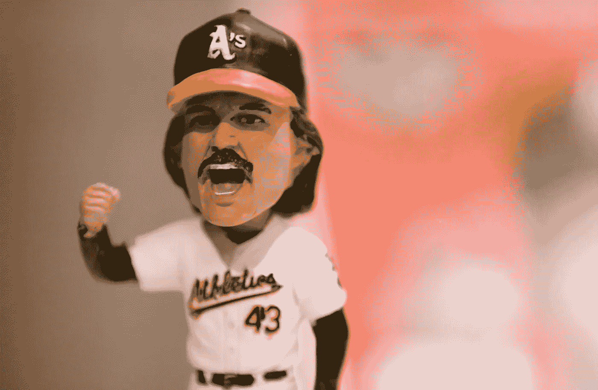
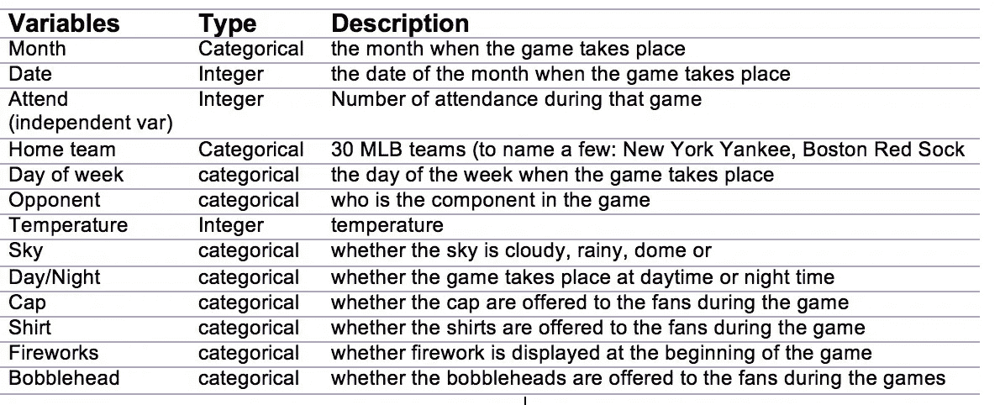
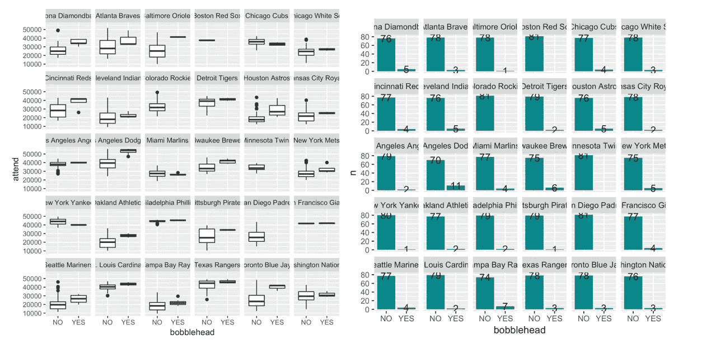
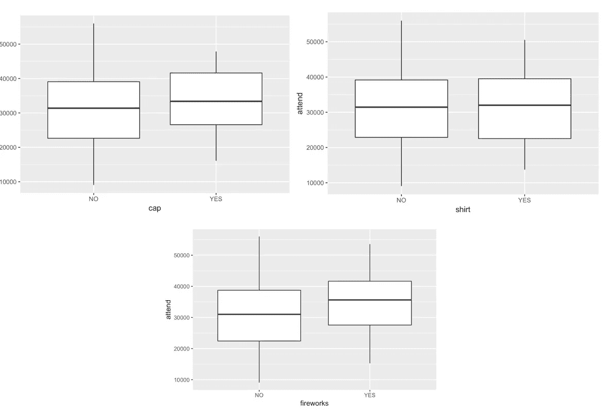
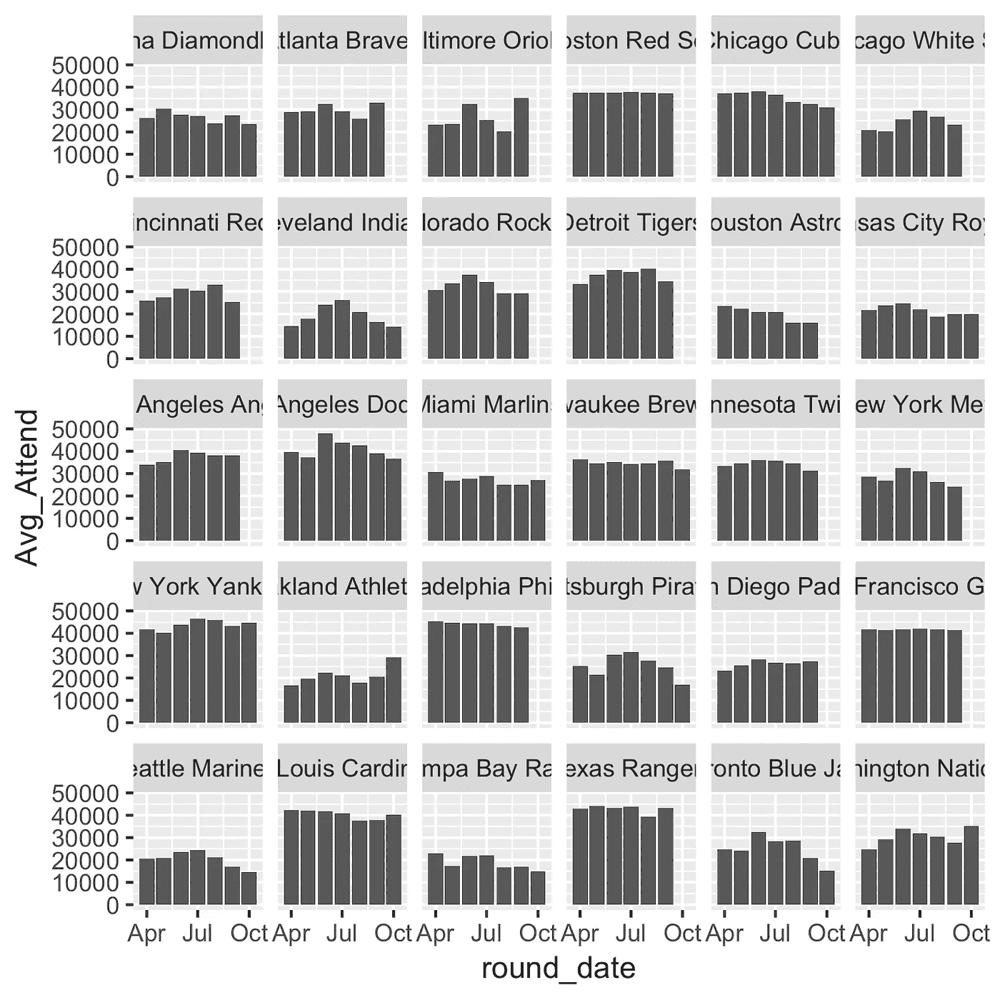
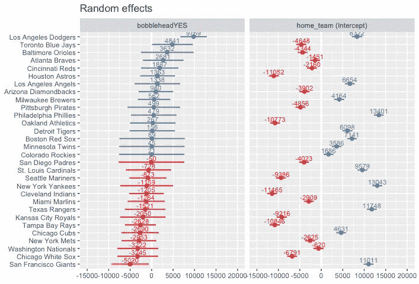
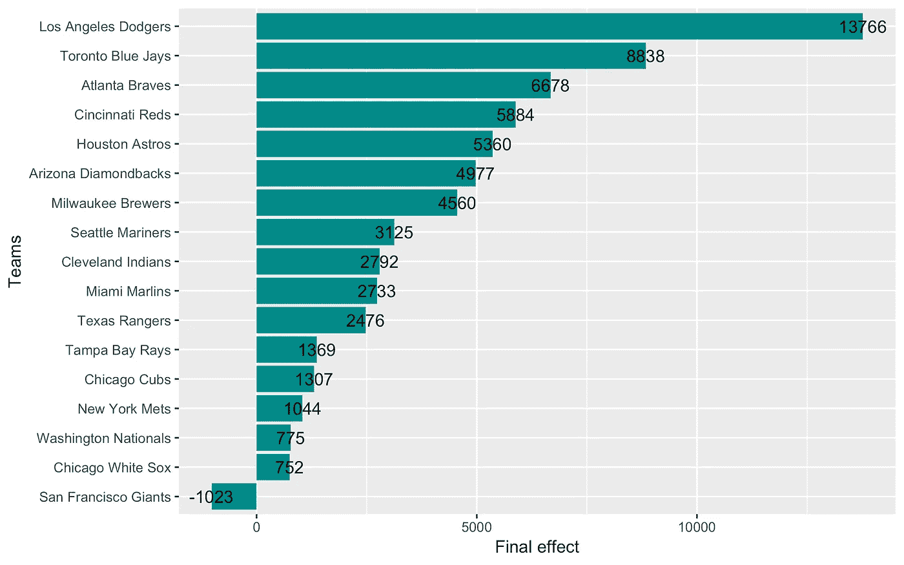

# 面板数据多层次模型在 MLB 促销中的应用

> 原文：<https://towardsdatascience.com/evaluating-bobblehead-promotion-in-mlb-an-application-of-multi-level-model-on-panel-data-8f5c6fc9e044?source=collection_archive---------13----------------------->

2015 年，我看了 money ball——这是一个关于 MLB 的小市场球队 Oakland A 如何利用数据科学/统计数据，以有限的预算组建一支强大的球队，击败其他富有和著名的球队，并在 2002 赛季连续 20 场比赛获胜的故事。这是我第一次了解到数据分析可以如此强大，这也激励我追求这一数据职业生涯。因此，我决定在这个关于 MLB 的项目中应用数据建模，但在另一个方面:评估营销推广。该数据集来自 Thomas Miller 所著的《营销数据科学:用 R 和 Python 进行预测分析的建模技术》一书。你可以在这里 [*下载数据集和我的 R 代码进行分析。*](https://github.com/Fumanguyen/bobblehead-mlb)

> 我讨厌失败多过我想要赢。
> 
> —比利·比恩，奥克兰 A 公司总经理，2002 年

# **一—简介**

在美国，职业棒球大联盟(MLB)球队的主场比赛(81 场)比国家篮球协会(41 场)和国家足球联盟(8 场)的总和还要多。结果？球迷不太可能出席每场比赛。一年四季都有很多选择。鉴于目前的市场形势，有这么多种类的新娱乐作为棒球比赛的竞争对手，找到销售门票的方法就更加重要了。

因为门票销售是许多球队的主要收入来源，所以了解哪种促销活动可以说服球迷前来对一支球队的可持续性至关重要。什么样的促销活动将导致美国职业棒球大联盟(MLB)比赛上座率的最大增长？答案很可能是摇头娃娃赠品。自 1999 年以来，MLB 队的宣传部门一直利用这些小人来吸引更多的观众，因为球迷们喜欢这样。

然而，有太多的因素，无论是场内还是场外，都会影响一个人是否参加 MLB 比赛的决定。除了促销，粉丝还会考虑游戏的时机、天气、胜率，以及游戏是否是跑马灯游戏[【1】](https://minds.wisconsin.edu/bitstream/handle/1793/46315/Schoenrock_The%20Effects%20of%20Promotions%20on%20Attendance%20at%20Major%20League%20Baseball%20Games.pdf?sequence=1&isAllowed=y)。因此，有时棒球营销人员无法理解摇头娃娃促销对上座率的真正影响。我们的分析旨在回答一个核心问题:提供摇头娃娃赠品可以增加多少销售额，增加多少，以及这一结果在 MLB 团队中如何变化。

了解这一点可以帮助我们在推广摇头娃娃时，为推广棒球部门提供完善的建议。

我们的报告包含以下部分:

II —数据特征

III —模型选择和解释

四、建议和结论

五、附录

# **二—数据特征**

该数据集提供了 2012 赛季所有 MLB 球队的出勤信息。每行说明一个游戏的属性，这些属性可以分为 4 个桶:时间(月份、日期、星期几、白天/晚上)、天气(温度、天空)、团队(home_team、对手)和促销(帽子、衬衫、烟花、摇头娃娃)。所有这些变量都会或多或少地影响比赛的上座率。

Table 1: Dependent and Independent variables of the dataset

我们真正关心的是摇头晃脑对出勤率的影响。我们想知道提供摇头晃脑如何影响出席率，以及这种影响是否因团队或提供摇头晃脑的时间而异，其他条件保持不变。

这是面板数据，包括横截面和时间序列数据。在这种情况下，数据集提供了在赛季的不同时间和不同团队中对摇头娃娃推广的观察。因此，摇头晃脑的影响可能不仅随时间而变化，而且在不同的团队中也是如此。让我们通过我们的可视化来确认它。

您可以在此了解更多关于面板数据的信息。

**甲)** **主场 _ 球队出勤**

Figure 1: Avg. attendance varies among MLB teams

MLB 有富有的球队和不那么富有的球队。像纽约扬基队、洛杉矶道奇队、费城费城人队、旧金山巨人队……这样的大市场球队和像坦帕湾雷队、奥克兰运动家队、西雅图水手队……这样的小市场球队之间的受欢迎程度是不同的。这些大市场球队通常有更高的收入、更多的预算、更多的明星球员，因此比小市场球队吸引更多的观众。在这个市场中，品牌名称是决定每场比赛上座率的关键因素。

> “我们试图解决的问题是，有富有的团队，也有贫穷的团队。然后是五十英尺的垃圾，然后是我们。这是一场不公平的游戏。”
> 
> —比利·比恩，奥克兰 A 公司总经理，2002 年。

**b)摇头出席**

从图 2 中我们观察到:

●一些球队在有摇头晃脑的比赛和没有摇头晃脑的比赛之间的上座率有明显差异，例如旧金山巨人队和费城人队。

●一些球队没有体验到明确的效果或没有足够的数据来产生明确的效果，如波士顿红袜队、圣地亚哥教士队、科罗拉多洛基队、明尼苏达双城队。

●大多数球队的上座率都有所增加:休斯顿太空人队、西雅图海洋队、辛辛那提红人队、多伦多蓝鸟队等。

Figure 2: Attendance difference between games with bobbleheads and without bobblehead / The number of games with and without bobbleheads among teams.

然而，这种增长是摇头娃娃促销的结果吗？不完全是。从下图中，你可以看到很大一部分摇头晃脑是在周六和周日提供的，这两天通常是一周中最拥挤的日子。人们可能会去看比赛，因为在周末即使没有摇头晃脑。因此，我们有动力确定摇头晃脑的结果是出席人数的真正增加。此外，摇头娃娃在工作日和周末参加人数增加有什么不同吗？

Figure 3: Bobblehead offering and attendance by days of week

**c)其他类型的出勤晋升**

衬衫、帽子、烟花(在同一张图上):图 4 显示帽子和衬衫的促销对出席率有轻微影响。在这三者中，烟火似乎对出席人数影响最大。平均而言，有烟花的游戏有 34，400 人参加，而没有烟花的游戏只吸引了 30，600 名粉丝。

Figure 4: Variation in attendance by Cap, Shirt and Fireworks

**d)季节性影响**

除了一些球队(波士顿红袜队、旧金山巨人队、费城费城人队、密尔沃基酿酒人队和圣路易斯红衣主教队)的上座率在几个月内保持稳定外，其他球队似乎有一些季节性影响，6 月和 7 月的上座率最高，4 月、8 月和 9 月的上座率有所下降。

**e)天气(温度，天空)出勤**

从上面的图表中，我们没有看到温度和游戏上座率之间的明确关系。此外，天空条件似乎是一个重要因素。球迷们倾向于在多云或晴朗的日子去棒球场。他们不想在雨天或有穹顶的时候出去。

**f)推论**

这种可视化为我们提供了在我们的模型中应该包含哪些独立变量的提示。对于大多数变量，我们看到它们和出勤率之间的相关性。因此，我们将在建模步骤中加入 home_team、月份、工作日、天气(除了温度)。

# **三—型号选择**

1.  **聚合**

聚合方法帮助我们找出摇头晃脑对整个团队和时间的出席率的平均影响。使用线性回归模型，我们检验了游戏中是否提供摇头晃脑促销与该游戏的出席率之间的关系。我们知道摇头晃脑的系数是 4494，这意味着提供摇头晃脑会使棒球比赛的上座率平均增加 4494。

聚合方法的问题在于，它未能证明 MLB 团队在摇头推广影响方面的异质性。在接下来的部分中，我们将使用另外两种方法来帮助我们识别这种变化。

**2。分组**

分组方法有两个核心问题:

●摇头娃娃推广的时机是一个重要因素吗？如上所述，很大一部分摇头晃脑是在周末提供的。如果在工作日提供摇头晃脑，对出席率有什么影响吗？

●城市的规模是一个重要因素吗？我们都知道 MLB 的上座率因城市而异，因为每个城市都有不同的生活水平、球迷基础和替补人数。所有这些异质性都会影响摇头晃脑影响出席率的方式。为了简化，我们只基于城市人口作为第一异质性因素，因为它表明有多大的球迷基础。

为了回答第一个问题，我们将我们的数据集分成两组:发生在工作日的游戏和发生在周末的游戏。之后，我们对数据的每个子集应用线性回归。结果表明，周末提供摇头晃脑的效果与平日提供摇头晃脑的效果存在差异。平均而言，工作日的摇头晃脑增加了 6，628 名观众(平均 24.7%)，而周末的摇头晃脑仅增加了 2，938 名观众(平均 8.9%)。这可以用以下事实来解释:在周末，不管是否有摇头娃娃赠品，许多球迷都会去看棒球；而在工作日，他们需要更多的激励来参加比赛。

关于第二个问题，我们获得了一个关于城市人口的新数据集，基于此，我们将数据集分为两组:一组主队来自小城市(意味着人口少于 100 万)，另一组来自大城市(意味着人口大于 100 万)。有 9 支队伍驻扎在大城市，21 支队伍驻扎在小城市。

同样，线性回归结果显示，来自大城市的团队的摇头效应和来自小城市的团队的摇头效应之间存在差异。平均而言，大城市的摇头晃脑增加了 7，638 人(24.2%)，而小城市的摇头晃脑仅增加了 2，485 人(8.5%)。虽然城镇人口不同，但当没有摇头晃脑时，平均上座率可能不会在团队之间变化太大(平均 31.5K 对 29.2K)。当提供摇头晃脑时，大城市的上座率比小城市提高了很多。这可能是因为大城市比小城市有更大的粉丝群，有更多的增量粉丝被摇头晃脑的赠品所吸引。

当谈到摇头娃娃推广时，使用分组方法让我们对棒球的多样性有了更多的了解。然而，在这种方法中仍然存在某种程度的聚合，这可能会清除我们可以提供给棒球营销人员的有用信息。我们希望找到一种能够在团队层面上展示异质性的方法，多层次模型是我们下一步的尝试。

**3。多级模型**

虽然聚合模型在赛季的所有比赛中提供了固定的截距和固定的摇头摆尾斜率，但多级模型[【2】](https://complementarytraining.net/r-playbook-introduction-to-multilevelhierarchical-models/)假设这种效应会因球队而异，因为我们在这种情况下将其视为第一级。还有斜率和截距的固定效应，分别是 3997 和 32004。这可以解释为参赛队伍平均增加了 3997 人。(请注意，此固定斜率与总量法(4494)中的斜率略有不同，因为总量法中的斜率是游戏的平均增量)。

下图显示了作为多级模型结果的变化斜率和截距。

这里，截击的随机效应展示了 MLB 团队不同的出席水平。还有，摇头晃脑的随机效果是各队对固定效果的偏离。因此，我们可以通过将固定效果添加到随机效果中来得出每个团队的最终平均效果。这是我们的最终结果:

Figure 8: The verying final average effects of bobblehead on MLT teams

●洛杉矶道奇队享受了摇头晃脑对上座率的最大积极影响(平均而言，摇头晃脑增加了 13，766 个上座率)，其次是多伦多蓝鸟队(约 8，838)，以及亚特兰大勇士队(6，678)。

●另一方面，旧金山巨人队是唯一一支承受摇头晃脑对上座率产生负面影响的球队(平均而言，他们的比赛上座率减少了 1023 人)。此外，芝加哥白袜队、华盛顿国民队、纽约大都会队和芝加哥小熊队的门票销售也略有增加。

●圣地亚哥教士队、科罗拉多落基山队、明尼苏达双城队、波士顿红袜队、底特律老虎队等 13/30 支球队没有看到摇头晃脑的明显效果(随机效果~ 0)，因为我们没有这些球队足够的摇头晃脑观察数据(最少 3 次观察)。

●拦截中的随机效应只是说明了每个团队平均出席水平的差异。

# **四—建议&结论**

摇头娃娃推广被证明能有效提高棒球上座率。MLB 推广部团队预计每场比赛平均增加 4428 名观众。然而，由于许多因素导致团队之间存在巨大的异质性，摇头晃脑的影响也在团队之间从大约 13，700 下降到负数。洛杉矶道奇队是受到摇头晃脑影响最大的球队，而旧金山巨人队在升级中略受影响。

该分析也给了我们一些关于何时何地应该实施摇头晃脑赠品活动的见解。虽然大多数有摇头晃脑的游戏都是在周末，但我们的分析表明摇头晃脑在周末的影响不如在工作日。周末的摇头晃脑增加了 8.9%的出席率，而工作日的出席率为 24.2%。此外，大城市的球队应该比小城市的球队更多地考虑提供摇头娃娃推广，因为他们有更大的粉丝群，因此他们可以吸引更多的粉丝带着摇头娃娃去棒球场。

对于进一步的研究，我们建议使用更大的数据样本，对摇头娃娃推广进行更多的观察，以获得更有意义的结果。在上面的分析中，有 13/30 个团队，我们不能推断摇头晃脑的最终效果，因为我们只有每个团队 0-2 次摇头晃脑的观察。我们建议至少收集 3 个观察值。

参考:

[1，促销对美国职业棒球大联盟比赛上座率的影响，阿曼达·舍恩罗克，2009 年](https://minds.wisconsin.edu/bitstream/handle/1793/46315/Schoenrock_The%20Effects%20of%20Promotions%20on%20Attendance%20at%20Major%20League%20Baseball%20Games.pdf?sequence=1&isAllowed=y)

[2、了解面板数据回归，马达夫·米什拉](/understanding-panel-data-regression-c24cd6c5151e)

[3、多级模型的简单说明](https://complementarytraining.net/r-playbook-introduction-to-multilevelhierarchical-models/)

***关于作者:*** *我是加州大学戴维斯分校的 MBA 学生。我对营销分析、建模、机器学习和数据科学充满热情。本文属于我 MBA 项目下的独立学习。非常感谢我的同学 Jamie Ho 对这个项目的贡献。如果您有任何意见、反馈或问题，请随时通过 mapnguyen@ucdavis.edu 联系我，或通过*[*LinkedIn*](https://www.linkedin.com/in/maiptnguyen/)*联系我。快乐造型！*