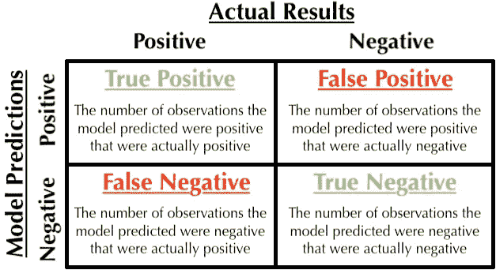
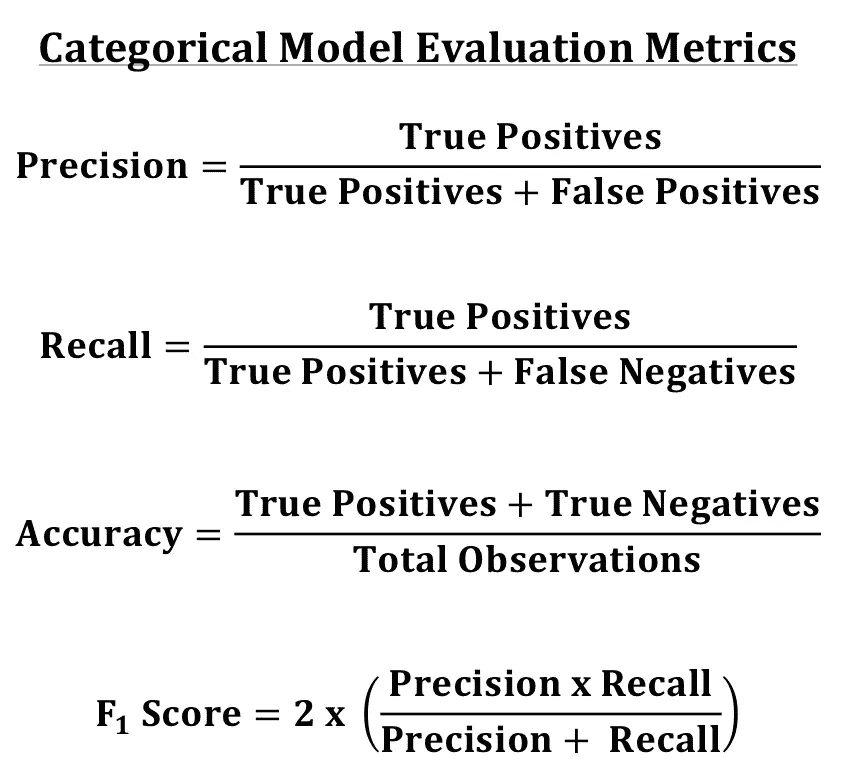

# 评估分类模型

> 原文：<https://towardsdatascience.com/evaluating-categorical-models-e667e17987fd?source=collection_archive---------20----------------------->

当您有分类数据时，您可以建立几个模型来根据给定的数据预测新的观察值。您可以构建逻辑回归、决策树、随机森林、助推模型等等。你如何比较它们，如何确定哪种型号是最好的？

# 混淆矩阵

假设我们有一个二元分类数据集，我们的目标是预测某事是真还是假。我们建立了几个模型，现在我们需要一种方法来组织我们的结果。一种方法是通过使用混淆矩阵。我们的模型预测数据为真或为假。我们可以按照下面的指南将数据组织成一个混乱矩阵:

The confusion matrix with an explanation of each category of results.

我们的模型既可以在一个观察值实际为真时预测它为真( **TP** )，在它实际为真时预测它为假( **FN** )，在它实际为假时预测它为假( **TN** )，在它实际为假时预测它为真( **FP** )。混淆矩阵将有和目标变量的类别一样多的列和行，因此它将总是一个正方形。我们可以组织我们的结果，并通过挑选具有最高真实预测的模型来确定哪个模型是最好的？

# 精确度、召回率、准确度和 F1 分数

不同的情况需要不同的[评估指标](https://en.wikipedia.org/wiki/Precision_and_recall)。例如，为垃圾邮件过滤器和医学测试建立的分类模型需要进行不同的判断。如果垃圾邮件过滤器将一封重要的电子邮件标记为垃圾邮件(假阳性)，比将一封垃圾邮件标记为非垃圾邮件(假阴性)要麻烦得多。根据预测的假阳性有多少来判断模型的标准被称为**精度**。如果医学测试告诉患病的患者他们是健康的(假阴性)，这将比当他们实际上是健康的(假阳性)时告诉患者他们可能生病更成问题，因为测试的管理者可以建议进一步的测试来验证患者的健康。当你实际上并不健康的时候，寻求进一步的测试比走来走去认为你是健康的要好。根据预测到的假阴性的数量来判断模型的标准被称为**召回**。

也可以使用其他指标。**准确性**通过做出多少个正确的预测来判断模型。F1 分数是精确度和召回率的调和平均值。您必须决定哪个指标最适合您的情况。

The equations of some binary categorical model evaluation metrics.

# 结论

以上指标用于评估二元分类模型。当添加多个类别时，我们必须调整我们的评估指标。Python 的 Scikit-Learn 库有方法来[可视化混淆矩阵](https://scikit-learn.org/stable/auto_examples/model_selection/plot_confusion_matrix.html)和[评估模型](https://scikit-learn.org/stable/modules/classes.html#module-sklearn.metrics)。您必须决定哪个评估指标最适合您的项目。