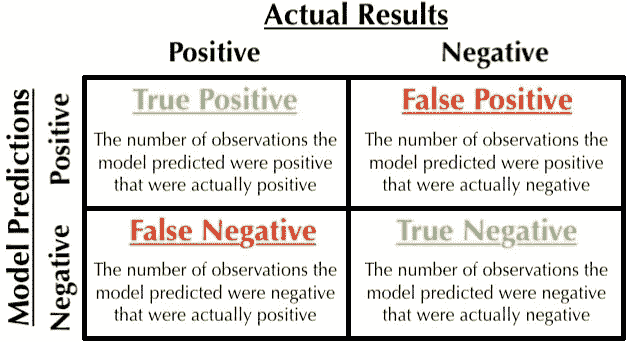
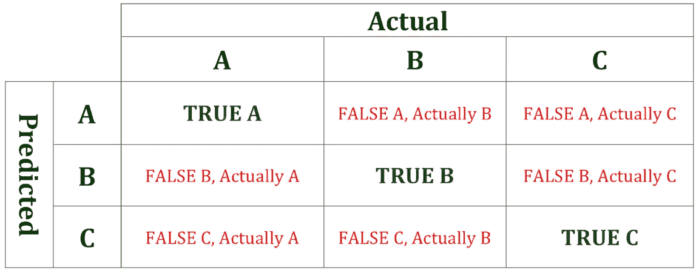
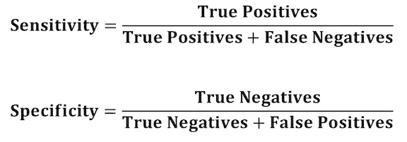
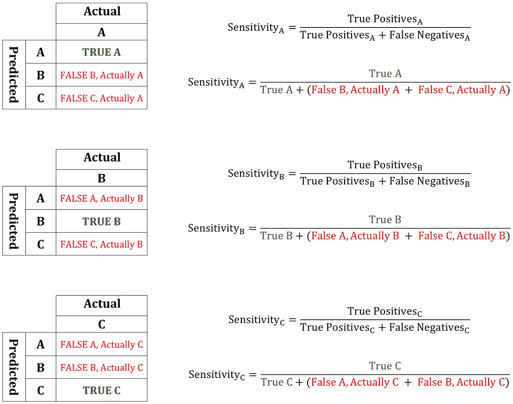
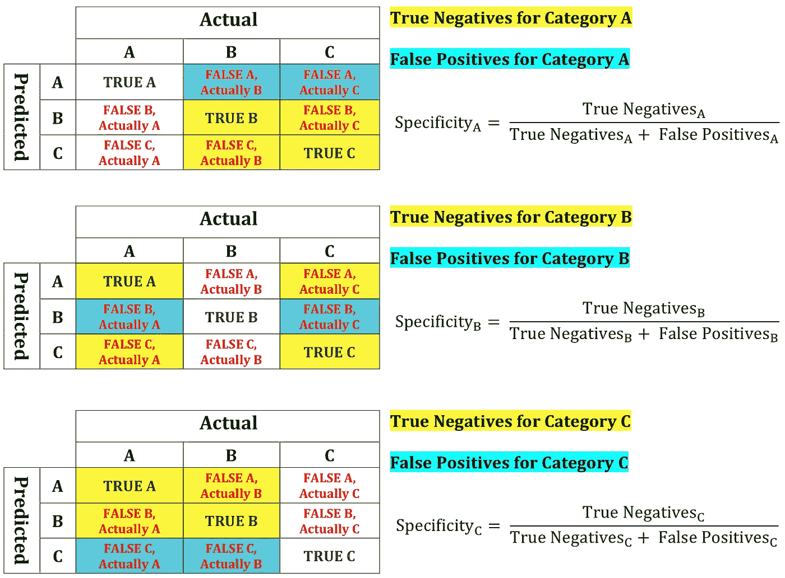

# 评价分类模型 II:敏感性和特异性

> 原文：<https://towardsdatascience.com/evaluating-categorical-models-ii-sensitivity-and-specificity-e181e573cff8?source=collection_archive---------10----------------------->

[上周](/evaluating-categorical-models-e667e17987fd)我讨论了二元分类模型的评估指标。这些二元模型的预测可以分为四组:真阳性、假阳性、假阴性和只考虑一类的真阴性。

The confusion matrix for a binary classification model

当添加其他类别时，预测可能会落入其他组。有多少个类别，就有多少种方法来计算每个评估指标。下面我将介绍这些类型的多分类模型的评估指标。

The confusion matrix for a multi-categorical classification model

# 定义灵敏度和特异性

二元分类模型可以用精确度、召回率、准确度和 F1 度量来评估。我们不必指定指标适用于哪个组，因为模型只有两个选项可供选择；观察值要么属于该类，要么不属于该类，模型可能是正确的，也可能是不正确的，因此有混淆矩阵的四个部分。当模型有多个类别作为预测选项时，我们必须计算适用于每个类别的指标。

**敏感度**是评估模型预测每个可用类别的真阳性的能力的指标。**特异性**是评估模型预测每个可用类别的真实否定的能力的指标。这些指标适用于任何分类模型。计算这些指标的公式如下。

The equations for calculating sensitivity and specificity

你可能已经注意到回忆的方程式看起来和敏感度的方程式一模一样。何时使用任一术语取决于手头的任务。

# 计算灵敏度和特异性

上面的多分类模型可以预测每个观察值的类别 A、B 或 C。当有两个以上可能的预测选项时，必须为每个可能的类别计算这些度量。灵敏度的计算如下:

Sensitivity calculations for multi-categorical classification models

特异性决定了模型预测观察值是否不属于特定类别的能力。当观察实际上属于除了正在考虑的类别之外的每一个其他类别时，它需要模型性能的知识。特异性的计算如下:

Specificity calculations for multi-categorical classification models. The color shade of the text on the right hand side is lighter for visibility.

# 摘要

多类别分类模型可以通过每个可能类别的敏感性和特异性来评估。一个模型对预测一个类别很有效，但对其他类别可能很糟糕。这些评估指标允许我们为不同的目的分析模型。您必须决定哪个评估指标最适合您的项目。