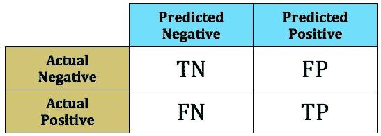
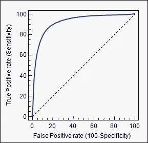
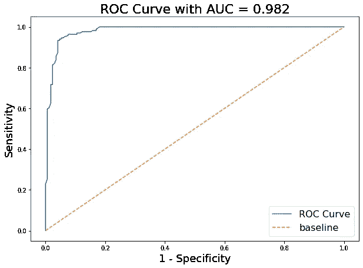
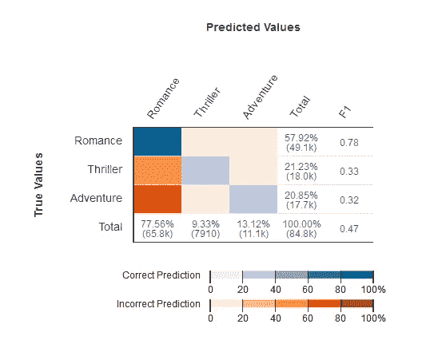

# 评估 Python 中的机器学习分类问题:重要的 6+1 度量

> 原文：<https://towardsdatascience.com/evaluating-machine-learning-classification-problems-in-python-5-1-metrics-that-matter-792c6faddf5?source=collection_archive---------6----------------------->

## 评估您的 ML 分类项目性能的指南


Photo by [Franck V.](https://unsplash.com/@franckinjapan?utm_source=medium&utm_medium=referral) on [Unsplash](https://unsplash.com?utm_source=medium&utm_medium=referral)

机器学习分类和评估模型可能是一项艰巨的任务。本文将试图通过解释“混淆矩阵”、评估指标以及二元分类问题的 ROC AUC 来消除这种“混淆”。对于每个部分，还提供了一个示例 **Python** 代码，以帮助读者理解 Python 中的机器学习二进制分类和评估。

# **分类 vs 回归**

数据科学家通常利用机器学习(ML)工具和库来开发代码，这些代码在不使用显式指令的情况下有效地执行特定任务，而是依靠模式和推理来预测连续变量或变量的类别/类别。一般来说，我们可以把这些 ML 问题分为三类:

**回归**:这些问题涉及到预测一个连续变量，比如温度、价格、年龄等。例如:

*   "根据房子的特点，它的售价是多少？"
*   "客户将在这个网站上订购多少产品？"

**二元分类:**这些问题通常涉及需要是/否或 1/0 结果的问题。例如:

*   “这是欺诈交易吗？”
*   “这个客户会订购这个产品吗？”

**多类分类:**这些类似于二元分类，但是在这种情况下，问题涉及在两个以上的类别之间进行选择。例如:

*   “这是什么样的交易？借方、贷方等。”
*   "这位顾客对哪类产品感兴趣？"

# **评估二元分类问题**

通常，在回归和分类模型中，数据集被分为训练数据集和测试数据集。然后，该模型在“训练数据集”上进行训练和拟合，并用于基于“测试数据集”进行预测，以 ***评估*** 性能。这种训练/测试分割的原因是为了模拟未来的数据集，也是为了避免模型过度适应训练数据集。这种方法的好处是测试数据集中目标的实际值是已知的，这对于评估模型是至关重要的。 ***但是这个测评是怎么做的呢？***

对于二元分类问题，可以计算多种度量来评估预测模型的性能。这些指标是基于所谓的“**混淆矩阵**”计算出来的。

## 混乱矩阵

[《关于混淆矩阵的理论》](http://www2.cs.uregina.ca/~dbd/cs831/notes/confusion_matrix/confusion_matrix.html)把矩阵描述为:

> 混淆矩阵包含关于由分类系统完成的实际和预测分类的信息。通常使用矩阵中的数据来评估这种系统的性能。

下面给出的这个矩阵是所有二进制分类问题的基础，并且广泛用于机器学习模型中。表中的缩略语也有描述。



***正*** 在这种情况下就是 ***的类息*** 。例如，“识别欺诈交易”。

**真阳性(TP):** 当模型预测为阳性，并且它们实际上为阳性时(例如，欺诈交易被识别为欺诈)。

**真阴性(TN)** :模型预测为阴性，实际为阴性(例如，非欺诈交易被识别为非欺诈)。

**假阳性(FP)(也称为 I 型错误):**当模型预测为阳性，但实际上却为阴性时(例如，非欺诈性交易被识别为欺诈性交易)。

**假阴性(FN)(也称为第二类错误):**当模型预测为阴性，但它们为阳性时(例如，欺诈性交易被识别为非欺诈性交易)。

通常，第二类错误(FN)具有更严重的后果，而在 ML 中，目标是最小化第二类错误。另一方面，第一类错误的后果较小。然而，在理想情况下，一个完美的模型应该没有这些错误。

让我们用 Python 写一个函数来创建混淆矩阵。 [Scikit Learn (SKLearn)库有一个](https://scikit-learn.org/stable/modules/generated/sklearn.metrics.confusion_matrix.html) `[metrics](https://scikit-learn.org/stable/modules/generated/sklearn.metrics.confusion_matrix.html)` [包，其中包含了](https://scikit-learn.org/stable/modules/generated/sklearn.metrics.confusion_matrix.html) `[confusion_matrix](https://scikit-learn.org/stable/modules/generated/sklearn.metrics.confusion_matrix.html)` [方法](https://scikit-learn.org/stable/modules/generated/sklearn.metrics.confusion_matrix.html)。

```
# Importing the metrics package from sklearn library
from sklearn import metrics# Creating the confusion matrix
cm = metrics.confusion_matrix(y_test, y_pred)# Assigning columns names
cm_df = pd.DataFrame(cm, 
            columns = ['Predicted Negative', 'Predicted Positive'],
            index = ['Actual Negative', 'Actual Positive'])# Showing the confusion matrix
cm_df
```

## **重要的六项指标**

在统计书籍中有许多评估混淆矩阵的度量，但其中六个在 ML 问题中使用得更广泛。

准确度是正确预测占预测总数的比例。

*准确率= (TP + TN) /所有预测*

**误分类**为(1-准确性)，指预测总数中的所有错误预测。

***灵敏度(又名回忆)*** 表示“在所有实际阳性中，我们预测为阳性的有多少”，可以解释为:

*灵敏度(回忆)= TP / (FN + TP)*

**特异性(又名选择性或真阴性率，TNR)** 表示“在所有实际阴性中，我们预测多少为阴性”，可以写成:

*特异性= TN / (TN + FP)*

**精度(又名阳性预测值，PPV)** 表示“在所有预测的阳性病例中，有多少实际上是阳性的”，或

*精度= TP / (TP + FP)*

**F1 得分**是精确度和灵敏度的调和或加权平均值，是分类问题精确度的一种广泛使用的测量方法。其计算方法如下:

F1 得分= 2 *(精度*灵敏度)/(精度+灵敏度)

Python 中的这个函数将计算并报告混淆矩阵的这六个指标。

```
# Creating a function to report confusion metricsdef confusion_metrics (conf_matrix):# save confusion matrix and slice into four pieces TP = conf_matrix[1][1]
    TN = conf_matrix[0][0]
    FP = conf_matrix[0][1]
    FN = conf_matrix[1][0] print('True Positives:', TP)
    print('True Negatives:', TN)
    print('False Positives:', FP)
    print('False Negatives:', FN)

    # calculate accuracy
    conf_accuracy = (float (TP+TN) / float(TP + TN + FP + FN))

    # calculate mis-classification
    conf_misclassification = 1- conf_accuracy

    # calculate the sensitivity
    conf_sensitivity = (TP / float(TP + FN)) # calculate the specificity
    conf_specificity = (TN / float(TN + FP))

    # calculate precision
    conf_precision = (TN / float(TN + FP)) # calculate f_1 score
    conf_f1 = 2 * ((conf_precision * conf_sensitivity) / (conf_precision + conf_sensitivity)) print('-'*50)
    print(f'Accuracy: {round(conf_accuracy,2)}') 
    print(f'Mis-Classification: {round(conf_misclassification,2)}') 
    print(f'Sensitivity: {round(conf_sensitivity,2)}') 
    print(f'Specificity: {round(conf_specificity,2)}') 
    print(f'Precision: {round(conf_precision,2)}')
    print(f'f_1 Score: {round(conf_f1,2)}')
```

## 加一指标:ROC AUC[或受试者工作特征曲线下面积(ROC)]

据[维基百科](https://en.wikipedia.org/wiki/Receiver_operating_characteristic):

> 受试者操作特征曲线，或 ROC 曲线，是一种图示，说明了二元分类器系统在其辨别阈值变化时的诊断能力。ROC 曲线是通过在各种阈值设置下绘制真阳性率(TPR)对假阳性率(FPR)来创建的。在机器学习中，真阳性率也称为灵敏度、召回率或检测概率[4]。

我们可以利用 ROC 曲线来可视化阳性和阴性类别之间的重叠。为此，我们可以遵循以下步骤:

1)将分类阈值设置为 0，这意味着所有预测都被分类为第 1 类(阳性)。

2)计算该阈值的灵敏度和 1-特异性。

3)绘制数值(x = 1-特异性，y =敏感性)。

4)提高小数字的分类阈值(如 0.005)。

5)重复步骤 1–4。

6)重复直到阈值等于 1(这意味着所有预测都是 0 类，负的)。

这个过程的结果看起来会像这个图表。曲线下面积(AUC)是我们可以用于分类模型的另一个评估指标。45 度线是 AUC 为 0.5 的基线。完美模型的 AUC 为 1.0。AUC 越接近 1.0，预测越好。



ROC Curve (from [https://www.medcalc.org/manual/roc-curves.php](https://www.medcalc.org/manual/roc-curves.php))

让我们用 python 构建一个 ROC AUC，使用`Logistic Regression`模型。

```
# The codes below is partly copied from the code written by Matt Brem, Global Instructor at General Assembly.# Importsimport matplotlib.pyplot as plt
import numpy as np
import pandas as pd
from sklearn.model_selection import train_test_split
from sklearn.linear_model import LogisticRegression# Train/test split
X_train, X_test, y_train, y_test = train_test_split(X,y, random_state = 42)# Instantiating a logisitic regression model
logreg = LogisiticRegression()
logreg.fit(X_train, y_train)    # model fitting
y_pred = logreg.predict(X_test)   # Predictions# Calculating class probabilities
pred_proba = [i[1] for i in logreg.predict_proba(X_test)]pred_df = pd.DataFrame({'true_values': y_test,
                        'pred_probs':pred_proba})# The codes below is motly copied from the code written by Matt Brem, Global Instructor at General Assembly.# Create figure.
plt.figure(figsize = (10,7))# Create threshold values. 
thresholds = np.linspace(0, 1, 200)# Define function to calculate sensitivity. (True positive rate.)
def TPR(df, true_col, pred_prob_col, threshold):
    true_positive = df[(df[true_col] == 1) & (df[pred_prob_col] >= threshold)].shape[0]
    false_negative = df[(df[true_col] == 1) & (df[pred_prob_col] < threshold)].shape[0]
    return true_positive / (true_positive + false_negative)

# Define function to calculate 1 - specificity. (False positive rate.)
def FPR(df, true_col, pred_prob_col, threshold):
    true_negative = df[(df[true_col] == 0) & (df[pred_prob_col] <= threshold)].shape[0]
    false_positive = df[(df[true_col] == 0) & (df[pred_prob_col] > threshold)].shape[0]
    return 1 - (true_negative / (true_negative + false_positive))

# Calculate sensitivity & 1-specificity for each threshold between 0 and 1.
tpr_values = [TPR(pred_df, 'true_values', 'pred_probs', prob) for prob in thresholds]
fpr_values = [FPR(pred_df, 'true_values', 'pred_probs', prob) for prob in thresholds]# Plot ROC curve.
plt.plot(fpr_values, # False Positive Rate on X-axis
         tpr_values, # True Positive Rate on Y-axis
         label='ROC Curve')# Plot baseline. (Perfect overlap between the two populations.)
plt.plot(np.linspace(0, 1, 200),
         np.linspace(0, 1, 200),
         label='baseline',
         linestyle='--')# Label axes.
plt.title(f"ROC Curve with AUC = {round(metrics.roc_auc_score(pred_df['true_values'], pred_df['pred_probs']),3)}", fontsize=22)
plt.ylabel('Sensitivity', fontsize=18)
plt.xlabel('1 - Specificity', fontsize=18)# Create legend.
plt.legend(fontsize=16);
```



Sample Output of the Above Code

# **多类分类的混淆矩阵**

评估多类分类问题与评估二元问题没有什么不同，但是在这种情况下，将为每个类单独计算上面讨论的度量。在具有`N`类的分类模型中，混淆矩阵将是`NxN`，左轴显示实际的类(如测试集中已知的)，顶轴显示预测的类。矩阵的每个元素𝑖,𝑗将是被分类为预测类别𝑗.中的具有实际类别𝑖的项目的数量

[亚马逊 AWS ML 文档](https://docs.aws.amazon.com/machine-learning/latest/dg/multiclass-classification.html)提到:

> 与二元分类问题的过程不同，您不需要选择分数阈值来进行预测。预测答案是具有最高预测分数的类别(即标签)。在某些情况下，您可能希望仅在预测的答案得分较高时才使用它。在这种情况下，您可以选择预测分数的阈值，根据该阈值您是否接受预测答案。



Multi-Class Confusion Matrix (from Amazon AWS website [https://docs.aws.amazon.com/machine-learning/latest/dg/multiclass-classification.html](https://docs.aws.amazon.com/machine-learning/latest/dg/multiclass-classification.html))

亚马逊 AWS 文档中也提到:

> 多分类中使用的典型度量与二分类情况中使用的度量相同。在将所有其他类分组为属于第二类之后，通过将每个类视为二元分类问题来计算每个类的度量。然后，对所有类别的二进制度量进行平均，以获得宏平均(平等对待每个类别)或加权平均(按类别频率加权)度量。

# 将所有这些整合在一起…

正如本文中所解释的，有许多度量标准可以用来评估分类模型的性能。本文介绍了二进制分类模型、评估此类模型的指标，并提供了一组 python 代码片段来帮助读者进行此类评估。

还讨论了多类分类并与二元分类进行了比较。

***尼克·米奈博士****(*[*LinkedIn 简介*](https://www.linkedin.com/in/nickminaie/?source=post_page---------------------------) *)是一位资深顾问和富有远见的数据科学家，代表了领导技能、世界级数据科学专业知识、商业敏锐度和领导组织变革能力的独特组合。他的使命是推进人工智能(AI)和机器学习在行业中的实践。*