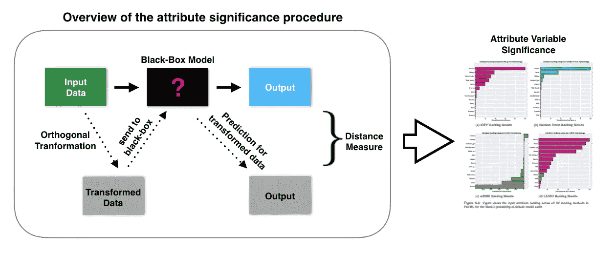
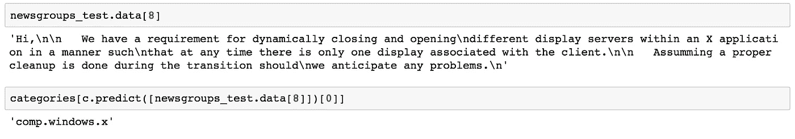
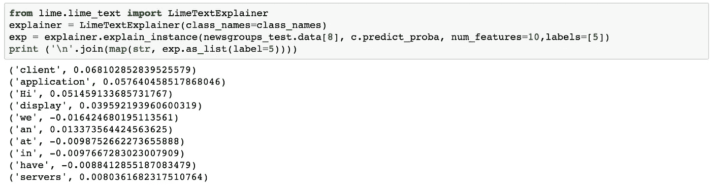
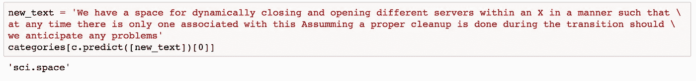
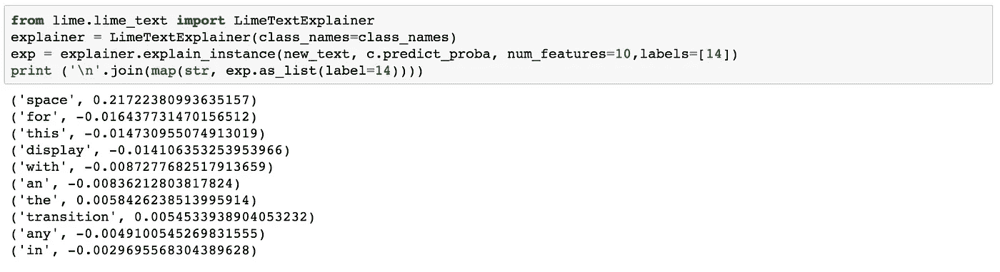
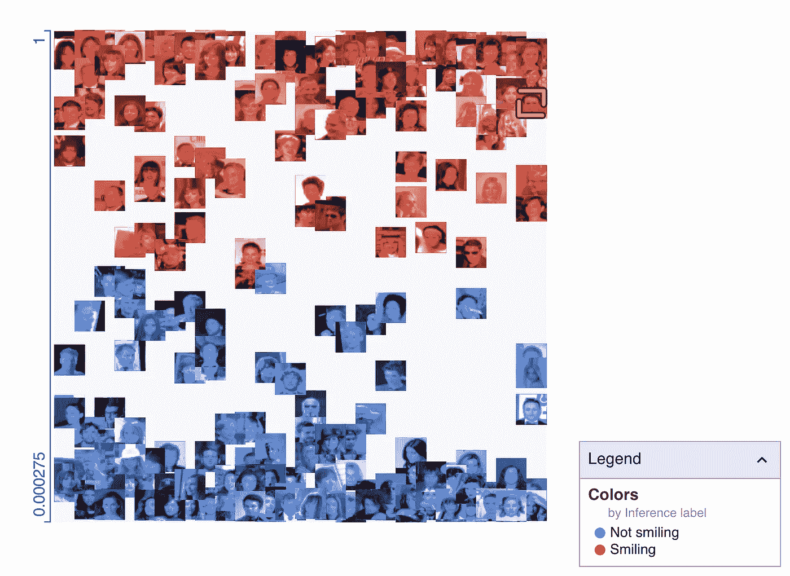

# 评估机器学习模型的公平性和偏见。

> 原文：<https://towardsdatascience.com/evaluating-machine-learning-models-fairness-and-bias-4ec82512f7c3?source=collection_archive---------5----------------------->

## 引入一些工具来轻松评估和审核机器学习模型的公平性和偏见

评估机器学习模型的偏差正成为不同行业和数据研究人员越来越普遍的关注点。模型公平性是机器学习中一个相对较新的子领域。在过去，对歧视的研究是从分析人类驱动的决策和这些决策背后的基本原理中产生的。由于我们开始依赖预测性 ML 模型为保险和银行等不同行业做出决策，我们需要实施策略来确保这些模型的公平性，并在预测过程中检测任何歧视行为。

随着 ML 模型变得越来越复杂，解释它们变得越来越困难。预测模型通常是一个黑盒函数，它接受某个输入( *x* )并输出一个预测( *y* )。假设一家保险公司希望使用一个预测模型来衡量接纳客户的风险。输入( *x* )可以包括特征或属性，例如种族、年龄、性别、民族、教育水平和收入。他们还可以根据模型预测来决定是否应该要求一个人支付更高的保费，这些预测研究了我刚才提到的相同属性。在美国的银行和金融行业，这可能会有一些法律影响，因为它不批准正确申请人的信贷请求，违反了平等信贷机会法案(公平贷款)。

随着预测模型的使用迅速增长，并被部署为做出获取某些服务(如银行贷款、信誉或就业)的明智决策，现在重要的是审计和解释这些模型的输出决策，并在早期阶段进行公平设计。在本文中，我将讨论 5 种工具，它们可以用来探索和审计预测模型的公平性。

# 1- FairML:

Source: [https://github.com/adebayoj/fairml](https://github.com/adebayoj/fairml)

FairML 是一个用 python 编写的工具箱，用于审计机器学习模型的公平性和偏见性。这是一种量化模型输入重要性的简单方法。它使用四种输入排序算法来量化模型对模型输入的相对预测依赖性。

关于安装和演示代码，可以参考库的主 Github repo。

 [## 阿德巴约/fairml

### 在 GitHub 上创建一个帐户，为 adebayoj/fairml 的发展做出贡献。

github.com](https://github.com/adebayoj/fairml) 

# 2-石灰

Lime 是一个开源项目，旨在解释和说明机器学习模型是如何工作的。Lime 的伟大之处在于它支持的机器学习或深度学习模型的广泛范围。我可以解释文本分类，多类分类，图像分类和回归模型。

这里有一个使用 Lime 来理解和探索做出预测性决策的决策标准的快速演示。在这个例子中，我训练了一个使用 20 个类别新闻组数据集的文本分类器。以下文本被归类为 *comp.windows.x* 类别。

现在，让我们用 Lime 来探究这篇课文中哪些特定的词最有分量来得出这个决定。

如你所见，*客户端，应用程序*这几个词最有分量。我们来做个小实验。我将从上面的文本中删除这两个单词，并放置另一个单词，然后再次尝试预测。

你可以看到单词*空格*引入了偏见并完全改变了预测，尽管文本的上下文仍然相同。

要了解代码是如何工作的，可以参考代码库和下面链接中的示例代码:

 [## 市场营销/市场营销

### Lime:解释任何机器学习分类器的预测— marcotcr/lime

github.com](https://github.com/marcotcr/lime) 

# 3- IBM AI 公平 360

AI Fairness 360 是一个开源库，它使用一系列偏差缓解算法来检测和缓解机器学习模型中的偏差。这个库非常全面，充满了评估偏倚的指标。

他们创造了一种互动的体验，在这种体验中你可以看到衡量标准并测试能力。

他们还创建了 G [指南材料](http://aif360.mybluemix.net/resources#guidance),可以指导哪些度量标准可以用于哪些用例。

 [## IBM/AIF360

### 数据集和机器学习模型的一套全面的公平指标，对这些指标的解释，以及…

github.com](https://github.com/IBM/AIF360) 

该库依赖于一系列偏差缓解算法，例如:

*   **优化预处理(** [**Calmon et al .，2017**](http://papers.nips.cc/paper/6988-optimized-pre-processing-for-discrimination-prevention) **):** 它提出了一种学习数据变换的优化，具有三个目标:控制区分度、限制单个数据样本中的失真、保持效用。
*   **异类冲击清除器(** [**费尔德曼等人，2015**](https://doi.org/10.1145/2783258.2783311) **)**
*   **均衡赔率后处理(** [**哈特等人，2016**](https://papers.nips.cc/paper/6374-equality-of-opportunity-in-supervised-learning) **)**

还有很多。

# 4- SHAP

SHAP 可以通过将博弈论与局部解释联系起来，解释任何机器学习模型的输出。它使用一些漂亮的 JS 可视化来解释模型。

有关其工作原理的详细解释和指导，请参考下面的链接

 [## slundberg/shap

### 解释任何机器学习模型输出的统一方法。-slund Berg/shap

github.com](https://github.com/slundberg/shap) 

# 5-谷歌假设工具

Smile Detection Example

Google What-If Tool (WIF)是一个 tensorboard 插件，用于理解黑盒分类或回归 ML 模型。它有多个演示，互动体验和全面的文件。

 [## 张量流/张量板

### TensorFlow 的可视化工具包。通过在 GitHub 上创建帐户，为 tensorflow/tensorboard 的发展做出贡献。

github.com](https://github.com/tensorflow/tensorboard/tree/master/tensorboard/plugins/interactive_inference) 

总之，ML 模型中的任何偏差都是由于注释数据的人员中存在的某种偏差，或者是由于偏斜或缺少特征或任何其他需要挑选和调查的原因而存在于数据本身中。未能捕捉这些特征并概括数据来训练模型会导致模型偏差。有偏见的机器学习模型可能会导致做出不公平/有偏见的决策，从而影响最终用户。因此，所有利益相关者都应该集中精力检测他们开发的模型中是否存在偏见，这一点非常重要。