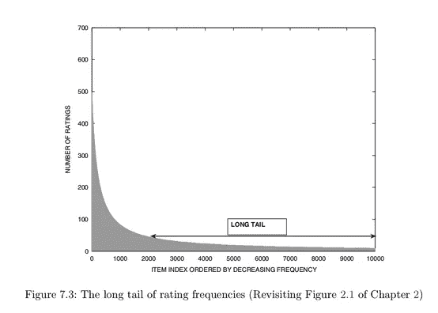

# 评估推荐系统:均方根误差还是平均绝对误差？

> 原文：<https://towardsdatascience.com/evaluating-recommender-systems-root-means-squared-error-or-mean-absolute-error-1744abc2beac?source=collection_archive---------11----------------------->

推荐系统的准确性通常通过两个主要指标来评估:均方根误差(RMSE)和平均绝对误差(MAE)。两者都很好，因为它们允许容易的解释:它们都与原始评级的规模相同。然而，根据数据集的上下文，使用其中一个可能更好。我们来探究一下原因。

# **成本和收益:**

Source: [the Surprise Library Docs,](https://surprise.readthedocs.io/en/stable/accuracy.html) where R is the predicted Ratings Matrix.

平均误差(MAE)的一个大的特征是在误差项中不会对极值产生任何偏差。如果有异常值或较大的误差项，它会将这些与其他预测进行同等加权。因此，当您不真正关注异常值的重要性时，在关注评级准确性时，MAE 应该是首选。要获得推荐系统的整体视图或表示，请使用 MAE。

Source: [the Surprise Library Docs,](https://surprise.readthedocs.io/en/stable/accuracy.html) where R is the predicted Ratings Matrix.

均方根误差的一个趋势是，当残差(误差项)被平方时，它倾向于不成比例地惩罚大误差。这意味着 RMSE 更容易受到异常值或糟糕预测的影响。

根据定义，RMSE 永远不会像梅一样小。然而，如果误差项遵循正态分布，T. Chai 和 R. R. Draxler 在[的这篇论文](https://www.geosci-model-dev.net/7/1247/2014/gmd-7-1247-2014.pdf)中表明，在给定足够数据的情况下，使用 RSME 允许误差集的重构。另一方面，MAE 只能准确地重建 0.8 的数据集。此外，RSME 不使用绝对值，这在计算距离、梯度或其他度量时更方便。这就是为什么机器学习中的大多数成本函数都避免使用 MAE，而是使用误差平方和或均方根误差。

# **长尾的重要性:**

Source: [Recommender Systems: The Textbook](https://www.amazon.com/Recommender-Systems-Textbook-Charu-Aggarwal/dp/3319296574) by Charu Aggarwal

推荐系统的数据集通常只有很少的项目包含最多的评价，而大多数项目只有很少的评价。这影响了准确度测量，因为对流行项目的准确度预测通常不同于对稀疏评级项目的准确度预测。这个问题的一个解决方案是，在计算 RSME 或 MAE 时，给每个商品一个特定的权重，这是由商家决定的。这些可以允许推荐系统如何评估所有项目的更准确的表示。

# **来源及延伸阅读:**

大量信息来源于 Chai 和 Drexler 的这篇论文，[https://www . geosci-model-dev . net/7/1247/2014/gmd-7-1247-2014 . pdf](https://www.geosci-model-dev.net/7/1247/2014/gmd-7-1247-2014.pdf)

以及 Charu Aggarwal 的《推荐系统:教科书》第七章的讨论。