# 对机器学习的规避攻击(或“对抗性例子”)

> 原文：<https://towardsdatascience.com/evasion-attacks-on-machine-learning-or-adversarial-examples-12f2283e06a1?source=collection_archive---------7----------------------->

## [机器学习的安全性](https://towardsdatascience.com/tagged/security-for-ml)

## 你的 ML 模型比你想象的要容易骗

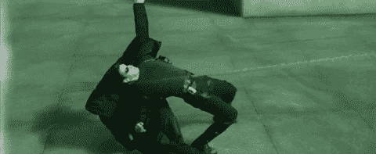

[Source.](https://thumbs.gfycat.com/CrazySpanishCero-mobile.jpg)

机器学习令人兴奋。然而，就像任何新的技术或发明一样，ML 不仅带来了[新的惊人能力——但不幸的是，也带来了新的漏洞](https://medium.com/@iljamoisejevs/what-everyone-forgets-about-machine-learning-974752543849)。

之前我已经讨论过如何[以结构化的方式](https://medium.com/@iljamoisejevs/will-my-machine-learning-be-attacked-6295707625d8)考虑这些漏洞(或者如何为你的 ML 开发一个“威胁模型”)。这一次，我将深入探讨如何通过所谓的**规避攻击**在推理时间利用您的 ML 系统。

没有时间浪费了，让我们开始吧。

# 逃避机器学习

当网络被输入一个**“对立的例子”**——一个仔细扰乱的输入，看起来和感觉上与人类未经篡改的副本完全一样——但完全摆脱了分类器时，规避攻击就发生了。

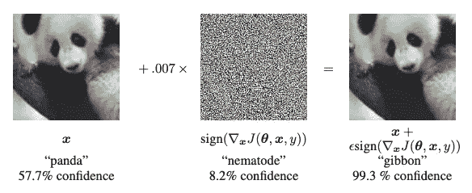

[Source.](https://arxiv.org/abs/1412.6572)

尽管所有关于对立例子的宣传都是“新”现象，但它们实际上并不那么新。[对抗性 ML 的领军人物之一 Battista Biggio 的一篇论文](https://arxiv.org/pdf/1712.03141.pdf)指出，攻击机器学习领域最早可以追溯到 2004 年。当时，在垃圾邮件过滤的背景下研究了对立的例子，表明线性分类器可以很容易地被垃圾邮件内容中几个精心制作的变化所欺骗。

完整时间表:

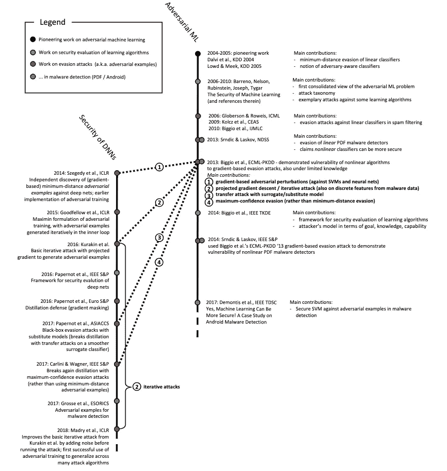

对立例子的“新奇”真正来自于它们是在深度学习的背景下被发现的。2013 年，谷歌人工智能的 Christian Szegedy 致力于理解神经网络如何“思考”,但却发现了一个所有神经网络似乎都拥有的有趣特性——很容易被微小的干扰所愚弄。鉴于深度学习已经变得如此之大——对抗性例子和对抗性 ML 领域已经成为焦点。

当谈到对立的例子时，我将主要使用计算机视觉论文——但实际上它们同样适用于任何类型的机器学习系统，从复杂到不复杂。以下是我个人最喜欢的一些:

图片:[用对抗眼镜糊弄人脸检测](https://www.cs.cmu.edu/~sbhagava/papers/face-rec-ccs16.pdf)。

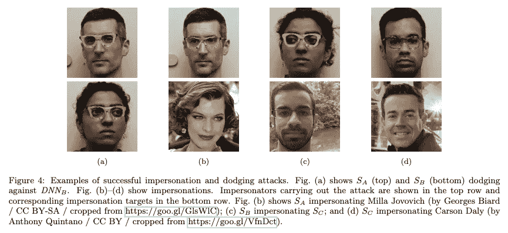

视频:[DEFCON](https://github.com/advboxes/AdvBox/blob/master/applications/StealthTshirt/README.md)上的隐身 t 恤。

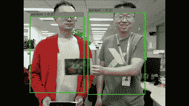

音频:[语音转文本转录。](https://nicholas.carlini.com/code/audio_adversarial_examples/)

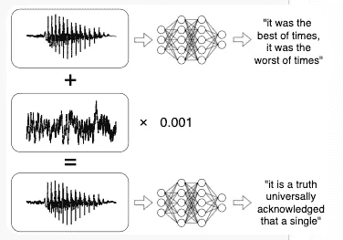

语言:[情感分析和文本推导](https://www.semanticscholar.org/paper/Generating-Natural-Language-Adversarial-Examples-Alzantot-Sharma/c68fbc1f4aa72d30974f8a3071054e3b227137fd)。

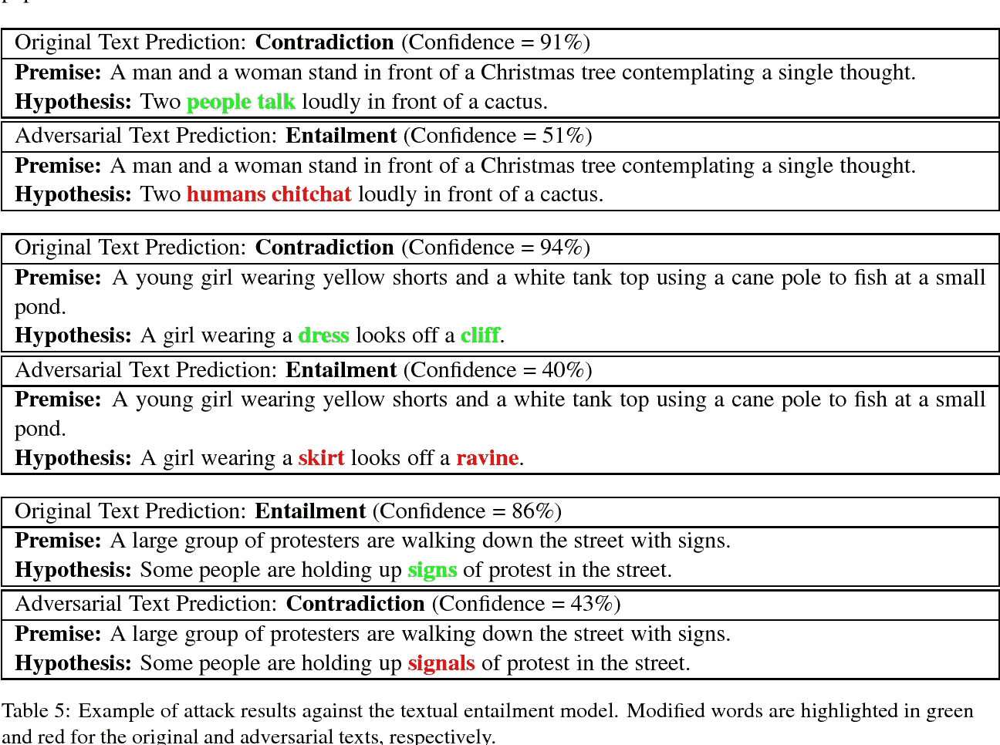

强化学习:[赛船](https://openai.com/blog/faulty-reward-functions/)。

恶意软件:[利用 RL 躲避恶意软件分类器。](https://arxiv.org/pdf/1801.08917.pdf)

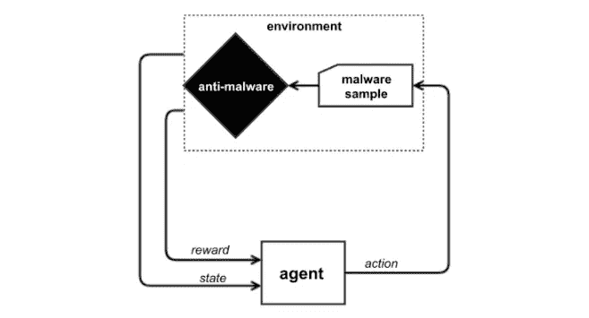

# 为什么会有对抗性的例子存在？

这是个很好的问题。到目前为止，对于这种情况的原因，机构群体还没有达成共识。存在许多假设。

试图解释对立例子的第一个也是最初的假设来自 [Szegedy 自己的论文](https://arxiv.org/abs/1312.6199)，其中他们认为它们的存在是由于流形中低概率“口袋”的存在(即太多的非线性)和网络的不良正则化。

后来出现了一种相反的理论，由 [Goodfellow](https://arxiv.org/abs/1412.6572) 首创，认为事实上对立的例子是由于现代机器学习，特别是深度学习系统中*太多的*线性而发生的。Goodfellow 认为，像 ReLU 和 Sigmoid 这样的激活函数基本上是中间的直线(在这里，碰巧我们更喜欢保持梯度，以防止它们爆炸或消失)。所以在一个神经网络中，你有大量的线性函数，所有的都延续着彼此的输入，都在同一个方向。如果你对一些输入(这里或那里的几个像素)添加微小的扰动，这些扰动在网络的另一端积累成巨大的差异，它就会吐出乱码。

第三个也可能是今天最普遍采用的假设是倾斜边界。简而言之，作者认为，因为模型永远不会完美地拟合数据(否则测试集的准确性将一直是 100%) —在分类器的边界和采样数据的实际子流形之间，总会存在对立的输入口袋。他们还从经验上揭穿了前两种方法，所以如果你是技术人员，这篇文章值得一读。

还有其他一些非常数学化的解释:

*   [缺乏足够的训练数据](https://arxiv.org/abs/1804.11285)
*   [构建鲁棒分类器的计算困难](https://arxiv.org/abs/1805.10204)

最后是我个人的最爱。[麻省理工学院](https://arxiv.org/abs/1905.02175)最近的一篇论文认为，对立的例子不是一个错误——它们是神经网络看待世界的一个特征。仅仅因为我们人类局限于三维空间，不能区分噪声模式，并不意味着这些噪声模式不是好的特征。我们的眼睛只是糟糕的传感器。因此，我们在这里真正处理的是一个比我们自己更复杂的模式识别机器——而不是把我们不理解的模式称为“对立的例子”,我们应该接受这个世界比看起来更复杂(明白吗？).

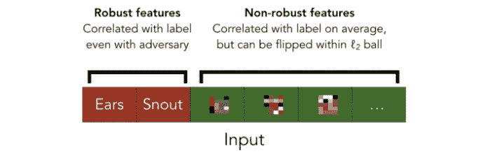

[Source.](https://arxiv.org/abs/1905.02175)

如果整篇论文太长——我强烈推荐这篇[11 分钟的博客摘要](http://gradientscience.org/adv/)。

顺便说一句，那篇论文独特地解释了与对立例子相关的另一个真正有趣的现象——它们的可转移性。[以前的工作](https://arxiv.org/abs/1605.07277)指出，对立的例子很容易在不同的模型和不同的数据集之间转移。没错——你可以在狗和猫之间训练一个模型，但你可以在输入中加入*相同的敌对噪音*,愚弄一个在热狗和非热狗之间训练的完全不同的模型。因为麻省理工学院的论文指出，噪音实际上是一种特征，所以图像领域的其他图像(无论是猫、狗、热狗还是不是热狗)都共享它是有道理的。迷人的东西。

# 攻击者的能力和敌对的例子

攻击者对目标系统的了解(或他们的"[能力](https://medium.com/@iljamoisejevs/will-my-machine-learning-be-attacked-6295707625d8)")非常重要。他们对你的模型和它是如何构建的了解得越多，他们就越容易对它发起攻击。

在 [Calypso](https://calypsoai.com) 我们将闪避攻击分为五个独立的类别:

1.  那些使用渐变的
2.  那些使用置信度分数的
3.  那些使用硬标签的
4.  那些使用代理模型的
5.  暴力攻击

根据定义，基于梯度的攻击需要访问模型的梯度，因此是一种[白盒攻击](https://medium.com/@iljamoisejevs/will-my-machine-learning-be-attacked-6295707625d8)。这些无疑是最强大的，因为攻击者可以利用他们对模型如何思考(其梯度)的详细理解来数学优化攻击。

这也是最适合攻击硬化模型的技术。事实上，[的研究](https://arxiv.org/abs/1705.07263)已经表明，如果攻击者能够访问模型的渐变——他们将*总是*能够编造一套新的对抗性例子来欺骗模型。这就是为什么对立的例子如此重要的原因——[通过模糊性获得安全性](https://en.wikipedia.org/wiki/Security_through_obscurity)除此之外，防御它们实际上是相当困难的(稍后将详细介绍)。

迄今为止，三种最强大的基于梯度的攻击是:

*   [EAD](https://arxiv.org/abs/1709.04114) (L1 标准)
*   [C & W](https://arxiv.org/abs/1705.07263) (L2 标准)
*   [马德里](https://arxiv.org/abs/1706.06083)(李定额)

**置信度得分**攻击使用输出的分类置信度来估计模型的梯度，然后对上述基于梯度的攻击进行类似的智能优化。这种方法不需要攻击者了解模型的任何信息，因此属于[黑盒类型](https://medium.com/@iljamoisejevs/will-my-machine-learning-be-attacked-6295707625d8)。

迄今为止，三种最强大的基于信任的攻击是:

*   [动物园](https://arxiv.org/abs/1708.03999)
*   [SPSA](https://arxiv.org/abs/1802.05666)
*   [NES](https://arxiv.org/abs/1804.08598)

**硬标签**攻击只依赖模型输出的标签(“猫”、“狗”、“热狗”)，不需要置信度得分。这使得攻击更加愚蠢——但可以说更加现实(你知道有多少公共端点输出分类分数？).这一类别中最强大的攻击仍然是[边界攻击](https://arxiv.org/abs/1712.04248)。

**代理模型**攻击与基于梯度的攻击非常相似，只是它们需要一个额外的步骤。当对手无法访问模型的内部，但仍想发起白盒攻击时，他们可以尝试首先在他们的机器上重建目标的模型。他们有几个选择:

*   如果目标模型作为一个 oracle 可用，攻击者可以通过重复查询端点和观察输入输出对来了解它(我在这里将更多地讨论这种“逆向工程”攻击
*   如果目标模型应用于标准的分类任务(例如人脸检测)，攻击者可能只是猜测模型被训练的架构和数据，并使用它来构建副本
*   如果攻击者没有任何信息，由于我们之前讨论的可转移属性，他们可以简单地使用任何现成的图像分类器，并生成不完美但功能强大的对抗示例

最后，还有**蛮力**攻击。这些攻击根本不使用优化来生成对立的例子，而是求助于简单的东西，如:

*   [随机旋转/平移图像](https://arxiv.org/abs/1712.02779)
*   [应用公共扰动](https://arxiv.org/abs/1807.01697)
*   [添加具有大 SD 的高斯噪声](https://arxiv.org/abs/1901.10513)

# 如何针对对抗性的例子进行辩护？

简而言之——很难。我们真的是进退两难。让我们检查两大类辩护——经验辩护和形式方法。

让我们从**正式方法**开始，因为它们讨论起来更快。你们当中那些在芯片设计或航空航天&国防等行业工作过的人应该对形式化方法很熟悉。对其他人来说——形式方法是一种数学技术，用于保证软件/硬件系统的健壮性。在大多数软件中，如果你设计或构建错误，可能会导致一些停机时间和一些愤怒的客户评论——但它可能不会杀死任何人。然而，在某些行业，这样的缺陷是不可接受的。你不能制造了 1 亿个芯片却发现芯片的某个部分有缺陷——你也不能把一架飞机放在空中，除非你已经用数学方法验证了每个组件都按预期工作。

形式方法的工作方式非常简单，就是尝试每一种可能的场景，然后看看它是如何进行的。在规避攻击的世界里，这意味着试图在一定的干扰半径内产生每一个可能的敌对例子。例如，假设您有一个只有两个灰度像素的图像，比如 180 和 80。那么让我们假设你决定在每个方向上的扰动范围为 3。这给了你(3+1+3)或 49 种组合来尝试——如果你想正式验证这些组合中没有一个是敌对的，你就必须将每一个都放入你的模型中，看看另一端会出现什么。

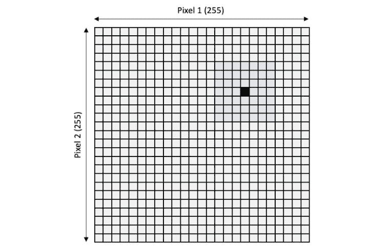

二维无色图像的 49 种组合。一幅 1000 x 1000px 的彩色图像，每个方向的扰动范围都是 3，会怎么样？这是要检查的(3+1+3)^(3*1000 *** 1000 个)组合(excel 拒绝提供数字)！

希望你能很快发现正式方法的问题——从计算的角度来看，它们并不便宜，而且通常完全难以处理。事实上，当应用于神经网络时，目前最先进的形式方法技术不能验证超过几层深度的网络。因此，目前这是一个有价值的——但难以实现的愿望。

如果你确实想更深入地了解神经网络的形式方法，这里有一些不错的论文:

*   [Reluplex:验证深度神经网络的高效 SMT 求解器](https://arxiv.org/abs/1702.01135)
*   [深度神经网络安全验证](https://arxiv.org/abs/1610.06940)
*   [用混合整数规划评估神经网络的鲁棒性](https://arxiv.org/abs/1711.07356)

否则，让我们继续进行**实证防御。**经验辩护顾名思义，就是依靠实验来论证辩护的有效性。例如，你可能攻击一个模型两次——首先是一个正常的、不设防的版本，然后是一个加固的版本——观察每个版本有多容易被欺骗(希望加固的模型表现得更好)。因此，正式方法试图计算每一种可能的情况，并在这样做的过程中验证不存在对立的例子——经验方法采取“你看它有效，为什么要计算”的方法。

让我们来看看一些更受欢迎的类型:

1.  对抗训练
2.  梯度掩蔽
3.  输入修改
4.  侦查
5.  额外课程

**对抗性训练**——传授当今最受关注、也可以说是最有效的防守。在对抗训练期间，防御者用训练池中包含的对抗例子来重新训练模型，但是用正确的标签来标记。这教导模型忽略噪声，并且仅从“鲁棒的”特征中学习。

对抗性训练的问题在于，它只能保护你的模型免受与最初训练样本相同的攻击。因此，如果有人随后发起使用不同算法优化的攻击，或者发起适应性攻击(即针对防御模型的白盒攻击)，他们就能够再次欺骗分类器，就好像没有防御措施一样。

你可能会想，嗯，你可以不断地重新训练你的模型，一遍又一遍地包括新伪造的对立例子——但在某些时候，你已经向训练集中插入了如此多的虚假数据，以至于模型学习的边界基本上变得无用。

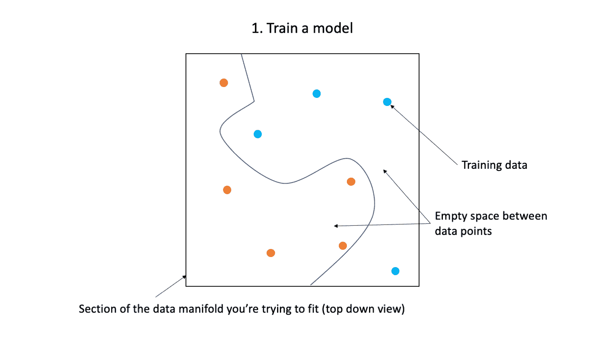

也就是说，如果目标只是让攻击者更难绕过分类器，那么对抗性训练是一个可靠的选择。实际上也有很多创造性的方法来做这件事:

*   [在](https://arxiv.org/abs/1705.07204)的合奏
*   [梯级在](https://arxiv.org/abs/1708.02582)
*   [AT](https://arxiv.org/abs/1706.06083)的稳健优化方法
*   [通过光谱归一化](https://arxiv.org/abs/1811.07457)

接下来，**渐变蒙版。**基本上是不防。有一段时间，敌对的 ML 社区认为，因为需要梯度来计算对模型的强大攻击，隐藏梯度应该可以解决这个问题。[防御性蒸馏](https://arxiv.org/abs/1511.04508)非常受欢迎——但很快[被证明是假的](https://arxiv.org/pdf/1607.04311.pdf)。

梯度掩蔽不能作为一种防御策略的原因是因为对立例子的可转移性。即使你成功隐藏了模型的渐变——攻击者仍然可以构建一个代理，攻击它，然后转移例子。

**输入修改**发生在输入在被传递到模型之前，以某种方式被“清理”以消除敌对噪音。例子包括各种去噪解决方案([自动编码器](https://arxiv.org/abs/1412.5068)、[高级代表性去噪器](https://arxiv.org/abs/1712.02976)、[颜色位深度减少、平滑](https://arxiv.org/abs/1704.01155)、[重整 GANs](https://arxiv.org/abs/1805.06605) 、 [JPEG 压缩](https://arxiv.org/abs/1608.00853)、[fova tion](https://arxiv.org/abs/1511.06292)、[像素偏转](https://arxiv.org/abs/1801.08926)、[通用基函数变换](https://arxiv.org/abs/1803.10840)等等。

接下来，**检测**。一些检测方法与输入修改密切相关，因为一旦输入被清除，就可以将其预测与原始预测进行比较，如果两者相差很远，则很可能输入已被篡改。下面是[几个](https://arxiv.org/abs/1711.05929) [的例子](https://arxiv.org/abs/1705.09064)。

其他的就不一样了。他们实际上训练了一个独立的检测网络，其唯一的工作就是决定一个输入是否是敌对的。此外，还有许多检测防御措施，用于检查在输入馈送/预测流程的不同点计算的原始统计数据:

*   在[上输入本身](https://arxiv.org/abs/1702.06280)
*   关于[卷积滤波器](https://arxiv.org/abs/1612.07767)
*   在 [ReLU 激活时](https://arxiv.org/abs/1704.00103)
*   在[逻辑上](https://arxiv.org/abs/1803.06373)

总的来说，输入修改和检测方法很棒，因为它们可以应用于已经训练好的模型，并且不需要数据科学家回到原点。在卡里普索，我们是这种防守的忠实粉丝。

最后，还有**额外(空)类**方法。这个想法很简单。分类器是在一个非常特殊的数据分布上训练的，根据定义，当超出这个范围时，分类器是没有线索的。因此，与其强迫分类器在它显然不知道标签是什么的时候猜测标签，为什么不给它弃权的选项呢？这就是空类所支持的([论文](https://arxiv.org/abs/1703.04318))。

总而言之，经验防御是不完美的——但它们是有效的，有时只需要几行代码。是的，不可否认，他们是攻击者的一场永无止境的猫捉老鼠游戏，新的游戏通常会很快被[打破](https://nicholas.carlini.com/papers/2018_icml_obfuscatedgradients.pdf)——但是如果你认为攻击者像电一样(总是选择阻力最小的路径)——我们的工作就是让他们的生活*足够艰难。*

# 结束语

唷！这是一篇很长帖子——但希望你觉得它有趣且有用。

最后一点，如果你是一名工程师而不是数学家，并且更喜欢通过做来学习，那么**人工智能伦理研究所&机器学习**有一个关于[对抗性鲁棒性](https://github.com/EthicalML/awesome-production-machine-learning#adversarial-robustness-libraries)的优秀开源工具集合。去玩吧。

否则，如果你已经完成了规避攻击，但还想了解更多关于 ML 安全的知识，我推荐你阅读我的其他关于 [ML 安全威胁模型](https://medium.com/@iljamoisejevs/will-my-machine-learning-be-attacked-6295707625d8)和[中毒](https://medium.com/@iljamoisejevs/poisoning-attacks-on-machine-learning-1ff247c254db)和[隐私](https://medium.com/@iljamoisejevs/privacy-attacks-on-machine-learning-a1a25e474276)攻击的帖子。

确保每个人的安全。