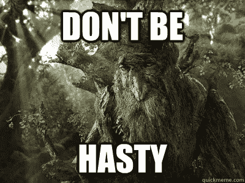
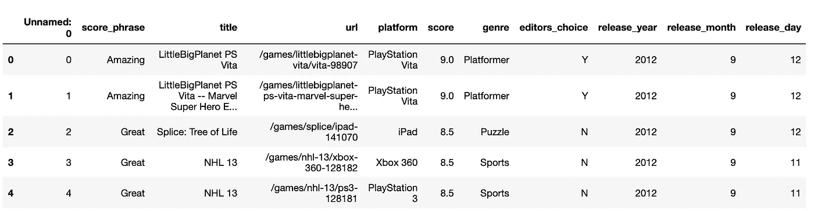
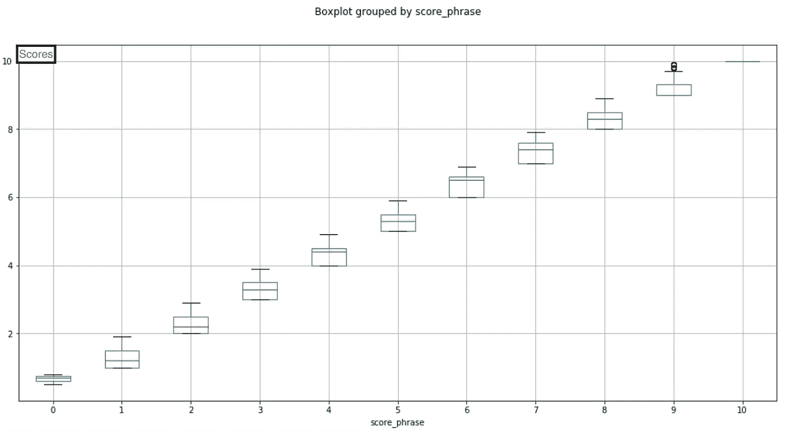
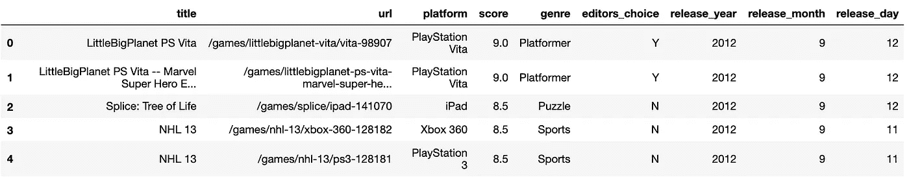
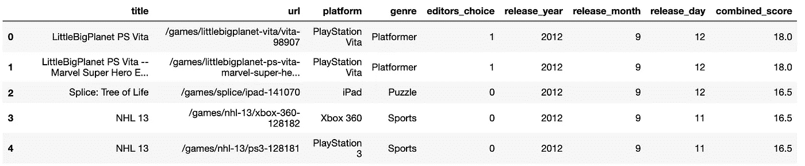
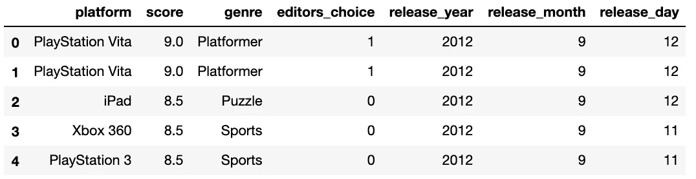

# 洗过熊猫吗？

> 原文：<https://towardsdatascience.com/ever-washed-a-panda-c94d23c47667?source=collection_archive---------25----------------------->

## 熊猫数据帧清理简介

通常在数据科学中，我们会对项目的目标感到兴奋。“我要用回归模型来预测燃油效率，并让我的结果达到 5%以内的准确度！”我们很想马上就去实践这个想法。在头脑中开始一个伟大的目标可能是一个巨大的动力，但是要小心跳过任何项目中最重要的部分之一的危险:数据清理。它也许并不华丽，也许你并没有拯救世界，但是用一个比我更聪明的人的话来说:



A wise old tree teaches life lessons

在匆忙进行预测之前，真正了解一个数据集是建立健康、持久关系的最佳方式。


At the panda wash! woah woah woah at the…

相信我，数据奖励我们慢下来从各个角度考虑问题。让我们问一些基本的问题:当我们看我们的数据时，我们看到了什么？我们应该看吗？每一列的意图是什么？这些值是字面意义上的还是分类意义上的？该列中的值如何与其他列中的值相关联？我知道这些问题看起来很简单，但是从小处着手可以帮助你抓住一些你在匆忙中可能会错过的东西。你可能会惊讶于简单的问题会引出更复杂的问题。

好了，是时候穿上我们的雨衣，拿起海绵和橡胶扫帚，变得有点脏了。

出于这个练习的目的，我们会说我正试图根据可用的数据来预测游戏分数。我将使用 kaggle 的游戏评论数据集，可以在这里找到:[https://www . ka ggle . com/egrinstein/20-years-of-games/downloads/20-years-of-games . zip/2](https://www.kaggle.com/egrinstein/20-years-of-games/downloads/20-years-of-games.zip/2)

1.  当我们查看数据时，我们看到了什么？我们应该看吗？

让我们从导入 pandas 开始，将 csv 文件读入数据帧:

```
import pandas as pd
df = pd.read_csv('ign.csv')df.head()
```



a first look at our dataframe

从一开始，我就能看出一些问题。首先，看起来这个 csv 文件有自己的索引列。保留这两个都是多余的，所以让我们通过专门调用 csv 索引列来去掉我们的。

```
df = pd.read_csv('ign.csv',index_col='Unnamed: 0')
```

2.每一列的意图是什么？这些值是字面意义上的还是分类意义上的？

我们有两个可能包含分数的列:score_phrase，看起来像文本，score，看起来像数字。在上下文中，这两列似乎都表示分类数据。让我们看看它们的数据类型和值:

```
df.score_phrase.value_counts()Great          4773
Good           4741
Okay           2945
Mediocre       1959
Amazing        1804
Bad            1269
Awful           664
Painful         340
Unbearable       72
Masterpiece      55
Disaster          3
Name: score_phrase, dtype: int64df.score.describe()count    18625.000000
mean         6.950459
std          1.711736
min          0.500000
25%          6.000000
50%          7.300000
75%          8.200000
max         10.000000
Name: score, dtype: float64
```

所以看起来 score_phrase 有 11 个不同的文本值，可以很容易地转换成 11 个数字排名。分数似乎是一个数字排名系统，从 0 到 10。现在是做决定的时候了。我用分数吗？score_phrase？还是两者的混合？让我们在做决定之前获得更多的信息。

在同一个数据集中同时包含 score 和 score_phrase 列似乎很奇怪。我假设 score_phrase 可能基于 score 列中的分数，让我们来看看。下面，我将在数据帧中查找灾难的行，以查看分数列中的值。我将对 score_phrase 的所有唯一值进行同样的操作。

```
score_dict = {'Disaster': [],
              'Unbearable': [],
              'Painful': [],
              'Awful': [],
              'Bad': [],
              'Mediocre': [],
              'Okay': [],
              'Good': [],
              'Great': [],
              'Amazing': [],
              'Masterpiece': []}for name in score_dict.keys():
    score_dict[name] = df.loc[df.score_phrase == name].score.values
    print(name,
          score_col_dict[name].min(),
          score_col_dict[name].max())Disaster 0.5 0.8
Unbearable 1.0 1.9
Painful 2.0 2.9
Awful 3.0 3.9
Bad 4.0 4.9
Mediocre 5.0 5.9
Okay 6.0 6.9
Good 7.0 7.9
Great 8.0 8.9
Amazing 9.0 9.9
Masterpiece 10.0 10.0
```

为了确保万无一失，让我们用一个方框图来看看我们的结果，0 代表灾难，10 代表杰作:



看起来 score 列中的值直接影响 score_phrase 值，所以我们可以完全去掉 score_phrase 列。

现在，让我们再来看看我们的数据框架:



editors_choice 列似乎也是一个二元 yes 或 no 列。让我们把它变成 0 和 1，这样更容易处理。

```
df.editors_choice = df.editors_choice.astype('category')
df.editors_choice = df.editors_choice.cat.codes
```



Change the editors_choice column

既然我们已经做了更明显的事情，是时候做出更深思熟虑的决定了。对我们的预测有用的信息是什么？书名？虽然标题肯定很重要，但我不认为它们会影响收视率，只会影响游戏的发现。网址？这只是一个工具，让人们使用数据集来了解每一个。平台呢？你发布游戏的平台会影响你的评分吗？我会说是的。让我们把它再修剪一下。



那些年、月和日的不同列又是怎么回事呢？将它们放在一个日期时间列中会更好吗？应该如何看待站台柱的不同价值？流派呢？这些都是很好的问题，重要的是不仅要问和回答这些问题，还要问和回答更多关于数据集的问题。一旦你最终清理了所有的东西并完全理解了数据，那么也只有到那时你才应该继续。


Don’t be hasty