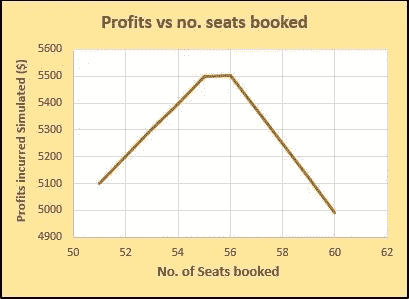
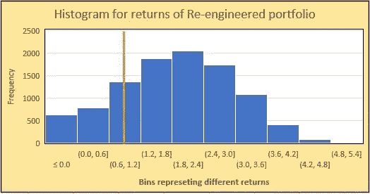
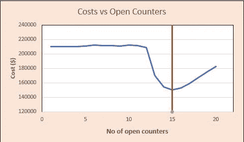

# 每个数据科学家都需要阅读这些模拟故事

> 原文：<https://towardsdatascience.com/every-data-scientist-needs-to-read-these-simulation-stories-7be0531e782f?source=collection_archive---------18----------------------->

## 使用智能模拟解决的业务用例

专注于机器学习算法以使其预测模型更好的数据科学家，经常忽视通过模拟进行随机控制的力量。凭借他们对概率和统计分布的丰富知识，模拟不再是陌生的概念，可以提供更快更直观的结果。在我的经历中，有些情况下，模拟比预测模型揭示了更多可操作的见解。我奉献这篇文章来解释一些极其常见的商业情况，以及模拟是如何成为救世主的！

> 模拟是指由已知关系定义的系统或过程的表示。

模拟，允许我们建立一个世界的数学模型，并在计算机上运行几次。这使我们能够评估各种决策，并从中做出选择。也就是做决策。这是试图用更简单的语言来描述模拟。让我们深入研究数学和代码。当谈到统计和概率时，R 当然是我的首选语言，因此我用 R 写了所有的代码来模拟不同的过程。

## 1.航空公司机票超售——明智还是不明智？

航空业巨头说，达美航空公司不断面临的问题是，订了票的顾客没有出现在航班上。为了减少损失，他们倾向于超额预订一些额外的机票。例如，飞机上有 50 个座位。平均有 10%买票的人不露面。每张票的价格是 100 美元。由于超额预订，如果最后一分钟乘客不能登机，他们将获得 250 美元的补偿。应该超订多少座位才能使预期收益最大化？
解决方案在下面注释良好的代码中。56 是预定座位的最佳数量，以最大化预期利润，如代码片段下面的图表所示。

Profits with different No. of seats booked

## 2.在两个股票投资组合中选择

有一个概念是在给定期限内重组股票投资组合。它也有年度收益(5%)和亏损上限(30%)。假设股票的年回报率服从正态分布，均值= 3%，标准差= 5%。如果你可以选择投资另一项 10 年期传统固定 1%年回报存款，你会选择哪一项？
解决方案在下面的代码中。如图所示，几乎 77%的重组投资组合的回报率超过 1%。因此，这是一个更好的选择。

## 3.33 扇门。一辆车。许多山羊。留下或交换。你还记得那个游戏节目吗！！

在一个有 33 扇门的游戏节目中，一扇门后有一辆车，另一扇门后有一只山羊。你选了一扇门，主人为你打开了另一扇有山羊的门。你会换门还是留在你选择的门上？

## 4.像黑色星期五这样的促销活动，开放收银台的最佳数量是多少？

一年中最关键的购物日，大型零售商(如沃尔玛)必须在顾客等待时间和成本之间取得平衡。很少，他们的目的是试验不同的排队系统，以更好地了解他们的客户。比方说，总共有 20 个计数器。每个营业柜台的运营成本为 20 美元，等待超过 10 分钟的顾客会被“惹恼”,每位顾客将被罚款 1 美元。假设每个柜台都有自己的队列，到达的顾客随机加入一个队列，保持开放的最佳结账柜台数量是多少？
注:基于排队系统理论，顾客到达间隔时间和服务时间假设为无记忆分布。[伽玛](https://en.wikipedia.org/wiki/Gamma_distribution)分布最适合它。下面是解决问题的模拟代码。正如我们所见，在这种情况下，15 个开放式收银台的成本最低。

## 致读者…

上面列出的业务用例是非常标准的，不需要在您的专业领域中完全复制。尽管如此，我有信心，一些修改版本的那些实例可以遇到，现在，你知道鸭汤食谱攻击他们！！

*感谢阅读。如果你在任何其他的另类模式中使用过模拟的力量，请分享评论。*