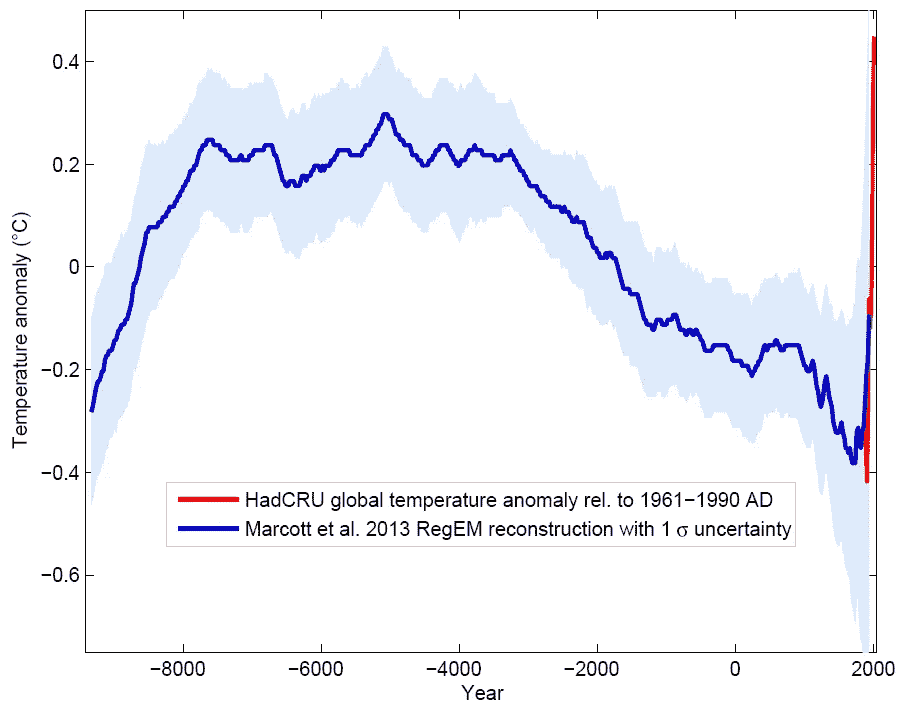
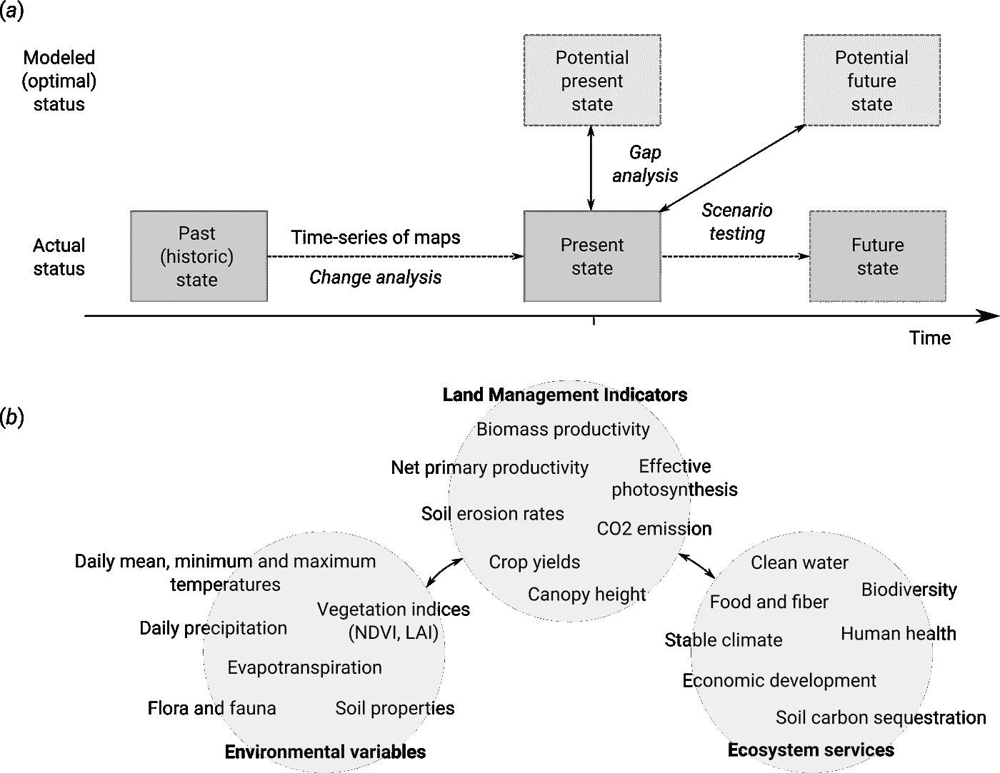
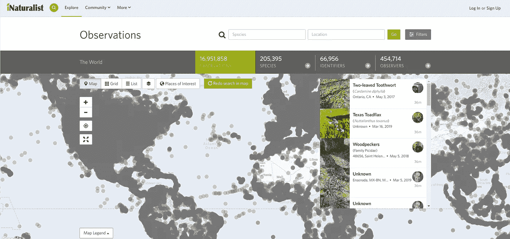
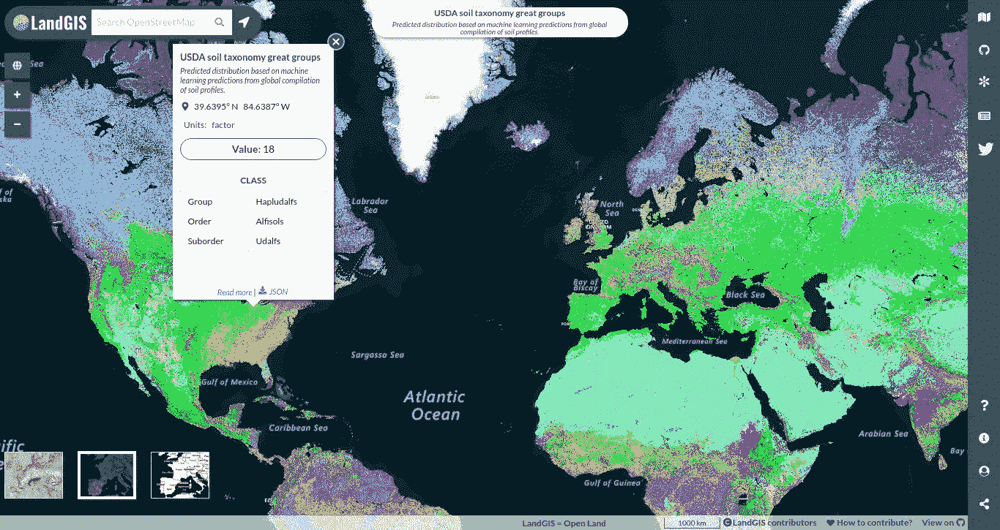
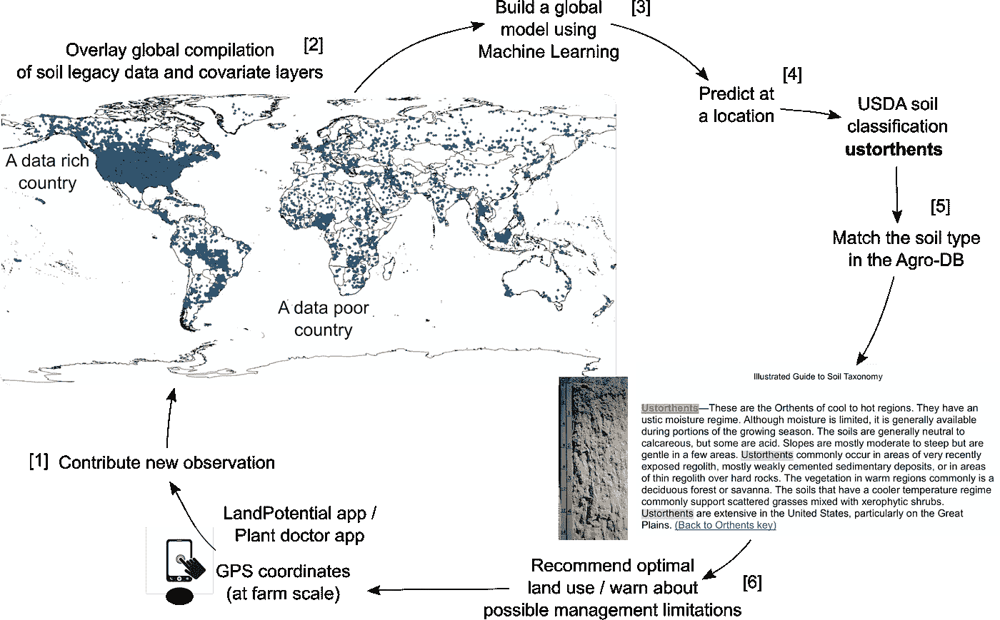

# 每个人都有权利知道地球正在发生什么:走向全球公域

> 原文：<https://towardsdatascience.com/everybody-has-a-right-to-know-whats-happening-with-the-planet-towards-a-global-commons-5a1ad4ba0bdd?source=collection_archive---------9----------------------->

## 遥感、传统实地观测、数据科学和可重复研究对监测环境的关键作用

*合著:* [*汤姆·柯林斯*](https://www.linkedin.com/in/tomncollins/)*[*伊赫萨尼·惠勒*](https://www.linkedin.com/in/ichsani-wheeler-46913621/)*[*罗伯特·麦克米伦*](https://www.linkedin.com/in/r-a-bob-macmillan-29a80b87/)**

**自 2004 年以来， [OpenStreetMap](http://openstreetmap.org) 一直是构建世界开放地图的主要平台。最近，通过分布式工作和共同所有权建立地理信息的概念已经产生了几个鼓舞人心的企业；比如——街头级影像平台。然而，目前 OpenStreetMap 和 mapi pile 都只关注城市和城市地区。地球的其他地方呢？制作公开的全球环境变量地图怎么样，比如土地覆盖、土地使用、气候、土壤、植被和生物多样性？一些盈利和非盈利组织已经开始这样做了，提供了绘制世界土地利用(【https://osmlanduse.org】T4)、土地覆盖([https://geo-wiki.org](https://geo-wiki.org/))、生物多样性([https://gbif.org](https://gbif.org))、森林动态([https://globalforestwatch.org](https://www.globalforestwatch.org/))、天气([https://openweathermap.org](https://openweathermap.org))和地形([https://opentopography.org](https://opentopography.org/))等平台。这些开放的数据源很棒，但是很分散。如果*将*组合成一个*完整*和*一致的“开放地图”*式的世界环境系统，这样的信息会更加有效。如果实现的话，这样一个系统可以成为任何人都可以像维基百科一样自信地跟踪我们环境的现状和变化的地方。为了促成这一想法，OpenGeoHub 基金会最近推出了一款网络地图应用和一项名为[“land GIS”](http://opengeohub.org/about-landgis)的数据服务。**

# **了解我们环境历史的重要性**

**如果我们不知道昨天发生了什么，我们怎么能判断今天呢？任何人要想了解生态系统服务及其对环境的价值，首先必须了解过去的环境状况。过去选定的某个点(在环境科学中通常称为*“基线”*)是最终的参考点，使我们能够量化环境退化/恢复的规模以及所涉及的潜在成本/收益。跟踪环境历史的一个典型的、被广泛认可的例子是全球年地表温度的变化状况(见图 1)。**

****

**Fig 1: Global temperature reconstruction from proxy data of [Marcott et al (2013)](https://dx.doi.org/10.1126/science.1228026). This example indicates two major patterns: 1) mean annual temperature of the planet fluctuates systematically due to glacial and interglacial periods, and 2) the rate of increase of mean annual temperature due to human-induced CO2 emission (last 100 years) is unprecedented. [Graph by: Klaus Bitterman](http://www.realclimate.org/index.php/archives/2013/09/paleoclimate-the-end-of-the-holocene/).**

**如果我们关注上图中过去的几百年，我们会注意到地球可能一直在变冷而不是变暖。全球年气温的预期(*【自然】*)趋势与*【人为引起】*趋势有明显差异。在这种情况下，它是全球变暖效应，我们现在知道这主要是由于化石二氧化碳排放(化石燃料工业，交通，农业)。 [Ricke 等人(2018)](https://doi.org/10.1038/s41558-018-0282-y) 估计，每增加一吨化石碳排放的社会成本(*“每增加一吨二氧化碳排放所导致的与气候损害相关的全部经济成本”*)平均为每排放一吨二氧化碳当量 417 美元。我们仍然在 2017 年人均排放了约 4.9 tCO2(美国为 15.7 tCO23.8 其他 G20 国家的 tCO2 根据 [Olivier 和 Peters，(2018)](https://www.pbl.nl/en/publications/trends-in-global-co2-and-total-greenhouse-gas-emissions-2018-report) ，这意味着 2017 年二氧化碳排放的总社会成本约为 15.4 万亿美元！即使把 [Ricke et al. (2018)](https://doi.org/10.1038/s41558-018-0282-y) 估算的数字换成美国环保局使用的[保守数字](https://www.edf.org/true-cost-carbon-pollution)(40 美元)，我们也可以看到，CO2 排放具有严重的经济后果。因此，环境管理和计算环境破坏的社会成本很可能成为一项主要的经济活动(也就是说，如果我们的全球文明所运行的当前经济体系要生存下去的话)。**

**前面的例子说明了地表温度等物理变量如何与二氧化碳排放量的测量值相关联，然后可以根据经济成本对二氧化碳排放量进行评估。但是我们的星球有着多种多样的景观、气候带和地质材料，并且地球的这些不同部分对全球事件和过程有着不同的反应。为了更好地展示这些过程的地理分布，科学家们以不同的空间分辨率绘制了全球地图。使用这些图意味着我们不仅知道每个物理变量的平均变化的单个值，而且还知道变化最显著的地方的 T2，并且通常还知道是什么在驱动 T5(图 2a)。此外，在记录和量化全球环境动态时，科学家记录了科学上认可的特定严格变量的动态，我们可以将其称为**土地管理指标**(图 2b)。**

****

***Fig. 2: Difference between the historic, actual and potential values of land management indicators (a), and examples of some common environmental variables and land management indicators (b) of importance for monitoring the status of the Earth’s environment.***

**在这里，并不是所有的土地管理指标都同样重要。一些变量是人类生活质量的直接指标，当用于预测潜在的未来自然灾害、生态系统服务的收益或损失等时，其价值可达数十亿甚至数万亿美元(见前面的二氧化碳排放例子)。例如,《联合国防治荒漠化公约》(《荒漠化公约》)选择了以下三个土地退化关键指标:**

1.  **土地覆被分类，**
2.  **土地生产力，**
3.  **生物量中的地上和地下碳，**

**保持这三项中的每一项不变，或者至少不显著恶化，是朝着**土地退化中立迈出的一步。****

****谈到土地管理指标，现在越来越重要的是能够*【绘制过去】**【预测未来】*，即制作不同时期的土地管理指标图，同时保持相同的空间参考。记录过去 10，000 年土地利用变化的完整全球数据集的一个例子是 [**海德数据集**](https://themasites.pbl.nl/tridion/en/themasites/hyde/) ( [Klein Goldewijk 等人，2011 年](https://dx.doi.org/10.1111/j.1466-8238.2010.00587.x))，该数据集包括 10 种主要土地利用类型、人口密度和城市及农村地区覆盖率的时间序列图像，由荷兰环境署(PBL)制作和分发。人们可以很快观察到，大多数这样的历史时间序列图都有同样的问题，那就是它们对于在更远的过去发生的事件和条件的确定性相对较低。由于这个原因，海德只能在 10 公里的相对粗糙的空间分辨率下使用，随着我们回到前工业时代，空间模式的可靠性急剧下降。2019 年，我们可以以精细的空间分辨率绘制几乎所有世界森林和树冠高度的地图。但是 100 年前的森林所在的位置(更不用说 2000 年前了)就很难重建了。****

****地图的空间分辨率往往定义了一个系统的大部分技术规格和地图的可用性( [Hengl 和 MacMillan，2019](https://envirometrix.github.io/PredictiveSoilMapping/) )。从管理的角度来看，地球的陆地可以划分为离散的空间单元或像素，理想情况下对应于地球表面的等面积块。例如， [**What3Words**](https://what3words.com) 公司(图 3)为每个 3⨉3m 像素分配了三个常用词的唯一组合(总土地面积估计为 [148，939，063 平方公里](https://en.wikipedia.org/wiki/Land)，超过了 1.65⨉10^13 的唯一像素！).通过使用 with 单词，你可以与 3⨉3m 空间街区内的其他人联系。我们现在还可以将所有关键土地管理指标的值附加到每个独特的像素上，然后跟踪它们随时间的变化。这种精细的土地管理应用于农业用地时，被称为**“精准农业】**。正如我们将在后面的章节中看到的，在 2019 年以 1-5 米的分辨率绘制地球陆地地图当然是可行的，但也将需要大规模的计算基础设施。****

********

*****Fig. 3:* [*What3words map browser*](https://what3words.com) *screenshot showing pixelation/discretization of the Earth’s surface.*****

****迄今为止，我们认为需要监测的最重要的全球土地变量类型是土地覆盖、土地使用、温度、降水、蒸汽压力不足、空气传播的微粒、火灾、地上和地下生物量、气体排放、有效光合作用、动植物种类及其特征、土壤水和土壤宏观和微观动植物。这些变量类型的变化可进一步解释为得出土地管理指标，然后可用于跟踪业绩和估计潜在的财务损失或收益。通过长时间监测这些指标，并对其精确的空间分布进行建模，我们可以评估环境的各种潜在状态，预测未来状态，并使用这些信息不断改善和优化土地管理。****

# ****天空中的眼睛****

****如同在许多科学领域一样，减少量化土地退化方面的政治偏见或争议的一个方法是依靠强大的技术和客观的测量。自 20 世纪 60 年代以来，很明显，跟踪全球植被状况的最有效方法是使用基于卫星的遥感系统(RS)作为连续地球观测(EO)的基础。从 2008 年开始， [NASA 和 USGS](https://www.usgs.gov/center-news/free-open-landsat-data-unleashed-power-remote-sensing-a-decade-ago) 制作了所有的 **Landsat** 影像，免费开放象征性地开启了遥感数据的新时代[朱等 2019](https://doi.org/10.1016/j.rse.2019.02.016) 。事实证明，国家机构开放遥感数据也能产生经济效益。[朱等人(2019)](https://doi.org/10.1016/j.rse.2019.02.016) 估计，仅美国用户 2011 年的生产率节约就达 17 亿美元，国际用户增加 4 亿美元，这几乎足以支付整个项目的历史费用(仅从 2011 年的利润中计算)！支持改进资源管理的应用将不可避免地导致 EO 应用呈指数级增长，这些趋势将在未来几十年保持积极([欧玛，2016](https://doi.org/10.1016/j.asr.2015.10.038))；[郭氏，2018](https://doi.org/10.1038/d41586-018-03924-9) )。开放 EO 数据对于自然保护和土地恢复项目尤为重要( [Turner 等人，2014 年](https://doi.org/10.1016/j.biocon.2014.11.048)；[吉布斯&三文鱼，2015](https://doi.org/10.1016/j.apgeog.2014.11.024) 。近 20 年来，NASA 和 USGS 一直在维护和共享从他们的 **MODIS** 图像中获得的[土地产品的时间序列；](https://lpdaac.usgs.gov/dataset_discovery/modis/modis_products_table) [**哥白尼全球地勤**](https://land.copernicus.eu/global/)(CGLS；由 [VITO NV](https://remotesensing.vito.be/) 主持)提供了类似的土地管理指标列表，包括植被指数、吸收的光合有效辐射(FAPAR)和干物质生产率。在最近发射了欧盟资助的**哥白尼哨兵**和日本宇宙航空研究开发机构(JAXA)的先进陆地观测卫星 **ALOS** 之后，基于 EO 的环境监测项目蓬勃发展。除了多光谱图像，德国航空航天中心(DLR) **TANDEM-x** 项目现在已经产生了可能是最精确的全球地表模型(包括全球森林冠层高度地图)，空间分辨率为 12 米，垂直精度前所未有( [Martone et al. 2018](https://doi.org/10.1016/j.rse.2017.12.002) )。该数据集的 100 m 分辨率版本最近已免费发布，供研究和教育使用。德国航天中心的下一代地形/高程测绘将专注于更精细的分辨率(5 米)和更快的重访时间(< 1 个月)，以便我们能够越来越多地跟踪地表高程或体积位移的所有细微变化。以下三个趋势现在普遍适用于所有 EO 项目([欧玛，2016](https://doi.org/10.1016/j.asr.2015.10.038)；[赫罗德等人 2016](http://dx.doi.org/10.3390/rs8121036) ):****

1.  ****空间分辨率不断提高，重访时间越来越快。****
2.  ****降低单位面积的收购、储存和加工成本。****
3.  ****更先进的技术允许穿透云层和植被(主动传感器)并提高检测材料和组织的准确性。****

****现在越来越难以掩盖糟糕的土地管理或空气或水污染。公开(或廉价)获得的图像的空间分辨率现在正朝着亚米级精度快速发展。在 2019 年 [**行星实验室**](https://www.planet.com) 已经创建了一个图像融合系统，支持在 [3 m 空间分辨率](https://www.planet.com/markets/monitoring-for-precision-agriculture/) ( [Houborg 和 McCabe，2018](https://doi.org/10.3390/rs10060890) )下推导每日归一化差异植被指数(NDVI)和叶面积指数(LAI)。同样，one sol 公司已经从 Sentinel-2 和 LandSat7/8 图像中自动提取了农场边界和作物状态(目前仅在欧洲和美国),因此，即使是较小规模的农场及其植被指数也可以逐块进行跟踪。这些系统正从只有原始图像转变为按土地管理单位(如田地)对土地管理指标进行预处理的估计。我们预计，在未来几年，掩盖任何森林砍伐(甚至是一些树木的损失)将变得越来越困难？)、生物量损失(Landsat 7/8 和 Sentinel 2)、土壤损失、二氧化碳排放(Sentinel 5)，甚至是地球上任何地方的[更小规模的废物堆](https://www.newscientist.com/article/2198898-ai-could-monitor-farms-from-space-to-look-for-illegal-pollution/)(行星实验室)。我们认为这些都是好的趋势，也认为这种意识跨越国界无缝延续是好的，也就是说，它使我们有能力不分国界地识别糟糕的土地管理者或环境污染者。人们有权了解过去、现在和未来全球土地的状况。这种全球环境意识很可能是全球化最积极的方面之一。****

# ****可重复的研究是建立对地图信任的基础****

****在前面的章节中，我们讨论了遥感影像如何直接和客观地测量环境状况，它现在如何变得越来越容易获取，以及因此遥感数据的应用数量和整体市场如何可能呈指数增长。但大多数国家和企业都没有能力处理如此庞大的数据量，更不用说利用它们将传递的新型信息了。例如，要归档所有 LandSat 场景，你需要数 Pb 的存储空间，更不用说处理这些数据的大型基础设施了。举例来说，行星实验室声称每天获得 50 万亿像素的新数据。为了应对如此大规模的数据挑战，谷歌开发了一种云解决方案，用于处理美国宇航局、欧空局和 JAXA 的所有图像以及所有其他公开可用的图像: [**谷歌地球引擎**](https://earthengine.google.com) (GEE) ( [戈雷利等人 2017 年](https://doi.org/10.1016/j.rse.2017.06.031))。几个研究小组已经使用 GEE 基础设施推导出全球森林砍伐/森林覆盖变化地图( [Hansen 等人，2013](https://dx.doi.org/10.1126/science.1244693) )、地表水动力学( [Pekel 等人，2016](https://doi.org/10.1038/nature20584) )、土地覆盖( [Song 等人，2018](https://doi.org/10.1038/s41586-018-0411-9) )和[农田分布](https://croplands.org) ( [Xiong 等人，2017](https://doi.org/10.1016/j.isprsjprs.2017.01.019) )，仅举几个最著名的例子。最近在遥感杂志上关于 GEE 的特刊[列出了更多 GEE 的应用。](https://www.mdpi.com/journal/remotesensing/special_issues/GEE)****

****GEE 真的让本科生能够在没有任何研究预算的情况下以 30 米的分辨率绘制世界地图。GEE 是否应该成为获取、存储和分发土地管理指标的通用解决方案？听起来是个完美的选择。拥有同一原始遥感数据的多个副本肯定会效率低下。谷歌还考虑周到地支付处理成本，这(相对而言)考虑到他们的基础设施规模可能很小。但是 GEE 是有代价的。首先，向 GEE 上传和下载较大的数据集包括一个期望，即用户将需要增加他们的 Google Drive 或 Google 云存储的容量。第二个更严重的限制是[谷歌的使用条款](https://earthengine.google.com/terms/)指出:****

> ****5.服务的贬值。Google 可以在任何时候因任何原因停止任何服务或任何部分或功能，而不对客户承担任何责任。****

****换句话说，像谷歌这样的公司可以在任何时候停止 GEE，并且在法律上不承担任何后果，因为这些是所有 GEE 用户在开始服务时已经接受的使用条款。另一个问题是:我们能信任谷歌吗？如果谷歌开发人员在他们的代码中犯了一个错误怎么办？虽然 GEE 中使用的许多算法都是基于开源软件的，但是理解在生成地球图像之前 Google 服务器上发生的事情并不容易。一个由欧盟资助的项目 [**OpenEO**](https://openeo.org) (开放地球观测)现在着眼于确保 ***【跨云后端再现性】*** 。它开发了一种语言(API)，可以用来向不同的云后端提出问题，包括 GEE。通过这种方式，它旨在使比较和验证他们的结果变得相对简单，但也找到例如进行特定类型计算的最便宜的选项。 [**O2R 项目**](https://o2r.info) 有许多关于如何备份和共享代码和数据以及以相对较低的成本实现计算再现性的实用技巧。****

****EO 是客观监测土地动态的基础，但并不是所有的土地管理指标都可以单独使用遥感技术直接制图。一些土地管理指标需要通过在点位置插入取样(即观察/测量)值或使用预测制图方法来估算。有些变量更复杂，不能仅使用光谱反射率来绘制。例如，还没有 EO 系统可以用来直接估算土壤有机碳(SOC)密度。这样做的技术尚不存在，因此，我们需要使用点样本和预测映射来尝试估计每个像素的 SOC。幸运的是，现在有越来越多的带有环境变量的点数据通过开放数据许可和国际倡议跨境提供。已建立的野外观测汇编包括: [**全球生物多样性信息设施**](https://www.gbif.org) 观测、 [**全球历史气候网**](https://www.ncdc.noaa.gov/data-access/land-based-station-data/land-based-datasets/global-historical-climatology-network-ghcn) 站数据、 [**WoSIS 土壤剖面数据库**](https://www.isric.org/explore/wosis) 【点】、 [**sPlot 全球植物数据库**](https://www.idiv.de/sdiv/working_groups/wg_pool/splot/) 、 [**鸟类**](https://www.birdlife.org) ，仅举几个最广为人知的例子。如今，越来越多的点数据测量和观测也是通过公民科学和众包项目贡献的，如[**in naturalist**](https://www.inaturalist.org)(图 4)[**Geo-wiki**](https://www.geo-wiki.org)、 [**公民气象观测计划**](http://www.wxqa.com) 和类似项目( [Irwin，2018](https://doi.org/10.1038/d41586-018-07106-5) )。甚至商业公司现在也开放共享他们的专有数据，并将其用于全球数据挖掘项目(当然前提是他们的用户同意)。例如，温度、压力、噪音水平等的连续测量。来自 [**Netatmo**](https://www.netatmo.com) 气象站(估计全球售出超过 15 万台设备)。许多用户也乐于分享他们手机设备上的天气测量数据。Plantix app 目前正在制作一个植物病害和生长异常照片的全球数据库。我们在此仅提及几个主要的全球或大陆数据存储库和计划。当然，还有更多的本地语言版本的存储库。****

****随着地面观测和测量的全球汇编变得更大和更一致，越来越需要从中提取增值的全球地图。现在，人们越来越有兴趣使用亿亿级高性能计算来处理新兴的新型原位观测网络，以提高高分辨率天气预报、农业管理和地球系统建模的质量和成本效益。未来几年一个特别令人兴奋的发展可能是一种混合的基于过程的建模+机器学习方法，它结合了最好的数据和我们最好的地球物理/地球化学知识([赖希斯坦等人 2019](https://doi.org/10.1038/s41586-019-0912-1) )。****

********

*****Fig. 4: iNaturalist.org: a Citizen Science system. Screenshot showing geographical density and type of data (usually field photographs with description and interpretation of species names etc) contributed.*****

****总而言之，建立数据信任的最有希望的途径似乎是实现计算的可再现性(记录所有处理步骤，并提供再现完全相同的结果所需的所有相关元数据)。现在有越来越多的健壮的方法来实现可重复性，即使对于计算量相对较大的项目也是如此。由于与新的地球观测卫星发射相关的免费遥感数据的提供越来越多，似乎主流数据分析将从本地网络转移到(虚拟)云和**大地球数据立方体**，即通过基于网络的工作流进行数据分析( [Sudmanns et al. 2019](https://doi.org/10.1080/17538947.2019.1585976) )。在这种情况下，地球观测站仍将是一个有价值的(希望)越来越值得信赖的地方，用来处理全球公共遥感数据，并制作新的有价值的环境状况地图。但社会也需要更开放的非营利基础设施，如 OpenStreetMap，以确保长寿。无论如何，全球实地观测资料库、公民科学和机器学习将在生成更全面的土地管理指标的更可靠地图方面发挥越来越大的作用。****

# ****OpenLandMap.org:我们对全球土地共享的贡献****

****我们(OpenGeoHub 基金会)最近开始提供托管和数据科学服务，通过一个我们称为“土地地理信息系统”的系统，帮助制作和共享关于多种环境措施的实际和潜在状态的最新、完整记录(可能达到完全可再现的水平)的数据集，该系统可通过[https://openlandmap.org](https://landgis.opengeohub.org)获得(图 5)。最初， [LandGIS](http://opengeohub.org/about-landgis) 通过一个允许交互式查询和叠加的简单网络制图界面，提供关于[土壤特性/类别](https://doi.org/10.5281/zenodo.1476844)、[地形](https://doi.org/10.5281/zenodo.1447209)、地质、[土地覆盖/使用/退化](https://doi.org/10.5281/zenodo.1475449)、[气候](https://doi.org/10.5281/zenodo.1420114)、当前和[潜在植被](https://peerj.com/articles/5457/)的新数据和现有数据。这是一个真正的开放土地数据和服务系统，任何人都可以贡献和共享全球地图，并使成千上万的研究人员和企业能够访问它们。****

****LandGIS in action: a 6-minutes video tutorial on how to access, use and download data.****

****土地地理信息系统基于以下六个主要支柱:****

1.  ****开放数据许可证([开放数据共享开放数据库许可证](https://opendatacommons.org/licenses/odbl/)和/或[知识共享署名共享](https://creativecommons.org/licenses/by-sa/4.0/legalcode))将数据副本放在[zenodo.org](https://zenodo.org/search?page=1&size=20&q=LandGIS)，****
2.  ****通过 [github 库](https://github.com/Envirometrix/LandGISmaps)可获得大部分代码的完整记录的、可复制的程序，****
3.  ****基于使用开源软件实现的最新总体机器学习技术的预测，****
4.  ****基于使用[开放地理空间联盟](http://www.opengeospatial.org/) (OGC)标准的数据分发:GDAL、WMS、WCS 等。****
5.  ****针对高流量使用优化的网络服务的多样性(云优化的地理 IFFs)，****
6.  ****管理、开放的用户和开发人员社区。****

****我们为我们自己的数据挖掘和空间预测过程的 LandGIS 结果做出了贡献，包括潜在自然植被的制图(例如 [Hengl 等人 2018](https://doi.org/10.7717/peerj.5457) )和土壤属性和类别的 3D 制图。但是，我们也托管其他人提供的地图，特别是如果数据已经过同行审查并有完整记录的话。****

********

*****Fig. 5: LandGIS interface showing predicted global distribution of USDA great groups (soil types) based on a global compilation of soil profiles. Data available for download at doi:* [*10.5281/zenodo.1476844*](https://doi.org/10.5281/zenodo.1476844)*.*****

****为了说明我们产生有用信息以改善全球土地管理的一般方法，考虑土壤类型制图的例子。美国农业部和美国地质勘探局已经投入了数十年，甚至可能是数十亿美元，主要通过土壤分类系统 [*【美国农业部土壤分类学】*](https://en.wikipedia.org/wiki/USDA_soil_taxonomy) 来收集土壤数据，并生成和维护关于土壤的知识。经过几十年的实地工作和对数千份土壤样本的实验室分析，美国农业部和美国地质调查局产生了一个包含超过 350，000 份土壤类型实地观察结果的[储存库](https://ncsslabdatamart.sc.egov.usda.gov/)(在这种情况下，我们重点关注[土壤大类群](https://www.nrcs.usda.gov/wps/portal/nrcs/detail/soils/edu/?cid=nrcs142p2_054278))。我们将这些点数据与其他国家和国际汇编相结合，产生了世界上最一致和最完整的美国农业部土壤大群体训练数据集。然后，我们将这些点覆盖在代表土壤形成因素的约 300 个全球协变量层上，然后使用随机森林拟合空间预测模型( [Hengl 等人，2017](https://doi.org/10.1371/journal.pone.0169748) )。尽管我们在美国以外(大多数训练点位于美国)仅实现了有限的分类准确性，但拥有足够大的训练数据集使我们能够为基本上没有训练点的国家制作土壤类型的初始地图(分辨率相对较高，为 250 m )(图 6)。因为我们有完全自动化的叠加、建模和空间预测，一旦我们获得更多关于土壤类型的观测结果，我们就可以更新这些初始预测，并逐渐制作更好、更可用/有用的地图。****

********

*****Fig. 6: Example of a general workflow of how LandGIS can be used to recommend optimal soil use practices at a farm scale based on accurately predicting the soil type (in this case:* [*USDA soil great groups*](https://www.nrcs.usda.gov/wps/portal/nrcs/detail/soils/edu/?cid=nrcs142p2_054278)*). Note we run a circular process where with each new contribution (training points) we can produce increasingly more detailed / more accurate soil maps.*****

****正在开发的其他 LandGIS 功能包括:****

1.  ******多用户**:为环境活动的各种参与者提供相关和有用的功能，包括土地所有者、社区领袖、科学咨询机构、商业承包商、捐助者和投资者。****
2.  ******多模块**:整合环境管理中的各种活动，包括项目发现、农场尽职调查、筹资、实施、自动土地管理 KPI(关键绩效指标)跟踪。****
3.  ******与企业 IT** 和社交媒体的集成:实现增强的安全性、数据保护和互操作性特性。****
4.  ******基于上下文的定制**和丰富:空间自动填充的用户数据(节省手动设置工作)、基于对等活动的功能、针对特定条件的基于位置的警报(例如霜冻警告、温度阈值等)。****
5.  ****集成**“区块链”功能，支持环境令牌交易**。****

****因此，总的来说，仍然需要一个 OpenStreetMap 类型的系统，以允许存档和共享环境变量和土地管理指标。有了 [LandGIS](https://landgis.opengeohub.org) 和 OpenLandMap.org，我们已经证明了使用*“旧的遗留数据”*可以立即产生新的、增值的信息。我们展示了技术和知识转移的机会(从数据丰富的国家到数据贫乏的国家)，我们认为这是一个双赢的局面。我们将用于生成 LandGIS 图层的所有代码作为开源代码发布，允许任何人完全复制最先进的空间分析，包括作为商业服务的基础。我们已经将所有数据作为开放数据发布，允许任何人，包括企业，在这些土壤和其他环境数据的基础上进行构建——希望以我们甚至无法想象的方式。****

*****请引用为:*****

> ****托米斯拉夫·亨格尔，汤姆·柯林斯，伊奇萨尼·惠勒，罗伯特·麦克米伦。(2019 年 3 月 27 日)。每个人都有权利知道地球正在发生什么:走向全球公域。中等(走向数据科学)，[http://doi.org/10.5281/zenodo.2611127](http://doi.org/10.5281/zenodo.2611127)****

# ****参考资料:****

1.  ****吉布斯，H. K .，&萨蒙，J. M. (2015)。绘制世界退化土地图。应用地理，57，12–21。[https://doi.org/10.1016/j.apgeog.2014.11.024](https://doi.org/10.1016/j.apgeog.2014.11.024)****
2.  ****Gorelick，m . Han cher，m . Dixon，m . Ilyushchenko，s .，Thau，d .，& Moore，R. (2017)。谷歌地球引擎:面向所有人的全球地理空间分析。环境遥感，202，18–27。[https://doi.org/10.1016/j.rse.2017.06.031](https://doi.org/10.1016/j.rse.2017.06.031)****
3.  ****Hansen，M. C .、Potapov，P. V .、Moore，r .、Hancher，m .、Turubanova，S. A. A .、Tyukavina，a .、… & Kommareddy，A. (2013 年)。21 世纪森林覆盖变化的高分辨率全球地图。科学，342(6160)，850–853。[https://dx.doi.org/10.1126/science.1244693](https://dx.doi.org/10.1126/science.1244693)****
4.  ****Hengl、de Jesus、J. M .、Heuvelink、G. B .、Gonzalez、M. R .、Kilibarda、m .、Blagoti、a .、…、Guevara、M. A. (2017 年)。SoilGrids250m:基于机器学习的全球网格土壤信息。PLoS one，12(2)，e0169748。【https://doi.org/10.1371/journal.pone.0169748 号****
5.  ****Hengl，Walsh，M. G .，Sanderman，j .，Wheeler，I .，Harrison，S. P .，& Prentice，I. C. (2018)。潜在自然植被的全球制图:对估计土地潜力的机器学习算法的评估。PeerJ，6，e5457。【https://doi.org/10.7717/peerj.5457 ****
6.  ****t .亨格尔，麦克米伦，r . a .(2019 年)。荷兰瓦赫宁根 R. OpenGeoHub 基金会预测土壤制图，370 页[，](http://www.soilmapper.org,)ISBN:978–0–359–30635–0。[http://soilmapper.org](http://soilmapper.org)****
7.  ****Herold，m .，See，l .，Tsendbazar，n .，& Fritz，S. (2016 年)。走向一体化的全球土地覆盖监测和绘图系统。遥感，8(12)。[http://dx.doi.org/10.3390/rs8121036](http://dx.doi.org/10.3390/rs8121036)****
8.  ****Houborg 和 m . McCabe(2018 年)。通过 CubeSat，Landsat 和 MODIS 数据的融合在 3 m 分辨率下每日反演 NDVI 和 LAI。遥感，10(6)，890。[https://doi.org/10.3390/rs10060890](https://doi.org/10.3390/rs10060890)****
9.  ****欧文(2018)。不需要博士:公民科学如何改变研究？自然，562，480–482。[https://doi.org/10.1038/d41586-018-07106-5](https://doi.org/10.1038/d41586-018-07106-5)****
10.  ****Klein Goldewijk、A. Beusen、M. de Vos 和 G. van Drecht (2011 年)。过去 12，000 年人类引起的土地利用变化的 HYDE 3.1 空间显示数据库，全球生态学和生物地理学 20(1):73–86。[https://dx.doi.org/10.1111/j.1466-8238.2010.00587.x](https://dx.doi.org/10.1111/j.1466-8238.2010.00587.x)****
11.  ****郭(2018 年)。生态学的遥感革命。自然 556，137。[https://doi.org/10.1038/d41586-018-03924-9](https://doi.org/10.1038/d41586-018-03924-9)****
12.  ****Marcott，S. A .，Shakun，J. D .，Clark，P. U .，& Mix，A. C. (2013)。过去 11300 年区域和全球温度的重建。科学，339(6124)，1198–1201。[https://dx.doi.org/10.1126/science.1228026](https://dx.doi.org/10.1126/science.1228026)****
13.  ****Martone，m .，Rizzoli，p .，Wecklich，c .，González，c .，Bueso-Bello，J. L .，Valdo，p .，… & Moreira，A. (2018 年)。来自串联 X 干涉 SAR 数据的全球森林/非森林地图。环境遥感，205，352–373。https://doi.org/10.1016/j.rse.2017.12.002****
14.  ****奥利维耶、j . g . j &彼得斯、J.A.H.W. (2018)。全球二氧化碳和温室气体排放总量趋势:2018 年报告。第 3125 号报告。PBL 荷兰环境评估机构，海牙。****
15.  ****纽约州欧玛市(2016 年)。用于地表成像的中高分辨率地球观测的进展:演变、未来趋势和对可持续发展的贡献。空间研究进展，57(1)，110–126。【https://doi.org/10.1016/j.asr.2015.10.038 ****
16.  ****Pekel，J. F .，Cottam，a .，Gorelick，n .，& Belward，A. S. (2016)。全球地表水及其长期变化的高分辨率制图。自然，540(7633)，418。[https://doi.org/10.1038/nature20584](https://doi.org/10.1038/nature20584)****
17.  ****赖希斯坦，m .，坎普斯-瓦尔斯，g .，史蒂文斯，b .，荣格，m .，登茨勒，j .，&卡瓦尔海斯，N. (2019)。数据驱动的地球系统科学的深度学习和过程理解。自然，566(7743)，195。[https://doi.org/10.1038/s41586-019-0912-1](https://doi.org/10.1038/s41586-019-0912-1)****
18.  ****里克，k .，德鲁埃，l .，卡尔代拉，k .，塔沃尼，M. (2018)。国家层面的碳社会成本。自然气候变化，8(10)，895。[https://doi.org/10.1038/s41558-018-0282-y](https://doi.org/10.1038/s41558-018-0282-y)****
19.  ****Song，X. P .，Hansen，M. C .，Stehman，S. V .，Potapov，P. V .，Tyukavina，a .，Vermote，E. F .，& Townshend，J. R. (2018)。1982-2016 年全球土地变化。自然，560(7720)，639。[https://doi.org/10.1038/s41586-018-0411-9](https://doi.org/10.1038/s41586-018-0411-9)****
20.  ****Sudmanns，m .，Tiede，d .，Lang，s .，Bergstedt，h .，Trost，g .，Augustin，h .，…，T. (2019)。大地球数据:地球观测数据管理和分析的颠覆性变化？。国际数字地球杂志，1–19。[https://doi.org/10.1080/17538947.2019.1585976](https://doi.org/10.1080/17538947.2019.1585976)****
21.  ****Turner，w .，Rondinini，c .，Pettorelli，n .，Mora，b .，Leidner，A. K .，Szantoi，z .，… & Koh，L. P. (2015 年)。免费和开放的卫星数据是保护生物多样性的关键。生物保护，182，173–176。[https://doi.org/10.1016/j.biocon.2014.11.048](https://doi.org/10.1016/j.biocon.2014.11.048)****
22.  ****熊，j .，Thenkabail，P. S .，Gumma，M. K .，Teluguntla，p .，Poehnelt，j .，Congalton，R. G .，… & Thau，D. (2017)。使用谷歌地球引擎云计算的非洲大陆自动农田制图。摄影测量与遥感杂志，126，225–244。https://doi.org/10.1016/j.isprsjprs.2017.01.019****
23.  ****Zhu，z .，Wulder，M. A .，Roy，D. P .，C. E .，Hansen，M. C .，Radeloff，V. C .，… & Pekel，J. F. (2019)。免费和开放的陆地卫星数据政策的好处。环境遥感，224，382–385。【https://doi.org/10.1016/j.rse.2019.02.016 ****