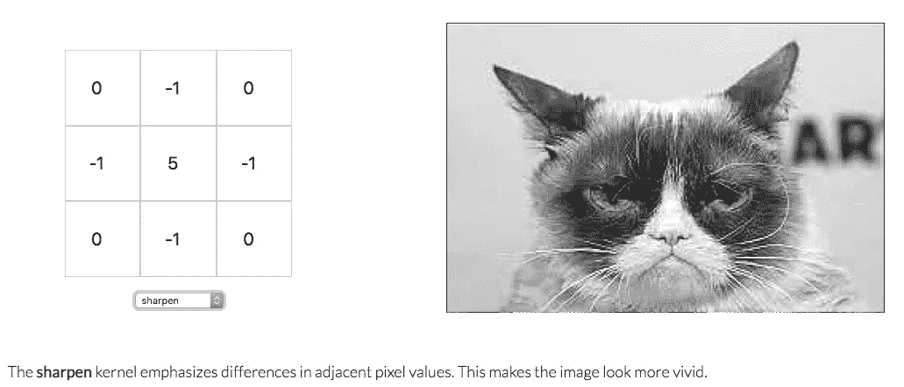
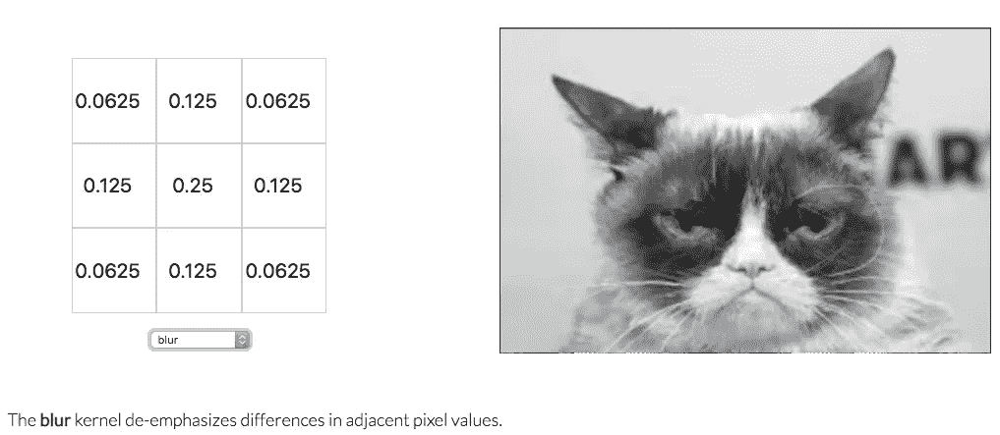
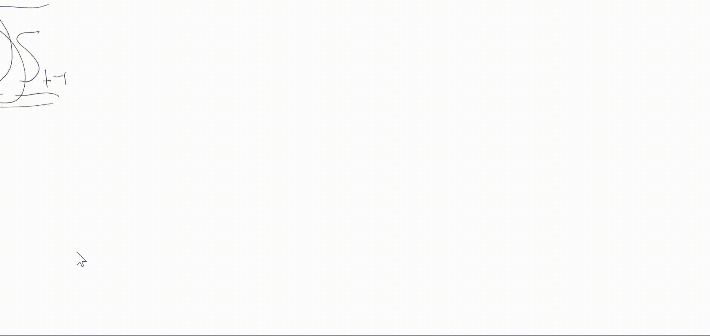
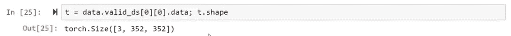
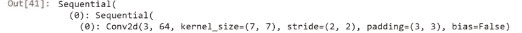
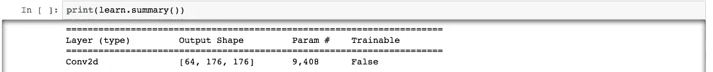

# 每个人都想成为一只猫

> 原文：<https://towardsdatascience.com/everybody-wants-to-be-a-cat-6dd6190c5d9c?source=collection_archive---------31----------------------->

## fast.ai《程序员实用深度学习》第六课

我正在学习 fast.ai 的杰瑞米·霍华德和雷切尔·托马斯的[“程序员实用深度学习”](https://course.fast.ai/)课程，并在博客上记录我的经历。由于非常慷慨的 fast.ai 社区已经为每一课做了详细的笔记(参见第六课的笔记[这里](https://github.com/hiromis/notes/blob/master/Lesson6.md))，我只是写下讲座的部分内容，并附上我需要停下来思考几次的 Jupyter 笔记本。

我需要回顾的第一个主题出现在关于数据扩充的仿射变换的讨论中。“仿射”又是什么意思？与线性有关。我咨询了谷歌，找到了很多解释，都非常清晰，但是[数学堆栈交换的这个](https://math.stackexchange.com/questions/275310/what-is-the-difference-between-linear-and-affine-function)对我来说很有用:线性函数只是缩放，但是仿射函数缩放并移位。

第六课剩下的大部分时间，我都在理解卷积。杰里米说，文件中的所有图片都是关于猫的，因为[西尔万·古格](https://twitter.com/GuggerSylvain)喜欢猫，而且他写了大部分文件(尽管[西尔万说](https://forums.fast.ai/t/lesson-6-in-class-discussion/31440/129?u=go_go_gadget)他不喜欢猫，事实上，只是把它们放在文件中以吸引人们阅读文件，这很有趣)。

因此，让我们探索回旋，并保持与暴躁猫(RIP)猫的主题。

Jeremy 使用 Bret Victor 的[图像内核动画](http://setosa.io/ev/image-kernels/)来说明卷积运算是如何工作的。给定一个矩阵，其元素表示图像的像素，卷积采用该矩阵的一个元素，并使用如下所示的 3 x 3 矩阵(通常为正方形)对所选元素/像素周围的元素值进行逐元素矩阵乘法，该像素位于矩阵的中心。如果像素靠近图像的边缘，我们可能需要“填充”矩阵，如 Francesco Visin 的动画[所示。最后，我们将所有的乘积相加得到一个值(所以用线性代数术语来说，我们只是在做点积)。](https://github.com/vdumoulin/conv_arithmetic/blob/master/README.md)

使用下面显示的带有“锐化”内核的 Grumpy Cat 图像，我们看到内核将通过将其乘以 5 来强烈强调它“正在看”的像素(中心的像素)，同时通过将其乘以 0 或-1 来削弱其周围的像素，从而增加它们之间的对比度。

类似地，使用“模糊”内核，我们看到该内核将相关像素的值降低到 0.25，但将周围像素的值降低得更多，这降低了整体对比度。

有时候，当学习一些东西时，可能会觉得“是的，所有这些都很有道理，我完全明白了，”然后你试图解释它，并意识到你实际上对你刚才听到的几乎一无所知。停下来向别人解释你刚学到的一个概念，即使那个人是虚构的(或者一个博客；) )，是一种高效确定自己是否真正理解的方法！

这一刻对我来说是其中之一:我们正在通过一系列卷积运行张量，每个卷积都减少了高度和宽度，但增加了输出通道的数量，当我们完成时，我们得到了下图所示的张量。

[https://www.youtube.com/watch?v=U7c-nYXrKD4&feature=youtu.be&t=5630](https://www.youtube.com/watch?v=U7c-nYXrKD4&feature=youtu.be&t=5630)

512 感觉有点正常，是 2 的幂，但是为什么我们在 11 停下来，特别是对于其他两个维度？

我几乎没有写出来，因为为了弄清楚，我只是看了视频，看了几十遍笔记，最后，我觉得我没有什么要补充的。但为了理解它，我不得不按照与视频/笔记中显示的不同的顺序为自己写下它，所以这里是那篇文章，以防它对其他人有所帮助。

所以让我们后退。我们从表示图像的张量开始，该张量有 3 个通道(红色、蓝色和绿色)，高度为 352 像素，宽度为 352 像素。这是张量的形状:

我们有很多图像，这么多这样的张量，但是 PyTorch 希望我们使用每个图像的小批量，所以[正如 Jeremy 所说的](https://youtu.be/U7c-nYXrKD4?t=5538)，我们可以用特殊值`None`索引到数组中，这创建了一个新的单位轴，给我们一个形状为`[1, 3, 352, 352]`的秩为 4 的张量。这是一个小批量的 1 图像，它有 3 个通道，高 352 像素，宽 352 像素。我必须不断检查的一件事是，shape 函数在高度和宽度之前返回通道，但当我们将张量视为多维矩阵时，我们将维度列为高度 x 宽度 x 通道数。所以在矩阵术语中，上面的张量的维数是 352 x 352 x 3(记住 1 不是矩阵的维数；就是小批量的大小)。

然后我们通过一系列的激活来运行张量，从一个 2 维卷积`Conv2d`开始，使用大小为 2 的步幅。这意味着它不是“看”矩阵的每个元素，而是“看”所有其他元素，“跳过”其中的一半。这就是导致高度和宽度减半，输出通道数量翻倍的原因。

因此，当我们通过第一个卷积层运行张量时，我们获得一个 352 x 352 x 3 的维度矩阵，并通过 64 个步长为 2 的卷积(或内核)运行它，我们得到一个(352 / 2) x (352 / 2) x 64 的维度矩阵；也就是说，它是 176 x 176 x 64，或者用 PyTorch 形状来表示，如下所示:

然后，我们运行张量通过两个以上的层:`BatchNorm2d`和`ReLU`，它们不会改变形状，然后池层`MaxPool2d`，它会改变形状为 88 x 88 x 64。我发现杰森·布朗利的[对卷积神经网络池层的温和介绍](https://machinelearningmastery.com/pooling-layers-for-convolutional-neural-networks/)对理解池层如何工作非常有帮助。

我们不断地对这些层进行多次检查，时不时地，我们将高度和宽度各除以 2，并将内核的数量加倍。因此，在某一点上，我们有 44 x 44 x 256，然后是 22 x 22 x 512，最后是我们想知道的 11 x 11 x 512 矩阵。

所以我认为我们在高度和宽度上停留在 11，仅仅是因为 11 是一个奇数！如果我们将 11 除以 2，我们会得到 5.5，这对于矩阵来说不是一个合适的维数。感觉上我花在追逐张量上的时间和答案的简单性不成比例。尽管如此，我对立体体操的理解肯定比以前好得多，所以我想这很了不起！

在 GitHub 上的 [pets 笔记本](https://github.com/LauraLangdon/pets)中查看完整代码，下周第 7 课再见！

关于此主题的其他帖子:

第一课:[fast . ai 入门](/getting-started-with-fast-ai-350914ee65d2)

第 2 课:[对妊娠试验结果进行分类](/classifying-pregnancy-test-results-99adda4bca4c)

第二课(续):[深度学习能比鸽子表现更好吗？](/can-deep-learning-perform-better-than-pigeons-d37ef1581a2f)

第三课:[一万种行不通的方法](/10-000-ways-that-wont-work-311925525cf0)

第四课:[预测服务员的小费](/predicting-a-waiters-tips-1990342a0d02)

第五课:[但是泡菜去哪里了？](/but-where-does-the-pickle-go-53619676bf5f)

我是加州大学东湾分校的数学讲师，也是一名有抱负的数据科学家。在 [LinkedIn](https://linkedin.com/in/laura-langdon/) 上和我联系，或者在 [Twitter](https://twitter.com/laura_e_langdon) 上和我打招呼。