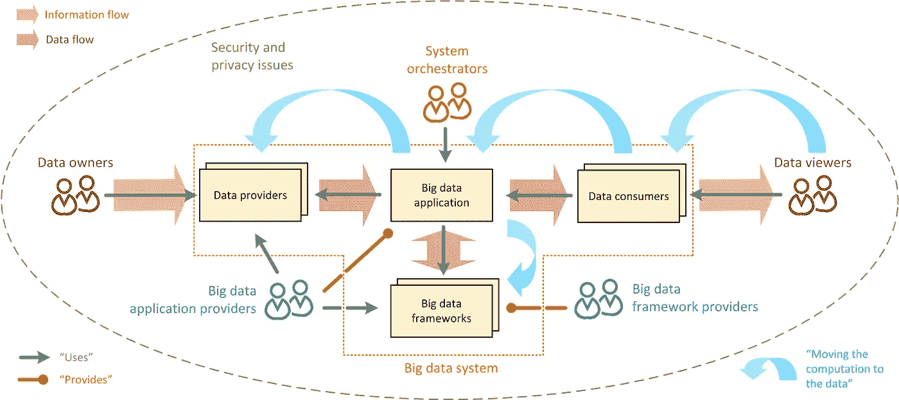
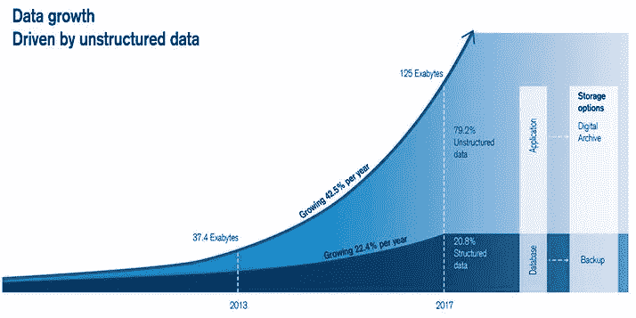
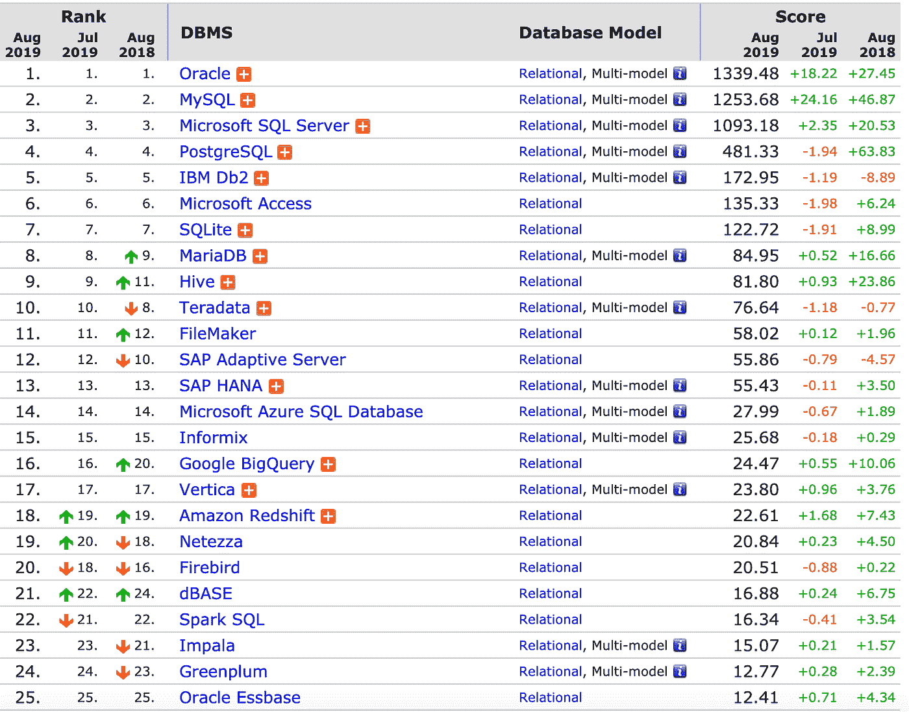
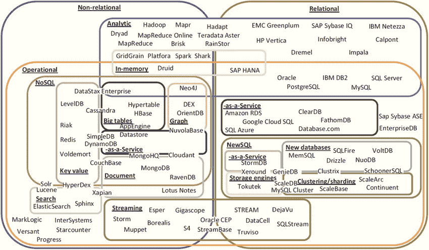
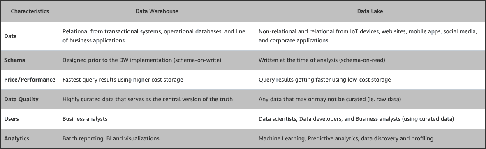
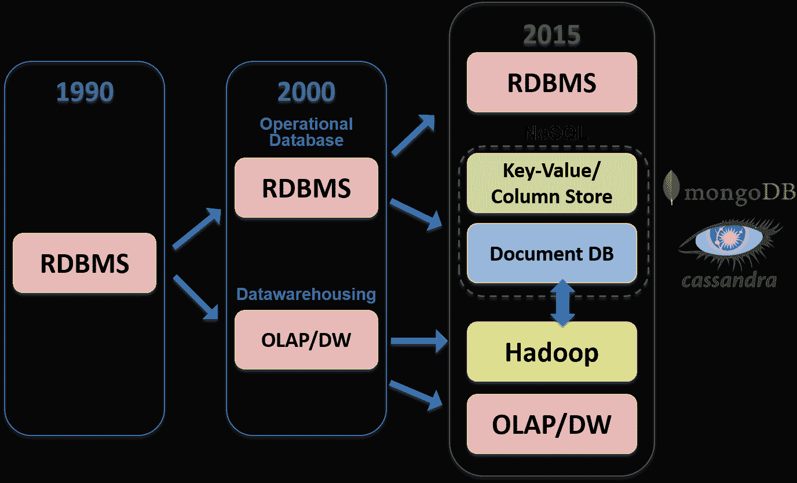
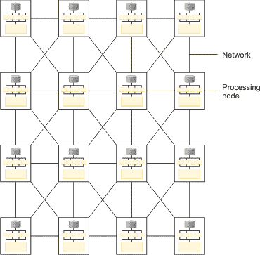
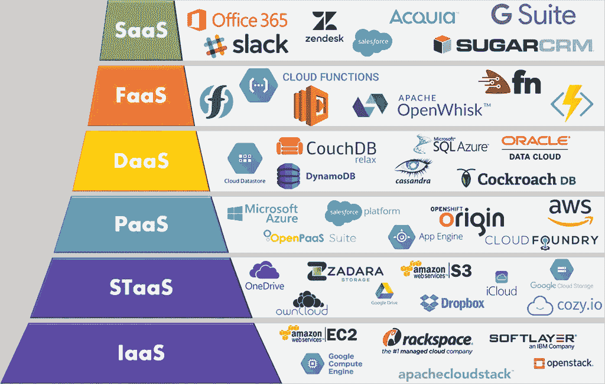
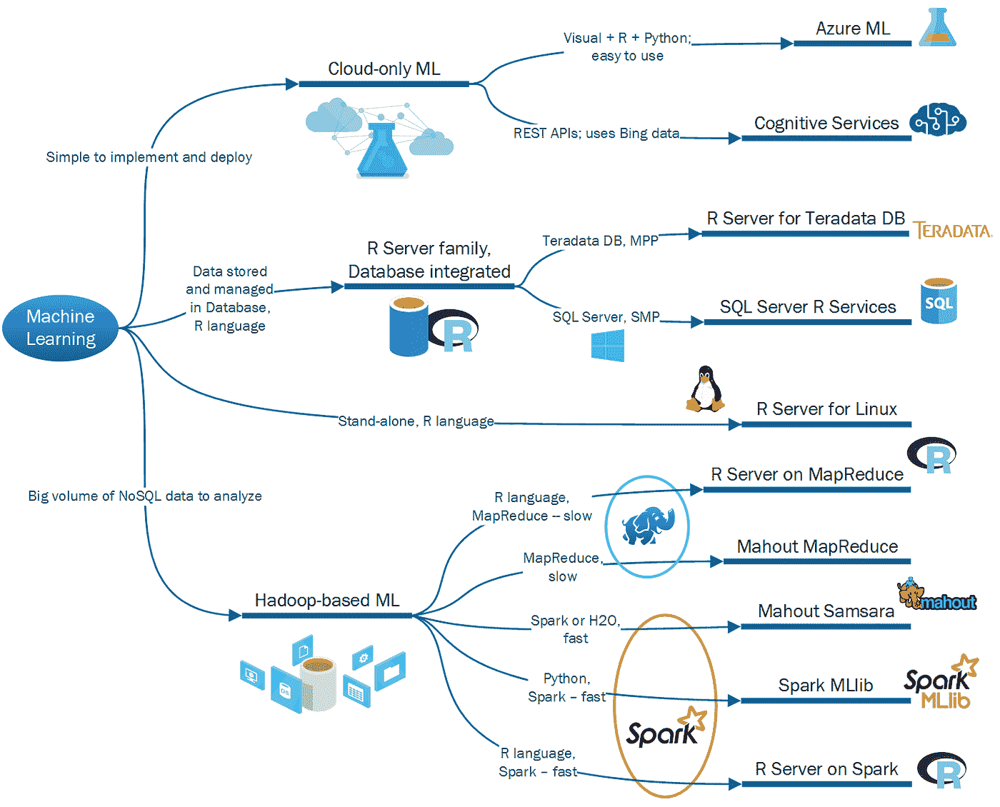
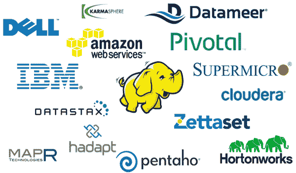

# 数据科学家应该了解的关于数据管理的一切*

> 原文：<https://towardsdatascience.com/everything-a-data-scientist-should-know-about-data-management-6877788c6a42?source=collection_archive---------0----------------------->

## (*但不敢问)

NIST Big Data Taxonomy (Source: [WikiCommons](https://commons.wikimedia.org/wiki/File:Revised_NIST_Big_Data_Taxonomy.jpg))

由[黄家仪](https://medium.com/@phoebetwong) & [罗伯特·贝内特](https://www.linkedin.com/in/robert-bennett-4002734b/)

要成为一名真正的“”数据科学家，或者许多博客作者和雇主所说的“[独角兽](/whats-the-secret-sauce-to-transforming-into-a-unicorn-in-data-science-94082b01c39d)”，你必须掌握数据科学过程的每一步——从存储数据到将成品(通常是预测模型)投入生产。但大部分数据科学培训侧重于机器/深度学习技术；数据管理知识通常被认为是事后的想法。数据科学学生通常通过存储在笔记本电脑上的文本文件中经过处理和清理的数据来学习建模技能，而忽略了数据香肠是如何制作的。学生们通常没有意识到，在行业环境中，从各种来源获取原始数据为建模做准备通常是 80%的工作。由于企业项目通常涉及大量数据，而他们的本地机器无法处理这些数据，因此整个建模过程通常发生在云中，大部分应用程序和数据库托管在其他地方数据中心的服务器上。即使学生找到了一份数据科学家的工作，数据管理也常常成为一个独立的数据工程团队负责的事情。因此，太多的数据科学家对数据存储和基础设施知之甚少，这往往会损害他们在工作中做出正确决策的能力。本文的目标是提供一个路线图，说明 2019 年的数据科学家应该了解的数据管理知识——从数据库类型、数据存储和处理的位置和方式，到当前的商业选项——以便有抱负的“独角兽”可以自己更深入地探索，或者至少学到足够的知识，以便在面试和鸡尾酒会上听起来像一个独角兽。

## 非结构化数据和大数据工具的兴起

IBM 305 RAMAC (Source: [WikiCommons](https://commons.wikimedia.org/wiki/File:BRL61-IBM_305_RAMAC.jpeg))

数据科学的故事实际上是数据存储的故事。在前数字时代，数据存储在我们的头脑中、泥板上或纸上，这使得汇总和分析数据极其耗时。1956 年，IBM 推出了第一台带磁性硬盘的商用计算机， [305 RAMAC](https://gizmodo.com/ibm-305-ramac-the-grandaddy-of-modern-hard-drives-5494858) 。整个装置需要 30 英尺 x 50 英尺的物理空间，重量超过 1 吨，公司可以以每月 3200 美元的价格租赁该装置，存储高达 5 MB 的数据。自那以来的 60 年里，[DRAM](https://www.computerworld.com/article/3182207/cw50-data-storage-goes-from-1m-to-2-cents-per-gigabyte.html)的每千兆字节价格从 1965 年的 26.4 亿美元降至 2017 年的 4.9 美元。除了价格大幅降低之外，数据存储也变得更密集/更小。305 RAMAC 中的磁盘每平方英寸存储 100 位，相比之下，今天典型的磁盘每平方英寸存储超过 1 万亿位。

数据存储成本和规模的大幅降低使当今的大数据分析成为可能。凭借超低的存储成本，构建数据科学基础架构以从海量数据中收集和提取见解成为企业的一种有利可图的方法。随着不断生成和传输用户数据的[物联网设备](https://internetofthingsagenda.techtarget.com/definition/IoT-device)的大量出现，企业正在收集越来越多的活动数据，从而创造出大量高容量、高速度和高多样性的信息资产(或大数据的“[三个 v](https://www.zdnet.com/article/volume-velocity-and-variety-understanding-the-three-vs-of-big-data/)”)。这些活动中的大多数(例如，电子邮件、视频、音频、聊天消息、社交媒体帖子)都会产生[非结构化数据](https://www.datamation.com/big-data/structured-vs-unstructured-data.html)，这些数据几乎占当今企业数据总量的 80%,并且在过去十年中其增长速度是结构化数据的两倍。

125 Exabytes of enterprise data was stored in 2017; 80% was unstructured data. (Source: [Credit Suisse](https://www.credit-suisse.com/eg/en/articles/asset-management/in-cloud-we-trust-uk-201905.tag*article-topic--asset-management---security.html))

这种大规模数据增长极大地改变了数据存储和分析的方式，因为传统的工具和方法无法应对“大数据的三个 v”新技术的发展能够以更快的速度和更低的成本处理不断增长的数据量和数据种类。这些新工具还对数据科学家的工作方式产生了深远的影响，使他们能够通过执行分析和构建以前不可能实现的新应用程序来利用海量数据。以下是我们认为每个数据科学家都应该了解的主要大数据管理创新。

**关系数据库& NoSQL**

[关系数据库管理系统](https://www.alooma.com/blog/types-of-modern-databases) (RDBMS)出现于 20 世纪 70 年代，将数据存储为具有行和列的表格，使用结构化查询语言(SQL)语句来查询和维护数据库。关系数据库基本上是表的集合，每个表都有一个严格定义它们存储的数据的属性和类型的模式，以及标识特定列或行以便于访问的键。RDBMS 曾经被[甲骨文](https://db-engines.com/en/system/Oracle)和 [IBM](https://db-engines.com/en/system/IBM+Db2) 统治，但是今天许多开源选项，像 [MySQL](https://db-engines.com/en/system/MySQL) 、 [SQLite](https://db-engines.com/en/system/SQLite) 和 [PostgreSQL](https://db-engines.com/en/system/PostgreSQL) 一样流行。

RDBMS ranked by popularity (Source: [DB-Engines](https://db-engines.com/en/ranking/relational+dbms))

由于一些非常吸引人的特性，关系数据库在商业世界中找到了一个家。数据完整性在关系数据库中是绝对重要的。RDBMS 满足了[原子性、一致性、隔离性和持久性(或 ACID 兼容)](https://blog.yugabyte.com/a-primer-on-acid-transactions/)的要求，它通过施加许多约束来确保存储的数据是可靠和准确的，这使它们成为跟踪和存储诸如帐号、订单和支付等事物的理想选择。但是这些限制伴随着代价高昂的权衡。由于模式和类型的限制，RDBMS 在存储非结构化或半结构化数据方面非常糟糕。僵化的模式也使得 RDBMS 的建立、维护和发展更加昂贵。建立一个 RDBMS 需要用户事先有具体的用例；对模式的任何改变通常都是困难且耗时的。此外，传统的 RDBMS 被设计成[在单个计算机节点](https://crate.io/a/rise-distributed-sql-database/)上运行，这意味着当处理大量数据时，它们的速度要慢得多。[分割 RDBMS 以便在保持 ACID 合规性的同时进行水平扩展也极具挑战性。所有这些属性使得传统的 RDBMS 不适合处理现代大数据。](https://crate.io/a/rise-distributed-sql-database/)

到 2000 年代中期，现有的 RDBMS 不再能够处理一些非常成功的在线业务的不断变化的需求和指数级增长，因此开发了许多非关系型(或 NoSQL)数据库(下面是一个关于脸书在数据量开始增长时如何处理 MySQL 的局限性的故事)。当时没有任何已知的解决方案，这些在线企业发明了新的方法和工具来处理他们收集的大量非结构化数据:谷歌创建了 [GFS](https://en.wikipedia.org/wiki/Google_File_System) 、 [MapReduce](https://ai.google/research/pubs/pub62) 和[BigTable](https://cloud.google.com/bigtable/docs/)；亚马逊创造了[dynamo db](https://cloudacademy.com/blog/amazon-dynamodb-ten-things/)；雅虎创造了[Hadoop](https://www.sas.com/nl_nl/insights/big-data/hadoop.html#hadoopworld)；脸书创造了[卡珊德拉](https://www.facebook.com/notes/facebook-engineering/cassandra-a-structured-storage-system-on-a-p2p-network/24413138919/)和[蜂巢](https://www.facebook.com/notes/facebook-engineering/hive-a-petabyte-scale-data-warehouse-using-hadoop/89508453919/)；LinkedIn 创造了[卡夫卡](https://engineering.linkedin.com/blog/2016/04/kafka-ecosystem-at-linkedin)。这些企业中的一些开源他们的工作；一些发表了研究论文，详细介绍了他们的设计，导致了数据库与新技术的扩散，NoSQL 数据库成为行业中的主要参与者。

An explosion of database options since the 2000’s. Source: [Korflatis et. al (2016)](https://www.researchgate.net/figure/Landscape-and-categorization-of-the-high-variety-of-existing-database-systems-18_fig2_303562879)

[NoSQL 数据库](https://www.fullstackpython.com/no-sql-datastore.html)与模式无关，并提供存储和操作大量[非结构化和半结构化数据](https://www.datamation.com/big-data/structured-vs-unstructured-data.html)所需的灵活性。用户不需要知道在设置期间将存储什么类型的数据，并且系统可以适应数据类型和模式的变化。NoSQL 数据库旨在将数据分布在不同的节点上，通常具有更好的水平伸缩性和容错性。然而，这些性能优势也是有代价的——NoSQL 数据库不符合 ACID 标准，并且不能保证数据的一致性。相反，它们提供“[最终一致性](https://medium.baqend.com/nosql-databases-a-survey-and-decision-guidance-ea7823a822d)”:当旧数据被覆盖时，它们会返回暂时有点错误的结果。例如，[谷歌的搜索引擎索引](https://arstechnica.com/information-technology/2016/03/to-sql-or-nosql-thats-the-database-question/)不能在人们同时搜索给定术语时覆盖其数据，因此当我们搜索时，它不会给我们最新的结果，但它会给我们最新的、最好的答案。虽然这种设置在数据一致性绝对必要的情况下(比如金融交易)是行不通的；对于需要速度而不是精确的任务来说，这很好。

现在有几种不同种类的 NoSQL，每一种都有特定的用途。键值存储，如 [Redis](https://db-engines.com/en/system/Redis) 、 [DynamoDB](https://db-engines.com/en/system/Amazon+DynamoDB) 和 [Cosmos DB](https://db-engines.com/en/system/Microsoft+Azure+Cosmos+DB) ，只存储键值对，并提供检索与已知键相关的值的基本功能。当速度很重要时，它们最适合简单的数据库模式。宽列存储，如 [Cassandra](https://db-engines.com/en/system/Cassandra) 、 [Scylla](https://db-engines.com/en/system/ScyllaDB) 和 [HBase](https://db-engines.com/en/system/HBase) ，将数据存储在列族或表中，用于管理大型分布式系统中数 Pb 的数据。文档存储，如 [MongoDB](https://db-engines.com/en/system/MongoDB) 和 [Couchbase](https://db-engines.com/en/system/Couchbase) ，以 XML 或 JSON 格式存储数据，以文档名为键，以文档内容为值。这些文档可以包含许多不同的值类型，并且可以嵌套，这使得它们特别适合跨分布式系统管理半结构化数据。图形数据库，如 [Neo4J](https://db-engines.com/en/system/Neo4j) 和 [Amazon Neptune](https://db-engines.com/en/system/Amazon+Neptune) ，将数据表示为相关节点或对象的网络，以便于数据可视化和图形分析。图形数据库对于分析异构数据点之间的关系特别有用，比如在欺诈预防或脸书的朋友图中。

MongoDB 是目前[最受欢迎的 NoSQL 数据库](https://db-engines.com/en/ranking)，它为那些一直在努力用传统 RDBMS 方法处理非结构化数据的企业带来了巨大的价值。下面是[的两个行业例子](https://arstechnica.com/information-technology/2016/03/to-sql-or-nosql-thats-the-database-question/):大都会人寿花费*数年*试图在 RDBMS 上建立一个可以处理其所有保险产品的中央客户数据库后，内部黑客马拉松的某人在几小时内用 MongoDB 建立了一个，并在 90 天内投入生产。市场研究公司 YouGov 每小时收集 5g 数据，通过从 RDBMS 迁移到 MongoDB，节省了 70%的存储容量。

**数据仓库，数据湖，&数据沼泽**

随着数据源的不断增长，使用多个数据库执行数据分析变得效率低下且成本高昂。20 世纪 80 年代的出现了一种叫做[数据仓库](https://blogs.oracle.com/bigdata/data-lake-database-data-warehouse-difference)的解决方案，它将企业所有数据库中的数据集中起来。数据仓库通过创建来自不同来源(内部和外部)的单一数据存储库，支持数据从运营系统流向分析/决策系统。在大多数情况下，数据仓库是一种关系数据库，它存储经过处理的数据，这些数据是为收集业务洞察力而优化的。它收集来自事务系统和业务应用程序的具有预定结构和模式的数据，这些数据通常用于运营报告和分析。

但是，由于进入数据仓库的数据需要在存储之前进行处理，对于今天的大量非结构化数据，这可能需要大量的时间和资源。作为回应，企业开始在[维护](https://www.dataversity.net/brief-history-data-lakes/)[数据湖](https://blogs.oracle.com/bigdata/data-lake-database-data-warehouse-difference)2010 年的，这些数据湖存储了企业任何规模的所有结构化和非结构化数据。数据湖存储原始数据，无需首先定义数据结构和模式就可以建立数据湖。数据湖允许用户运行分析，而不必将数据移动到单独的分析系统，使企业能够从以前无法进行分析的新数据源中获得洞察力，例如通过使用来自日志文件、点击流、社交媒体和物联网设备的数据构建机器学习模型。通过使所有企业数据随时可供分析，数据科学家可以回答一系列新的业务问题，或者用新数据解决旧问题。

Data Warehouse and Data Lake Comparisons (Source: [AWS](https://aws.amazon.com/big-data/datalakes-and-analytics/what-is-a-data-lake/))

数据湖体系结构的一个常见挑战是，如果没有适当的数据质量和治理框架，当数 TB 的结构化和非结构化数据流入数据湖时，对其内容进行分类通常会变得极其困难。数据湖可能会变成[数据沼泽](https://s3-ap-southeast-1.amazonaws.com/mktg-apac/Big+Data+Refresh+Q4+Campaign/ESG-White-Paper-AWS-Apr-2017+(FINAL).pdf)，因为存储的数据变得太乱而无法使用。许多组织现在呼吁更多的数据治理和元数据管理实践，以防止数据沼泽的形成。

**分布式&并行处理:Hadoop、Spark、& MPP**

虽然存储和计算需求在过去几十年中飞速增长，但传统硬件并没有跟上发展的步伐。企业数据不再适合标准存储，处理大多数大数据分析任务所需的计算能力可能需要几周、几个月，或者根本不可能在标准计算机上完成。为了克服这一缺陷，许多新技术发展到包括多台计算机协同工作，将数据库分布到数千台商用服务器上。当一个计算机网络被连接并一起工作来完成相同的任务时，这些计算机就形成了一个[集群](https://www.datacamp.com/community/blog/data-science-cloud)。一个集群可以被认为是一台单独的计算机，但是它可以显著地提高性能、可用性和可伸缩性，而不是一台更强大的机器，并且通过使用商用硬件来降低成本。 [Apache Hadoop](/what-happened-to-hadoop-what-should-you-do-now-2876f68dbd1d) 是分布式数据基础设施的一个例子，它利用集群来存储和处理大量数据，并支持数据湖架构。

Evolution of database technologies (Source: [Business Analytic 3.0](https://practicalanalytics.co/2015/06/02/the-maturing-nosql-ecoystem-a-c-level-guide/))

当你想到 Hadoop 时，想想“分发”Hadoop 由[三个主要组件](https://hortonworks.com/apache/hadoop/#section_2)组成:Hadoop 分布式文件系统(HDFS)，一种跨多个(分布式)物理硬盘存储和跟踪你的数据的方式；MapReduce，一个跨分布式处理器处理数据的框架；还有另一个资源协商器(YARN)，它是一个集群管理框架，协调诸如 CPU 使用、内存和网络带宽在分布式计算机之间的分配。Hadoop 的处理层是一项特别值得注意的创新: [MapReduce](https://hci.stanford.edu/courses/cs448g/a2/files/map_reduce_tutorial.pdf) 是一种两步计算方法，用于以可靠、容错的方式处理分布在大型商用硬件集群中的大型(多 TB 或更大)数据集。第一步是将您的数据分布在多台计算机上(Map ),每台计算机对其数据片并行执行一次计算。下一步是以成对的方式组合这些结果(Reduce)。谷歌[在 2004 年发表了一篇关于 MapReduce 的论文](https://ai.google/research/pubs/pub62)，这篇论文[被雅虎程序员](https://www.wired.com/2011/10/how-yahoo-spawned-hadoop/)采用，他们于 2006 年在开源的 Apache 环境中实现了这篇论文，为每个企业提供了使用商用硬件存储前所未有的海量数据的能力。尽管这一想法有许多开源实现，但谷歌品牌名称 MapReduce 仍然存在，有点像 Jacuzzi 或 Kleenex。

Hadoop 是为迭代计算而构建的，在单次操作中从磁盘扫描大量数据，将处理分布在多个节点上，并将结果存储回磁盘。在传统数据仓库环境中需要 4 个小时运行的查询 zettabytes 的索引数据，使用 Hadoop 和 [HBase](https://hbase.apache.org/) 可以在 10-12 秒内完成。Hadoop 通常用于生成复杂的分析模型或大容量数据存储应用，如回顾性和预测性分析；机器学习和模式匹配；客户细分和流失分析；和活动档案。

但是 MapReduce [批量处理数据](https://datawhatnow.com/batch-processing-mapreduce/)，因此不适合处理实时数据。[阿帕奇 Spark](/a-beginners-guide-to-apache-spark-ff301cb4cd92) 于 2012 年建造，以填补这一空白。Spark 是一个并行数据处理工具，它通过[处理内存中的数据](https://dzone.com/articles/apache-spark-introduction-and-its-comparison-to-ma)来优化速度和效率。它在相同的 MapReduce 原理下运行，但通过在内存中完成大部分计算，并且仅在内存满或计算完成时写入磁盘，运行速度要快得多。这种内存计算允许 Spark“在内存中运行程序的速度比 Hadoop MapReduce 快 100 倍，在磁盘上快 10 倍。”然而，当数据集如此之大以至于[RAM 不足成为一个问题](/a-beginners-guide-to-apache-spark-ff301cb4cd92)(通常数百 GB 或更多)时，Hadoop MapReduce 可能会优于 Spark。Spark 还拥有一套广泛的数据分析库，涵盖了广泛的功能: [Spark SQL](https://spark.apache.org/sql/) 用于 SQL 和结构化数据； [MLib](https://spark.apache.org/mllib/) 用于机器学习， [Spark Streaming](https://spark.apache.org/streaming/) 用于流处理， [GraphX](https://spark.apache.org/graphx/) 用于图形分析。由于 Spark 的重点是计算，它没有自带存储系统，而是运行在各种存储系统上，如亚马逊 S3、Azure 存储、Hadoop 的 HDFS 和 T21。

In an MPP system, all the nodes are interconnected and data could be exchanged across the network (Source: [IBM](https://www.ibm.com/support/knowledgecenter/en/SSZJPZ_11.5.0/com.ibm.swg.im.iis.productization.iisinfsv.install.doc/topics/wsisinst_pln_engscalabilityparallel.html))

Hadoop 和 Spark 并不是唯一利用集群处理大量数据的技术。另一种流行的分布式查询处理计算方法叫做[大规模并行处理(MPP)](https://www.zdnet.com/article/mapreduce-and-mpp-two-sides-of-the-big-data-coin/) 。与 MapReduce 类似，MPP 将数据处理分布在多个节点上，这些节点并行处理数据以获得更快的速度。但与 Hadoop 不同，MPP 用于 RDBMS，并利用了一种[“无共享”架构](https://0x0fff.com/hadoop-vs-mpp/) —每个节点都用多核处理器处理自己的数据片，这使得它们比传统的 RDBMS 快很多倍。一些 MPP 数据库，如 [Pivotal Greenplum](https://pivotal.io/pivotal-greenplum) ，有[成熟的机器学习库](https://madlib.apache.org)，允许数据库内分析。然而，与传统的 RDBMS 一样，大多数 MPP 数据库不支持非结构化数据，即使是结构化数据也需要一些处理来适应 MPP 基础设施；因此，为 MPP 数据库建立数据管道需要额外的时间和资源。由于 MPP 数据库符合 ACID 标准，并且速度比传统 RDBMS 快得多，因此它们通常用于高端企业数据仓库解决方案，如 [Amazon Redshift、Pivotal Greenplum 和 Snowflake](https://db-engines.com/en/system/Amazon+Redshift%3BGreenplum%3BSnowflake) 。举一个行业例子，[纽约证券交易所](https://www.forbes.com/sites/tomgroenfeldt/2013/02/14/at-nyse-the-data-deluge-overwhelms-traditional-databases/#3d171aa05aab)每天接收 4 到 5tb 的数据，并进行复杂的分析、市场监控、容量规划和监控。该公司一直在使用无法处理工作负载的传统数据库，加载该数据库需要数小时，并且查询速度很慢。迁移到 MPP 数据库后，他们的日常分析运行时间减少了 8 个小时。

**云服务**

另一项彻底改变企业大数据分析能力的创新是云服务的兴起。在云服务出现之前的糟糕日子里，企业必须从软件和硬件供应商那里购买内部数据存储和分析解决方案，通常需要支付前期永久软件许可费以及每年的硬件维护和服务费。除此之外，还有用于构建和维护内部基础架构的电力、冷却、安全、灾难保护、IT 员工等成本。即使存储和处理大数据在技术上是可能的，但大多数企业发现大规模存储和处理大数据的成本过高。使用内部基础架构进行扩展还需要大量的设计和采购流程，这需要很长的实施时间，并且需要大量的前期资金。因此，许多潜在的有价值的数据收集和分析的可能性被忽略了。

“As a Service” providers: e.g. Infrastructure as a Service (IaaS) and Storage as a Service (STaaS) (Source: [IMELGRAT.ME](https://imelgrat.me/cloud/cloud-services-models-help-business/))

当云服务在 2000 年代末推出时，内部部署模式开始迅速失去市场份额——在过去十年中，全球云服务市场每年增长 15%。云服务平台提供对[各种服务](https://imelgrat.me/cloud/cloud-services-models-help-business/)(从虚拟计算到存储基础设施再到数据库)的订阅，通过互联网以现收现付的方式交付，为客户提供对灵活、低成本存储和虚拟计算资源的快速访问。云服务提供商负责所有硬件和软件的购买和维护，通常拥有庞大的服务器和支持人员网络来提供可靠的服务。许多企业发现，他们可以利用云服务显著降低成本和提高运营效率，并且能够利用现成的云资源及其内置的可扩展性更快地开发和生产产品。通过消除构建内部基础设施的前期成本和时间投入，云服务还降低了采用大数据工具的门槛，并有效地为中小型企业普及了大数据分析。

有几种云服务模式，公共云是最常见的。在[公共云](https://azure.microsoft.com/en-us/overview/what-are-private-public-hybrid-clouds/?cdn=disable)中，所有硬件、软件和其他支持基础设施都归云服务提供商所有和管理。客户与其他“云租户”共享云基础设施，并通过 web 浏览器访问他们的服务。一个[私有云](https://www.liquidweb.com/kb/difference-private-cloud-premise/)通常由具有特殊安全需求的组织使用，如政府机构和金融机构。在私有云中，服务和基础架构仅由一个组织专用，并在私有网络上维护。私有云可以是内部的，也可以由其他地方的第三方服务提供商托管。[混合云](https://www.sdxcentral.com/cloud/multi-cloud/definitions/what-is-multi-cloud/)将私有云与公共云结合起来，让组织能够获得两者的优势。在混合云中，数据和应用程序可以在私有云和公共云之间移动，以获得更大的灵活性:例如，公共云可以用于高容量、低安全性的数据，而私有云可以用于敏感的关键业务数据，如财务报告。[多云模式](https://www.sdxcentral.com/articles/news/pivotal-greenplum-adds-multicloud-support/2017/09/)涉及多个云平台，每个平台提供一个特定的应用服务。为了实现组织的目标，多云可以是公共云、私有云和混合云的组合。组织通常选择云计算来满足其特定的业务、位置和时间需求，并避免供应商锁定。

## 案例研究:为推荐应用初创公司构建端到端数据科学基础设施

Machine learning packages for different types of data environment (Source: [Kosyakov (2016)](https://biz-excellence.com/2016/09/13/machine-learning-dt/))

构建一个可行的数据科学产品不仅仅是用 scikit-learn 构建一个机器学习模型，酸洗它，并将其加载到服务器上。它需要了解企业生态系统的所有部分如何协同工作，首先是数据从哪里/如何流入数据团队，数据处理/转换的环境，企业可视化/呈现数据的约定，以及模型输出如何转换为其他一些企业应用程序的输入。主要目标包括建立一个易于维护的过程；其中模型可以被迭代并且性能是可再现的；模型的输出可以很容易地被其他涉众理解和可视化，以便他们可以做出更明智的商业决策。实现这些目标需要选择正确的工具，以及了解业内其他人在做什么和最佳实践。

让我们用一个场景来说明:假设你刚刚被一家度假推荐应用初创公司聘为首席数据科学家，该公司预计每天从用户那里收集数百千兆字节的结构化(客户资料、温度、价格和交易记录)和非结构化(客户的帖子/评论和图像文件)数据。您的预测模型将需要每周用新数据重新训练，并根据需要即时提出建议。既然你希望你的应用能大获成功，那么你的数据收集、存储和分析能力就必须是高度可扩展的。你将如何设计你的数据科学过程和生产你的模型？完成工作需要哪些工具？因为这是一家初创公司，而你是首席——也许是唯一的——数据科学家，所以这些决策就由你来做。

首先，您必须弄清楚如何建立数据管道，从数据源接收原始数据，处理数据，并将处理后的数据提供给数据库。理想的数据管道具有较低的事件延迟(能够在收集数据后立即查询数据)；可扩展性(能够随着产品的扩展处理大量数据)；交互式查询(支持批处理查询和较小的交互式查询，允许数据科学家探索表和模式)；版本控制(在不关闭管道和丢失数据的情况下对管道进行更改的能力)；监控(当数据停止进入时，管道应该生成警报)；和测试(不间断地测试管道的能力)。也许最重要的是，它最好不要干扰日常业务运营——例如，如果您正在测试的新模型导致您的运营数据库陷入停顿，就会有人被解雇。构建和维护数据管道通常是数据工程师的责任(有关更多详细信息，[本文](/data-science-for-startups-data-pipelines-786f6746a59a)对为初创公司构建数据管道进行了出色的概述)，但数据科学家至少应该熟悉该过程、其局限性以及访问已处理数据进行分析所需的工具。

接下来，您必须决定是建立内部基础设施还是使用云服务。对于初创公司来说，当务之急是在不增加运营资源的情况下扩展数据收集。如前所述，内部基础设施需要巨大的前期和维护成本，因此云服务往往是初创公司的更好选择。云服务允许根据需求进行扩展，并且只需要最少的维护工作，因此您的小型员工团队可以专注于产品和分析，而不是基础架构管理。

Examples of vendors that provide Hadoop-based solutions (Source: [WikiCommons](https://commons.wikimedia.org/wiki/File:Top-Hadoop-Companies_Final.png))

为了选择云服务提供商，您必须首先建立分析所需的数据，以及最适合这些数据类型的数据库和分析基础架构。由于在您的分析管道中既有结构化数据又有非结构化数据，您可能希望建立一个数据仓库和一个数据湖。数据科学家需要考虑的一件重要事情是，存储层是否支持构建模型所需的大数据工具，以及数据库是否提供有效的数据库内分析。例如，一些 ML 库(如 Spark 的 MLlib)不能有效地与作为数据主要接口的数据库一起使用——数据必须在操作之前从数据库中卸载，随着数据量的增长，这可能会非常耗时，并且当您必须定期重新训练您的模型时，这可能会成为一个瓶颈(从而导致另一个“头重脚轻”的情况)。

对于云中的数据科学，大多数云提供商都在努力开发自己的本机机器学习能力，使数据科学家能够利用存储在自己平台上的数据轻松构建和部署机器学习模型(亚马逊有 [SageMaker](/chapter-1-intro-to-aws-sagemaker-a1ecf00ec761) ，谷歌有 [BigQuery ML](https://cloud.google.com/bigquery-ml/docs/) ，微软有 [Azure Machine Learning](https://azure.microsoft.com/en-us/services/machine-learning-studio/) )。但是这些工具集仍在开发中，并且经常不完整:例如， [BigQuery ML](https://cloud.google.com/bigquery-ml/docs/bigqueryml-intro) 目前只支持线性回归、二元和多类逻辑回归、K-means 聚类和 TensorFlow 模型导入。如果您决定使用这些工具，您必须彻底测试它们的能力，以确保它们做您需要它们做的事情。

选择云提供商时要考虑的另一个主要问题是供应商锁定。如果您选择专有的云数据库解决方案，您很可能无法访问本地环境中的软件或数据，并且转换供应商需要迁移到不同的数据库，这可能成本高昂。解决这个问题的一个方法是选择支持[开源](https://opensourceforu.com/2019/04/an-overview-of-open-source-cloud-platforms-for-enterprises/)技术的厂商([这里是网飞解释他们为什么使用开源软件](https://medium.com/netflix-techblog/why-we-use-and-contribute-to-open-source-software-1faa77c2e5c4))。使用开源技术的另一个优势是，它们往往会吸引更大的用户群体，这意味着您可以更容易地雇佣有经验和技能的人在您的基础设施中工作。解决这个问题的另一种方法是选择第三方供应商(如 [Pivotal Greenplum](https://pivotal.io/pivotal-greenplum) 和 [Snowflake](https://www.snowflake.com/) )，它们使用其他主要的云提供商作为存储后端来提供云数据库解决方案，这也允许您在多个云中存储数据，如果这符合您的创业公司的需求。

最后，既然你希望公司发展壮大，你就必须实施一个强大的云管理实践来保护你的云并防止[数据丢失和泄露](https://www.credit-suisse.com/eg/en/articles/asset-management/in-cloud-we-trust-uk-201905.tag*article-topic--asset-management---security.html)——比如管理数据访问和保护接口和 API。您还需要实施[数据治理最佳实践](https://hortonworks.com/wp-content/uploads/2014/05/TeradataHortonworks_Datalake_White-Paper_20140410.pdf)来维护数据质量，并确保您的数据湖不会变成数据沼泽。

如您所见，企业数据科学项目中有比调整机器学习模型中的超参数更多的东西！我们希望这种高层次的概述已经让您兴奋地学习更多关于数据管理的知识，并可能学到一些东西来打动饮水机旁的数据工程师。

*免责声明:本文表达的观点是我们自己的观点，不代表我们过去或现在雇主的观点。*