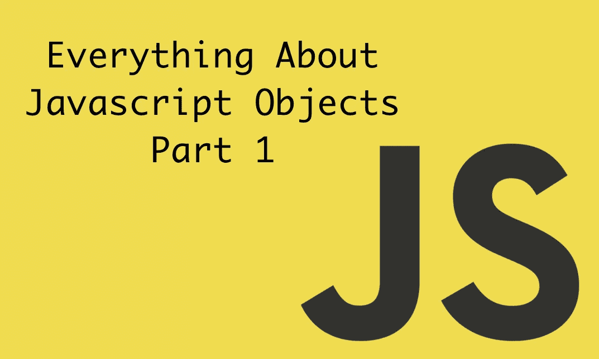
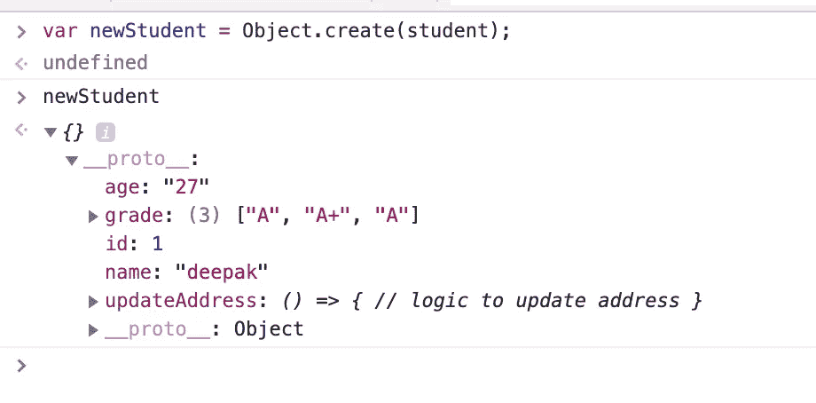

# 关于 Javascript 对象的一切

> 原文：<https://towardsdatascience.com/everything-about-javascript-object-part-1-854025d71fea?source=collection_archive---------12----------------------->



Object in Javascript

***近***JavaScript 中的一切都是除了**之外的对象六个**是**不是对象**是——`***null***`、`***undefined***`、**、*字符串*、**、*数字*、**、*布尔*、**、*符号*、**。这些被称为原始值或原始类型。******

任何不是原始值的东西都是一个**对象**。这包括**数组**、**函数**、构造函数和对象本身。

是啊！函数和数组也是对象，我们将在本文后面看到。

# 目标

从概念上讲，对象在所有编程语言中都是一样的，也就是说，它们代表了我们希望在程序中用特征/属性和方法来表示的真实世界的事物。

例如，如果你的对象是一个学生，那么它将拥有姓名、年龄、地址、id 等属性和`updateAddress`、`updateName`等方法。

在 JavaScript 中，把一个对象想象成一个包含条目的列表，列表中的每个条目(一个属性或一个方法)都由一个键值对存储在内存中作为引用。

让我们看一个对象示例。

```
const firstObj = {
  1: "deepak",
  "age": 28
}
```

`firstObj`是一个有 2 个属性 1，年龄和值为`deepak`和`28`的对象。

JavaScript 对象在创建方式上有些不同。对`class`本身没有要求，可以使用文字符号来声明。

## 对象创建

在 javascript 中，我们可以用多种方式创建对象，让我们来看看每一种方式。

1.  `Object literal`(D \直接方式)。对象文字是用大括号括起来的逗号分隔的键值对列表。对象文字属性值可以是任何数据类型，包括数组文字、函数、嵌套对象文字或原始数据类型。

```
var student = {
  id: 1,
  name: "deepak",
  age: "27",
  updateAddress: () => {
   // logic to update address
  },
  grade: ['A', 'A+', 'A']
}
```

> 注意:上面的学生对象键可以通过点符号访问，即`student.id`、`student.name`或通过方括号符号访问，即`student[‘id’]`、`student[‘name’]`等

2.`Object.create()`。方法使用旧对象的指定原型和属性创建新对象。

> 注意:每个 JavaScript 函数默认都有一个`prototype`对象属性(默认为空)。方法或属性可以附加到此属性。

```
// syntax - Object.create(prototype[, propertiesObject])
var newStudent = Object.create(student); 
// this create a new object with old object added in its prototype // chain 
```

下面是对象`__proto__`的输出



Object in Javascript

我们现在可以使用我们在这里学习的方法向`newStudent`对象添加新的属性和数据。

> 注意:`newStudent`将可以访问父`student`对象的键和值，因为它已经被添加到了`newStudent`原型链中，这是我们在 javascript 中进行继承的一种方式。也就是说，`*newStudent*`会存储一个到`*student*`对象的链接。当读取一个属性时，这个*父对象*也被参考。
> 
> 父级可以有父级，依此类推。重复这一过程，直到我们到达一个没有任何父对象的对象，即父对象是`null`。

3.`Object Instance`。结合使用`Object`构造函数和"`new`"关键字允许我们初始化新的对象。

让我们看一个例子

```
const newObj = new Object();
newObj.name = ‘Deepak’;
newObj.location = ‘Delhi, India’;
```

然而，上述使用`new Object()`的方法不太适合需要创建多个同类对象的程序，因为这将涉及为每个此类对象重复编写上述代码行。

为了处理这个问题，我们可以使用下一种方法

4.`Object construtor`。当我们需要一种方法来创建一个可以多次使用的对象“类型”而不必每次都重新定义对象时，构造函数会很有用，这可以通过使用对象构造函数来实现。

让我们看一个例子

```
function Vehicle(name, model) { 
   this.name = name; 
   this.model = model; 
} 

let car1 = new Vehicle('Fiesta', '2019'); 
let car2 = new Vehicle('DC avanti', '2018');
```

我们创建了两个属性相同但值不同的对象。

**5。** `Object.assign()`。这是从其他对象创建新对象的另一种方法。

> 注意:我们将在下一部分讨论可枚举/所有权，所以请原谅我。

它将所有可枚举的自身属性的值从一个或多个源对象复制到目标对象。它将返回目标对象。让我们通过一个例子来理解:

```
var obj = { a: 1 };
var copy = Object.assign({}, obj);
console.log(copy); // { a: 1 }
```

`Object.assign()`有很多用例，比如对象克隆、合并对象等。

6。 `Object.fromEntries()` **。M** 方法将一个键值对列表转换成一个对象。让我们看一个例子

```
const entries = new Map([
  ['foo', 'bar'],
  ['baz', 42]
]);const obj = Object.fromEntries(entries);console.log(obj);
// expected output: Object { foo: "bar", baz: 42 }
```

> 注意:创建对象的最好方法是通过文字符号，因为它在源代码中占用较少的空间。对于正在发生的事情，这是显而易见的，所以使用`new Object()`，您实际上只是输入了更多内容，并且(理论上，如果没有被 JavaScript 引擎优化)执行了一个不必要的函数调用。此外，文字符号在同一行代码中创建对象并分配属性，这与其他符号不同。

## 如何添加/更新和删除对象的属性

如前所述，对象的属性可通过**点或括号符号**添加。让我们看一个例子

```
const a = {};
a.name = 'deepak';
a['city'] = 'delhi';
a[1] = 'dope';
```

这里，`name`和`city`是对象属性。

一个对象只能包含一个具有一个值的键。我们不能让一个键有两个不同的值。

属性名可以是字符串、数字、特殊字符或动态属性，但如果属性名不是字符串，则必须用括号符号来访问。因此，如果我们需要访问上面例子中的属性`*1*`，我们可以执行`*a[1]*`，但是`*a.1*`将返回一个语法错误。然而，属性情况，即`*a.name*`或`*a["name"]*`将会起作用。

```
a.first name = 'deepak' // will return syntax error
a['first name'] = 'deepak' // will work 
```

要更新一个属性，我们可以再次使用上述两种符号类型。如果我们向已经创建的属性添加值，那么该值将被更新或创建。

```
a.city = 'new york';
```

上面将城市值从`delhi`更新为`new york`。

我们也可以通过像`**Object.defineProperties()**` **或** `**Object.defineProperty()**`这样的`Object`函数方法来创建和更新对象的属性

```
Object.defineProperties(a, {
  pincode: {
    value: 10012,
    writable: true
  },
  property2: {}
});console.log(a.pincode); // 10012
```

要删除一个对象的属性，我们可以使用`delete`关键字，我们可以同时使用这两种符号。

```
delete a['city'];
delete a.city;
```

如果成功删除属性，返回值`delete`为`true`。要不然就是`false`。

> 你知道不允许属性更新或删除的方法吗？如果是，请在下面评论。如果不是，请不要担心，我会带着更多的问题深入下一篇文章。

## 如何迭代对象属性？

实际编码时会有这样的情况，我们想要访问所有的对象键值对。

**使用循环——for in 和 for of 循环**

对于中的 **for，它遍历一个对象并逐个返回属性。**

```
for (const key in a) {
   console.log(key, a[key]);
}
```

Key 将一个接一个地拥有所有属性，`a[key]`将返回值。For in 循环也迭代原型链，并且也将返回父键，所以如果您看到更多的键，请不要感到惊讶。为了避免看到更多的键，我们可以做一个`hasOwnProperty`检查，只获取当前对象的键。

在的 **for 的情况下，在[可迭代对象](https://medium.com/@ideepak.jsd/javascript-es6-iterables-and-iterators-de18b54f4d4)上迭代。更多阅读请点击这里。**

对象函数中有各种方法帮助访问对象属性和值，而不是原型链。

1.  `**Object.keys()**` **或** `**Object.getOwnPropertyNames()**` **。返回一个字符串键数组。**

```
const keys = Object.keys(a) 
// return ["name", "first name", "city", "1"];const newKeys = Object.getOwnPropertyNames(a);
// return ["name", "first name", "city", "1"];keys.map(key => console.log(a[key])); 
// return ["deepak", "deepak", "new york", "dope"];
```

**2。** `**Object.values()**` **。返回一个数值数组。**

```
const keys = Object.values(a);// return ["deepak", "deepak", "new york", "dope"]
```

**3。** `**Object.entries()**` **。**返回一个由`[key, value]`对组成的数组。

```
const data = Object.entries(a);// returns 
[ ["1", "dope"], ["name", "deepak"], ["first name", "deepak"], ["city", "new york"]]
```

从上面我们可以看出，一个物体的属性出现的顺序并不是固定的。

## 如何检查对象中的属性存在

有三种方法可以检查对象中是否存在该属性。

1.  **使用** `**hasOwnProperty**`。此方法返回一个布尔值，该值指示对象是否将指定的属性作为自己的属性，而不是父/继承属性。

```
console.log(a.hasOwnProperty(1)); // return true;
console.log(a.hasOwnProperty('1')); // return false;const b = Object.create(a); // this will add a as parent of b
console.log(b.hasOwnProperty(1)); // return false
```

> 注意:`*hasOwnProperty*`返回 true，即使属性的值是`*null*`或`*undefined*`。

> 如果我们在一个对象中使用`hasOwnProperty`作为属性名会怎么样？在下面评论你的想法。

**2。在操作符中使用*—***`**in**`**操作符**返回`true`如果指定的属性在指定的对象或其原型链中，即在其父对象中。

```
console.log(1 in a); // return true;
console.log('1' in a); // return false;const b = Object.create(a); // this will add a as parent of b
console.log(b.hasOwnProperty(1)); // return true
```

> 注意:`*hasOwnProperty*` *只检查当前对象属性，而* `*in*` *运算符检查当前+父属性*

## 3.使用定制的功能

通过自定义方法检查属性是否存在有多种方法。其中一个是通过`Object.keys`获得的 eg。

```
Object.keys(a).indexOf(1) !== -1 // return true
```

在你的自定义方法下面写下注释来做同样的事情😃。

## 什么是按引用复制/共享和按值复制，它如何应用于对象？

不同之处在于，通过值，我们的意思是每次创建新的内存分配，而在引用的情况下，我们指向已经创建的内存空间。

在 javascript 的上下文中，所有的原始数据类型都是通过值方法分配内存的，对于一个对象来说，根据实现的不同，它可以通过值或引用进行复制。

```
// pass by value
let a = 5; 
let b = a;a = 6;
console.log(b) // return 5 as each time a new memory is allocated// pass by reference
const a = {x: 1};
const b = a; a.x = 3;
console.log(b.x) // it returns 3 as its a shared memory between a and b
```

## 什么是对象的浅层和深层复制/克隆？

浅层拷贝和深层拷贝的核心区别在于如何将属性复制到新对象中。

在**浅拷贝**中，新对象与旧对象共享数据，即在上述示例中，使用`=`创建`a`对象的浅拷贝`b`。所以按引用传递在大多数情况下是浅层拷贝。

此外，浅层副本将复制顶级属性，但嵌套对象在原始对象(源)和副本对象(目标)之间共享。

浅层复制的另一种方法是使用`Object.assign()`,这将在开始部分讨论。让我们看看这个例子

```
let obj = {
  a: 1,
  b: {
    c: 2,
  },
}let newObj = Object.assign({}, obj);
console.log(newObj); // { a: 1, b: { c: 2} }

obj.a = 10;
console.log(obj); // { a: 10, b: { c: 2} }
console.log(newObj); // { a: 1, b: { c: 2} }newObj.b.c = 30;
console.log(obj); // { a: 10, b: { c: 30} }
console.log(newObj); // { a: 20, b: { c: 30} }
```

正如我们在上面的`obj.b.c = 30`中看到的，这是`Object.assign()`的一个缺陷。`Object.assign`只做浅仿。`newObj.b`和`obj.b`共享对该对象的相同引用，因为没有制作单独的副本，而是复制了对该对象的引用。

在**深度复制中，**新对象将拥有自己的一组键-值对(与原始对象具有相同的值)，而不是共享。

让我们来看看做深度复制的一些方法

1.  `JSON.parse(JSON.stringify(object))`

```
let obj = { 
  a: 1,
  b: { 
    c: 2,
  },
}

let newObj = JSON.parse(JSON.stringify(obj));

obj.b.c = 20;
console.log(obj); // { a: 1, b: { c: 20 } }
console.log(newObj); // { a: 1, b: { c: 2 } } (New Object!)
```

上面的问题是我们不能复制值为`undefined`或`Symbol`的用户定义的对象函数或键。

```
let obj = { 
  a: 1,
  b: { 
    c: 2,
  },
  d: () => {}
}

let newObj = JSON.parse(JSON.stringify(obj));

console.log(newObj); // { a: 1, b: { c: 2 } } (New Object!) 
```

此外，这种方法不适用于圆形对象。

> 注意:圆形对象是具有引用自身的属性的对象。

```
let obj = { 
  a: 'a',
  b: { 
    c: 'c',
    d: 'd',
  },
}

obj.c = obj.b;
obj.e = obj.a;
obj.b.c = obj.c;
obj.b.d = obj.b;
obj.b.e = obj.b.c;

let newObj = JSON.parse(JSON.stringify(obj));

console.log(newObj);
```

上面会抛出一个错误说`converting circular structure to JSON.`

**2。使用 ES6 扩展运算符—**

```
let obj = {
  one: 1,
  two: 2,
  nested: {
    three: 3
  },
}

let newObj = { ...obj }; 
console.log(newObj); // { one:1, two:2, nested: {three: 3}} 
(New Object!)
```

不过`nested`还是被浅浅的抄了*。*

## ***如何比较两个物体？***

*对象的相等操作符`==`和严格相等操作符`===`的工作方式完全相同，即只有当两个对象共享相同的内存引用时，它们才相等。*

*例如，如果两个变量引用同一个对象，则它们相等:*

```
*const a = {};
const b = a;console.log(b == a); // return trueconst c = {};
console.log(c == a); //return false*
```

*如果您想加入我的电子邮件列表，请考虑在这里输入您的电子邮件地址 和**关注我的**[**medium**](https://medium.com/@ideepak.jsd)**阅读更多关于 javascript 和**[**Github**](https://github.com/dg92)**的文章，查看我的疯狂代码**。如果有什么不清楚或者你想指出什么，请在下面评论。*

1.  *[Javascript 执行上下文和提升](https://levelup.gitconnected.com/javascript-execution-context-and-hoisting-c2cc4993e37d)*
2.  *[Javascript —生成器-产出/下一个&异步-等待🤔](https://medium.com/datadriveninvestor/javascript-generator-yield-next-async-await-8442d2c77185)*
3.  *[理解 Javascript‘this’关键字(上下文)](https://medium.com/datadriveninvestor/javascript-context-this-keyword-9a78a19d5786)。*
4.  *[Javascript 数据结构与映射、归约、过滤](https://levelup.gitconnected.com/write-beautiful-javascript-with-%CE%BB-fp-es6-350cd64ab5bf)*
5.  *[Javascript- Currying VS 部分应用](https://medium.com/datadriveninvestor/javascript-currying-vs-partial-application-4db5b2442be8)*
6.  *[Javascript ES6 —可迭代程序和迭代器](https://medium.com/datadriveninvestor/javascript-es6-iterables-and-iterators-de18b54f4d4)*
7.  *[Javascript —代理](https://medium.com/datadriveninvestor/why-to-use-javascript-proxy-5cdc69d943e3)*
8.  *[Javascript —作用域](https://medium.com/datadriveninvestor/still-confused-in-js-scopes-f7dae62c16ee)*

# *如果你喜欢这篇文章，请随意分享，以帮助他人找到它！*

# ***谢谢！***