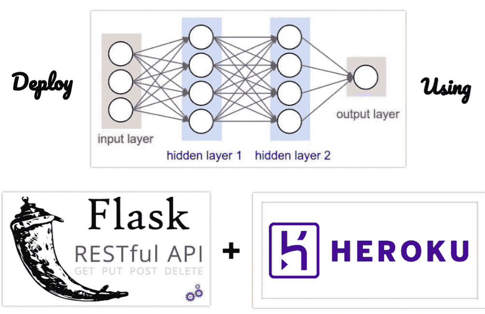
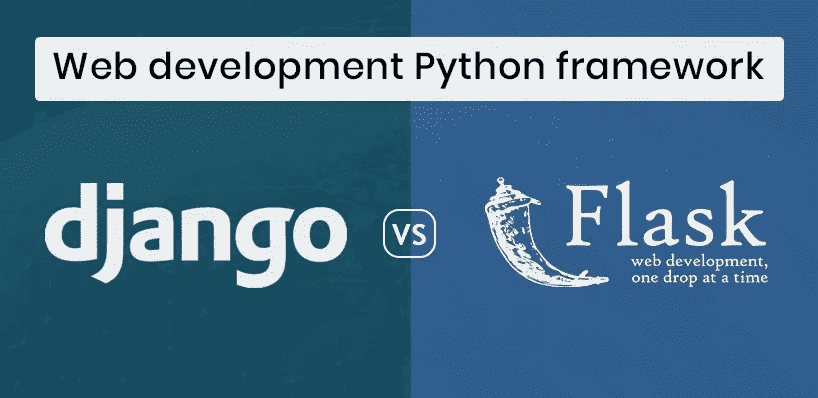
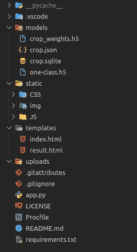
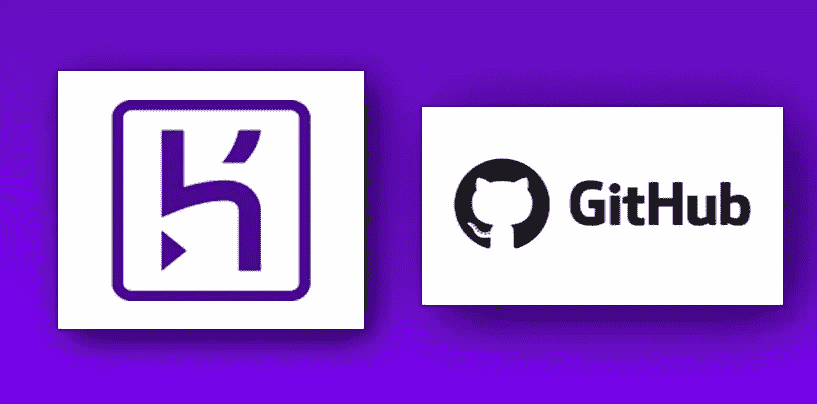
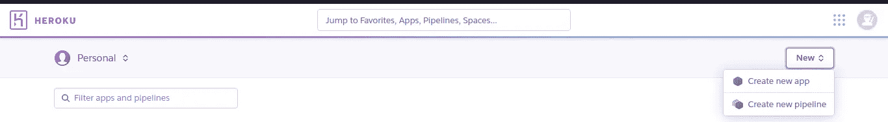
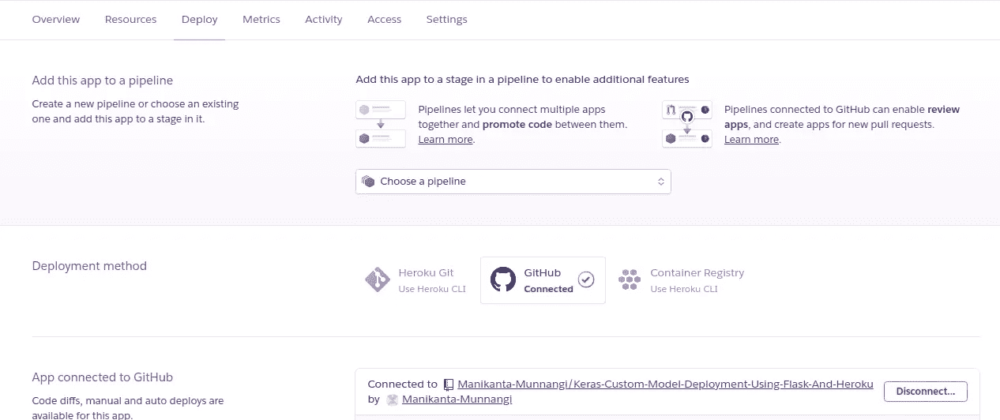
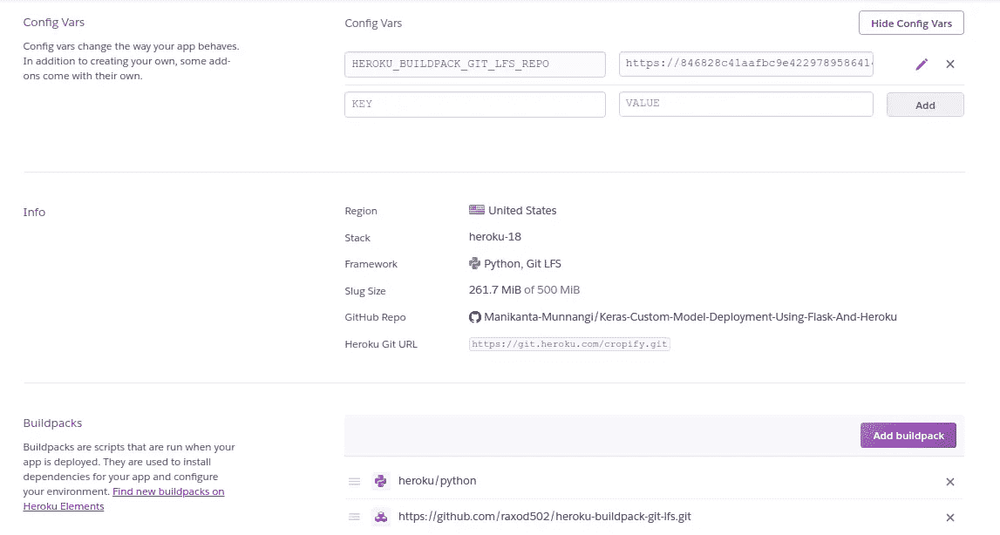
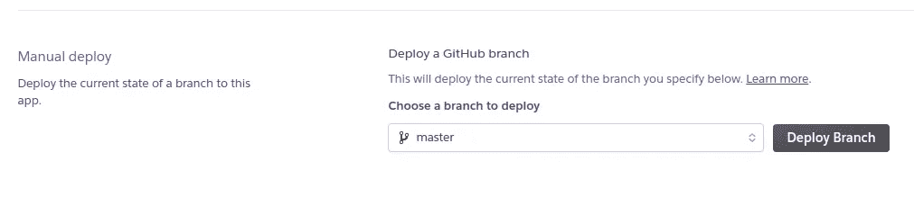

# 把你的深度学习模型训练到一个 web app 之后的一切。

> 原文：<https://towardsdatascience.com/everything-from-your-deep-learning-model-to-a-web-app-279cd733f3d4?source=collection_archive---------10----------------------->

> 使用流行的 web 框架 Flask + Heroku 是一个云平台，可以帮助您轻松部署。



Frameworks For Deploying Any Model.

> 数据科学项目的一个常规生命周期是从一个用例开始，从我们想要解决的问题类型所需的所有来源中提取数据，分析数据并执行一些功能工程，构建一个统计模型以对未来数据进行良好的概括，并部署到生产和监控中，通常用于执行措施，并在需要时使用新数据重新训练模型**。**

但是，大多数时候，人们最终会停留在建立统计模型的阶段，他们不会将他们的模型放到互联网上进行真实世界的测试，因为 ***像前端和后端开发*** 这样的新技术技能需要学习将模型部署到网络中。

当然，有一些简单的方法可以做到这一点，这将使我们的工作变得更简单，即使你应该知道一些基本知识，甚至不到你第一次部署的 20%。在这篇文章中，您将学习如何做一个部署部分表单基础。

在开始这篇文章之前，让我用我用 flask 和 Heroku 构建的项目激励你们，欢迎你们来演示。

[](https://cropify.herokuapp.com/) [## 作物:植物病害标识符

### 想知道你的植物感染了什么类型的疾病，然后上传一张(番茄、土豆)植物的图片并进入…

cropify.herokuapp.com](https://cropify.herokuapp.com/) 

# 你将从这篇文章中学到什么。

1.  训练后将模型权重保存到磁盘。
2.  部署需要哪些技能？
3.  设置和安装烧瓶。
4.  下载一个不错的 html5 前端模板。
5.  写代码上传到 Github。
6.  部署到赫罗库。

# 1.保存模型权重。

大多数人都知道这一步，通常称之为序列化。在训练了一些问题解决用例的模型之后。每个人通常保存他们的整个模型(架构+权重+优化器状态),或者只保存他们选择的 python 或 API 库(Pickle，Keras)的权重，以防止再次训练模型。有一件事你应该知道，如果你想只保存重量，你需要在加载前将它的架构作为一个 JSON 或 YAML 文件，否则它会显示一个错误“只读模式”。

假设您已经完成了训练，并希望在几天后预测某个对象的省时模型将是一个好主意，因为无需再次训练，您可以简单地加载重量并进行预测。

# 2.部署所需的技能类型。

## 2.1 Web 框架。

你应该知道 web 框架的一些基础知识互联网上有很多可供选择的框架，如 Angular.js、Node.js 和 ASP.net，PHP 许多框架，但数据科学家也喜欢 python 和 R(经常用于统计分析),我们也可以使用最流行的 web 框架如 Django 和 Flask 用 python 编写 web 应用程序。

> Flask 和 Django 是构建 web 应用的两个选择。



Flask vs Django.

当然，Flask 是一个轻量级的、完全灵活的 WSGI，易于学习和实现，但只用于小型和大型项目，但经常用于小型项目，每个人都喜欢它的简化版本。您只需 5 行代码就可以启动您的 web 应用程序。

**Django** 是一个每个人都喜欢的全栈框架，通常用于开发大型应用程序。几乎你可以做很多事情，但当你习惯它时，需要时间。它涉及一些相互关联的概念。所以，你需要在写代码之前学习这些。

**结论:** Flask 和 Django 有一些相似的概念。从 flask 开始它涵盖了基础知识，并且熟悉了一些概念，比如(模板和渲染)。通过 flask 开发了一些应用程序之后，你可以向 Django 过渡了。

**2.2 HTML+CSS+Java Script 的一些基础知识。**

是啊，前端和后端开发但是我们不会为 UI 部分和后台操作写太多代码。如果你不想让你的 web 应用程序有好的用户界面，这是完全可选的，在这种情况下，你不会太多地处理这种标记和样式，对于一个具有完全响应和异常处理的好看的网站，你需要学习一些概念。但是，相信我，会很简单的。我们只是从 bootstrap 网站或 html5 网站下载一个好看的模板。

只要对代码做一些修改，你就可以用你所有的东西创建并运行一个漂亮的网站。在几节之后，我们将在下面看到这一部分。

# 3.设置和安装烧瓶。

要安装 Flask，您需要 pip 或 conda(如果您已经安装)。在安装 flask **之前，你需要为你的 flask 项目**创建一个虚拟环境，因为不会与库冲突。我们只使用我们的项目所需的任何库及其首选版本。因此，创建一个虚拟 env 将非常有用。

```
Pip install Flask
```

安装完成后，通过在终端中导入 jupyter notebook(或)中的 flask 库来检查它是否安装正确。

# 4.为你的项目获得一个好的 UI 模板。

您可能希望在 UI 中展示您的专业项目。然后你需要做一个前端的部分。**幸运的是，我们在互联网上可以获得所有现成的代码**下面列出的一些代码是完全免费的。

[](https://html5up.net/) [## HTML5 以上

### 由@ajlkn 设计并在 Creative Commons 许可下发布的响应式 HTML5 和 CSS3 站点模板。

html5up.net](https://html5up.net/) [](https://themes.getbootstrap.com/) [## 由引导团队构建和策划的引导主题。

### Bootstrap Themes 是由 Bootstrap 的创建者策划的最好的模板和主题的集合。我们收集的…

themes.getbootstrap.com](https://themes.getbootstrap.com/) 

Twitter **Bootstrap** 是一个使用 CSS 和 Javascript / jQuery 的工具包。这是一个前端框架，所有内置的 CSS 类，你只需要导入一个，它会为你的网站做所有的样式。您可以在没有太多 CSS 知识的情况下开始工作。**它还创建了一个响应迅速的网站。**当然你得懂 HTML(建站基础)。

选择一个最适合你的项目 UI 的模板，删除模板中你觉得没用的部分。

# 5.开始写代码。

首先，我将解释我正在部署的一个 web 应用程序的使用案例，该应用程序将有助于检测植物的疾病(仅针对番茄和马铃薯两个类别),分析并提供生物和化学补救措施，以克服损失并进一步控制受影响的植物。如果你对补救措施中的农业内容感到困惑，我收集了一些视频，通过位于结果附近的视频按钮，帮助你在实践中进行解释。

你可以在我下面的 Github 链接中找到上面项目的代码。我将一步一步地详细解释代码。

[](https://github.com/Manikanta-Munnangi/Keras-Custom-Model-Deployment-Using-Flask-And-Heroku) [## mani kanta-mun nangi/Keras-Custom-Model-Deployment-Using-Flask-And-Heroku

### 此时您不能执行该操作。您已使用另一个标签页或窗口登录。您已在另一个选项卡中注销，或者…

github.com](https://github.com/Manikanta-Munnangi/Keras-Custom-Model-Deployment-Using-Flask-And-Heroku) 

首先，您应该知道 flask 项目中文件的结构。它将看起来像下面一个。



Flask files structure.

> 不用担心模特文件夹里的文件。你可以理解模型文件夹中的文件无非是模型权重(h5)、架构(JSON)和数据库(db。这些是我的项目文件，但开始时，你需要有文件夹。不要改变文件夹的名称，因为它们是 flask 想要的格式。

首先，两个文件夹是 __pycache__ 和。vscode 用于 visual studio 代码(vs code)配置文件，它将在您在 visual studio 中编码时生成。所以，不用担心。

> **文件夹:**

1.  Models == >模型权重、JSON 和任何数据库文件。

2.Static == >这是 CSS、javascript 文件以及 flask 中使用的图像将存储在该文件夹中的位置。

3.模板== >有 index.html(名字不用改)等 HTML 文件。

4.Uploads == >在进行预测之前，图像文件应该存储在某个文件夹中，就是这个。

> **文件:**

app.py == >运行 flask 并在 web 服务器上工作的主要代码。

Procfile == >您使用 Procfile 来告诉 Heroku 如何运行您的应用程序的各种文件。

requirements.txt == >列出您的项目所使用的包，以便 Heroku 在上面安装 dynos(容器)。

。要忽略的 GitHub 文件。

。gitattributes == >大文件存储路径(Git LFS)当你想上传超过 100mb 的文件时，Git LFS 就派上了用场。

## 5.2 烧瓶脚本。

5 行代码就能让你的网络应用启动并运行。

烧瓶样板代码。

**在 Index.html**写 hello world 或任何要显示的文本。

```
<!doctype html>
<html>  
<body>       
<h1> Hello world</h1>   
</body>
</html>
```

***@ app . route('/')****其中@ decorator 用来包装另一个函数，扩展其他函数的行为。*

****渲染 _ 模板*** 渲染 Html 文件。 ***app.run()启动 webserver*** 并提供一个本地主机 URL。打开 [http://127.0.0.1:5000/](http://127.0.0.1:5000/) 查看您的 web app，*

> *烧瓶基础完成。编写模型预测函数。*

*在 **app.py 文件**中创建一个预测函数，该函数通过 flask 中的**请求模块**获取我们的图像，并用 model 对其进行处理，并将结果返回给 result.html 进行显示。*

***== >使用请求功能从 flask 模块获取图像文件**。*

***== >将用户上传的图像**保存到名为“上传”的文件夹中。在预测之前，它应该在内存中。*

*==> **leaf_predict** 是一个函数，返回用户上传的图片是否有叶子。这是使用**卷积自动编码器**完成的，我将在下一篇文章中讨论。如果返回变量是 leaf，那么我们的模型将开始预测，除非它不会。*

*==> **Model_predict** 函数用于对上传的图像进行预处理，我们接受了调整大小、图像到数组、标准化和扩展维度，然后编译和预测等方面的培训。*

*==> **Info()** 功能是从数据库文件中获取疾病信息(。sqlite)。它将在 model_predict 返回疾病名称后检索疾病信息。为了检索，我们编写代码来检查疾病名称和 SQLite 数据库疾病名称是否相同，如果相同，我们将疾病信息返回到结果页面。*

*==> **最后返回无**..为什么？？在' POST **'** 方法**之后，request.files** 设置缺省为 None。*

> *如果你想得到一个清晰的图片和更多的代码，你可以通过我的 [Github](https://github.com/Manikanta-Munnangi/Keras-Custom-Model-Deployment-Using-Flask-And-Heroku) 查看。*

*检查它将是超级简单的。这是一个大项目，所以我离开你审查剩余的代码和理解，所以你可以得到工作流。*

## *5.3 输入表单的 Html 脚本。*

*用 Vs 代码或者你选择的任何 IDE 获取你下载的引导或者 Html 文件。*

*但是**的主要部分是通过 Html 按钮**获取图像数据，所以我们在提交表单数据后，应该调用 app.py 中的**预测函数***

*表单数据 Html。*

*   *< form action = **"/predict"** 功能用 POST 方法提交后进行唤起。*
*   *“file”制作一个上传文件的按钮 **accept=" image/*"** 只获取所有格式的图像，如(jpg，jpeg，png…)*
*   ***必需的**变量在最后使得用户提交表单时必须输入图像。*
*   *最后，*

## *5.4 Returning Results with Html.*

*After prediction, we want to display results it can be done with Html again. first, we need to pass the result through the “predict” function in the app.py to result.html file.*

*Results through Html.*

*result.html disease info code.*

> *After Building entire model with flask .Now, it’s time to upload your work to Github.*

*   *Uploading all code to Github for **Heroku cloud 从 GitHub 获取代码**，而不是使用 Heroku CLI 进行部署。*

*在把你的项目推给 Heroku 之前，你需要有两个 Heroku 需要的关于如何运行应用程序的文件。Procfile 和 requirements.txt*

## *Procfile:*

```
*web: gunicorn app:app --bind 0.0.0.0:$PORT*
```

*   *Gunicorn 是 Python 的开源 web 服务器。它允许 Heroku 部署我们的应用程序。你需要用 pip 安装它以防你没有安装。*
*   *我们让我们的服务器启动 app.py，使用 app name，Flask 的实例是第二个参数，第一个参数是 app 的名称。[app:app]= = >[app 的名称:它的 Flask 实例(__name__)]*

```
**from* flask *import* Flaskapp = Flask(__name__)*
```

*   *港口和主机将由 Heroku 负责。*

## *Requirements.txt:*

*将项目中使用的所有包放入一个文件中。您可能知道这个命令*

```
*pip freeze > requirements.txt*
```

*冻结命令显示所有软件包及其当前版本。我们使用“>”操作符将冻结命令的结果复制到名为 requirements.txt 的文件*

# ***6.部署到赫罗库。***

******

***Heroku with Github.***

***有了 Heroku，工作变得更简单，因为它负责一切，因为它是一个**平台即服务(PAAS)** 这意味着它确实设置了基础架构、预安装的操作系统和冗余服务器、运行时环境。除了一些您应该手动执行的步骤。***

## ***要遵循的步骤:***

1.  ***通过 Heroku 官方网站创建一个 Heroku 账户。***
2.  ***登录后，创建应用程序。***

******

***Create a new app in Heroku.***

***3.将您的项目命名为 name.herokuapp.com，并将**部署方法设置为 Github。*****

******

***Connect to Github.***

***4.这里，我们将我们的 GitHub 帐户与选择我们的**项目存储库联系起来。*****

***5.手动部署验证 procfile 并安装 requirements.txt 文件中的所有库压缩到 slug 编译器，负责将应用程序缩放到 dyno 以供执行。如果压缩到 **slug 后整个项目超过 300MB，您的应用程序停止处理您的应用程序。**因为他们在有限的时间内限制了免费访问帐户的 slug 大小。***

******

***Look for Slug, buildpacks, and config settings.***

***6.我的 slug 大小低于 300MB，框架使用了 python 和 git LFS，链接到**大型文件系统(LFS)的文件在 Heroku 中不受支持。*****

*   ***所以我们需要将 configs 作为 key“HEROKU _ build pack _ GIT _ LFS _ REPO”添加到 value“https://<token>@ github . com/username/repository . GIT”令牌是唯一的个人访问令牌。</token>***
*   ***你需要在 GitHub >设置> Heroku 的开发者设置中注册，才能访问你的 LFS 文件，还需要链接到 buildpacks 来安装 https://github.com/raxod502/heroku-buildpack-git-lfs.git 的 LFS。***

***7.最后，点击 deploy 部分的 deploy 按钮，您就完成了您的项目，人们可以通过互联网访问**。*****

******

***Finally, Deploy.***

> ***如果你有任何错误，很好地解决日志和调试你的错误，谷歌它，你一定会得到解决方案。***

# ***需要记住的要点:***

1.  ***如果你是一个学习基础知识的初学者，使用 flask 框架。***
2.  ***使用来自 bootstrap 或 html5.net 网站的模板，它们是免费的。根据您的项目对模板进行更改。***
3.  ***开始和 Heroku 一起工作，这看起来很容易，因为你经常工作。***
4.  ***最后，试着做一些能提升你技能的项目，从小项目中获得核心基础知识，然后再去做大项目。***

***这是一篇很长的文章，我希望你们喜欢它，并从这篇文章中学到了一些基础知识。尝试使用我的 GitHub 中的代码。我很快又想出了另一篇文章。***

> ***快乐学习:)***