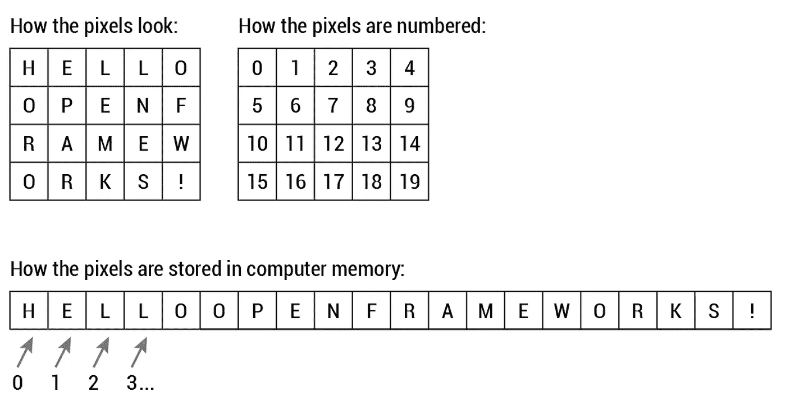
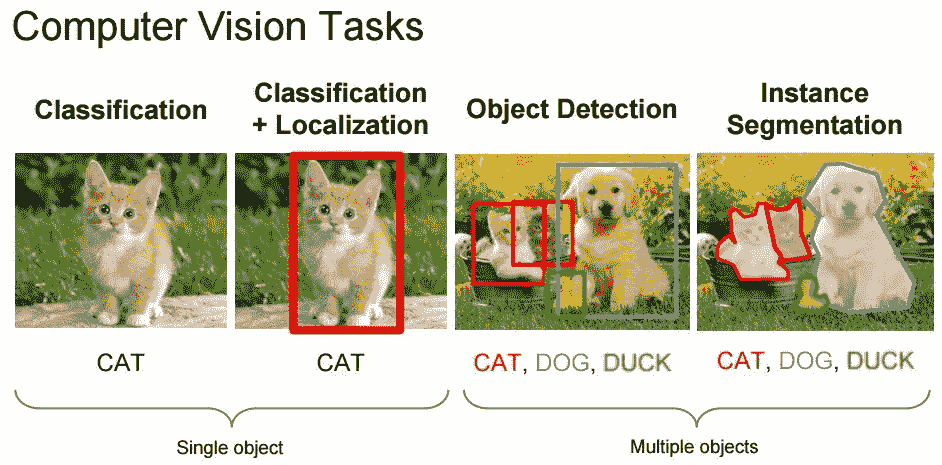

# 你想知道的关于计算机视觉的一切。

> 原文：<https://towardsdatascience.com/everything-you-ever-wanted-to-know-about-computer-vision-heres-a-look-why-it-s-so-awesome-e8a58dfb641e?source=collection_archive---------0----------------------->

## 下面来看看为什么这么牛逼。


Computer Vision in Action🤖📹 Photo by the author

最强大和最引人注目的人工智能类型之一是计算机视觉，你几乎肯定已经在许多方面体验过，甚至不知道。让我们来看看它是什么，它是如何工作的，为什么它这么棒(而且只会变得更好)。

计算机视觉是计算机科学的一个领域，它专注于复制人类视觉系统的部分复杂性，并使计算机能够像人类一样识别和处理图像和视频中的对象。直到最近，计算机视觉只能在有限的能力下工作。

由于人工智能的进步以及深度学习和神经网络的创新，该领域近年来能够实现巨大飞跃，并能够在一些与检测和标记物体相关的任务中超过人类。

计算机视觉发展背后的驱动因素之一是我们今天生成的数据量，这些数据随后被用来训练和改善计算机视觉。


YOLO Multi-Object Detection And Classification. Photo by the author

随着大量的视觉数据(*每天有超过 30 亿张图片在网上被分享*)，分析这些数据所需的计算能力现在已经可以使用了。随着计算机视觉领域随着新的硬件和算法的发展，物体识别的准确率也在提高。在不到十年的时间里，今天的系统已经从 50%的准确率达到了 99%，这使得它们在对视觉输入做出快速反应方面比人更准确。

计算机视觉的早期实验始于 20 世纪 50 年代，到 20 世纪 70 年代，它首次被用于商业用途，以区分打字和手写文本，今天，计算机视觉的应用已经呈指数增长。

> 到 2022 年，计算机视觉和硬件市场预计将达到 486 亿美元

# 计算机视觉是如何工作的？

神经科学和机器学习中的一个主要公开问题是:我们的大脑到底是如何工作的，我们如何用自己的算法来近似它？现实是，大脑计算的工作和综合理论非常少；因此，尽管神经网络应该“模仿大脑的工作方式”，但没有人能确定这是否是真的。

同样的悖论也适用于计算机视觉——因为我们无法决定大脑和眼睛如何处理图像，所以很难说生产中使用的算法有多接近我们自己的内部心理过程。

在某种程度上，计算机视觉就是模式识别。因此，训练计算机如何理解视觉数据的一种方法是给它输入图像，大量的图像数以千计，如果可能的话，数以百万计的已被标记的图像，然后对这些图像进行各种软件技术或算法的处理，使计算机能够在与这些标记相关的所有元素中寻找模式。

例如，如果你给电脑输入一百万张猫的图片(我们都喜欢它们😄😹)，它会让它们接受算法，让它们分析照片中的颜色、形状、形状之间的距离、物体彼此的边界等等，以便识别“猫”的含义。当它完成时，如果输入其他未标记的图像，计算机将(理论上)能够利用它的经验找到猫的图像。

让我们暂时把我们毛茸茸的猫朋友放在一边，让我们更专业一点🤔😹。下面是存储亚伯拉罕·林肯图像的灰度图像缓冲区的简单说明。每个像素的亮度由一个 8 位数字表示，范围从 0(黑色)到 255(白色):


Pixel data diagram. At left, our image of Lincoln; at center, the pixels labeled with numbers from 0–255, representing their brightness; and at right, these numbers by themselves. Photo by [Nguyen Dang Hoang Nhu](https://unsplash.com/@nguyendhn) on Unsplash

```
{157, 153, 174, 168, 150, 152, 129, 151, 172, 161, 155, 156,
 155, 182, 163,  74,  75,  62,  33,  17, 110, 210, 180, 154,
 180, 180,  50,  14,  34,   6,  10,  33,  48, 106, 159, 181,
 206, 109,   5, 124, 131, 111, 120, 204, 166,  15,  56, 180,
 194,  68, 137, 251, 237, 239, 239, 228, 227,  87,  71, 201,
 172, 105, 207, 233, 233, 214, 220, 239, 228,  98,  74, 206,
 188,  88, 179, 209, 185, 215, 211, 158, 139,  75,  20, 169,
 189,  97, 165,  84,  10, 168, 134,  11,  31,  62,  22, 148,
 199, 168, 191, 193, 158, 227, 178, 143, 182, 106,  36, 190,
 205, 174, 155, 252, 236, 231, 149, 178, 228,  43,  95, 234,
 190, 216, 116, 149, 236, 187,  86, 150,  79,  38, 218, 241,
 190, 224, 147, 108, 227, 210, 127, 102,  36, 101, 255, 224,
 190, 214, 173,  66, 103, 143,  96,  50,   2, 109, 249, 215,
 187, 196, 235,  75,   1,  81,  47,   0,   6, 217, 255, 211,
 183, 202, 237, 145,   0,   0,  12, 108, 200, 138, 243, 236,
 195, 206, 123, 207, 177, 121, 123, 200, 175,  13,  96, 218};
```

这种存储图像数据的方式可能与你的期望背道而驰，因为数据在显示时当然*看起来*是二维的。然而，事实就是如此，因为计算机内存只是由一个不断增长的线性地址空间列表组成。



How pixels are stored in memory. Photo by the author

我们再回到第一张图，想象一下加一个彩色的。现在事情开始变得更加复杂。计算机通常将颜色解读为一系列 3 个数值——红、绿、蓝(RGB)——在相同的 0-255 范围内。现在，除了它的位置，每个像素实际上有 3 个值供计算机存储。如果我们给林肯总统着色，那将导致 12×16×3 个值，或 576 个数字。


Photo by the author

一幅图像需要大量的内存，一个算法需要迭代大量的像素。但是，为了训练一个具有有意义的准确性的模型，特别是当你谈论深度学习时，你通常需要成千上万的图像，越多越好。

# 计算机视觉的演变

在深度学习出现之前，计算机视觉可以执行的任务非常有限，需要开发人员和人类操作员进行大量的手动编码和努力。例如，如果您想要执行面部识别，您必须执行以下步骤:

*   **创建一个数据库**:你必须以特定的格式捕捉所有你想追踪的对象的个人图像。
*   **给图像加注释**:然后，对于每一张单独的图像，你必须输入几个关键数据点，比如两眼之间的距离、鼻梁的宽度、上唇和鼻子之间的距离，以及其他几十个定义每个人独特特征的测量数据。
*   **捕捉新图像**:接下来，你必须捕捉新图像，无论是照片还是视频内容。然后你必须再次经历测量过程，在图像上标记关键点。你还必须考虑图像拍摄的角度。

在所有这些手动工作之后，应用程序最终能够将新图像中的测量值与存储在其数据库中的测量值进行比较，并告诉您它是否与它正在跟踪的任何配置文件相符。事实上，几乎没有自动化，大部分工作都是手动完成的。误差幅度仍然很大。

机器学习为解决计算机视觉问题提供了一种不同的方法。有了机器学习，开发人员不再需要手动将每个规则编码到他们的视觉应用程序中。相反，他们编写了“特征”程序，即可以检测图像中特定模式的小型应用程序。然后，他们使用统计学习算法，如线性回归、逻辑回归、决策树或支持向量机(SVM)来检测模式和分类图像，并检测其中的对象。

机器学习帮助解决了许多传统软件开发工具和方法面临的历史性挑战。例如，几年前，机器学习工程师能够创建一个软件，它可以比人类专家更好地预测乳腺癌的生存窗口。然而，构建该软件的功能需要数十名工程师和乳腺癌专家的努力，并花费了大量时间进行开发。

深度学习提供了一种完全不同的方法来进行机器学习。深度学习依赖于神经网络，这是一种通用功能，可以解决任何通过示例表示的问题。当你为神经网络提供许多特定类型数据的标记示例时，它将能够提取这些示例之间的共同模式，并将其转换为数学方程，这将有助于对未来的信息进行分类。

例如，创建一个具有深度学习的面部识别应用程序只需要你开发或选择一个预构建的算法，并用它必须检测的人的面部样本来训练它。给定足够多的例子(大量的例子)，神经网络将能够检测人脸，而无需进一步的特征或测量指令。

深度学习是做计算机视觉非常有效的方法。在大多数情况下，创建一个好的深度学习算法可以归结为收集大量的标记训练数据，并调整参数，如神经网络的类型和层数以及训练时期。与以前的机器学习类型相比，深度学习的开发和部署更加容易和快速。

目前大多数计算机视觉应用，如癌症检测、自动驾驶汽车和面部识别，都利用了深度学习。由于硬件和云计算资源的可用性和进步，深度学习和深度神经网络已经从概念领域进入实际应用。

# 破译一幅图像需要多长时间

总之不多。这就是为什么计算机视觉如此令人兴奋的关键:尽管在过去，即使是超级计算机也可能需要几天或几周甚至几个月才能完成所有需要的计算，但今天的超高速芯片和相关硬件，以及快速可靠的互联网和云网络，使这一过程变得快如闪电。曾经至关重要的因素是许多从事人工智能研究的大公司愿意分享他们的工作脸书、谷歌、IBM 和微软，特别是通过开源他们的一些机器学习工作。

这允许其他人在他们的工作基础上进行，而不是从零开始。因此，人工智能行业正在发展，不久前需要几周才能完成的实验今天可能只需要 15 分钟。对于计算机视觉的许多现实应用来说，这个过程都是在几微秒内连续发生的，所以今天的计算机能够做到科学家所说的“情境感知”

# 计算机视觉的应用

计算机视觉是机器学习中的一个领域，其中的核心概念已经被集成到我们每天使用的主要产品中。

# 自动驾驶汽车中的 CV

但不仅仅是科技公司在利用机器学习进行图像应用。

计算机视觉使自动驾驶汽车能够了解周围的环境。摄像机从汽车周围的不同角度捕捉视频，并将其输入计算机视觉软件，然后实时处理图像，以找到道路的尽头，阅读交通标志，检测其他汽车，物体和行人。然后，无人驾驶汽车可以在街道和高速公路上行驶，避免撞到障碍物，并(希望)安全地将乘客送到目的地。

# 人脸识别中的 CV

计算机视觉在面部识别应用中也发挥着重要作用，这种技术使计算机能够将人的面部图像与他们的身份进行匹配。计算机视觉算法检测图像中的面部特征，并将它们与面部轮廓数据库进行比较。消费设备使用面部识别来验证其所有者的身份。社交媒体应用使用面部识别来检测和标记用户。执法机构也依靠面部识别技术来识别视频中的罪犯。

# 增强现实和混合现实中的 CV

计算机视觉在增强和混合现实中也发挥着重要作用，这种技术使智能手机、平板电脑和智能眼镜等计算设备能够在现实世界的图像上覆盖和嵌入虚拟物体。AR gear 使用计算机视觉来检测现实世界中的物体，以便确定设备显示屏上放置虚拟物体的位置。例如，计算机视觉算法可以帮助 AR 应用程序检测桌面、墙壁和地板等平面，这是建立深度和维度以及在物理世界中放置虚拟对象的一个非常重要的部分。

# 医疗保健中的简历

计算机视觉也是医疗技术进步的重要组成部分。计算机视觉算法可以帮助自动化任务，如检测皮肤图像中的癌性痣，或在 x 射线和 MRI 扫描中发现症状。

# 计算机视觉的挑战

帮助电脑看东西是非常困难的。

发明一台像我们一样看东西的机器看起来是一项艰巨的任务，不仅因为很难让计算机做到这一点，还因为我们不完全确定人类的视觉最初是如何工作的。

研究生物视觉需要了解像眼睛这样的感知器官，以及对大脑内感知的解释。尽管像任何涉及大脑的研究一样，还有很长的路要走，但在绘制过程图表和发现系统使用的技巧和捷径方面，已经取得了很大进展。



Credit For The Image Goes To: [**Mike Tamir**](https://twitter.com/MikeTamir)

许多流行的计算机视觉应用包括尝试识别照片中的事物；例如:

*   **物体分类**:这张照片中的物体属于哪一大类？
*   **物体识别**:这张照片中给定的物体是哪种类型？
*   **实物验证**:实物在照片里吗？
*   **物体检测**:照片中的物体在哪里？
*   **物体地标检测**:照片中物体的关键点是什么？
*   **物体分割**:图像中有哪些像素属于物体？
*   **物体识别**:这张照片里有什么物体，它们在哪里？

除了识别之外，其他分析方法包括:

*   **视频运动分析**利用计算机视觉来估计视频中物体的速度，或者摄像机本身的速度。
*   在**图像分割**中，算法将图像分割成多组视图。
*   **场景重建**创建通过图像或视频输入的场景的 3D 模型。
*   在**图像恢复**中，使用基于机器学习的过滤器从照片中去除模糊等噪声。

任何其他涉及通过软件理解像素的应用都可以安全地称为计算机视觉。

# 结论

尽管最近取得了令人印象深刻的进展，但我们仍然没有接近解决计算机视觉问题。然而，已经有多个医疗机构和企业找到了将由 CNN 支持的 CV 系统应用于现实世界问题的方法。而且这种趋势不太可能很快停止。

**如果你想联系我，顺便说一句，你知道一个好笑话，你可以在** [**Twitter**](https://twitter.com/ikac_Ilija) **或** [**LinkedIn 上联系我。**](https://www.linkedin.com/in/ilijamihajlovic/)

感谢阅读！😄 🙌