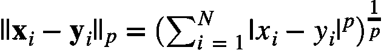

# 你想知道的关于 K 近邻的一切

> 原文：<https://towardsdatascience.com/everything-you-ever-wanted-to-know-about-k-nearest-neighbors-dab986e21b60?source=collection_archive---------20----------------------->

## 五分钟后


Photo by [Nina Strehl](https://unsplash.com/@ninastrehl?utm_source=medium&utm_medium=referral) on [Unsplash](https://unsplash.com?utm_source=medium&utm_medium=referral)

k 近邻算法是最简单、最容易理解的机器学习算法之一。它可以用于分类和回归任务，但在分类中更常见，所以我们将从这个用例开始。不过，这些原则在这两种情况下都适用。

# **下面是算法:**

1.  定义 *k*
2.  定义距离度量，通常是欧几里得距离
3.  对于一个新的数据点，找到最近的 *k* 个训练点，并以某种方式组合它们的类别——通常是投票——以获得一个预测的类别

就是这样！

**一些好处:**

*   不需要任何传统意义上的训练。你只需要一个快速的方法来找到最近的邻居。
*   易于理解和解释。

**部分否定:**

*   您需要定义 k，这是一个超参数，因此它可以通过交叉验证进行调整。**k 值越高，偏差越大，k 值越小，方差越大。**
*   您必须选择一个距离度量，根据度量的不同，可能会得到非常不同的结果。同样，您可以使用交叉验证来决定使用哪个距离。
*   它并没有真正提供哪些特性可能是重要的见解。
*   由于维数灾难，它可能会受到高维数据的影响。基本上，维度的诅咒意味着在高维度中，很可能接近的点并不比平均距离近多少，这意味着接近并没有太大的意义。在高维度中，数据变得非常分散，这就造成了这种现象。网上有很多关于这方面的好资源，我就不多说了。

**基本假设:**

*   对于我们的目标类或值，接近的数据点共享相似的值。

# **投票方式**

*   **多数投票:**选出 *k n* 个最近的邻居后，对这些邻居的班级进行“投票”。新的数据点被分类为邻居的大多数类。如果您正在进行二元分类，建议您使用奇数个邻居，以避免票数相等。然而，在一个多类问题中，更难避免平局。一个常见的解决方案是降低 k ，直到平局被打破。最常见类别的投票分数也可以作为该类别的概率得分。
*   **距离加权:**不是直接对最近的邻居 *k* 进行投票，而是根据该实例与新数据点的距离对每一票进行加权。一种常见的加权方法是基于新数据点和训练点之间的距离。新的数据点被添加到总权重最大的类别中。这不仅减少了平局的机会，而且还减少了数据失真的影响。

# 距离度量

欧几里德距离，或 2 范数，是一种非常常见的距离度量，用于 *k-* 最近邻。然而，可以使用任何标准。*p*-定额定义为



因此，对于 *p* 的任何值，您可以定义两点之间的距离: *x* 和 *y.*

# 搜索算法

如上所述，除了准备一种快速查找相邻点的方法之外，没有真正的训练。假设您的数据集包含 2000 个点。对一个点的 3 个最近邻居的强力搜索不需要很长时间。但是如果数据集包含 2，000，000 个点，强力搜索可能会变得非常昂贵，尤其是在数据的维度很大的情况下。其他搜索算法为了更快的运行时间而牺牲了穷举搜索。KDTrees 或 Ball trees 等结构用于加快运行时间。虽然我们不会深入这些结构的细节，但了解它们以及它们如何优化您的运行时间(尽管训练时间确实会增加)是很重要的。

# 半径邻居分类器

一个非常相关的算法是半径邻居分类器。这与最近邻分类器的想法相同，但不是查找 *k-* 最近邻，而是查找给定半径内的所有邻居。设置半径需要一些领域知识；如果您的点紧密地聚集在一起，您可能希望使用较小的半径来避免几乎每个点都投票。

# k-邻居回归量

为了将我们的问题从分类转变为回归，我们所要做的就是找到第 *k* 个最近邻的加权平均值。我们使用与上述相同的加权方法，计算这些最接近值的加权平均值，而不是取多数类。在这种情况下,“多数投票”只是邻居的简单平均值，而“距离加权”是由距离加权的平均值。

# 代码！

让我们看看这一切是如何与一些 Python 代码结合在一起的:

Source: [https://gist.github.com/tfolkman/1f122eb101011edc4a1456c70aef07fd](https://gist.github.com/tfolkman/1f122eb101011edc4a1456c70aef07fd)

一旦运行，您将获得:

```
Best Params: {'n_neighbors': 5, 'p': 1, 'weights': 'uniform'} 
Train F1: 0.9606837606837607 
Test Classification Report:             
                  precision    recall  f1-score   support            
          0       0.97         0.88    0.93       43  
          1       0.93         0.99    0.96       71  
avg / total       0.95         0.95    0.95       114  
Train Accuracy: 0.9494505494505494 
Test accuracy: 0.9473684210526315
```

还不错！希望这篇文章能帮助你更好地理解 K 近邻是如何工作的，以及如何在 Python 中实现它。如果你想学习更多的机器学习算法，一定要看看《Scikit-Learn 和 TensorFlow 的[动手机器学习》这本书。](https://amzn.to/38cz74r)

这篇文章也可以在这里找到[。](https://learningwithdata.com/posts/tylerfolkman/everything-you-ever-wanted-to-know-about-k-nearest-neighbors-dab986e21b60/)

**加入我的** [**邮箱列表**](https://upscri.be/lg7gvt) **保持联系。**