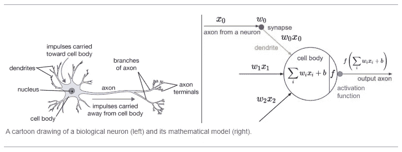

# 关于深度学习模型中的“激活函数”，你需要知道的一切

> 原文：<https://towardsdatascience.com/everything-you-need-to-know-about-activation-functions-in-deep-learning-models-84ba9f82c253?source=collection_archive---------0----------------------->

这篇文章是你的**一站式解决方案，可以解决你脑海中出现的与深度学习模型中使用的激活函数相关的每个可能的问题**。**这些基本上是我关于激活函数的笔记，以及我对这个话题的所有知识都集中在一个地方**。所以，不做任何不必要的介绍，让我们直接进入正题。

# 内容

1.  **什么是激活功能**，它在**网络**中做什么？
2.  **为什么**需要它而**为什么不用线性函数代替**？
3.  激活功能的理想特征是什么？
4.  使用各种非线性激活
5.  **值得注意的**来自**最新研究**的非线性激活
6.  **如何(和哪个)在深度神经网络中使用**它们

# 什么是激活函数？

简单地说，激活函数是添加到人工神经网络中的函数，以便帮助**网络学习数据**中的复杂模式。当与我们大脑中基于神经元的模型进行比较时，激活功能最终决定向下一个神经元发出什么信号。这也正是激活函数在人工神经网络中的作用。**它接收前一个单元的输出信号，并将其转换成某种形式，可以作为下一个单元的输入**。下图总结了这种比较。

Source: cs231n by Stanford

# 为什么需要它？

在网络中具有非线性激活函数有多种原因。

1.  除了前面讨论的生物相似性，它们还有助于根据我们的要求，将神经元的输出值限制在一定的范围内。这一点很重要，因为激活函数的输入是 **W*x + b** ，其中 **W** 是单元的重量，而 **x** 是输入，然后有偏置 **b** 加到其上。如果不受某个限制，这个值可以非常大，特别是在具有数百万个参数的非常深的神经网络的情况下。这将导致计算问题。例如，有一些激活函数(如 softmax)为不同的输入值(0 或 1)输出特定的值。
2.  激活函数中最重要的特征是其将非线性加入神经网络的能力。为了理解这一点，让我们考虑如下图所示的多维数据:

使用三个特征(图中的体重、收缩压和年龄)的线性分类器可以给我们一条穿过三维空间的线，但它永远无法准确地学习使一个人成为吸烟者或不吸烟者的模式(手头的分类问题)，因为定义这种分类的模式仅仅是**非线性的。人工神经网络出现了。如果我们使用具有单个细胞但没有激活功能的人工神经网络会怎样。因此，我们的输出基本上是 **W*x + b.** ，但这是不好的，因为 **W*x 也有 1 度**，因此是线性的，而**这基本上等同于线性分类器。****

如果我们堆叠多层。让我们将 nᵗʰ图层表示为 fₙ(x).的函数所以我们有:

**o(x) = fₙ(fₙ₋₁(….f₁(x)**

然而，这也不够复杂，尤其是对于具有非常高的模式的问题，例如在计算机视觉或自然语言处理中面临的问题。

为了使模型获得学习非线性模式的能力(也称为更高程度的复杂性)，在它们之间添加了特定的非线性层(激活函数)。

# 激活功能的理想特征

1.  **消失梯度问题:**使用过程梯度下降来训练神经网络。梯度下降包括反向传播步骤，该步骤基本上是链式法则，以获得权重的变化，从而减少每个时期后的损失。考虑一个两层网络，第一层表示为 f₁(x，第二层表示为 f₂(x).整个网络是 o(x) = f₂(f₁(x)).如果我们在反向传递过程中计算权重，我们得到 o`(x) = f₂(x)*f₁`(x).这里 f₁(x)本身是由*动作* (W₁*x₁ + b₁)组成的复合函数，其中*动作*是层 1 之后的激活函数。再次应用链式法则，我们清楚地看到 f₁`(x) = *行为* (W₁*x₁ + b₁)*x₁，这意味着它也直接依赖于激活值。现在想象这样一个链式法则在反向传播时经过多层。如果 *Act* ()的值在 0 和 1 之间，那么几个这样的值将相乘以计算初始层的梯度。这降低了初始层的梯度值，并且这些层不能正确地学习。换句话说，由于网络的深度和激活将值移至零，它们的梯度趋于消失。这被称为**消失梯度问题**。所以我们希望我们的激活函数不会将梯度移向零。
2.  **以零为中心:**激活函数的输出应该在零处对称，这样梯度就不会移动到特定的方向。
3.  **计算开销**:激活函数在每一层之后应用，在深度网络中需要计算上百万次。因此，它们的计算成本应该很低。
4.  **可微分:**如上所述，使用梯度下降过程训练神经网络，因此模型中的层需要可微分或至少部分可微分。**这是一个功能作为激活功能层工作的必要条件。**

# 使用各种非线性激活

*   **乙状结肠:**乙状结肠的定义是:

**此激活功能仅出于历史原因，从未在实际模型中使用过。**计算量很大，会导致消失梯度问题，并且不是以零为中心的。这种方法一般用于二分类问题。

*   **软最大值**:软最大值是乙状结肠的一种更一般化的形式。用于**多类分类问题**。与 sigmoid 类似，它产生 0–1 范围内的值，因此被用作分类模型中的最后一层。
*   **Tanh:**Tanh 定义为:

如果你把它比作 sigmoid，它只解决了一个以零为中心的问题。

*   **ReLU** : ReLU **(整流线性单元)**定义为 **f(x) = max(0，x):**

这是一个广泛使用的激活函数，尤其是对于卷积神经网络。它易于计算，不会饱和，也不会导致梯度消失的问题。它只有一个问题，那就是不以零为中心。它受到**“垂死的热路”**问题的困扰。因为所有负输入的输出都是零。导致一些节点完全死亡，什么也学不到。

ReLU 的另一个问题是激活爆炸，因为它的上限是 inf。这有时会导致节点不可用。

*   **泄漏 ReLU 和参数 ReLU** :定义为 **f(x) = max(αx，x)**

the figure is for α = 0.1

这里α是一个超参数，一般设置为 **0.01** 。显然，漏 ReLU 在一定程度上解决了**“将死 ReLU”**的问题。注意，如果我们将α设置为 1，那么泄漏 ReLU 将变成线性函数 f(x) = x，并且将是无用的。因此， **α的值永远不会接近 1。**如果我们分别为每个神经元设置 **α** 作为超参数，我们得到**参数 ReLU** 或 **PReLU** 。

*   **ReLU6** :基本上是正向的 ReLU 限制，定义为 **f(x) = min(max(0，x)，6)**

这有助于停止激活爆炸，从而停止梯度爆炸(去 inf ),以及正常 ReLUs 发生的另一个小问题。

一个人想到的想法是，为什么不将 ReLU6 和 LeakyReLU 结合起来，以解决我们在以前的激活功能中遇到的所有已知问题。流行的 DL 框架没有提供这种激活功能的实现，但我认为这是一个好主意。

# **值得注意的**非线性激活来自**最新研究**

*   **Swish** :这是 Ramachandran 等人在 2017 年提出的，定义为 **f(x) = x*sigmoid(x)** 。

与 ReLU 相比，它的性能稍好，因为它的图形与 ReLU 非常相似。但是，因为它不会像 ReLU 在 x = 0 时那样在某一点突然改变，所以在训练时更容易收敛。

但是，Swish 的缺点是计算量很大。为了解决这个问题，我们来到了 Swish 的下一个版本。

*   **硬切换或 H 切换**:这被定义为:

最好的部分是，它几乎类似于 swish，但它的计算成本更低，因为它用 ReLU(线性类型)代替了 sigmoid(指数函数)。

# **如何在深度神经网络中使用****？**

*   ****Tanh 和 sigmoid 导致巨大的消失梯度问题**。因此，不应使用它们。**
*   ****从你网络中的 ReLU 开始**。激活层是在重量层(类似 CNN、RNN、LSTM 或线性致密层)之后添加的，如上文所述。如果你认为模型已经停止学习，那么你可以用一个 LeakyReLU 来代替它，以避免垂死的 ReLU 问题。然而，泄漏的 ReLU 会稍微增加计算时间。**
*   ****如果您的网络中也有批量定额层，则在激活功能生成 CNN-批量定额- *行为*** *之前添加。虽然批处理规范和激活函数的顺序是一个有争议的话题，有些人说顺序无关紧要，但我使用上面提到的顺序只是为了遵循最初的批处理规范论文。***
*   **激活函数在其默认的超参数中工作得最好，这些超参数在流行的框架中使用，如 Tensorflow 和 Pytorch。然而，可以调整 **LeakyReLU 中的负斜率，将其设置为 0.02** 以加快学习。**

**那是所有的乡亲们😃**

**我已经尝试解决每一个与激活功能相关的问题，但是，如果我错过了什么，请在下面评论。**

****可以在我的** [**Github**](https://github.com/vandit15) **上看更多深度学习相关的东西，关注我的**[**Linkedin**](https://www.linkedin.com/in/vandit-jain15/)**。****

****我之前的一些文章:****

** [## 关于 Auto-Deeplab 你需要知道的一切:谷歌关于细分的最新消息

### 搜索图像分割模型

towardsdatascience.com](/everything-you-need-to-know-about-auto-deeplab-googles-latest-on-segmentation-181425d17cd5)  [## 关于 MobileNetV3 及其与以前版本的比较，您需要了解的一切

### 论文综述:寻找 MobilenetV3，ICCV 19

towardsdatascience.com](/everything-you-need-to-know-about-mobilenetv3-and-its-comparison-with-previous-versions-a5d5e5a6eeaa)  [## 使用辅助旋转损耗的自监督 GANs

### 弥合有监督和无监督图像生成之间的差距

towardsdatascience.com](/self-supervised-gans-using-auxiliary-rotation-loss-60d8a929b556)  [## 使用专门为其制作的损失来处理类不平衡数据

### 通过添加大约 10 行代码，在严重的类不平衡数据上获得超过 4%的准确性提升。

towardsdatascience.com](/handling-class-imbalanced-data-using-a-loss-specifically-made-for-it-6e58fd65ffab)**