# 关于 TensorFlow 中的自动编码器，您需要了解的一切

> 原文：<https://towardsdatascience.com/everything-you-need-to-know-about-autoencoders-in-tensorflow-b6a63e8255f0?source=collection_archive---------11----------------------->

## 在 TensorFlow 中从理论到实现

Photo by [Alex wong](https://unsplash.com/@killerfvith?utm_source=medium&utm_medium=referral) on [Unsplash](https://unsplash.com?utm_source=medium&utm_medium=referral)

自动编码器是人工神经网络，可以从未标记的训练集中学习。这可能被戏称为*无监督深度学习*。它们既可以用于降维，也可以作为**生成模型**，这意味着它们可以从输入数据中生成新数据。

在本帖中，将介绍不同类型的自动编码器及其应用，并使用 TensorFlow 实现。

所有代码都可以在 Github [回购](https://github.com/marcopeix/Neural_Networkds_and_Deep_Learning/blob/master/Autoencoders.ipynb)中获得。

点燃你的笔记本，让我们开始吧！

> 关于机器学习、深度学习和人工智能的实践视频教程，请查看我的 [YouTube 频道](https://www.youtube.com/channel/UC-0lpiwlftqwC7znCcF83qg?view_as=subscriber)。

Technically, we can generate new “faces” with autoencoders!

# 自动编码器如何工作

自动编码器将数据作为输入，将其转换为有效的内部表示，并输出看起来像输入的数据。

换句话说，它在输入中寻找模式，以生成新的东西，但非常接近输入数据。

自动编码器总是由两部分组成:

*   一个**编码器**或**识别网络**
*   一个**解码器**或**生成网络**

当然，编码器将输入转换成更简单的内部表示，解码器负责从内部表示产生输出。

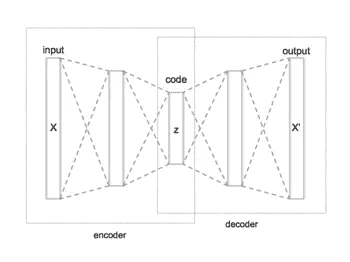

Schema of an autoencoder. Note that the internal representation is also termed “code”. [Source](https://en.wikipedia.org/wiki/Autoencoder)

注意，自动编码器在输入和输出层具有相同数量的神经元。为了迫使网络学习数据中最重要的特征，隐藏层必须具有较少的神经元。这样，它就不能简单地将输入复制到输出。由于隐藏层的维数比输出低，自动编码器被称为*欠完成。*

# 带自动编码器的 PCA

作为降维的一个例子，如果 PCA 仅使用线性激活函数，并且如果成本函数被设置为均方误差(MSE ),则可以用自动编码器来执行 PCA。

让我们看看如何实现这一点。

首先，我们创建一个虚拟 3D 数据集:

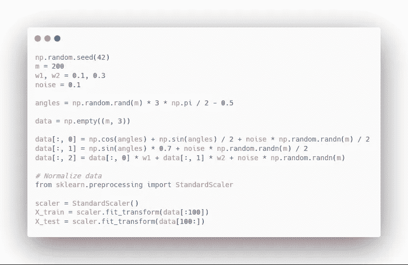

绘制数据集，我们得到:

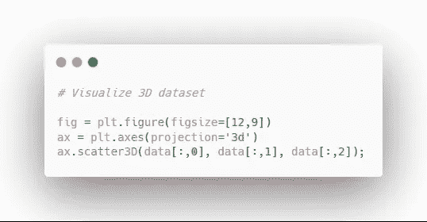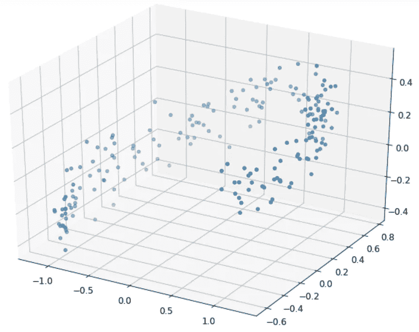

Generated 3D dataset

厉害！现在，我们准备编码和训练一个自动编码器来执行 PCA:

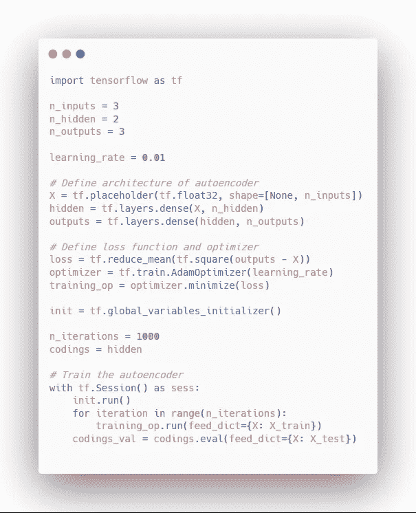

现在，我们可以像这样绘制结果:

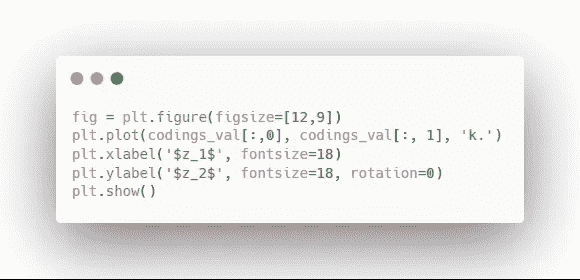

您应该会看到:

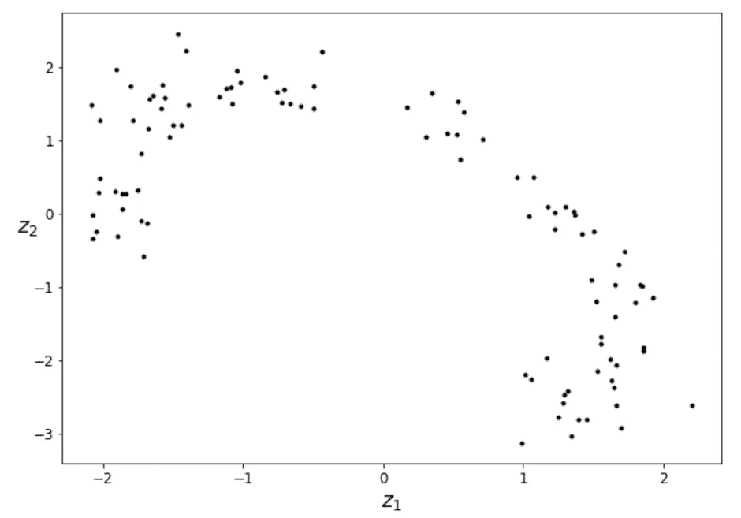

Result of PCA with an autoencoder

太好了！如您所见，自动编码器通过保持原始数据集的方差有效地执行了 PCA，但是是在 2D 平面上。

# 堆叠自动编码器

就像其他神经网络一样，自动编码器可以有多个隐藏层。它们被称为*堆叠式自动编码器*。更多的隐藏层将允许网络学习更复杂的特征。然而，过多的隐藏层可能会使输入过拟合，并且自动编码器将不能很好地概括。

堆叠式自动编码器的架构是关于*编码*层(中间隐藏层)对称的，如下图所示。

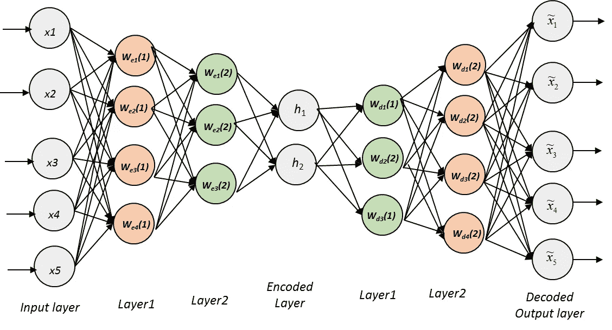

Schema of a stacked autoencoder

## MNIST 的实施情况

让我们使用 MNIST 数据集来训练堆栈式自动编码器。

首先，我们导入 MNIST 数据集:

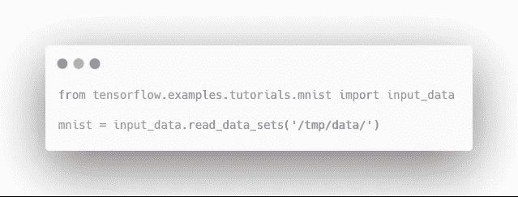

然后，我们构建堆栈式自动编码器:

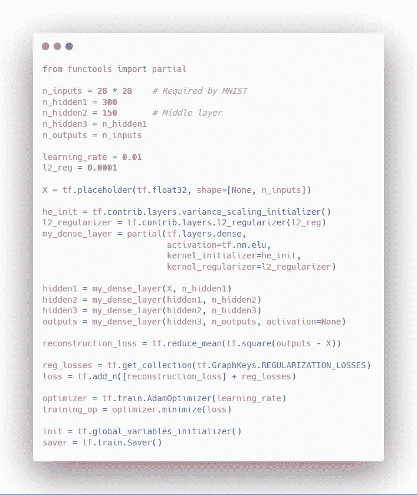

我们运行它:

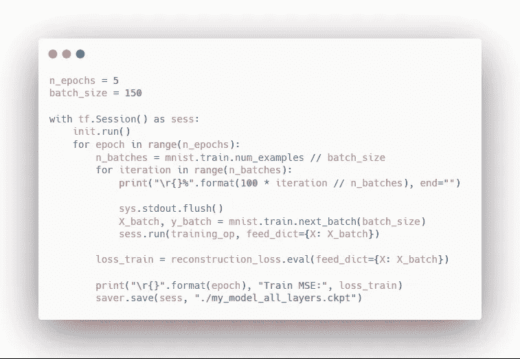

最后，我们可以看到自动编码器是如何重建数字的:

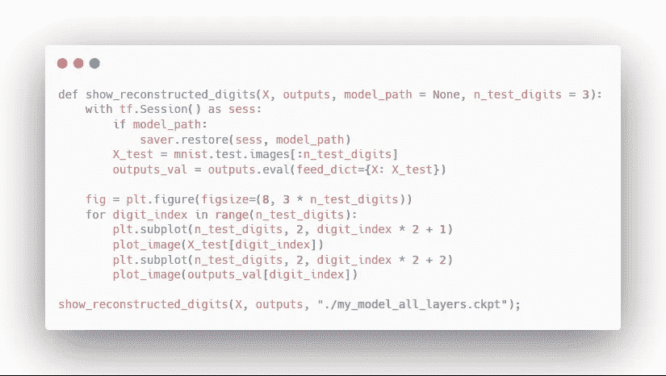

您应该会看到:

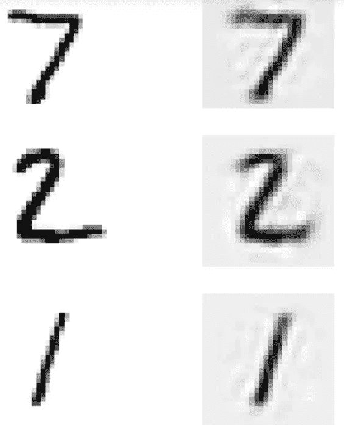

Reconstructed digits with a stacked autoencoder. **Left**: original digits. **Right**: reconstructed digits.

# 用可变自动编码器生成数字

2014 年推出的自动编码器的一个重要类别:变型自动编码器。它们在两个方面不同于传统的自动编码器:

*   它们是概率自动编码器，这意味着输出部分是偶然的，即使在训练之后
*   它们是生成式自动编码器；他们可以生成看起来像输入的新数据实例

变分自动编码器的结构与传统自动编码器的结构非常相似。但是，如下图，有一个小小的转折。

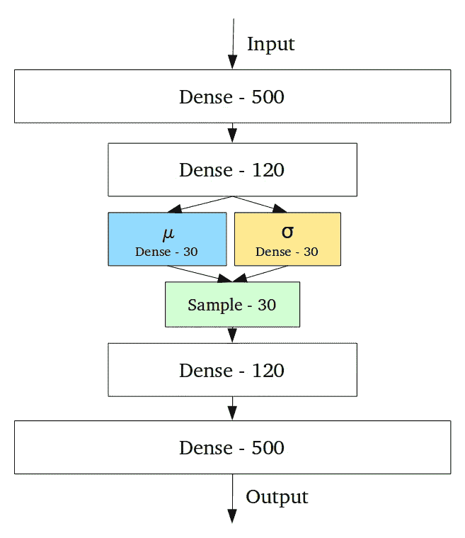

Schema of a variational autoencoder

这里，自动编码器产生了一个*均值*编码(*μ*)和一个标准差(*σ*)。然后，从具有相同均值*μ*和标准差*σ*的高斯分布中随机采样实际编码。然后，它被正常解码以产生输出。

此外，成本函数还有第二部分，称为*潜在损失*。这确保了自动编码器的编码看起来像是从简单的高斯分布中采样的。

让我们看看如何构建一个可变的自动编码器来生成新的手写数字。

至于前面的自动编码器，我们从定义架构和构建张量流图开始。您会注意到它与以前的自动编码器非常相似，但是我们添加了几个隐藏层来产生用于输出采样的平均值和标准偏差。

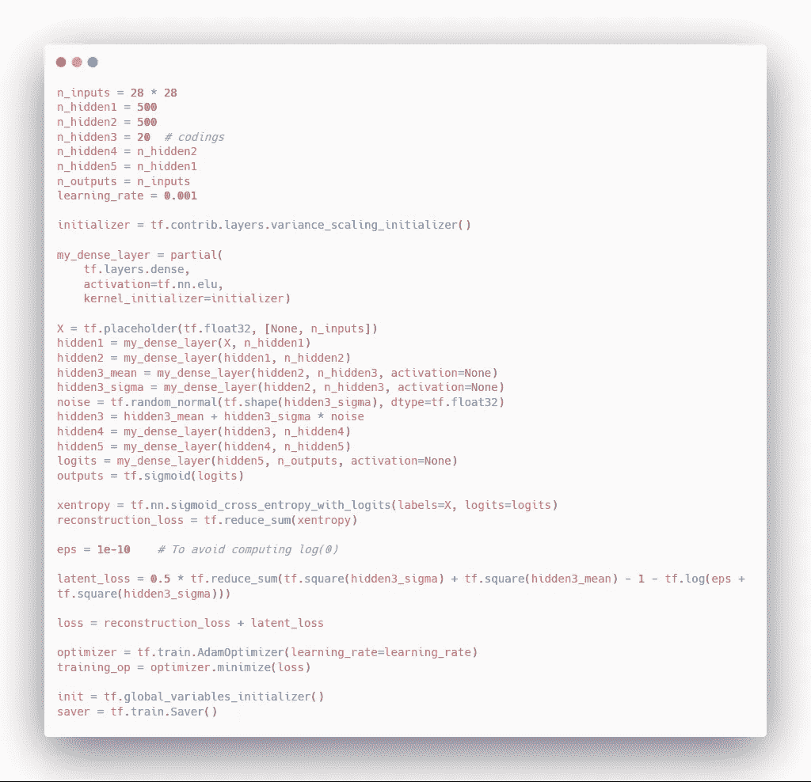

然后，我们可以通过从 MNIST 数据集学习来训练模型生成新的数字:

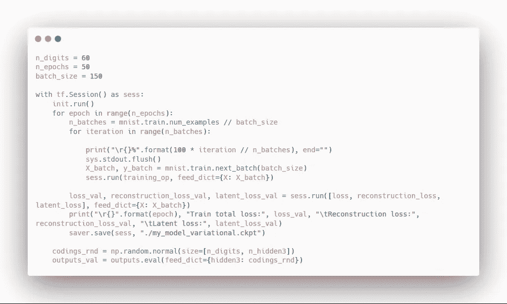

输出结果时，您应该看到:

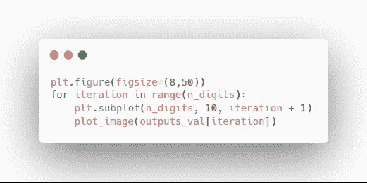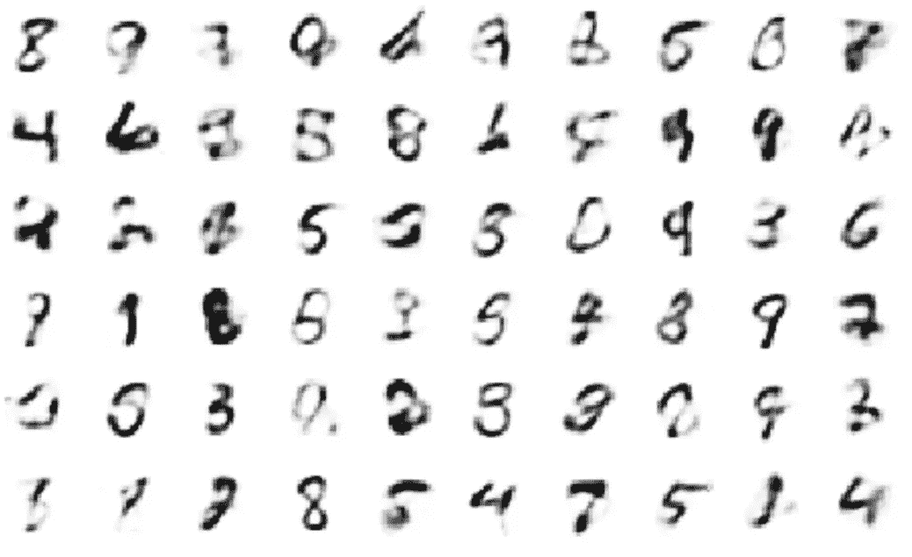

Generated digits from a variational autoencoder

正如你所看到的，数字非常接近 MNIST 数据集，我们的变分自动编码器成功地学习了关于输入的最重要的特征。

干得好，坚持到了最后！在这篇文章中，我们了解了自动编码器如何工作，以及它们如何用于降维、无监督学习和作为生成模型。

参考:使用 Scikit-Learn 和 tensor flow-aurélien géRon 进行机器实践学习