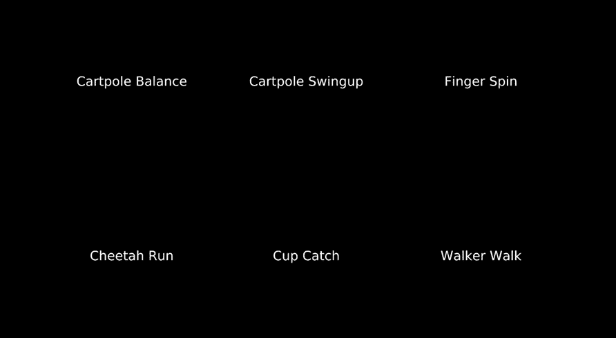
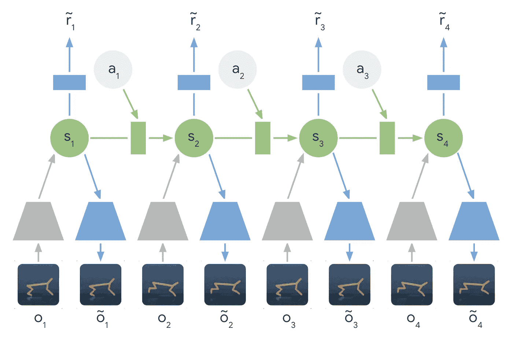
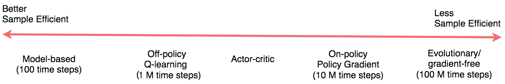
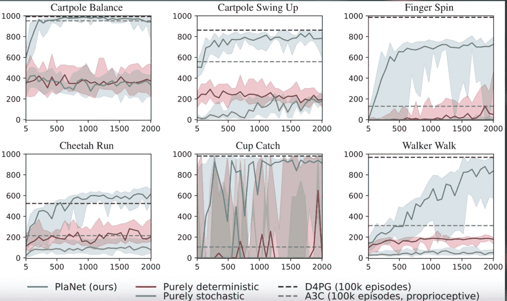

# 关于谷歌新的行星强化学习网络，你需要知道的一切

> 原文：<https://towardsdatascience.com/everything-you-need-to-know-about-googles-new-planet-reinforcement-learning-network-144c2ca3f284?source=collection_archive---------16----------------------->

## Google AI 的 PlaNet AI 对强化学习研究意味着什么，迁移学习如何发挥关键作用

Learning to walk before we can run

迁移学习如今在机器学习社区风靡一时。

迁移学习是许多托管 AutoML 服务的基础，这些服务由谷歌、T2、T4、IBM、Azure 和 T7 提供。它现在在最新的 NLP 研究中占据显著地位——出现在谷歌的变形金刚双向编码器表示( [BERT](https://ai.googleblog.com/2018/11/open-sourcing-bert-state-of-art-pre.html) )模型和塞巴斯蒂安·鲁德和杰瑞米·霍华德的文本分类通用语言模型微调( [ULMFIT](https://arxiv.org/abs/1801.06146) )中。

正如 Sebastian 在他的博客文章中所写的，' [NLP 的 ImageNet 时刻已经到来](http://ruder.io/nlp-imagenet/)':

> 这些作品[上了](https://blog.openai.com/language-unsupervised/) [头条](https://techcrunch.com/2018/06/15/machines-learn-language-better-by-using-a-deep-understanding-of-words/)，证明了预训练的语言模型可以用来在广泛的自然语言处理任务中实现最先进的结果。这种方法预示着一个分水岭时刻:它们可能会像预训练的 ImageNet 模型对计算机视觉一样，对 NLP 产生广泛的影响。

我们也开始看到神经网络的例子，它们可以使用跨领域的迁移学习来处理多项任务。Paras Chopra 有一个关于 PyTorch 网络的优秀教程，它可以基于文本描述进行图像搜索，搜索相似的图像和文字，并为图像编写说明(链接到他的帖子)。

 [## 一个神经网络，多种用途

### 使用单一模型构建图像搜索、图像标题、相似文字和相似图像

towardsdatascience.com](/one-neural-network-many-uses-image-captioning-image-search-similar-image-and-words-in-one-model-1e22080ce73d) 

手头的主要问题是: **迁移学习能在强化学习中应用吗？**

与其他机器学习方法相比，深度强化学习以数据饥渴而闻名，在其学习过程中易受不稳定性的影响(参见 Deepmind 的[关于带有神经网络的 RL 的论文](http://the correlations present in the sequence of observations, the fact that small updates to Q may significantly change the policy and therefore change the data distribution, and the correlations between the action-values and the target values.))，并且在性能方面落后。我们看到强化学习应用的主要领域和用例是游戏或机器人，也就是说，可以生成大量模拟数据的场景，这是有原因的。

与此同时，许多人认为强化学习仍然是实现人工智能的最可行的方法(AGI)。然而，强化学习不断地遇到在不同环境下概括许多任务的能力——这是智力的一个关键属性。

毕竟学习不是一件容易的事情。当这些环境既有高维度的感觉输入，又没有进步、回报或成功的概念或有极其延迟的概念时，这些强化学习代理必须处理和导出它们的环境的有效表示。最重要的是，他们必须利用这些信息将过去的经验推广到新的情况。

> **到目前为止，强化学习技术和研究主要集中在对单个任务的掌握上。我很有兴趣看看迁移学习是否可以帮助强化学习研究实现通用性——所以当谷歌人工智能团队今年早些时候发布** [**深度规划网络(星球)代理**](https://arxiv.org/pdf/1811.04551.pdf) **时，我非常兴奋。**

# 在行星后面

对于这个项目，PlaNet agent 的任务是“规划”一系列行动来实现一个目标，如极点平衡，教会虚拟实体(人类或猎豹)行走，或通过击打特定位置来保持盒子旋转。

Overview of the six tasks that the Deep Planning Network (PlaNet) agent had to perform. [See the longer video](https://www.youtube.com/watch?v=tZk1eof_VNA&feature=youtu.be)

从最初介绍行星的谷歌人工智能博客帖子来看，这里有六个任务(加上与该任务相关的挑战):

*   横竿平衡:从一个平衡的姿势开始，代理人必须快速识别以保持横竿向上
*   **Cartpole Swingup:** 带固定摄像头，这样手推车就可以移动到看不见的地方。因此，代理必须吸收和记忆多个帧的信息。
*   **手指旋转:**需要预测两个独立的物体，以及它们之间的相互作用。
*   **猎豹奔跑**:包括与地面难以精确预测的接触，需要一个可以预测多种可能未来的模型。
*   **Cup Catch:** 只在球被接住时提供稀疏的奖励信号。这需要对未来进行准确的预测，以计划一系列精确的行动。
*   **学步车行走:**模拟机器人从躺在地上开始，必须先学会站起来再行走。

地球需要实现的这些任务之间有一些共同的目标:

1.  代理需要预测各种可能的未来(为了稳健的规划)
2.  代理需要根据最近行动的结果/回报来更新计划
3.  代理需要在许多时间步骤中保留信息

那么 Google AI 团队是如何实现这些目标的呢？

# 行星 AI…其他的呢？

《人工智能星球》在三个不同的方面标志着传统强化学习的偏离:

1.  **用潜在动力学模型**学习——PlaNet 从一系列隐藏或潜在状态*而不是图像*中学习，以预测潜在状态向前移动。
2.  **基于模型的规划** — PlaNet 在没有政策网络的情况下工作，而是基于持续的规划做出决策。
3.  **转移学习**——谷歌人工智能团队训练了一个星球智能体来解决所有六个不同的任务。

让我们深入了解其中的每一项优势，看看它们如何影响模型性能。

## #1 潜在动力学模型

作者在这里的主要决定是使用紧凑的潜在状态还是来自环境的原始感觉输入。

这里有一些权衡。使用紧凑的潜在空间意味着额外的困难，因为现在代理人不仅要学会击败游戏，还要建立对游戏中视觉概念的理解——这种图像的编码和解码需要大量的计算。

使用紧凑潜在状态空间的主要好处是，它允许代理学习更抽象的表示，如对象的位置和速度，也避免了必须生成图像。这意味着实际的计划要快得多，因为代理只需要预测未来的回报，而不是图像或场景。

潜在动态模型现在被更普遍地使用，因为研究人员认为“[潜在动态模型与提供的奖励的同时训练将创建对与奖励信号相关的变化因素敏感的潜在嵌入，而对训练期间使用的模拟环境的外部因素不敏感](https://deepdrive.berkeley.edu/node/209)。

[Learned Latent Dynamics Model](https://ai.googleblog.com/2019/02/introducing-planet-deep-planning.html) — Instead of using the input images directly, the encoder networks (gray trapezoids) compress the images’ information into hidden states (green circles). These hidden states are then used to predict future images (blue trapezoids) and rewards (blue rectangle).

> 查看这篇关于使用深度自动编码器进行高效嵌入式强化学习的优秀论文“[”](https://arxiv.org/abs/1903.10404)，其中提到:
> 
> 在自主嵌入式系统中，减少现实世界中采取的动作数量和学习策略所需的能量通常是至关重要的。从高维图像表示中训练强化学习代理可能非常昂贵和耗时。自动编码器是深度神经网络，用于将像素化图像等高维数据压缩成小的潜在表示。

## #2 基于模型的规划与无模型的规划

[Great diagram](https://medium.com/@jonathan_hui/rl-model-based-reinforcement-learning-3c2b6f0aa323) from [Jonathan Hui](https://medium.com/u/bd51f1a63813?source=post_page-----144c2ca3f284--------------------------------) showing the spectrum of reinforcement learning approaches

基于模型的强化学习试图让代理学习世界的一般行为方式。取代直接将观察映射到行动，这允许代理明确地*提前计划，*通过“想象”他们的长期结果来更仔细地选择行动。采用基于模型的方法的好处是它的样本效率更高——这意味着它不会从头开始学习每个新任务。

观察无模型强化学习和基于模型强化学习之间差异的一种方法是，看看我们是在优化最大回报还是最小成本(无模型=最大回报，而基于模型=最小成本)。

像使用策略梯度这样的无模型强化学习技术可以成为*强力*解决方案，其中正确的动作最终被发现并内化为策略。政策梯度必须实际体验到积极的回报，并且经常体验，以便最终缓慢地将政策参数转向重复的高回报举措。

> 一个有趣的注意事项是任务的类型如何影响你可能选择采取的方法。在 Andrej Kaparthy 的精彩帖子“[深度强化学习:来自 Pixel 的 Pong](http://karpathy.github.io/2016/05/31/rl/)s”中，他描述了政策梯度可以击败人类的游戏/任务:
> 
> “在许多游戏中，政策梯度很容易击败人类。特别是，任何需要精确发挥、快速反应和不太多长期规划的频繁奖励信号都是理想的，因为奖励和行动之间的这些短期相关性可以很容易地通过方法“注意到”，并且通过政策精心完善执行。你可以在我们的 Pong 代理中看到这种情况的迹象:它开发了一种策略，在这种策略中，它等待球，然后快速冲刺，在边缘抓住球，以高垂直速度快速发射球。代理重复这一策略，连续得了几分。有许多雅达利游戏中，深度 Q 学习以这种方式破坏了人类的基线表现——例如弹球、突围等。”

## #3 迁移学习

在第一场比赛后，星球代理人已经对重力和动力学有了初步的了解，并能够在接下来的比赛中重复使用这些知识。因此，PlaNet 的效率通常是以前从零开始学习的技术的 50 倍。这意味着代理只需要查看一个动画的五帧(字面意思是一个镜头的 1/5 秒)就能够以非常高的精度预测序列将如何继续。就实现而言，这意味着团队不必训练六个独立的模型来实现任务的稳定性能。

> 来自该论文:“PlaNet 解决了各种基于图像的控制任务，在最终性能方面与高级无模型代理竞争，同时平均数据效率高出 5000%……这些学习到的动态可以独立于任何特定任务，因此有可能很好地转移到环境中的其他任务”

查看 PlaNet 仅用 2000 集就超过 D4PG 的惊人数据效率提升:

From [the paper](https://planetrl.github.io/): PlaNet clearly outperforms A3C on all tasks and reaches final performance close to D4PG while, using 5000% less interaction with the environment on average.

以及这些测试性能与收集的剧集数量的关系图(星球用蓝色表示):

Figure 4 from [the PlaNet paper](https://arxiv.org/pdf/1811.04551.pdf) comparing PlaNet against model-free algorithms.

这些令人难以置信的令人兴奋的结果意味着数据高效和可推广的强化学习的新时代。留意这个空间！

**想了解更多信息？这里有一些关于强化学习的其他好资源:**

*   [TOPBOTS 最重要的 AI 强化学习研究](https://www.topbots.com/most-important-ai-reinforcement-learning-research/)
*   [开启深度 RL 教程](https://www.youtube.com/watch?v=fdY7dt3ijgY)
*   [DeepMind 的 David Silver 的 RL 课程(讲座 1–10)](https://www.youtube.com/watch?v=2pWv7GOvuf0&list=PL7-jPKtc4r78-wCZcQn5IqyuWhBZ8fOxT)
*   [Skymind.ai 的深度强化学习](https://skymind.ai/wiki/deep-reinforcement-learning)
*   [Andrej karpathy 的深度强化学习:来自像素的 Pong】](http://karpathy.github.io/2016/05/31/rl/)
*   [外加一个有趣的转移学习资源😎】[迪潘坚(DJ)萨卡](https://medium.com/u/6278d12b0682?source=post_page-----144c2ca3f284--------------------------------)的[转学指南](/a-comprehensive-hands-on-guide-to-transfer-learning-with-real-world-applications-in-deep-learning-212bf3b2f27a)

## 👉🏼有问题或反馈吗？下面评论！

## 👉🏼想要更多牛逼的机器学习内容？F [在 Medium](https://medium.com/comet-ml) 上关注我们！