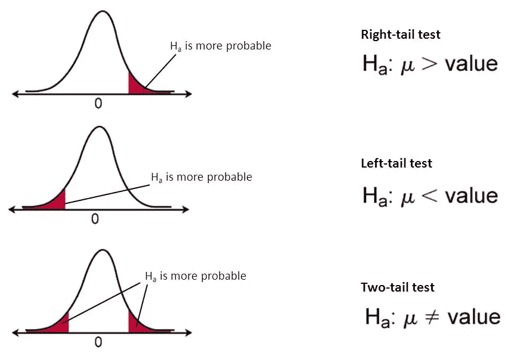

# 关于假设检验你需要知道的一切—第一部分

> 原文：<https://towardsdatascience.com/everything-you-need-to-know-about-hypothesis-testing-part-i-4de9abebbc8a?source=collection_archive---------0----------------------->

统计学是关于数据的，但数据本身并不有趣。我们感兴趣的是对数据的解读…

数据科学领域正以前所未有的速度发展。许多公司现在正在寻找能够筛选他们的金矿数据并帮助他们有效地做出快速商业决策的专业人士。这也为许多在职专业人士将职业生涯转向数据科学领域提供了优势。

有了这个人工智能，数据科学周围的许多大学生也想在数据科学领域追求自己的职业生涯。托马斯·达文波特(Thomas H. Davenport)和 D.J .帕蒂尔(D.J. Patil)在《哈佛商业评论》(Harvard Business Review)的一篇文章中正确地指出了这种围绕数据科学的宣传，

> “数据科学家:21 世纪最性感的工作”

> 在今天的分析世界中，建立机器学习模型已经变得相对容易(得益于更强大和灵活的工具和算法)，但基本概念仍然非常混乱。其中一个概念是假设检验。

在这篇文章中，我试图用插图来阐明假设检验的基本概念。

什么是假设检验？我们想达到什么目的？为什么我们需要进行假设检验？在我们继续之前，我们必须知道所有这些问题的答案。

统计学就是关于数据的。光有数据是没意思的。我们感兴趣的是对数据的解释。使用**假设检验**，我们试图用样本数据解释或得出关于人口的结论。一个**假设检验**评估关于总体的两个互斥的陈述，以确定哪个陈述最受样本数据支持。每当我们想要对数据的分布或者应用机器学习中的一组结果是否不同于另一组结果做出断言时，我们都必须依赖于统计假设检验。

> 有两种可能的结果:如果结果证实了假设，那么你已经进行了测量。如果结果与假设相反，那么你就有了发现——恩利克·费密

让我们看看在**假设检验**中我们应该知道的术语

## 1.参数和统计:

**参数**是对目标人群的固定特征或测量的总结描述。一个参数表示如果进行人口普查而不是抽样调查将获得的真实值

***例如:*** 均值(μ)、方差(σ)、标准差(σ)、比例(π)

> 群体:群体是我们想要研究/测试的对象的集合。对象集合可以是城市、学生、工厂等。这取决于手头的研究。

在现实世界中，很难获得完整的人口信息。因此，我们从总体中抽取一个样本，得出与上述相同的统计量。这些测量被称为样本统计。换句话说，

**统计数据**是对样本特征或测量的总结描述。样本统计用作总体参数的估计。

***例如:*** 样本均值(x̄)、样本方差(s)、样本标准差(s)、样本比例( *p)*

Picture from [CliffsNotes](https://www.cliffsnotes.com/study-guides/statistics/sampling/populations-samples-parameters-and-statistics)

## 2.抽样分布:

抽样分布是通过从特定人群中抽取大量样本而获得的统计数据的概率分布。

假设从 20 家医院中随机抽取 5 家医院。可能性可以是，(20，19，18，17，16)或(1，2，4，7，8)或者可以抽取 15，504 个(使用 20C₅组合)大小为 5 的不同样本中的任何一个。

> *一般来说，抽样分布的平均值将近似等于总体平均值，即(* x̄) = μ

要了解更多关于抽样分布的信息，请查看下面的视频:

Video from Khan Academy

## 3.标准误差(SE):

标准误差(SE)非常类似于标准偏差。两者都是传播的量度。数字越大，数据分布越广。简而言之，这两个术语本质上是相等的，但有一个重要的区别。而标准差使用 ***统计*** (样本数据)标准差使用 ***参数*** (总体数据)

> 标准差告诉你你的样本统计量(如样本均值)与实际总体均值的偏离程度。样本量越大，误差越小。换句话说，样本量越大，样本均值就越接近实际总体均值。

要了解更多关于标准误差(SE)的信息，请观看下面的视频

现在让我们考虑下面的例子，以便更好地理解其余的概念。

## 4.(一)。零假设(H₀):

没有预期的差别或效果的陈述。如果零假设未被拒绝，则不会进行任何更改。

> “无效”这个词在这个上下文中的意思是，这是一个普遍接受的事实，研究人员要取消。并不代表语句本身就是 null！(也许该术语应称为“可取消的抵押”，因为这样可能会减少混淆)

## 4.(二)。替代假说(H₁):

预期会有一些不同或效果的陈述。接受另一种假设会导致观点或行动的改变。它与零假设相反。

要了解更多关于无效假设和替代假设的信息，请观看下面的视频

## 5.(一)。单尾检验:

单尾检验是一种统计假设检验，在这种检验中，分布的临界区域是单侧的，因此它要么大于某个值，要么小于某个值，但不能同时大于和小于某个值。如果被测样本落入单侧临界区，替代假设将被接受，而不是零假设。

> 单尾检验也称为方向假设或方向检验。
> 
> **临界区域:**临界区域是对应于在某个选择的概率水平上拒绝零假设的值的区域。

## 5.(二)。双尾检验:

双尾检验是一种方法，在这种方法中，分布的临界区域是双侧的，并且检验样本是大于还是小于某个范围的值。如果被测样本属于任一关键区域，则接受替代假设，而不是零假设。

> 按照惯例，双尾检验用于确定 5%水平的显著性，这意味着分布的每一边都被截为 2.5%

## 6.测试统计:

**检验统计量**测量样本有多接近零假设。它的观测值从一个随机样本到另一个随机样本随机变化。检验统计包含与决定是否拒绝零假设相关的数据信息。

不同的假设检验根据零假设中假设的概率模型使用不同的检验统计量。常见测试及其测试统计包括:

Image from [https://support.minitab.com](https://support.minitab.com/)

*一般来说，样本数据必须提供足够的证据来否定原假设，并得出结论认为该效应存在于总体中。理想情况下，假设检验在总体中不存在效应时不能拒绝零假设，而在效应存在时拒绝零假设。*

到目前为止，我们已经知道，整个假设检验是基于手头的样本进行的。如果样本改变了，我们可能会得出不同的结论。有两种错误与无效假设的错误结论有关。

## 7.(一)。第一类错误:

***Type-I*** 当样本结果出现错误，导致原假设在事实上为真时被拒绝。**第一类**错误相当于误报。

**第一类**误差可以控制。与我们选择的**显著性水平**相关的α值与**第一类**误差有直接关系。

## 7.(二)。第二类错误:

***第二类*** 错误发生在基于样本的结果，当零假设事实上为假时不被拒绝。**第二类**错误相当于假阴性。

## 显著性水平(α):

发生第一类错误的概率，用***α***表示。α是我们有一个**类型 I** 错误的最大概率。对于 95%的置信水平，α的值是 0.05。这意味着有 5%的概率我们会拒绝一个真正的零假设。

## p 值:

***p 值*** 几乎在所有的机器学习模型中，从 t 检验到简单的回归分析到基于树的模型，在所有的统计中都使用。我们都使用 ***P 值*** 来确定假设检验中的统计显著性。尽管如此重要， ***P 值*** 却是一个容易让人误解的概念。

***P 值*** 评估样本数据在多大程度上支持“魔鬼代言人”的论点，即零假设为真。它衡量你的数据与零假设的符合程度。如果零假设为真，在样本数据中观察到的效果的可能性有多大？

*换句话说，假设零假设为真，一个* ***P 值*** *是一个通过随机机会单独得到一个结果等于或大于样本结果的概率。*

> **高 P 值:**您的数据可能为真空值
> 
> **低 P 值:**您的数据不太可能为真空

例如:假设你在显著性水平(α)为 5%的情况下测试以下假设，你得到的 p 值为 3%，你的样本统计量为*x̄**=**25*

> H₀: μ = 20
> 
> H₁: μ > 20

*对 p 值的解释如下:*

*上面我们看到* ***α*** *也就是所谓的犯****Type-I****错误。当我们说α* = *5%时，我们可以 100 次拒绝我们的零假设 5 次，即使它是真的。既然我们的***p 值是 3%，这比* ***α*** *(我们绝对低于犯下****type-I****错误的阈值)***意味着获得尽可能极端的样本统计量(x̄*【换句话说，只要我们假设 H₀为真，我们就无法获得样本统计量。因此，我们拒绝 H₀，接受 H₁.假设您得到的 ***P 值*** *为 6%，即假设零假设为真，获得尽可能极端的样本统计值的概率更高。所以我们没能拒绝 H₀，与* ***α*** *相比，我们不能冒险犯下****I 型*** *错误超过约定的显著性水平。因此，我们不能拒绝零假设，也不能拒绝替代假设。***

**既然我们已经了解了**假设检验中的基本术语，**现在让我们来看看假设检验中涉及的步骤以及一个示例。**

****

**例如，一家大型百货公司正在考虑推出网上购物服务。如果超过 40%的互联网用户通过互联网购物，这项新服务将会推出。**

*****第一步:制定假设:*****

**制定假设的适当方式是:**

> **H₀: π ≤ 0.40**
> 
> **H₁: π > 0.40**

**如果零假设 H₀被拒绝，那么替代假设 H₁将被接受，新的互联网购物服务将被引入。另一方面，如果我们不能拒绝 H₀，那么除非获得额外的证据，否则不应该引入新的服务。这个零假设的检验是一个**单尾**检验，因为替代假设是定向表达的:使用互联网购物的网民比例大于 0.40。**

*****第二步:选择合适的测试:*****

**为了检验零假设，有必要选择适当的统计技术。对于这个例子，符合标准正态分布的***【z】****统计量是合适的。***

****z = (p-π)/σₚ，σₚ=sqrt(π(1-π)/n 所在的地方)****

*****第三步:选择显著性水平，α:*****

**我们了解到 ***显著性水平*** 是指 ***第一类*** 错误。在我们的示例中，如果我们根据样本数据得出结论，认为偏好新服务计划的客户比例大于 0.40，而实际上该比例小于或等于 0.40，则会出现第一类错误。**

**如果我们根据样本数据得出的结论是，偏好新服务计划的客户比例小于或等于 0.40，而实际上它大于 0.40，那么就会出现第二类错误。**

**有必要平衡这两种类型的误差。作为一种折衷，α通常设置为 0.05；有时是 0.01；α的其他值很少。对于我们的示例，我们将考虑 0.05。**

*****第四步:收集数据并计算检验统计量:*****

**在考虑了期望的α和其他定性因素(如收集样本数据的预算限制)后，确定样本量。以我们的例子为例，假设有 30 个用户接受了调查，其中 17 个表示他们使用互联网购物。**

**因此，样本比例的值为 *p=17/30=0.567。***

***σₚ=sqrt((0.40)(0.60)/30)=0.089.的价值***

**测试统计量 *z* 可以计算为**

***z=(p-π)/σₚ=(0.567–0.40)/0.089=1.88***

*****第五步:确定概率(或临界值):*****

****

**使用上面的标准正态表，获得 1.88 的 *z* 值的概率是 0.96995，即 **P(z≤1.88)=0.96995** *。*但是我们想要计算 *z 右边的概率(因为我们对获得落在拒绝区域或临界区域的概率值感兴趣)，*即**1–0.96995**=**0.03005**。这个概率与α *直接相当(因为α正在犯 I 类错误，我们计算的概率值也落在临界区域内)***

**如果您想了解如何查找给定 z 分数的概率值，请观看以下视频:**

**或者， *z 的临界值，*将给出临界值 0.05 右侧的面积，在 1.64 *(在 1.64 处，概率为 0.94950)* 和 1.65 *(在 1.65 处，概率为 0.95053)* 之间，等于 1.645 *(概率为 0.95，即从正态分布的左侧开始，这意味着向右***

**请注意，在确定检验统计的临界值时，超出临界值的尾部面积为 *α或α/2。*单尾检验为 *α* ，双尾检验为 *α/2* 。我们的例子是一个单尾测试。**

**如果您想了解如何查找 *α、*的临界值，请观看以下视频:**

*****第 6 步和第 7 步:比较概率(或临界值)并做出决定:*****

**与测试统计的计算值或观察值相关的概率是 0.03005。这是在π=0.40 时得到一个 ***P 值*** 为 0.567 的概率(样本比例= *p)* 。这低于 0.05 的显著性水平。因此，零假设被拒绝。**

**或者，测试统计量 ***z=1.88*** 的计算值位于拒绝区域，超出 1.645 的值。同样，得出了拒绝零假设的相同结论。**

**注意，检验零假设的两种方法是等价的，但是在比较的方向上数学上是相反的。如果与检验统计量(TSCAL)的计算值或观察值相关的概率 ***小于*** 显著性水平(α)，则无效假设被拒绝。但是，如果检验统计量的计算值的绝对值 ***大于检验统计量的临界值的绝对值***(TSCR)，则无效假设被拒绝。这种符号偏移的原因是，TSCAL 的绝对值越大，在零假设下获得检验统计量的更极值的概率就越小。**

> **如果 TSCAL 的概率< significance level (α), then reject H₀.**
> 
> **But, if |TSCAL| > |TSCR|，那么拒绝 H₀**

*****第八步:结论:*****

**在我们的例子中，我们的结论是，有证据表明，通过互联网购物的互联网用户比例明显大于 0.40。因此，建议百货公司引进新的网上购物服务。**

**这个例子指的是比例的一个样本测试。然而，有几种类型的测试取决于对人口和手头问题的了解。**

**例如，我们有一个 t 检验，Z 检验。卡方检验、曼-惠特尼检验、威尔科克森检验等。**

**至此，我想结束“关于假设检验你需要知道的一切”的第一部分。我将在第二部分讨论参数和非参数测试，以及在什么场景中使用哪种测试。直到那时*快乐学习……***

***感谢阅读！***

**请在下面的评论部分分享您的反馈。**

*****引用:*****

1.  ***市场研究 Naresh K Malhotra 和 Satyabhushan Dash 的应用方向***
2.  **[*https://www . cliffs notes . com/study-guides/statistics/sampling/populations-samples-parameters-and-statistics*](https://www.cliffsnotes.com/study-guides/statistics/sampling/populations-samples-parameters-and-statistics)**
3.  **[https://www.statisticshowto.datasciencecentral.com](https://www.statisticshowto.datasciencecentral.com/)**
4.  **[*https://www.khanacademy.org*](https://www.khanacademy.org/)**
5.  **[https://365datascience.com](https://365datascience.com/)**
6.  **[*https://blog.minitab.com*](https://blog.minitab.com/)**