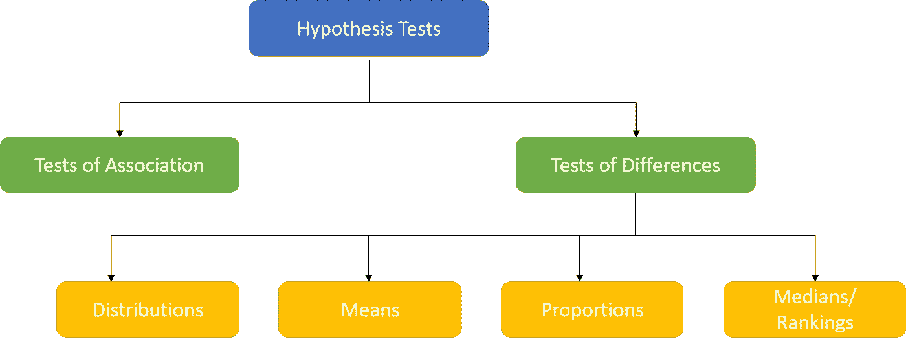
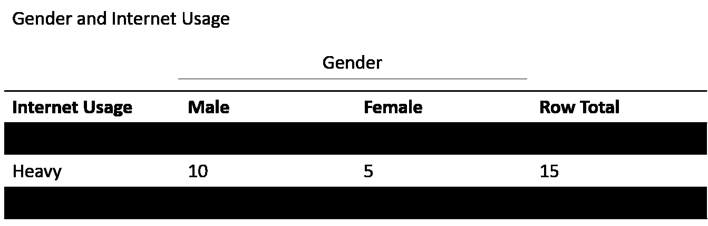
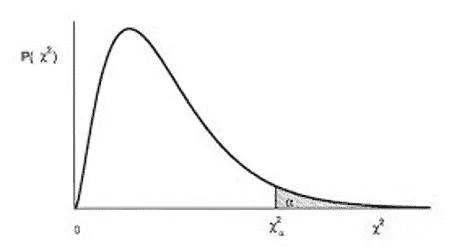
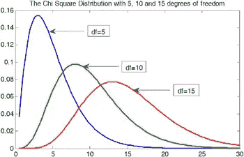
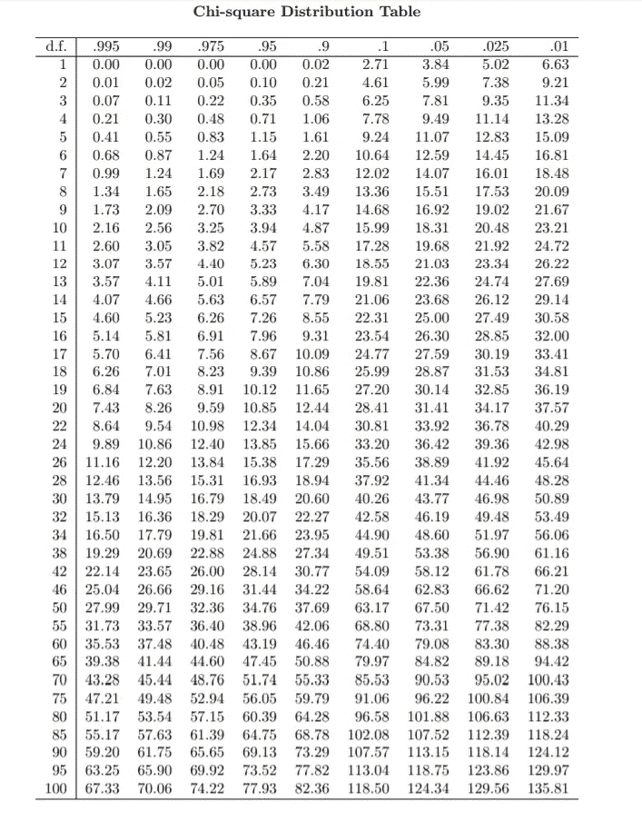
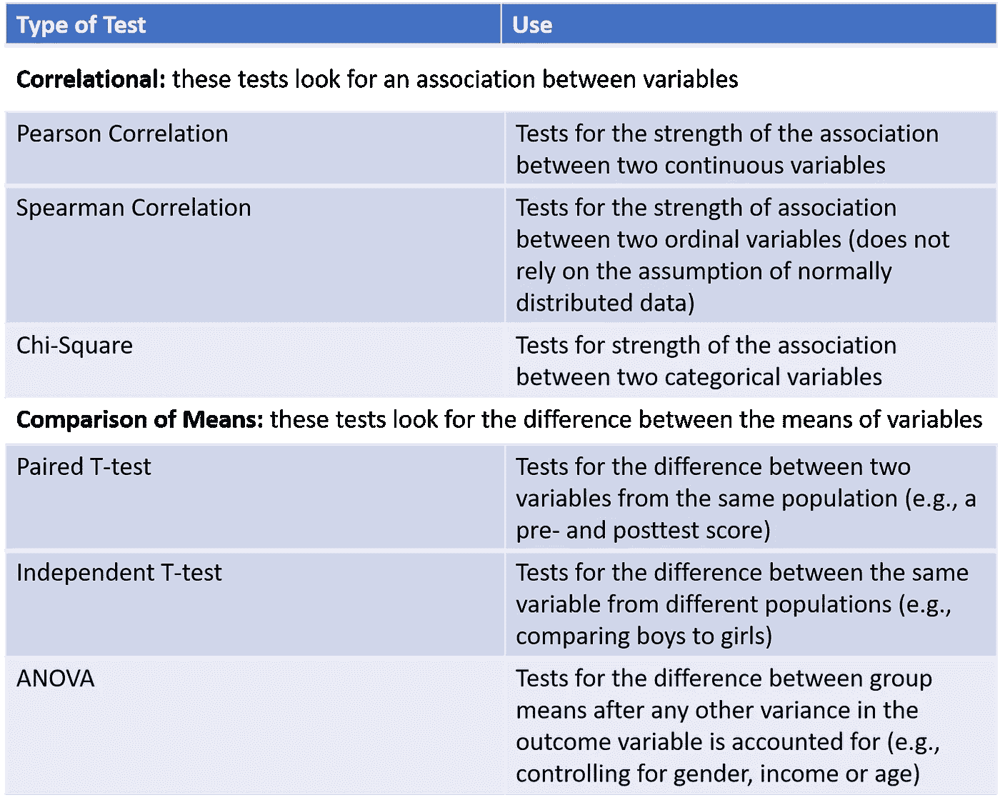
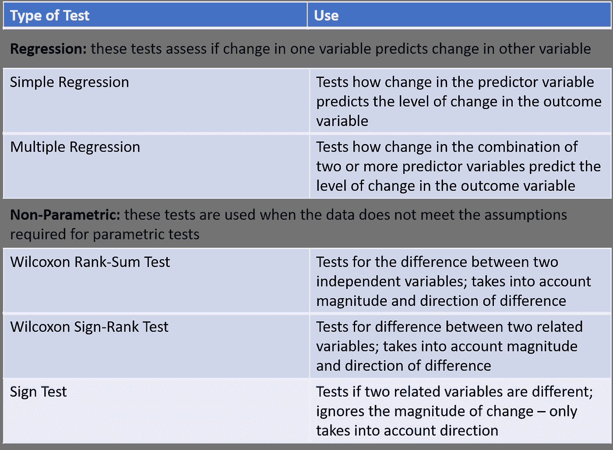
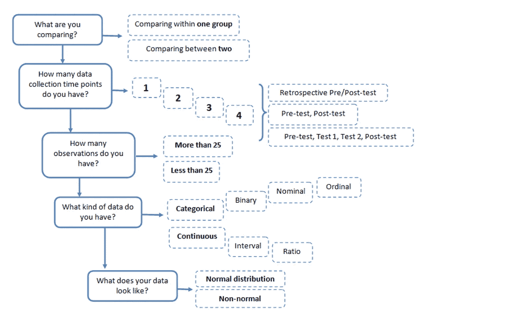
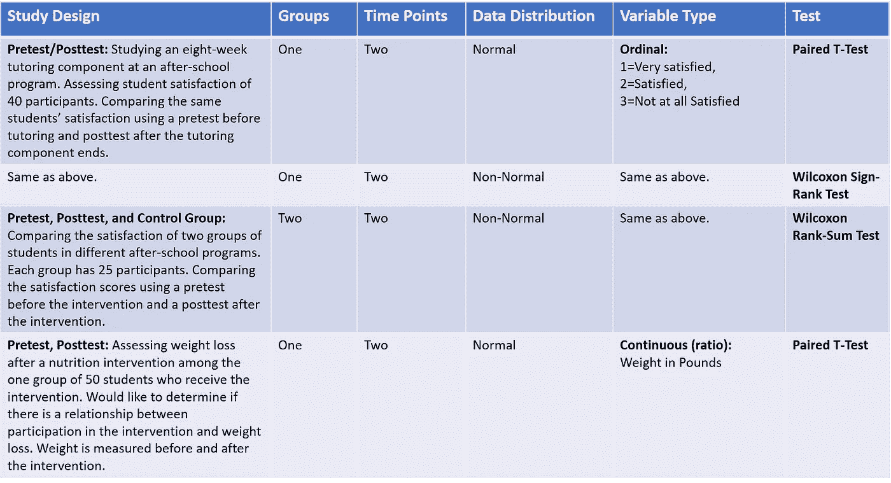

# 关于假设检验你需要知道的一切—第二部分

> 原文：<https://towardsdatascience.com/everything-you-need-to-know-about-hypothesis-testing-part-ii-f0526be27b7d?source=collection_archive---------9----------------------->

## 何时使用哪种统计检验？

Image by [Matthias Wewering](https://pixabay.com/users/mwewering-185784/?utm_source=link-attribution&utm_medium=referral&utm_campaign=image&utm_content=1699137) from [Pixabay](https://pixabay.com/?utm_source=link-attribution&utm_medium=referral&utm_campaign=image&utm_content=1699137)

在我之前的帖子中，我讨论了我们必须了解的基本术语，这些术语是用插图进行假设检验的。如果你还没有检查过，你可以在这里找到:

 [## 关于假设检验你需要知道的一切—第一部分

### 统计学是关于数据的，但是数据本身并不有趣。这是对数据的解释，我们是…

towardsdatascience.com](/everything-you-need-to-know-about-hypothesis-testing-part-i-4de9abebbc8a) 

我在这第二部分，我将重点关注**统计测试**。在我们查看了数据的分布，并可能进行了一些描述性统计以找到平均值、中位数或众数之后，是时候对数据进行推断了。在统计学中，我们将“假设检验”归入推断统计学。统计测试允许我们做出推断，因为它们可以显示观察到的模式是由于干预还是偶然。

一般来说，我们通过观察它们的***【P 值】，*** 来识别建模过程中最重要的特征，除非一些关键的业务场景阻止我们考虑其他变量。如果我们分析任何流行的建模技术的输出，无论是线性或逻辑回归还是 XGBoost 或随机森林，我们都会检查 ***P 值*** 以及它是否为 ***< 0.05(在 95%的置信水平下)*** 以确定模型中的显著性。我们如何获得这些 ***P 值*？在带下划线的建模过程中，我们在测试什么？执行了哪些统计测试？**

这些问题将帮助你理解我们在预测变量上测试的假设，最终帮助你做出商业决策。然而，有时，分析专家会对在给定场景中应该使用哪种统计测试感到困惑。选择使用哪种统计检验取决于研究设计、数据分布和变量类型。但是，只要稍微关注一下手头的问题，就很容易决定我们应该使用哪种类型的统计检验来得出结论。

在我们了解所有这些之前，让我们试着理解一些关于统计测试的细微差别。

统计测试旨在确定是否有足够的证据来“拒绝”一个无效假设。如果我们想继续表现得好像我们“相信”零假设是正确的，不拒绝可能是一个好结果。或者这可能是一个令人失望的结果，可能表明我们可能还没有足够的数据来通过拒绝零假设来“证明”一些东西。

当我们进行假设检验时，我们必须问自己我们在检验什么？我们是在测试两个群体之间的联系还是他们之间的差异？我们要测试一组还是两组项目？所有这些问题都关系到选择正确的统计测试。一般来说，我们可以把假设检验大致分为两类。

Classification of Hypothesis Tests

让我们看一个测试两个组之间关联的例子:

在我之前的[帖子](/everything-you-need-to-know-about-hypothesis-testing-part-i-4de9abebbc8a)中，我们讨论了互联网购物服务是否已经推出。对于那些没有机会阅读我上一篇文章的人来说，这里有一个例子:

一家大百货公司正在考虑引进网上购物服务。如果超过 40%的互联网用户通过互联网购物，这项新服务将会推出。在这种情况下，我们使用 ***Z-test*** 进行假设检验，无效假设和替代假设分别为；

> H₀: π ≤ 0.40
> 
> H₁: π > 0.40

现在假设我们对确定**互联网使用是否与性别有关感兴趣。**

让我们假设那些报告 5 小时或更少使用时间的用户被归类为轻度用户，其余的是重度用户。数据显示在下面的交叉表中。

***交叉制表:*** *它是一种定量分析多个变量之间关系的方法。有时我们称之为“列联表”或“交叉表”交叉制表通常在* ***分类数据上执行，这些数据可以被分成互斥的组。***

让我们来看看下面的轻度和重度互联网用户的交叉列表。

上面的交叉表包括两个变量类别的每种组合的一个单元格。10 名受访者是女性，她们报告说很少使用互联网。该表中的边际总量表明，在对两个变量都有有效回答的 30 名受访者中，15 名报告轻度使用，15 名报告重度使用。从性别来看，15 名受访者为女性，15 名为男性。

*为了检验交叉制表中观察到的关联的统计显著性，我们使用了* ***卡方统计量(χ )*** 。它帮助我们确定这两个变量之间是否存在系统的联系。在这种情况下，我们试图测试互联网使用(轻度/重度)与性别之间的关联。

H₀的零假设是变量之间没有关联。

***卡方检验是如何计算的:*** 一般来说，在给定现有行和列总数的情况下，如果变量之间不存在关联，则通过计算预期的单元格频率来进行检验。这些预期的小区频率，表示为 fₑ，然后与实际观察到的频率进行比较，fₒ在交叉表中找到，以计算卡方统计。预期频率和实际频率之间的差异越大，统计值就越大。假设一个交叉制表有 ***r*** 行和 ***c*** 列以及一个随机抽样的 ***n*** 个观察值。则预期频率可计算如下:

fₑ = (nᵣ n꜀)/n，在那里，

nᵣ =该行中的总数，

n꜀ =该列中的总数，

n =总样本量

对于互联网使用数据，从左到右和从上到下，单元的预期频率为:

(15 X 15) / 30 = 7.50

(15 X 15) / 30 = 7.50

(15 X 15) / 30 = 7.50

(15 X 15) / 30 = 7.50

***χ*** 的值计算如下:

χ***=***∑(fₒ-fₑ)/fₑ

χ***=***(5–7.5)/7.5+(10–7.5)/7.5+(10–7.5)/7.5+(5–7.5)/7.5

χ***=***0.833+0.833+0.833

***χ = 3.333***

为了确定系统关联是否存在，估计获得与交叉表计算值一样大或更大的卡方值的概率(换句话说，计算 p 值)。卡方统计的一个重要特征是与其相关的***【df】***自由度的数量。

> **自由度:**是指计算中涉及的有 ***自由度*** 变化的数值个数。换句话说，*的自由度，一般来说，可以定义为观察值的总数减去施加在观察值上的独立约束的数目。*

*在与交叉制表相关的卡方统计的情况下，自由度的数量等于行数( *r)* 减一和列数减一的乘积。即 df = *(r-1) * (c-1)。*只有当检验统计的计算值大于具有适当自由度的卡方分布的临界值时，两个变量之间无关联的零假设(H₀)才会被拒绝，如下图所示。*

**

*chi-square distribution with the critical region*

> *卡方分布是一种偏斜分布，其形状仅取决于自由度的数量。随着自由度数量的增加，卡方分布变得更加对称。*

**

*在这种情况下，自由度为 1(即*(2–1)*(2–1))。*使用卡方表，我们得到的临界值为 3.84，显著性水平为 5%(您可以从下面的卡方表中看到)*

**

*Chi-Square table at different α values*

*我们得到卡方计算值为 3.33。因为这小于临界值 3.84，所以无关联的零假设不能被拒绝，表明在 5%的水平上关联没有统计学意义。请注意，这种缺乏显著性主要是由于样本量小(本例中为 30)。相反，如果样本量为 300，交叉表的每个条目乘以 10，可以看出卡方统计值将乘以 10，为 33.33，在 5%的水平上显著。*

> *卡方统计应仅根据数据计数进行估计。当数据为百分比形式时，应首先将其转换为绝对计数或数字。此外，卡方检验的一个基本假设是观察值是独立得出的。作为一般规则，当任何单元中的预期或理论频率小于 5 时，不应进行卡方分析。*

*像卡方检验一样，可以根据手头的问题使用其他统计检验。让我们看看还有哪些其他可用的统计测试，以及在什么情况下我们可以使用它们。*

****

*下面的图表总结了在选择正确的测试之前需要回答的问题。*

**

*给定研究设计，如何选择正确的统计检验的几个例子:*

**

*就此，我想对假设检验的话题做个总结。我希望你觉得这是有用的。*

**感谢阅读！**

*请在下面的评论部分分享您的反馈。*

****引用:****

1.  **市场研究 Naresh K Malhotra 和 Satyabhushan Dash 的应用方向**
2.  *[*https://cyfar.org*](https://cyfar.org/)*