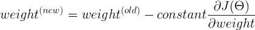
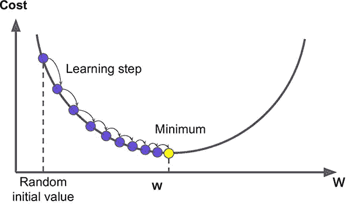

# 关于线性回归你需要知道的一切

> 原文：<https://towardsdatascience.com/everything-you-need-to-know-about-linear-regression-b791e8f4bd7a?source=collection_archive---------4----------------------->

线性回归是机器学习领域的第一块敲门砖。如果你是机器学习新手或数学极客，想知道线性回归背后的所有数学知识，那么你和我 9 个月前的情况一样。在这里，我们将看看线性回归的数学，并了解其背后的机制。

Linear Regression (Source: [https://datumguy.com/blog/blog/view/5ce138213122e?utm_content=buffer09809&utm_medium=social&utm_source=facebook.com&utm_campaign=buffer](https://datumguy.com/blog/blog/view/5ce138213122e?utm_content=buffer09809&utm_medium=social&utm_source=facebook.com&utm_campaign=buffer))

## 介绍

线性回归。分解之后，我们得到两个词‘线性’和‘回归’。当我们从数学角度思考时,“线性”一词似乎与直线有关，而“回归”一词意味着*一种确定两个或多个变量之间统计关系的技术*。

简单地说，线性回归就是找到一条几乎与给定数据相符合的直线的方程，这样它就可以预测未来的值。

## 假设

这个假设是什么？这只不过是我们正在谈论的直线方程。让我们看看下面的等式。

你觉得这个眼熟吗？这是一条直线的方程式。这是一个假设。让我们用类似的方式重写一下。

我们刚刚分别将 *y* 替换为 *h(x)* 和 *c* ，将 *m* 替换为*θ₀*和*θ₁*。 *h(x)* 将是我们的预测值。这是机器学习中最常见的写假设的方式。

为了理解这个假设，我们以房价为例。假设您收集了您所在地区不同房屋的大小及其各自的价格。该假设可以表示为

现在你所要做的就是根据你的数据集找到合适的基价和θ₁的价值，这样你就可以在给定房子大小的情况下预测它的价格。

更专业地说，我们必须调整*θ₀*&*θ₁*的值，以使我们的线尽可能地适合数据集。现在我们需要一些度量来确定“最佳”线，我们已经有了。这叫做成本函数。让我们调查一下。

## 成本函数 J(θ)

线性回归的成本函数为

为了让它对我们的大脑来说看起来更漂亮，我们可以把它重写为

这里的 *m* 表示数据集中的样本总数。在我们的例子中， *m* 将是我们数据集中房屋的总数。

现在仔细看看我们的成本函数，我们需要所有 *m* 个例子的*预测值*，即 *h(x)* 。让我们再看看我们的*预测值*或*预测价格*是什么样子的。

为了计算我们的成本函数，我们需要的是所有 *m* 个例子的 *h(x)* ，即 *m 个预测价格*对应于 *m* 个房屋。

现在，为了计算 *h(x)* ，我们需要一个*底价*和*θ₁.的价值*请注意，这些是我们将调整以找到最合适的值。我们需要一些东西来开始，所以我们将随机初始化这两个值。

## 成本函数的解释

如果你仔细观察成本函数

你会发现我们所做的只是在所有的 *m* 个例子中平均预测值和实际值之间的距离的平方。

看上图，这里 *m = 4。*蓝色线上的点是预测值，红色点是实际值。绿线是实际值和预测值之间的距离。

这条线路的费用是

所以成本函数计算的只是绿线长度平方的平均值。我们还将它除以 2，以简化我们将看到的一些未来的计算。

线性回归试图通过找到θ₀和θ₁.的合适值来最小化这个成本如何？通过使用梯度下降。

## 梯度下降

对于机器学习来说，梯度下降是一种非常重要的算法。从线性回归到神经网络，它无处不在。

这是我们更新权重的方法。这个更新规则是在一个循环中执行的&它帮助我们达到成本函数的最小值。 *α* 是一个恒定的学习速率，我们一会儿会谈到它。

## U 理解梯度下降

所以基本上我们是在更新我们的权重，用我们的成本函数对权重的偏导数减去它。

但是这怎么能把我们带到最小的成本呢？让我们想象一下。为了便于理解，我们假设*θ₀*现在为 0。

所以假设变成了

和成本函数

现在让我们看看成本如何依赖于θ₁.的价值因为这是一个二次方程，所以*θ₁*对 j(θ)*的图形将是一条抛物线，并且看起来像这样，其中*θ₁*在 *x 轴*上，*j(*θ*)在*y 轴*上。**

**

*Source: Machine Learning by Andrew Ng*

*我们的目标是达到成本函数的最小值，当我们的*θ₁*等于*θₘᵢₙ.时，我们将得到这个最小值**

*现在，首先我们将随机初始化我们的*θ₁.**

**

*Source: Machine Learning by Andrew Ng*

*假设*θ₁*初始化，如图所示。当前*θ₁*对应的成本等于图上的蓝点。*

*现在，让我们使用梯度下降更新θ*₁*。*

**

*我们正在减去成本函数 w . r . t*θ₁*乘以某个常数的导数。*

**

*Source: Machine Learning by Andrew Ng*

*成本函数 w . r . t*θ₁*的导数给出了曲线在该点的斜率。这在这些情况下是积极。所以我们从θ₁.的当前值中减去正的量这将迫使*θ₁*向左移动，并慢慢发散到*θₘᵢₙ*的值，在那里我们的成本函数最小。 *α* 的作用来了，就是我们的学习率。学习率决定了我们想要在一次迭代中下降多少。此外，这里需要注意的一点是，随着我们向最小值移动，曲线的斜率也变得不那么陡峭，这意味着，随着我们达到最小值，我们将采取越来越小的步骤。*

**

*Source: Machine Learning by Andrew Ng*

*最终，斜率将在曲线的最小值处变为零，然后*θ*₁*将不会更新。**

**这样想吧。假设一个人在山谷的顶端，他想到达谷底。因此，当坡度较陡时，他走较大的步子，当坡度不太陡时，他走较小的步子。他根据当前位置决定下一个位置，当他到达他的目标山谷底部时停下来。**

**类似地，如果*θ₁*在最小值的左侧被初始化，**

****

**Source: Machine Learning by Andrew Ng**

**这一点的斜率将是负的。在梯度下降中，我们减去斜率，但这里斜率是负的。所以，否定之否定就会变成肯定。因此，我们将继续增加，直到达到成本最低。**

****

**Gradient Descent (Source: [**https://saugatbhattarai.com.np/what-is-gradient-descent-in-machine-learning/**](https://saugatbhattarai.com.np/what-is-gradient-descent-in-machine-learning/)**)****

**上图很好的描绘了梯度下降。注意当我们到达最小值时，步长是如何变得越来越小的。**

**类似地，*θ₀*的值也将使用梯度下降进行更新。我没有展示它，因为我们需要同时更新*θ₀*和*θ₁*的值，这将导致一个三维图形(一个轴上是成本，*θ₀*在一个轴上，而*θ₁*在另一个轴上)变得有点难以想象。**

## **成本函数的导数**

**我们在梯度下降中使用成本函数的导数。**

********

**我们来看看微分后得到的结果。**

****

**同样，对于*θ₁***

****

## **线性回归可视化**

****

**Linear Regression Visualization**

**在此可视化效果中，您可以看到线是如何拟合到数据集的。注意，最初，这条线很快就覆盖了这段距离。但是随着成本的降低，线路变得更慢。**

**我的 [GitHub](https://github.com/sushantPatrikar/Linear-Regression-Simulator) 上有上面可视化的代码。**

> **有问题吗？需要帮助吗？联系我！**

**电子邮件:sushantpatrikarml@gmail.com**

**github:[https://github.com/sushantPatrikar](https://github.com/sushantPatrikar)**

**领英:[https://www.linkedin.com/in/sushant-patrikar/](https://www.linkedin.com/in/sushant-patrikar/)**

**网址:【https://sushantpatrikar.github.io/ T3**