# 关于 MobileNetV3 您需要知道的一切

> 原文：<https://towardsdatascience.com/everything-you-need-to-know-about-mobilenetv3-and-its-comparison-with-previous-versions-a5d5e5a6eeaa?source=collection_archive---------4----------------------->

当 MobileNet V1 在 2017 年到来时，它基本上开始了计算机视觉深度学习研究的一个新领域，即**提出可以在嵌入式系统中运行的模型**。这导致了几个重要的工作，包括但不限于 ShuffleNet(V1 和 V2)，MNasNet，CondenseNet，EffNet 等。介于两者之间的是去年推出的第二版 MobileNet。现在，今年的迭代给了我们 MobileNet 的第三个版本，叫做 MobileNetV3。这篇文章是对今年在韩国首尔 ICCV 上展示的谷歌 MobileNetV3 的回顾。

# 内容:

1.  **高效移动积木**
2.  **用于逐块搜索的神经架构搜索**
3.  **网络适配分层搜索**
4.  **网络改进—层移除和 H-swish**
5.  **整体结构**
6.  **实验和结果**

与以前的版本相比，第三版中有很多变化。:d .我认为这对于击败已经令人震惊的移动互联网 2 是必要的。如果需要的话，我将尝试简单回顾一下早期版本(主要是 V2)的概念。

# 高效的移动构建模块

MobileNetV1 引入了深度卷积来减少参数数量。第二个版本在块中增加了一个扩展层，使用三层得到一个**扩展-过滤-压缩(见下图[1])** 的系统。这个系统——被称为**反向剩余块**——进一步帮助提高了性能。

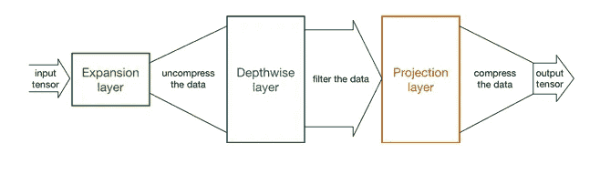

最新版本在取自 V2 的初始构建模块中增加了挤压和激励层[2]，这将在以后进行进一步处理(NAS 和 NetAdapt)。与 V2 的比较见下图。

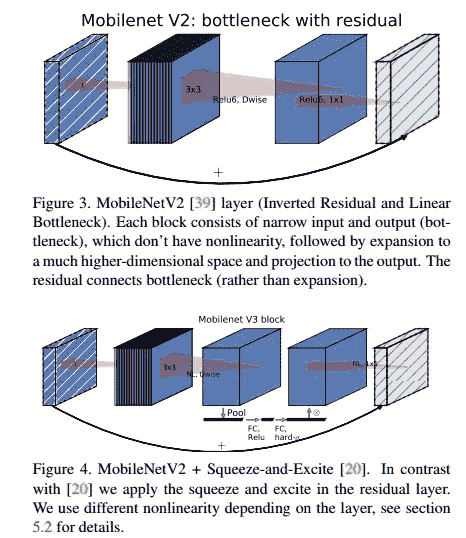

如上图所述，使用了 h-swish 非线性，这将在后面的故事中讨论。挤压和激励模块的添加有助于在创建输出特征图时，对来自输入的不同通道给予不相等的权重，假设输出特征图与普通 CNN 给予的权重相等。挤压和激励通常分别添加到 resnet/inception 模块中。但是，在此模型中，它是与 resnet 层并行应用的。挤压层和激发层如下(上图底部的小箭头):

**池- >密- >热卢- >密->h-唰- >鳞退。**

# 光模型的神经结构搜索

用外行人的话来说，神经架构搜索(NAS)[3]是试图**让一个模型(通常是一个 RNN，也称为控制器)输出一个模块线程的过程，这些模块可以放在一起形成一个模型，通过在所有可能的组合中进行搜索**，给出可能的最佳精确度。基本算法可以用这个图来概括[4]。

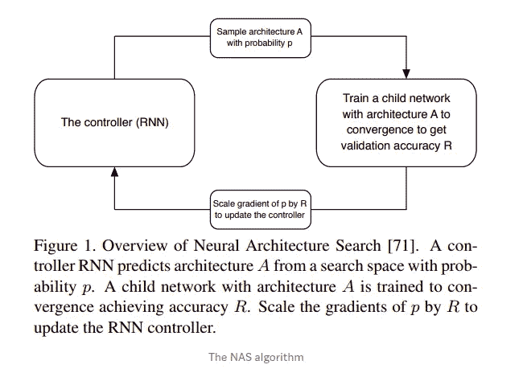

这类似于强化学习的标准过程。存在一个奖励函数，根据该函数更新控制器。这样做是为了追求一种状态，在这种状态下，从当前状态得到的回报是最大的。在 NAS 术语中，模型从当前状态移动到奖励准确度增加的状态。

通常，在大多数论文中，NAS 用于获得高效子模块的结构，这些子模块可以重复堆叠在一起以获得整个模型。然而，在这里，它是除了 NetAdapt 算法(稍后讨论)之外使用的，NetAdapt 算法将用于决定每一层的过滤器数量。因此，NAS 将用于优化每个数据块。

此外，因为我们想要一个轻型模型，所以 NAS 也相应地进行了调整。我们致力于一个新的奖励函数:**ACC(m)×【lat(m)/tar]^w，】T3，它考虑了模型的准确性和延迟(总推理时间)。ACC 是准确度，LAT 是等待时间，TAR 是目标等待时间，m 是搜索得到的模型。这里 w 是一个常数。作者还观察到，对于较小的模型(我们正在寻找)，w 需要是 **-0.15** (相对于原始的 w = **-0.07** )。**

有了所有这些变化，NAS 产生了一种可以使用 NetAdapt 按层进一步优化的网络体系结构。

# 用于分层搜索的网络适配器

原始的 NetAdapt[5]算法对每个 conv 的过滤器数量起作用，如下所示:

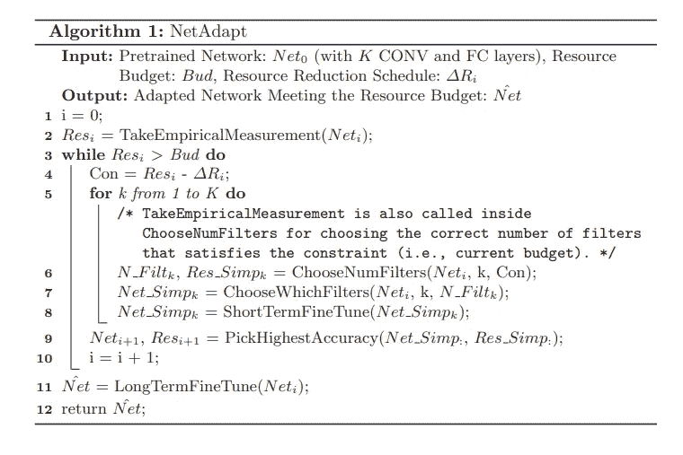

在这里，它试图为每个有问题的 conv 优化过滤器的数量，并选择具有最高精度的模型。K 个模型中具有最高峰值精度的模型是在 K 个 conv 层中的一个上工作得到的。

在 MobileNet 中工作的该算法的一种简化版本如下:

1.  从 NAS 输出开始。
2.  生成一组*提案。*与上一步中的模型相比，每个*方案*的延迟应减少δ。
3.  通过使用来自先前网络的权重和任何新过滤器的随机初始化，为新的*提议*设置权重。
4.  微调最终选定的*方案*，直到达到目标延迟。

最终选择基于一个度量标准。作者选择**(*Acc 变化/潜伏期变化)*** *。*这是凭直觉完成的，即准确性和延迟两个因素都保留在组合中，并且优先选择最大化准确性-延迟权衡斜率的模型。

# 网络改进

网络改进有两种方式:

1.  图层移除
2.  swish 非线性

## 图层移除

这里，我们讨论一些不借助搜索而手动完成的更改。这主要在前几层和最后几层完成。以下是这篇论文所做的调整:

1.  在最后一个块中，从 MobileNetV2 的反向剩余单元中提取的 1x1 扩展层被移过池层。这意味着 1x1 图层处理大小为 1x1 的要素地图，而不是 7x7，从而在计算和延迟方面更高效。
2.  我们知道扩展层需要大量的计算。但是现在它被移到了一个池层的后面，我们不需要从上一个块的最后一个层进行投影层的压缩。因此，我们可以从先前的瓶颈层(块)中移除投影层和过滤层。这两种变化都显示在这个图中。

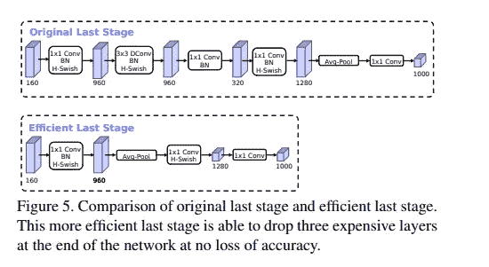

3.一个实验性的改变是在初始的 3x3 层中使用 16 个过滤器，而不是 32 个，这是默认的移动模型。

这些变化总共节省了 9 毫秒的推理时间。

## 非线性

swish 非线性被定义为:

实验证明，它可以提高精度。然而，由于 sigmoid 函数的计算开销很大，并且我们非常关心该模型中的计算开销，因此作者使用所谓的*硬 swish* 或 *h-swish* 对其进行了修改:

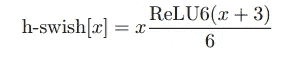

下图比较了讨论中的所有非线性:

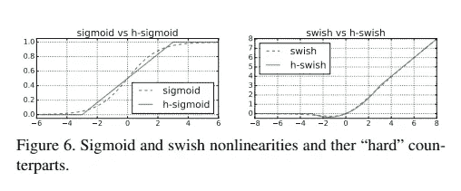

显然，就曲线而言，h-swish 与 swish 没有太大的不同，尽管它的计算开销更小。

# 整体结构

这就引出了整体结构。本文定义了两个术语:**移动网络 3-大型**和**移动网络 3-小型。**两者的结构如下(左边 MobileNetV3-大，右边 MobileNetV3-小):

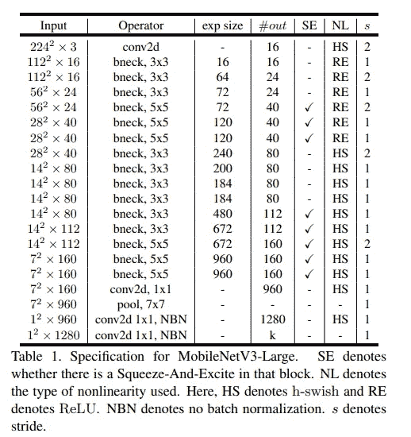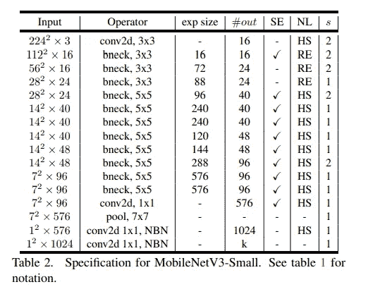

在前几层和后几层中可以看到上一节所述的变化，特别是在 1x1 最终 conv2d 层之前将池层放置在 7x7 输入上。

# 实验和结果

作者在计算机视觉的不同问题上做了大量的实验来证明这个模型的实际价值。我们将逐一讨论它们。

因为这篇论文是由谷歌的一群人写的(很多人都是这篇论文的作者，:D)，所以显然任何嵌入式设备都必须是 Pixel。他们使用 Pixel 1/2/3，并将其表示为 P-n。还有一点需要注意的是，所有这些结果都是在单核硬件上完成的，而不是这些手机拥有的多核硬件。

## 分类

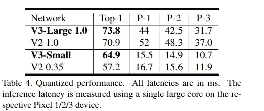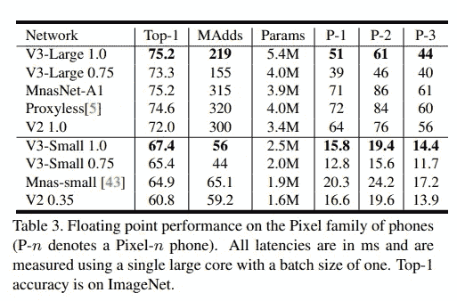

**左边的表格清楚地显示了从 V2 到 V3 的延迟降低，即使在 Imagenet 上分类的准确度提高了。**

## 目标检测

对于检测实验，作者使用 MobileNetv3 作为 SSDLite 上的主干，以下是结果:

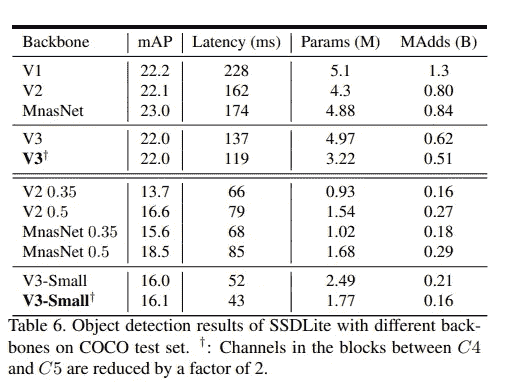

事实证明，在保持类似地图的情况下，MobileNetv3-Large 比 MobileNetV2 快 **27%** 。

## 分割

对于语义分割，作者提出了一种新的分割头，它来自 R-ASSP[6]，命名为 Lite R-ASSP 或 LR-ASSP。它是基于使用挤压和激励时汇集的想法

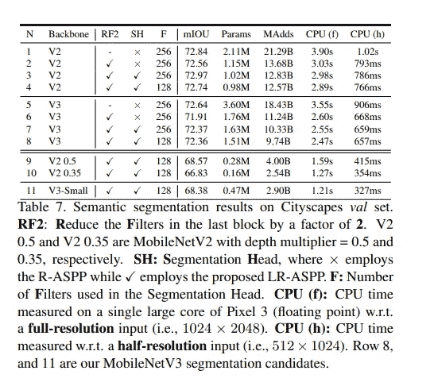

作者报告说，LR-ASSP 比与 MobileNetV2 一起提出的前身 R-ASSP 更快。

此外，MobileNetV3 主干网比 V2 的稍快。

# 结论

谷歌使用神经架构搜索得出最先进的结果是未来深度学习和计算机视觉的伟大成果，因为**这可能是使用和进一步改进这种网络搜索算法的巨大动力。这样的改进可能会导致我们完全依赖搜索来决定模型架构的阶段。** MobileNetV3 给出了轻量级模型在主要计算机视觉问题上的 SOTA 结果。

# 参考

[1][https://machinethink.net/blog/mobilenet-v2/](https://machinethink.net/blog/mobilenet-v2/)

[2]胡俊杰、沈立群和孙广昌。挤压和激励网络。ArXiv 电子版，2017 年 9 月

[3] Barret Zoph 和 Quoc 诉 Le。强化学习的神经结构搜索。更正，abs/1611.01578，2016

[4][https://towardsdatascience . com/everything-you-neural-architecture-search-8db 1863682 BF](/everything-you-need-to-know-about-automl-and-neural-architecture-search-8db1863682bf)

[5]杨天柱、Andrew G. Howard、、肖章、Alec Go、Mark Sandler、Vivienne Sze 和 Hartwig Adam。Netadapt:面向移动应用的平台感知神经网络适配。在 ECCV，2018 年

[6] Mark Sandler，Andrew G. Howard，Menglong Zhu，Andrey Zhmoginov 和陈良杰。Mobilenetv2:反向残差和线性瓶颈。用于分类、检测和分段的移动网络。更正，abs/1801.04381，2018

# **关于我**

对深度学习感兴趣？我尝试研究很酷的深度学习想法，尤其是在计算机视觉领域。访问我的 Github 个人资料。