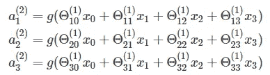
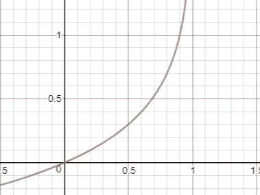
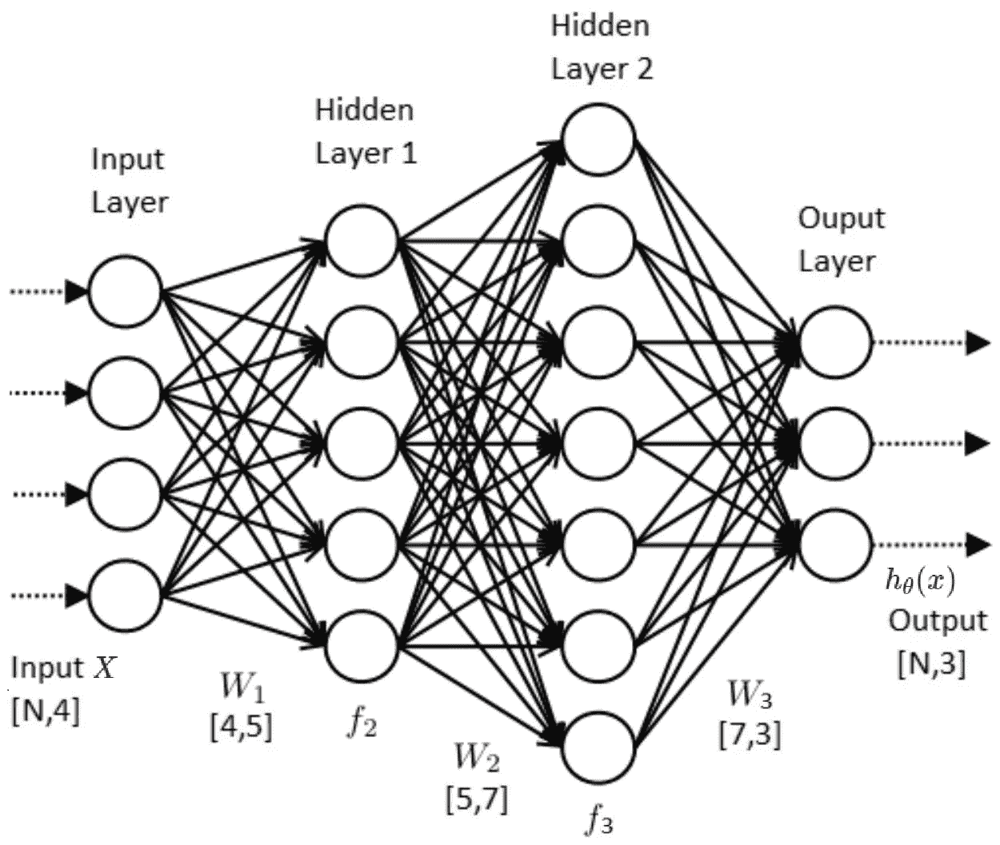

# 你需要知道的关于神经网络和反向传播的一切——机器学习简单而有趣

> 原文：<https://towardsdatascience.com/everything-you-need-to-know-about-neural-networks-and-backpropagation-machine-learning-made-easy-e5285bc2be3a?source=collection_archive---------0----------------------->

## 神经网络的基础解释，包括理解背后的数学

我发现很难在一个地方得到关于神经网络的一步一步和详细的解释。在课程或视频中，总会遗漏一些解释。所以我试着在一篇博文中收集所有的信息和解释(一步一步)。我会把这个博客分成 8 个部分，因为我觉得它最相关。

1.  模型表示
2.  模型表示数学
3.  激活功能
4.  偏置节点
5.  价值函数
6.  正向传播计算
7.  反向传播算法
8.  代码实现

***那么让我们开始……***

# 模型表示

[***人工神经网络***](https://en.wikipedia.org/wiki/Artificial_neural_network) 是受构成动物大脑的生物神经网络启发的计算系统。这种系统通过考虑例子来“学习”执行任务，通常没有用任何特定于任务的规则来编程。

Image 1: Neural Network Architecture

神经网络由 3 种类型的层构成:

1.  输入层-神经网络的初始数据。
2.  隐藏层-输入层和输出层之间的中间层，所有计算都在此完成。
3.  输出图层-生成给定输入的结果。

上图中有 3 个黄色圆圈。它们代表输入层，通常记为矢量***x。***有 4 个蓝色和 4 个绿色圆圈代表隐藏层。这些圆圈代表“激活”节点，通常记为 ***W*** 或 ***θ*** 。红色圆圈是输出图层或预测值(或多个输出类/类型的值)。

每个节点都与下一层的每个节点相连接，并且每个连接(黑色箭头)都有特定的权重。权重可以被视为该节点对来自下一层节点的影响。因此，如果我们看一下一个节点，它会像这样

Image 2: Node from Neural Network

我们来看最上面的蓝色节点(*“图片 1】*)。前一层(黄色)的所有节点都与之相连。所有这些连接都代表权重(影响)。当来自黄色层的所有节点值乘以它们的权重并且所有这些被汇总时，它给出了顶部蓝色节点的一些值。蓝色节点具有预定义的“激活”功能(*“图像 2”*上的*单位步进功能*)，该功能根据汇总值定义该节点是否将被“激活”或其“激活”程度。值为 1 的附加节点称为“偏置”节点。

# 模型表示数学

为了理解数学方程，我将使用一个更简单的神经网络模型。这个模型将有 4 个输入节点(3 + 1“偏差”)*。*一个隐藏层，有 4 个节点(3 + 1“偏差”)和一个输出节点。

Image 3: Simple Neural Network

我们将把“偏差”节点分别标记为 x₀和 a₀。因此，输入节点可以放在一个向量 *X* 中，隐藏层的节点放在向量 *A* 中。

Image 4: X (input layer) and A (hidden layer) vector

重量(箭头)通常记为 *θ* 或 *W.* 在这种情况下，我将它们记为 *θ。*输入层和隐藏层之间的权重将代表 *3x4* 矩阵。并且隐藏层和输出层之间的权重将表示为 *1x4* 矩阵。

> 如果网络在层 *j* 中有 **a** 个单元，在层 *j* +1 中有 **b** 个单元，则θⱼ的维数为 **b ×(a+1)** 。

Image 5: Layer 1 Weights Matrix (θ)

接下来，我们想要的是计算隐藏层的“激活”节点。为此，我们需要将输入向量 ***X*** 和权重矩阵 ***θ*** 乘以第一层*(****X*********【θ】***，然后应用激活函数 ***g*** 我们得到的是:

Image 6: Compute activation nodes

并且通过将隐藏层向量与第二层的权重矩阵***θ***(***A*********θ***)相乘，我们得到假设函数的输出:

Image 7: Compute output node value (hypothesis)

这个例子只有一个隐藏层和 4 个节点。如果我们试图推广具有多个隐藏层和每个层中的多个节点的神经网络，我们将得到下一个公式。

Image 8: Generalized Compute node value function

其中我们有具有 n 个节点的 L 层和具有 m 个节点的层。

# 激活功能

在神经网络中，激活函数基于加权和来定义给定节点是否应该被“激活”。我们把这个加权和值定义为 ***z*** 。在本节中，我将解释为什么“阶跃函数”和“线性函数”不起作用，并讨论最流行的激活函数之一的“ *Sigmoid 函数*”。还有一些其他的功能，我暂时先放在一边。

## 阶跃函数

第一个想法是使用所谓的“*阶跃函数”*(离散输出值)，其中我们定义阈值和:

*if(z >阈值)——“激活”节点(值 1)
if(z <阈值)——不“激活”节点(值 0)*

这看起来不错，但它有缺点，因为节点只能输出值 1 或 0。如果我们想要映射多个输出类(节点),就会遇到问题。问题是有可能激活多个输出类/节点(值为 1)。所以我们不能正确地分类/决定。

## 线性函数

另一种可能是定义“*线性函数”*，并获得一系列输出值。

然而，在神经网络中仅使用线性函数会导致输出层是线性函数，因此我们不能映射任何 ***非线性*** 数据。对此的证明如下:

然后由[函数组合](https://en.wikipedia.org/wiki/Function_composition)我们得到

这也是一个线性函数。

## Sigmoid 函数

它是当今使用最广泛的激活功能之一。它的方程式由下面的公式给出。

Image 9: Sigmoid Equation. source: wikipedia

Image 10: Sigmoid Function. source: wikipedia

它有多种属性，这使得它如此受欢迎:

*   这是非线性函数
*   范围值在(0，1)之间
*   在 x 轴上的(-2，2)之间，函数非常陡峭，这导致函数倾向于将值分类为 1 或 0

由于这个属性，它允许节点取 0 到 1 之间的任何值。最后，在多个输出类的情况下，这将导致每个输出类的*【激活】*的不同概率。而我们会选择“激活”(概率)值最高的一个。

# 偏置节点

使用“偏差”节点通常是创建成功学习模型的关键。简而言之， ***偏置值允许将激活函数向左或向右*** 移动，这有助于使**更好地适合数据**(作为输出的更好的预测函数)。

下面是我画的 3 个 Sigmoid 函数，你可以注意到变量 *x* 与某个值相乘/相加/相减是如何影响函数的。

*   乘以 ***x*** —使函数更加陡峭
*   加减 ***x*** —向左/向右移动功能

Image 11: Sigmoid Functions. source: [desmos.com](https://www.desmos.com/calculator)

# 价值函数

让我们从定义成本函数的通用方程开始。该函数表示误差的总和，即预测值和真实(标记)值之间的差异。

Image 12: General Cost functoin. source: [coursera.org](https://www.coursera.org/learn/machine-learning/home)

由于这是一个分类问题类型 ***y*** 只能取离散值{0，1}。它只能在一种类型的类中。例如，如果我们对狗(类别 1)、猫(类别 2)和鸟(类别 3)的图像进行分类。如果输入图像是狗。对于 dog 类，输出类的值为 1，对于其他类，输出类的值为 0。

这意味着我们希望我们的假设满足

Image 13: Hypothesis function range values

这就是为什么我们将假设定义为

Image 14: Hypothesis function

其中 *g* 在这种情况下将是 Sigmoid 函数，因为该函数的范围值在(0，1)之间。

我们的目标是优化成本函数，所以我们需要找到 min***【J(θ)***。但是 Sigmoid 函数是一个“非凸”函数(“ *Image 15* ”)，这意味着存在多个局部极小值。所以不能保证收敛(找到)到全局最小值。我们需要的是“凸”函数，以便梯度下降算法能够找到全局最小值(最小化 J(θ))。为此我们使用 ***log*** 函数。

Image 15: Convex vs Non-convex function. source: [researchgate.com](https://www.researchgate.net/publication/226717592_Design_for_Optimizability_Traffic_Management_of_a_Future_Internet)

这就是为什么我们对神经网络使用以下成本函数

Image 16: Neural Network cost function. source: [coursera.org](https://www.coursera.org/learn/machine-learning/home)

在标记值 *y* 等于 ***1*** 的情况下，假设为***-log(h(x))****或****-log(1-h(x))****否则。***

***如果我们看函数图，直觉是非常简单的。先来看一下 ***y=1*** 的情况。那么 ***-log(h(x))*** 就会像下图这样。我们只对(0，1) x 轴间隔感兴趣，因为假设只能取该范围内的值(*“图像 13”*)***

****

**Image 17: Cost function -log(h(x)) . source: [desmos.com](https://www.desmos.com/calculator)**

**从图中我们可以看到，如果***y = 1******【x】***趋近于 ***1*** ( *x 轴*)成本趋近于***0****(*h(x)-y*就会是*否则如果 ***h(x)*** 趋近于 ***0*** 代价函数趋于无穷大(非常大的代价)。****

*在 ***y=0*** 的另一种情况下，代价函数为 ***-log(1-h(x))****

**

*Image 18: -log(1-h) cost function. source: [desmos.com](https://www.desmos.com/calculator)*

*从图中我们可以看到，如果 ***h(x)*** 接近值 ***0*** ，成本将接近 ***0*** ，因为这也是正确的预测。*

*由于 ***y*** 【标注值】始终等于 ***0*** 或 ***1*** 我们可以把成本函数写成一个方程。*

**

*Image 19: Cost function equation. source: [coursera.org](https://www.coursera.org/learn/machine-learning/home)*

*如果我们用总和来写成本函数，我们将得到:*

**

*Image 20: Cost function in case of one output node. source: [coursera.org](https://www.coursera.org/learn/machine-learning/home)*

*而且这是针对神经网络输出层只有一个节点的情况。如果我们将此推广到多个输出节点(多类分类),我们会得到:*

**

*Image 21: Generalized Cost function. source: [coursera.org](https://www.coursera.org/learn/machine-learning/home)*

*方程的右边部分表示成本函数“正则化”。这种正则化通过降低θ的幅度/值来防止数据“过拟合”。*

# *正向传播计算*

*这个前向传播的过程，其实就是根据给定的输入，得到神经网络输出值。该算法用于计算成本值。它所做的与第 2 节“模型表示数学”中描述的数学过程相同。最终我们得到假设值*“图 7”*。*

**

*在我们得到了 *h(x)* 值(假设)之后，我们使用成本函数方程(*【图片 21】*)来计算给定输入集的成本。*

**

*Image 22: Calculate Forward propagation*

*在这里，我们可以注意到前向传播是如何工作的，以及神经网络**如何生成预测**。*

# *反向传播算法*

*我们想要做的是使用*(权重)的最优值集合来最小化成本函数***【J(θ)***。反向传播是我们为了**计算 *J(θ)*** 的偏导数而使用的一种方法。**

**该偏导数值然后被用于梯度下降算法(*“图像 23”*)中，用于计算最小化成本函数***【J(θ)***的神经网络的 ***θ*** 值。**

****

**Image 23: General form of gradient descent. source: [coursera.org](https://www.coursera.org/learn/machine-learning/home)**

**反向传播算法有 5 个步骤:**

1.  **设置***(1)= X****；*训练示例**
2.  **执行前向传播并为其他层 ***(l = 2…L)*** 计算 ***a(l)*****
3.  **使用 ***y*** 计算最后一层的 delta 值 ***δ(L) = h(x) — y*****
4.  **反向计算每个层的***【l】***值(在“反向传播背后的数学”一节中描述)**
5.  **计算每一层的导数值***δ(l)=(a(l))^t∘δ(l+1)***，代表成本 ***J(θ)*** 相对于 ***θ(l)*** 的导数**

> **反向传播是关于确定改变权重如何影响神经网络中的总成本。**

**它所做的是在神经网络中向后传播“错误”。在返回的途中，它会发现每个重量在总“误差”中所占的比重。对整体“误差”贡献更大的权重将具有更大的导数值，这意味着它们将改变更多(当计算梯度下降时)。**

**现在我们已经知道了反向传播算法在做什么，我们可以更深入地研究背后的概念和数学。**

## **为什么是衍生品？**

**一个函数(在我们的例子中是 ***J(θ)*** )对每个变量(在我们的例子中是权重 ***θ*** )的导数告诉我们该函数对那个变量或**的**敏感度，改变变量如何影响函数值**。****

**让我们看一个简单的神经网络例子**

****

**Image 24: Simple Neural Network**

**有两个输入节点 *x* 和 *y* 。输出函数是计算乘积 ***x*** 和 ***y*** 。我们现在可以计算两个节点的偏导数**

****

**Image 25: Derivatives to respect to y and x of f(x,y) = xy function**

**对 ***x*** 的偏导数是说如果 ***x*** 的值增加了某个值*ϵ那么它会增加 ***7ϵ*** 的函数(乘积 ***xy*** )而对 ***y*** 的偏导数是说如果***

**如我们所定义的，反向传播算法计算成本函数相对于每个 ***θ*** 权重参数的导数。通过这样做，我们确定成本函数***【J(θ)***对这些 ***θ*** 权重参数中的每一个有多敏感。它还帮助我们确定在计算梯度下降时，我们应该改变每个 ***θ*** 权重参数多少。所以最后我们得到了最符合我们数据的模型。**

## **反向传播背后的数学**

**我们将通过使用下面的神经网络模型作为起点来推导方程。**

****

**Image 26: Neural Network**

**在这个模型中，我们得到了 3 个输出节点( ***K*** )和 2 个隐藏层。如前所述，神经网络的成本函数为:**

****

**Image 27: Generalized Cost function. source: [coursera.org](https://www.coursera.org/learn/machine-learning/home)**

**我们需要的是计算 ***J(θ)*** 相对于每个 ***θ*** 参数的偏导数。我们将省略总结，因为我们使用的是矢量化实现(矩阵乘法)。此外，我们可以省去正则化(上面等式的右边部分)，我们将在最后单独计算它。因为是加法，所以导数可以独立计算。**

> **注意:将使用矢量化实现，因此我们会一次性计算所有训练示例。**

**我们从定义我们将使用的衍生规则开始。**

****

**Image 28: Derivative Rules**

**现在我们为我们的神经网络模型定义基本方程，其中 ***l*** 是层符号，而 ***L*** 是最后一层。**

****

**Image 29: Initial Neural Network model equations**

**在我们的例子中 ***L*** 的值为 4，因为我们的模型中有 4 层。让我们从计算第三层和第四层之间权重的偏导数开始。**

****

**Image 30: Derivative of θ parameters between 3rd and 4th layer**

*****步骤(6) — Sigmoid 导数*** 为了解释 ***步骤(6)*** 我们需要计算 Sigmoid 函数的偏导数。**

****

**Image 31: Derivative of Sigmoid function**

**在我们得到的最后一层的情况下，**

****

**Image 32: Output layer equation**

**所以，**

****

**Image 33: Output layer equation**

*****步骤(11) —去掉概括(σ)*** 也在最后 ***步骤(11)*** 需要注意的是，我们需要将*δ乘以 ***a*** 转置才能去掉概括(训练示例 1…m)。
***【δ】****——**带维数的矩阵
***【number _ of _ training _ examples，output _ layer _ size】***所以这也意味着我们将摆脱第二次汇总(1…K 为输出节点数)。
***a*** —带维度的矩阵
***【隐藏 _ 层 _ 大小，数量 _ 训练 _ 示例】*******

**现在我们继续对第二层和第三层之间的 ***θ*** 参数进行下一次求导。对于这个推导我们可以从 ***【步骤 9】***(*【图像 30】*)开始。由于 ***θ(2)*** 在*函数内，我们需要在计算导数时应用*“链式法则”*(来自“图 28”上的导数规则的步骤(6))。***

****

**Image 34: Derivative of θ parameters between 2nd and 3rd layer**

**现在我们得到了第二层和第三层之间的 ***θ*** 参数的导数。我们剩下要做的是计算输入层和第二层之间的 ***θ*** 参数的导数。通过这样做，我们将看到相同的过程(方程)将被重复，因此我们可以导出一般的 ***δ*** 和导数方程。我们再从 ***继续第三步*** ( *【图片 34】*)。**

****

**Image 35: Derivative of θ parameters between input and 2nd layer**

**从上式我们可以推导出 ***δ*** 参数以及相对于 ***θ*** 参数的导数的方程。**

****

**Image 36: Recursive δ equation**

****

**Image 37: Derivative of J (cost) with respect to θ in layer l equation**

**最后我们得到三个矩阵(与 ***θ*** 权重矩阵相同)与*权重矩阵具有相同的维数，并计算出每个*参数的导数。****

******添加正则化***
如前所述，正则化是防止模型过度拟合数据所必需的。我们已经为我们的成本函数定义了正则化，这是在“图像 21”上定义的等式的右边部分。***

****

**Image 38: Regularization equation for Cost function**

**为了增加梯度的正则化(偏导数),我们需要计算上面正则化的偏导数。**

****

**Image 39: Regularization equation for gradient (partial derivative)**

**这意味着只需将每一层的所有θ值之和与相对于 ***θ*** 的偏导数相加。**

## **代码实现**

**我们现在可以在代码中实现所有方程，我们将在其中计算成本和导数(使用反向传播),以便我们稍后可以在梯度下降算法中使用它们来优化我们模型的 ***θ*** 参数。**

**Image 38: Code implementation of Neural Network Cost function and Backpropagation algorithm**

# **结论**

**希望这是清晰易懂的。如果您认为某些部分需要更好的解释，请随时添加评论或建议。如有任何问题，请随时联系我。**

**希望你喜欢它！**

## **有用的链接**

** [## 衍生品简介

### 用简单的语言解释数学，加上拼图，游戏，测验，工作表和一个论坛。对于 K-12 的孩子，老师和…

www.mathsisfun.com](https://www.mathsisfun.com/calculus/derivatives-introduction.html)**