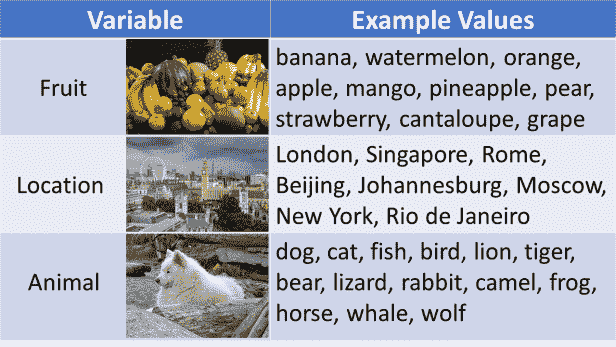
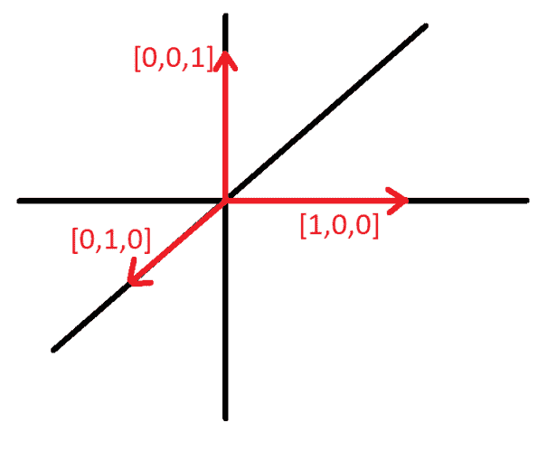
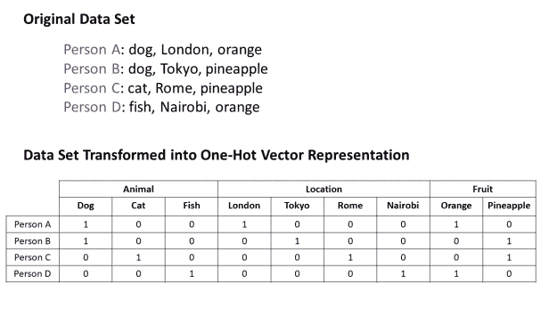
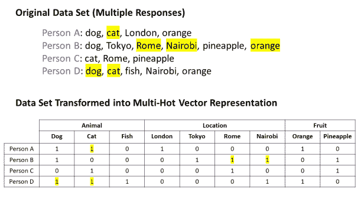
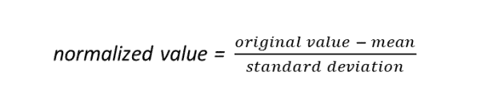

# 为神经网络准备 EHR 和表格数据

> 原文：<https://towardsdatascience.com/everything-you-need-to-know-about-preparing-tabular-data-for-machine-learning-code-included-d1b6779b934f?source=collection_archive---------18----------------------->

## 包含 Python 代码！

这篇文章也可以叫做“我在博士第一年研究大量电子健康记录数据集时学到的一切”在这里，我将概述分类变量和数量变量之间的差异，并解释如何为神经网络模型准备表格数据，包括:

*   分类变量的正确表示(热点向量介绍)
*   连续变量的规范化
*   填充缺失值(插补介绍)

最棒的是，提供了广泛适用的代码来对*您的*表格数据执行上述所有操作！可以在 GitHub 上下载本教程的代码:[rachellea/glassbox medicine/2019–06–01-data processing . py](https://github.com/rachellea/glassboxmedicine/blob/master/2019-06-01-dataprocessing.py)。

# **分类变量**

[分类变量](https://stattrek.com/statistics/dictionary.aspx?definition=categorical%20variable)是采用不同类别名称的变量。以下是分类变量的一些例子:



图片来源:[水果](https://en.wikipedia.org/wiki/Fruit#/media/File:Culinary_fruits_front_view.jpg)，[伦敦](https://en.wikipedia.org/wiki/London#/media/File:Palace_of_Westminster_from_the_dome_on_Methodist_Central_Hall.jpg)，[沙滩狗](https://commons.wikimedia.org/wiki/File:BeachDog2.jpg)

分类变量进一步细分为[名义变量和顺序变量](https://bolt.mph.ufl.edu/6050-6052/preliminaries/types-of-variables/):

*   *名义变量*在类别之间没有自然排序。上面的例子(水果、地点和动物)是“名义上的”变量，因为在类别之间没有内在的顺序；
*   *序数变量*有自然排序。例如，字母等级(A、B、C、D、F)或等级量表(疼痛等级为 1-10)是顺序变量。

**医学中的名义分类变量**

以下是医疗数据集中的一些名义变量(无自然排序)示例，以及一些示例值:

*   *性别*:女，男；
*   [*种族*](https://grants.nih.gov/grants/guide/notice-files/not-od-15-089.html) :美国印第安人或阿拉斯加土著、亚裔、黑人或非裔、西班牙裔或拉丁裔、夏威夷土著或其他太平洋岛民、白人；
*   *诊断*:糖尿病、高血压、高血脂、肺癌、肺炎、心肌梗死、狼疮、肠易激综合征、中风；
*   *手术*:阑尾切除术、胆囊切除术、乳房切除术、CABG *；
*   [*用药*](https://www.drugs.com/drug_information.html) :对乙酰氨基酚、阿普唑仑、阿米替林、氨氯地平、阿莫西林、阿托伐他汀；
*   *实验室检查:*全血细胞计数(CBC)、凝血酶原时间(PT)、基础代谢板(BMP)、综合代谢板(CMP)、血脂板、肝板、血红蛋白 A1c (HbA1c)。

*旁注:CABG 代表“冠状动脉旁路移植术”，这是一种心脏直视手术。医生把这个缩写念成“白菜”(认真)。


[卷心菜](https://en.wikipedia.org/wiki/Cabbage#/media/File:Chou_1.jpg)，不要与 [CABG](https://en.wikipedia.org/wiki/Coronary_artery_bypass_surgery) 混淆

**医学中的有序分类变量**

以下是医疗数据集中顺序变量(固有排序)的一些示例:

助记符:

*   序数变量是有序的；
*   名义变量只有 NOMS(名字)，没有顺序。

# **数量变量**

[定量](https://bolt.mph.ufl.edu/6050-6052/preliminaries/types-of-variables/)变量具有通常代表测量结果的数值。有两种定量变量:

*   离散的变量有可计数的数值。例如:患者服用的处方数量、患者被诊断患有的疾病数量、患者接受的手术数量；
*   *连续*变量在特定的取值范围内取任意值。例如:身高、体重、体重指数、肿瘤直径、腰臀比。

**实验室测试的附带说明**

如果您的变量是实验室测试的名称，那么它就是一个名义(分类)变量，因为它可以采用不同实验室测试的不同名称，例如“全血细胞计数”、“基础代谢组”、“全代谢组”

如果您的变量是实验室测试的结果，它可能是:

*   分类/标称:例如[尿液分析中的颜色](https://emedicine.medscape.com/article/2074001-overview)；
*   定量/离散:例如白细胞数量的计数；
*   定量/连续:例如血糖水平。大多数实验室测试结果都属于这一类，因为它们是某种物质(血液、脑脊液、尿液等)的测量结果。)

# **表示分类变量:独热向量**

在机器学习中，分类变量通常被表示为“独热向量”独热向量是这样一种向量，其中除了一个之外，所有条目都是零，即只有一个元素是“热的”(非零)。以下是一些热点媒介:

独热向量的酷之处在于，它们允许你表示你的分类变量，而不需要假设它们之间有任何特定的关系。

假设您想要表示分类变量“动物”,该变量的值为狗、猫和鱼。

*   如果你说狗= 1，猫= 2，鱼= 3，这意味着狗是鱼的三分之一，猫是狗的两倍，以及其他各种没有意义的数字关系；
*   然而，如果你说狗= [1，0，0]，猫= [0，1，0]，鱼= [0，0，1]，你并没有对这些动物之间的关系做出任何假设，因为这些单热点向量是垂直的:



如果你想要表现 20 种不同的动物，那没问题:只需使用长度为 20 的单键向量。由此产生的 20 个不同的独热向量在 20 维空间中仍然是相互垂直的(你会很高兴地知道，我将*而不是*试图勾画):

*   狗，狗，狗，狗
*   猫[0，1，0，0，0，0，0，0，0，0，0，0，0，0
*   鱼，鱼，鱼，鱼，鱼，鱼
*   马[0，0，0，1，0，0，0，0，0，0，0，0，0，0，0
*   蜥蜴[0，0，0，0，1，0，0，0，0，0，0，0，0，0，0
*   等等

一般来说，你需要的独热向量的长度等于你的分类变量可以取的不同可能值的数量。如果它可以取 5 个值，那么独热向量的长度应该是 5。如果它可以取 1，298 个值，那么您的独热向量的长度应该是 1，298。

**如果我的数据集中有很多分类变量怎么办？**

只需为每个分类变量创建一个不同的独热向量。假设你做了一个调查，问了三个人他们最喜欢的动物、地点和水果。最后，您的调查回答数据集包括分类变量“动物”(3 个可能值)、“位置”(4 个可能值)和“水果”(2 个可能值)。因此，您应该:

*   使用长度为 3 的独热向量表示“动物”;
*   将“位置”表示为长度为 4 的单独的独热码向量；
*   将“水果”表示为长度为 2 的另一个独热向量。

可视化，



如果我的分类变量可以同时取多个值，该怎么办？

如果在之前的调查中，你让人们选择多种动物、地点或水果，会怎么样？您可以使用“多热向量”，它与单热向量完全相同，只是多个条目可以等于 1。下面是一个例子(修改了前面的例子；附加条目以黄色突出显示):



像这样可以取多个值的分类变量在医学中很常见。例如，从患者十年的病历中提取的诊断、程序和药物很可能具有不止一个值。许多患者会有几个过去的诊断，几个过去的程序，和几个过去的药物。因此，您将需要一个用于诊断的多热点向量，另一个用于程序的多热点向量，以及另一个用于药物的多热点向量。

下面是提供的代码中[的一个片段，它使用](https://github.com/rachellea/glassboxmedicine/blob/master/2019-06-01-dataprocessing.py)[熊猫函数 get_dummies()](https://pandas.pydata.org/pandas-docs/stable/reference/api/pandas.get_dummies.html) 将每个分类变量转换成一个单热点或多热点向量:

```
def _one_hotify(self):
    """Modify self.clean_data so that each categorical 
    column is turned into many columns that together form a 
    one-hot vector for that variable. E.g. if you have a column 
    'Gender' with values 'M' and 'F', split it into two binary 
    columns 'Gender_M' and 'Gender_F'""" print('Onehotifying', str(len( 
        self.one_hotify_these_categorical)),'categorical variables')
    print('\tData shape before onehotifying:', 
        str(self.clean_data.shape))
    #one hotify the categorical variables
    self.clean_data = pd.get_dummies(data = self.clean_data,
                 columns = self.one_hotify_these_categorical,
                                         dummy_na = False)
    print('\tData shape after one-hotifying:', 
        str(self.clean_data.shape))
```

# **代表量化变量:规范化的重要性** **(即“如何喂养你的神经网络”)**

现在我们要换个话题，谈谈表示数量变量。看起来你可以直接把这些变量扔进模型，而不需要任何额外的工作，因为它们已经是数字了。然而，如果您正在构建一个神经网络模型，您不希望输入原始的定量变量，因为它们可能具有非常不同的标度，并且为神经网络提供不同标度的数字会使它变得令人难过(即，神经网络学习任何东西都会更加困难。)

我所说的“不同尺度”是指一些变量可能取小值(例如肿瘤直径= 0.5 厘米)，而其他变量可能取大值(例如体重= 350 磅)。)如果只给神经网络输入较小的标准化值，它的训练会更有效。

以下是在训练神经网络之前对定量变量进行归一化的常见步骤:

1.  将数据分成训练集、验证集和测试集。
2.  计算训练集中定量变量的平均值；
3.  计算训练集中定量变量的标准差；
4.  使用您刚刚在训练集上计算的平均值和标准偏差，标准化所有数据(训练、验证和测试)中定量变量的每个原始值:



您必须为数据集中的每个定量变量分别执行此操作(例如，分别为“肿瘤直径”和“重量”)，因为每个定量变量将具有不同的平均值和不同的标准差。

执行上述步骤的效果是，您所有的量化变量现在都将表示为以 0 为中心的小数字，这将使它们成为您的神经网络的良好食物。

为什么我们只使用训练集来计算均值和标准差？为什么不使用整个数据集？回答:如果我们在计算平均值和标准偏差时包括测试集，我们会将测试集的信息泄露到我们的训练数据中，这是作弊。

下面是提供的代码中[的一个片段，它使用 scikit-learn 的](https://github.com/rachellea/glassboxmedicine/blob/master/2019-06-01-dataprocessing.py)[标准缩放器](https://scikit-learn.org/stable/modules/generated/sklearn.preprocessing.StandardScaler.html)对连续变量进行归一化:

```
def _normalize(self):
    """Provide the features specified in 
    self.normalize_these_continuous
    with approximately zero mean and unit variance, based on the
    training dataset only."""
    train_data = ( 
        self.clean_data[self.normalize_these_continuous].values
        )[0:self.trainidx,:]
    scaler = sklearn.preprocessing.StandardScaler().fit(train_data)
    print('Normalizing data:\n\tscaler.mean_',str(scaler.mean_),
          '\n\tscaler.scale_',str(scaler.scale_))
    assert (len(self.normalize_these_continuous)
            ==scaler.mean_.shape[0]
            ==scaler.scale_.shape[0](
    self.clean_data[self.normalize_these_continuous] = 
        scaler.transform((
        self.clean_data[self.normalize_these_continuous]).values)
```

# **插补处理缺失数据**

数据值经常丢失。也许调查参与者没有回答所有的问题，或者患者在不同的州接受治疗，他们的诊断、程序和药物没有记录在当地的医疗记录中。

如果我们读入一个带有缺失值的数据文件，这些值将是“NaNs”，或者“不是一个数字”为了训练，我们必须用一个数字来代替它们。填补缺失值被称为“插补”

有不同的插补策略。这里有一个合理的策略:

*   用训练集模式替换分类变量的所有缺失值。因此，如果动物的模式(最常选择的值)是“狗”，我们将替换“你最喜欢的动物是什么？”用“狗”；
*   用训练集中值替换连续变量的所有缺失值。因此，如果中值高度是 5.2 英尺，我们用 5.2 替换所有缺失的“高度”条目。

下面是提供的代码的一个片段[，它使用](https://github.com/rachellea/glassboxmedicine/blob/master/2019-06-01-dataprocessing.py)[熊猫函数 fillna()](https://pandas.pydata.org/pandas-docs/stable/reference/api/pandas.DataFrame.fillna.html) 对缺失值进行插补:

```
def _impute(self):
    """Impute categorical variables using the mode of the 
    training data and continuous variables using the median 
    of the training data."""
    #impute missing categorical values with the training data mode
    print('Imputing categorical variables with mode:\n',
          str(self.impute_these_categorical))
    training_data = self.clean_data.iloc[0:self.trainidx,:]
    imputed_with_modes = (
        self.clean_data[self.impute_these_categorical]).fillna((
       training_data[self.impute_these_categorical]).mode().iloc[0])
    self.clean_data[self.impute_these_categorical] =\
        imputed_with_modes  

    #impute missing continuous values with the training data median
    print('Imputing continuous variables with median:\n',
          str(self.impute_these_continuous))
    imputed_with_medians = (
        self.clean_data[self.impute_these_continuous]
        ).fillna((training_data[self.impute_these_continuous]
        ).median())
    self.clean_data[self.impute_these_continuous] = 
        imputed_with_medians
```

# 摘要

*   仔细的数据准备对于你的神经网络达到良好的性能是至关重要的；
*   One-hot vectors 允许您输入分类变量，而无需假设不同类别之间的任何特定数字关系；
*   将你的量化变量归一化为以零为中心的小数字，将有助于你的神经网络更有效地训练；
*   真实数据集往往是不完整的。使用相关变量的中位数或众数来输入缺失值将允许您在这些数据集上构建模型。

**关于特色图片**


特色图片是[一只萨摩耶犬](https://commons.wikimedia.org/wiki/File:BeachDog2.jpg)，恰好是我一直以来最喜欢的一种狗。这只狗在“分类变量示例”表中客串了一次。[关于萨摩耶的趣闻](https://en.wikipedia.org/wiki/Samoyed_dog):

*   萨摩耶犬是西伯利亚的游牧驯鹿牧民饲养的；
*   萨摩耶犬是最古老的犬种之一；
*   脱落的萨摩耶毛皮可以用来编织衣物；
*   由于它们厚厚的皮毛，萨摩耶犬可以在远低于冰点的温度下保持温暖。

*原载于 2019 年 6 月 1 日*[*http://glassboxmedicine.com*](https://glassboxmedicine.com/2019/06/01/everything-you-need-to-know-about-preparing-tabular-data-for-machine-learning-code-included/)*。*