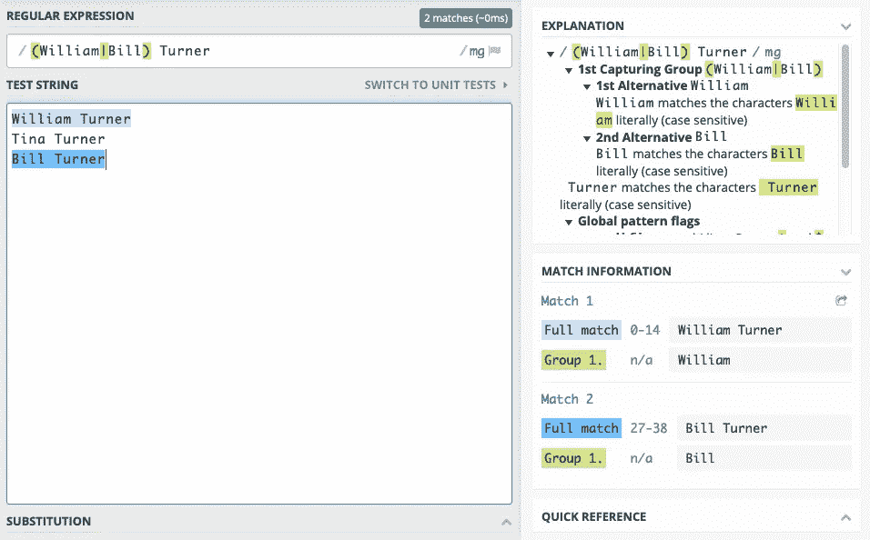
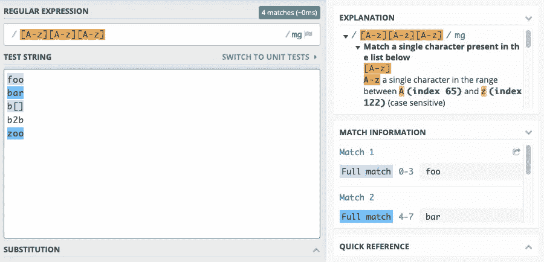

# 关于正则表达式你需要知道的一切

> 原文：<https://towardsdatascience.com/everything-you-need-to-know-about-regular-expressions-8f622fe10b03?source=collection_archive---------0----------------------->


Photo by [NESA by Makers](https://unsplash.com/@nesabymakers?utm_source=unsplash&utm_medium=referral&utm_content=creditCopyText) on [Unsplash](https://unsplash.com/s/photos/learn?utm_source=unsplash&utm_medium=referral&utm_content=creditCopyText)

读完这篇文章后，你会对什么是正则表达式，它们能做什么，它们不能做什么有一个坚实的理解。

你将能够判断何时使用它们，更重要的是，何时不使用它们。

让我们从头开始。

# 什么是正则表达式？

在抽象层次上，正则表达式，简称 regex，是集合的简写表示。一组弦。

假设我们有一个所有有效邮政编码的列表。与其保留那个又长又笨重的列表，不如用一个简短而精确的模式来完整地描述那个集合。每当您想要检查一个字符串是否是一个有效的邮政编码时，您可以将它与模式进行匹配。您将得到一个 true 或 false 结果，表明该字符串是否属于 regex 模式所代表的邮政编码集。

让我们扩展一下邮政编码集。邮政编码列表是有限的，由相当短的字符串组成，在计算上并不特别具有挑战性。

以`.csv`结尾的那组字符串呢？在查找数据文件时非常有用。这个集合是无限的。你不能事先列个清单。测试成员资格的唯一方法是到字符串的末尾，比较最后四个字符。正则表达式是以一种标准化的方式编码这种模式的一种方式。


Regular expressions match sets of strings. Photo by [Kristian Strand](https://unsplash.com/@kristianstrand?utm_source=medium&utm_medium=referral) on [Unsplash](https://unsplash.com?utm_source=medium&utm_medium=referral)

下面是一个正则表达式模式，代表我们的以`.csv`结尾的字符串集

`^.*\.csv$`

让我们把这种特殊模式的机制放在一边，看看实际情况:正则表达式引擎可以根据输入字符串测试模式，看它是否匹配。以上图案匹配`foo.csv`，但不匹配`bar.txt`或`my_csv_file`。

在代码中使用正则表达式之前，可以使用在线正则表达式计算器测试它们，并尝试友好的用户界面。

我喜欢[regex101.com](https://regex101.com/):你可以选择正则表达式引擎的风格，模式会被很好地分解，所以你可以很好地理解你的模式实际上做了什么。正则表达式模式可能是神秘的。

我建议你在另一个窗口或标签中打开[regex101.com](https://regex101.com/),以交互方式体验本文中的例子。我保证，这样您会对正则表达式模式有更好的感觉。


debugging regular expressions

# 正则表达式是用来做什么的？

正则表达式在任何受益于字符串的完全或部分模式匹配的场景中都很有用。以下是一些常见的使用案例:

*   验证字符串的结构
*   从结构化字符串中提取子字符串
*   搜索/替换/重新排列部分字符串
*   将字符串拆分成标记

所有这些在做数据准备工作时都会定期出现。

# 正则表达式的构造块

正则表达式模式是由不同的构建块构成的。它可以包含[文字](#literals)、[字符类](#character-classes)、[边界匹配器](#boundary-matchers)、[量词](#quantifiers)、[组](#groups)以及[或运算符](#the-or-operator)。

让我们深入研究一下一些例子。

## 文字

正则表达式中最基本的构件是字符，也称为文字。正则表达式模式中的大多数字符没有特殊的含义，它们只是匹配它们自己。考虑以下模式:

`I am a harmless regex pattern`

这个图案中没有一个字符有特殊含义。因此，模式中的每个字符都与其自身匹配。因此，只有一个字符串匹配这个模式，并且它与模式字符串本身相同。


matching a simple pattern

## 转义文字字符

有哪些确实有特殊含义的字符？以下列表显示了在正则表达式中具有特殊含义的字符。如果要表示它们自己，就必须用反斜杠对它们进行转义。

characters with special meaning in regular expressions

考虑以下模式:

`\+21\.5`

该模式仅由文字组成——`+`有特殊的含义并已被转义，同样的还有`.`——因此该模式仅匹配一个字符串:`+21.5`


## 匹配不可打印字符

有时需要引用一些不可打印的字符，如制表符⇥或换行符↩

最好对它们使用正确的转义序列:

如果您需要匹配换行符，它们通常有两种类型:

*   `\n`通常被称为 unix 风格的换行符
*   `\r\n`通常被称为 windows 风格的换行符

为了抓住这两种可能性，你可以在`\r?\n`上匹配，这意味着:可选的`\r`后跟`\n`


matching a newline

## 匹配任何 Unicode 字符

有时，您必须使用 Unicode 索引来匹配最能表达的字符。有时候一个字符就是不能被输入——就像 ASCII `NUL`、`ESC`、`VT`等控制字符。

有时，您的编程语言不支持将某些字符放入模式中。在 [BMP](https://en.wikipedia.org/wiki/Plane_(Unicode)#Basic_Multilingual_Plane) 之外的字符，如 [𝄞](https://charbase.com/1d11e-unicode-musical-symbol-g-clef) 或表情符号通常不被逐字支持。

在许多 regex 引擎中——比如 Java、JavaScript、Python 和 Ruby——您可以使用`\uHexIndex`转义语法通过 Unicode 索引匹配任何字符。假设我们想要匹配自然数的符号: [ℕ - U+2115](https://charbase.com/2115)

匹配这个字符的模式是:`\u2115`


matching a unicode symbol

其他引擎通常提供等效的转义语法。在围棋中，你可以使用`\x{2115}`来匹配ℕ

Unicode 支持和转义语法因引擎而异。如果你计划匹配技术符号、音乐符号或表情符号——特别是在 [BMP](https://en.wikipedia.org/wiki/Plane_(Unicode)#Basic_Multilingual_Plane) 之外——检查你使用的 regex 引擎的文档，以确保对你的用例有足够的支持。

## 模式的转义部分

有时模式要求连续字符作为文字进行转义。假设它匹配下面的字符串:`+???+`

该模式如下所示:

`\+\?\?\?\+`

将每个字符作为文字进行转义的需要使得阅读和理解变得更加困难。

根据您的正则表达式引擎，可能有一种方式在您的模式中开始和结束文字部分。检查你的文件。在 Java 和 Perl 中，应该逐字解释的字符序列可以用`\Q`和`\E`括起来。以下模式等同于上述模式:

`\Q+???+\E`

如果模式是由部分构成的，对模式的部分进行转义也是有用的，其中一些部分是按字面意思解释的，比如用户提供的搜索词。

如果你的 regex 引擎没有这个特性，那么生态系统通常会提供一个函数来对模式字符串中所有具有特殊含义的字符进行转义，比如 [lodash escapeRegExp](https://lodash.com/docs/4.17.10#escapeRegExp) 。

# OR 运算符

管道字符`|`是选择操作符。它匹配备选方案。假设一个模式应该匹配字符串`1`和`2`

下面的模式可以达到这个目的:

`1|2`

运算符左侧和右侧的模式是允许的替代模式。


以下模式匹配`William Turner`和`Bill Turner`

`William Turner|Bill Turner`

备选方案的第二部分是一致的`Turner`。将备选方案`William`和`Bill`放在前面，并且只提到`Turner`一次会比较方便。以下模式可以做到这一点:

`(William|Bill) Turner`

看起来可读性更强。它还引入了一个新概念:组。

# 组

您可以在圆括号中的部分中分组子模式。它们将包含的表达式组合成一个单元。对模式的各个部分进行分组有多种用途:

*   简化正则表达式符号，使意图更清晰
*   对子表达式应用量词[和](#quantifiers)
*   提取匹配组的子字符串
*   替换匹配组的子字符串

我们来看一个带组的正则表达式:`(William|Bill) Turner`

组有时被称为“捕获组”，因为在匹配的情况下，每个组的匹配子串被捕获，并且可用于提取。



如何使捕获的组可用取决于您使用的 API。在 JavaScript 中，调用`"my string".match(/pattern/)`会返回一个匹配的[数组。第一项是整个匹配的字符串，后续项是按照在模式中出现的顺序匹配模式组的子字符串。](https://developer.mozilla.org/en-US/docs/Web/JavaScript/Reference/Global_Objects/String/match)

Accessing sub-strings in captured in groups

## 示例:国际象棋符号

考虑识别[棋盘](https://en.wikipedia.org/wiki/Algebraic_notation_(chess))区域的字符串。棋盘上的区域可以被标识为第一列的 A1-A8，第二列的 B1-B8，等等，直到最后一列的 H1-H8。假设应该验证包含此符号的字符串，并使用捕获组提取组成部分(字母和数字)。下面的正则表达式可以做到这一点。

`(A|B|C|D|E|F|G|H)(1|2|3|4|5|6|7|8)`

虽然上面的正则表达式是有效的，并完成了工作，但它有些笨拙。这个也可以，而且更简洁一点:

`([A-H])([1-8])`


这看起来更简洁。但是它引入了一个新概念:字符类。

# 字符类别

字符类用于定义一组允许的字符。允许的字符集放在方括号中，并且列出了每个允许的字符。角色类`[abcdef]`相当于`(a|b|c|d|e|f)`。因为该类包含替代项，所以它只匹配一个字符。

图案`[ab][cd]`正好匹配 4 串`ac`、`ad`、`bc`和`bd`。它确实*不*匹配`ab`，第一个字符匹配，但第二个字符必须是`c`或`d`。

假设一个模式应该匹配一个两位数的代码。与之匹配的模式如下所示:

`[0123456789][0123456789]`

该模式匹配从`00`到`99`范围内的所有 100 个两位字符串。

## 范围

在一个字符类中列出所有可能的字符通常是乏味且容易出错的。使用破折号运算符:`[0-9][0-9]`可以将连续字符作为范围包含在字符类中


matching two characters in range 0–9

字符按数字索引排序——在 2019 年，数字索引几乎总是 [Unicode 索引](https://en.wikipedia.org/wiki/List_of_Unicode_characters)。如果您正在处理数字、拉丁字符和基本的标点符号，您可以查看 Unicode 的更小的历史子集: [ASCII](http://www.asciitable.com/) 。

从 0 到 9 的数字通过码位顺序编码:`0`的`U+0030`到`9`的码位`U+0039`，所以`[0–9]`的字符集是一个有效的范围。

拉丁字母的小写字母和大写字母也是连续编码的，所以字母字符的字符类也经常出现。以下字符集匹配任何小写拉丁字符:

`[a-z]`

您可以在同一个字符类中定义多个范围。以下字符类匹配所有小写和大写拉丁字符:

`[A-Za-z]`

您可能会有这样的印象，上面的模式可以缩写为:

`[A-z]`

这是一个有效的字符类，但它不仅匹配 a-z 和 A-Z，还匹配 Z 和 A 之间定义的所有字符，如`[`、`\`和`^`。



the range A-z includes unexpected characters [ and ]

> 如果你正在气头上咒骂定义 ASCII 并引入这种令人难以置信的不连续性的人的愚蠢，请稍安勿躁。ASCII 是在计算能力比今天珍贵得多的时代定义的。
> 
> 看`A hex: 0x41 bin: 0100 0001`和`*a hex: 0x61 bin: 0110 0001*`
> 
> 你如何在大写和小写之间转换？你翻转**一个**位。整个字母表都是如此。ASCII 经过优化，可以简化大小写转换。定义 ASCII 的人考虑得非常周到。一些可取的品质不得不为其他品质而牺牲。不客气

您可能想知道如何将`-`字符放入字符类。毕竟它是用来定义范围的。如果将`-`字符放在类中的第一个或最后一个字符:`[-+0–9]`或`[+0–9-]`，大多数引擎会逐字解释该字符。一些引擎需要使用反斜杠`[\-+0–9]`进行转义

## 否定

有时定义一个匹配大多数字符的字符类是很有用的，除了一些定义的例外。如果字符类定义以`^`开头，列出的字符集将被反转。例如，下面的类允许任何字符，只要它既不是数字也不是下划线。

`[^0-9_]`


looking for three consecutive non-digit and non-underscore characters

请注意，如果`^`字符不是类的第一个字符，它将被解释为文字，如在`[f^o]`中，如果在字符类之外使用，它将是一个[边界匹配器](#boundary-matchers)。

## 预定义的字符类

有些字符类使用如此频繁，以至于为它们定义了速记符号。考虑角色类`[0–9]`。它匹配任何数字字符，并且使用如此频繁，以至于有一个助记符号:`\d`。

下面的列表显示了具有最常见的速记符号的字符类，您使用的任何 regex 引擎都可能支持这些符号。

大多数引擎都提供了预定义字符类的完整列表，这些字符类与 Unicode 标准、标点符号、特定字母等的某些块或类别相匹配。这些额外的字符类通常特定于手边的引擎，并且不太容易移植。

## 点字符类

最普遍的预定义字符类是点，它本身就值得拥有一小部分。它匹配任何字符，除了像`\r`和`\n`这样的行终止符。

以下模式匹配以小写 x 结尾的任意三个字符串:

`..x`


the dot matches anything except newline characters

在实践中，点通常用于创建模式中的“任何东西都可以放在这里”部分。它经常与一个量词[结合使用](#quantifiers)和`.*`用于匹配“任何”或“无关”部分。


matching anything between 1 and 2

请注意，当在字符类中使用时，`.`字符失去了它的特殊含义。字符类`[.,]`只匹配两个字符，点和逗号。

根据您使用的正则表达式引擎，您可以设置 **dotAll** [执行标志](#execution-flags)，在这种情况下`.`将匹配任何东西，包括行终止符。

# 边界匹配器

边界匹配器(也称为“锚点”)不匹配字符本身，而是匹配边界。如果你愿意，它们匹配字符之间的位置。最常见的主播有`^`和`$`。它们分别匹配一行的开始和结束。下表显示了最常支持的锚点。

## 锚定开始和结束

考虑在多行文本中搜索数字的操作。模式`[0–9]`查找文本中的每个数字，不管它位于哪里。模式`^[0–9]`查找作为一行第一个字符的每个数字。


matching digits at the beginning of a line

同样的想法也适用于以`$`结尾的行。


matching digits at the end of a line

`\A`和`\Z` *或* `\z`锚是匹配多行字符串的有用工具。它们锚定到整个输入的开头和结尾。大写的`\Z`变体可以容忍尾随换行符，并且匹配之前的换行符，有效地丢弃匹配中的任何尾随换行符。

> 大多数主流 regex 引擎都支持\A 和\Z 锚，JavaScript 是个明显的例外。

假设需求是检查一个文本是否是指定棋位的两行记录。输入字符串如下所示:

```
Column: F
Row: 7
```

以下模式与上述结构相匹配:

`\AColumn: [A-H]\r?\nRow: [1-8]\Z`


Using /A and /Z to anchor to beginning and end of input

## 全字匹配

`\b`锚匹配任何字母数字序列的边缘。如果您想进行“全字”匹配，这是很有用的。下面的模式寻找一个独立的大写字母`I`。

`\bI\b`


the \b anchor matches on transitions between “words”

模式与`Illinois`的第一个字母不匹配，因为右边没有单词边界。下一个字母是单词字母——由字符类`\w`定义为`[a-zA-Z0–9_]`——而不是非单词字母，这将构成一个边界。

我们把`Illinois`换成`I!linois`吧。感叹号不是单词字符，因此构成了边界。


## 杂项锚

有点深奥的非字界`\B`是对`\b`的否定。匹配任何`\b`不匹配的位置。它匹配空格内字符*和字母数字序列之间的每个位置。*

一些正则表达式引擎支持`\G`边界匹配器。这在以编程方式使用正则表达式时很有用，一个模式被重复应用于一个字符串，试图在一个循环中找到所有匹配[的模式。它锚定到找到的最后一个匹配的位置。](https://docs.microsoft.com/en-us/dotnet/standard/base-types/anchors-in-regular-expressions#contiguous-matches-g)

# 量词

任何文字或字符组只匹配一个字符。模式`[0–9][0–9]`正好匹配两位数字。量词有助于指定模式的预期匹配数。它们用花括号表示。以下等同于`[0–9][0–9]`

`[0-9]{2}`

基本符号可以扩展到提供上限和下限。说是需要匹配二到六位数。确切的数字各不相同，但必须在 2 到 6 之间。下面的符号做到了这一点:

`[0-9]{2,6}`


sequences of 2–6 digits are matched

上限是可选的，如果省略，则等于或大于下限的任何出现次数都是可接受的。以下示例匹配两个或更多连续数字。

`[0-9]{2,}`

对于实践中经常使用的常用量词，有一些预定义的缩写。

## 那个？数量词

`?`量词相当于`{0, 1}`，表示:可选单次出现。前面的模式可能不匹配，或者匹配一次。

让我们寻找整数，可选地以加号或减号为前缀:`[-+]?\d{1,}`


finding integers with optional sign

## +量词

量词`+`相当于`{1,}`，意思是:至少出现一次。

我们可以通过用`+`替换`{1,}`来修改上面的整数匹配模式，使其更加符合习惯，我们得到:`[-+]?\d+`


finding integers with optional sign again

## 量词*

`*`量词相当于`{0,}`，意思是:零次或多次出现。你会经常看到它与点号连用为`.*`，意思是:任何字符都不在乎多频繁。

让我们匹配一个逗号分隔的整数列表。条目之间不允许有空格，并且必须至少有一个整数:`\d+(,\d+)*`

我们匹配的是一个整数，后跟任意数量的包含一个逗号和一个整数的组。


## 默认贪婪

假设需求是匹配捕获组中 http URL 的域部分。以下似乎是一个好主意:匹配协议，然后捕获域，然后是可选路径。这个想法大致可以解释为:

`[http://(.*)/?](/(.*)/?.*)`

> 如果你使用的引擎使用像 JavaScript 这样的`/regex/`符号，你必须避开正斜杠:`[http:\/\/(.*)\/?.*](/(.*)/?.*)`

它匹配协议，捕获协议之后的域，并允许一个可选的斜杠和其后的一些任意文本，这将是资源路径。


greedy capture matches too much

奇怪的是，给定一些输入字符串，该组捕获到以下内容:

unexpected portion of url captured by group

结果有些令人惊讶，因为该模式被设计为仅捕获域部分，但它似乎捕获了 URL 末尾之前的所有内容。

发生这种情况是因为模式中遇到的每个量词都试图匹配尽可能多的字符串。量词因此被称为**贪心**。

让我们检查一下:`[http://(.*)/?.*](/(.*)/?.*)`的匹配行为

捕获组中的贪心`*`是第一个遇到的量词。它所应用的`.`字符类匹配任何字符，所以量词扩展到字符串的末尾。因此捕获组捕获了一切。但是等等，你会说，结尾还有`/?.*`的部分。嗯，是的，它和字符串的剩余部分完全匹配——什么也没有，也就是空字符串。斜杠是可选的，后跟零个或多个字符。空字符串符合。整个模式完全吻合。

## 贪婪匹配的替代方案

贪婪是量词的默认用法，但不是唯一的用法。每个量词都有一个**不情愿的**版本，它匹配**最少**可能数量的字符。量词的贪婪版本通过追加一个**被转换成不情愿的版本？**交给他们。

下表给出了所有量词的符号。

量化器`{n}`在贪婪和勉强两种版本中是等价的。对于其他字符，匹配字符的数量可能会有所不同。让我们重新看看上面的例子，改变捕获组以尽可能少地匹配，希望能正确捕获域名。

`[http://(.*?)/?.*](/(.*?)/?.*)`


capturing empty strings with reluctant quantifiers

使用这种模式，组不会捕获任何东西，更准确地说是空字符串。这是为什么呢？捕获组现在尽可能少地捕获:什么也不捕获。`(.*?)`什么也没捕捉到，`/?`什么也没匹配，而`.*`匹配字符串剩余的全部内容。因此，这种模式并没有像预期的那样工作。

到目前为止，捕获组匹配太少或太多。让我们回到贪婪量词，但不允许在域名中使用斜杠字符，还要求域名至少有一个字符长。

`http://([^/]+)/?.*`

这种模式贪婪地捕捉协议后面的一个或多个非斜杠字符作为域，如果最后出现任何可选的斜杠，它后面可能会跟有路径中的任意数量的字符。


## 量化器性能

贪婪量词和勉强量词都意味着一些运行时开销。如果只有几个这样的量词，就没有问题。但是，如果多个嵌套组都被量化为贪婪或勉强，那么确定最长或最短的可能匹配是一个重要的操作，这意味着在输入字符串上来回运行，调整每个量词匹配的长度，以确定表达式作为一个整体是否匹配。

可能出现[灾难性回溯](https://www.regular-expressions.info/catastrophic.html)的病理情况。如果担心性能或恶意输入，最好选择不情愿的量词，并看看第三种量词:所有格量词。

## 所有格量词:永不回馈

如果您的引擎支持，所有格量词的行为很像贪婪量词，区别在于它们不支持回溯。他们试图匹配尽可能多的字符，一旦他们这样做了，他们永远不会产生任何匹配的字符来适应模式的任何其他部分的可能匹配。

它们通过在基本贪婪量词后面追加一个`+`来表示。

它们是“类贪婪”量词的快速执行版本，这使它们成为对性能敏感的操作的良好选择。

让我们在 PHP 引擎中看看它们。首先，我们来看看简单的贪婪匹配。让我们匹配一些数字，后面跟着一个九:`([0–9]+)9`

针对输入字符串进行匹配:`123456789`贪婪量词会首先匹配整个输入，然后返回`9`，这样剩下的模式就有机会匹配了。


greedy match

现在，当我们用所有格量词替换贪婪时，它将匹配整个输入，然后拒绝返回`9`以避免回溯，这将导致整个模式根本不匹配。


possessive quantifer causing a non-match

什么时候你会想要占有欲行为？当你知道你总是想要尽可能长的比赛。

假设您想要提取文件系统路径的文件名部分。假设`/`为路径分隔符。那么我们实际上想要的是最后一次出现`/`之后的字符串的最后一位。

所有格模式在这里工作得很好，因为我们总是希望在获取文件名之前使用所有的文件夹名。使用文件夹名的模式部分不需要归还字符。相应的模式可能如下所示:

`\/?(?:[^\/]+\/)++(.*)`

> 注意:这里使用 PHP `/regex/`符号，所以正斜杠被转义。

我们希望允许绝对路径，所以我们允许输入以可选的正斜杠开始。然后，我们使用由一系列非斜杠字符后跟一个斜杠组成的文件夹名。为此，我使用了一个[非捕获组](#non-capturing-group)——因此它被标记为`(?:pattern)`，而不仅仅是`(pattern)`。最后一个斜杠之后剩下的任何内容都是我们捕获到一个组中进行提取的内容。


example of posessive matching

# 非捕获组

非捕获组与正常组完全匹配。但是，它们不提供匹配的内容。如果不需要捕获内容，它们可以用来提高匹配性能。非捕获组写为:`(?:pattern)`

假设我们想验证一个十六进制字符串是有效的。它需要由偶数个十六进制数字组成，每个数字在`0–9`或`a-f`之间。以下表达式使用组来完成这项工作:

`([0-9a-f][0-9a-f])+`

由于该组在模式中的作用是确保数字成对出现，并且实际匹配的数字没有任何相关性，因此该组也可以用更快执行的非捕获组来替换:

`(?:[0-9a-f][0-9a-f])+`


matching sequences of hex bytes

## 原子团

还有一个非捕获组的快速执行版本，它不支持回溯。它被称为“独立非捕获群”或“原子群”。

它被写成`(?>pattern)`

原子组是非捕获组，可用于优化模式匹配速度。通常，它由 regex 引擎支持，这些引擎也支持所有格量词。

它的行为也类似于所有格量词:一旦一个原子组匹配了字符串的一部分，第一个匹配就是永久的。这个群体永远不会试图以另一种方式重新匹配，以适应模式的其他部分。

`a(?>bc|b)c`匹配`abcc`但不匹配`abc`。

原子组的第一场成功比赛在`bc`进行，并且一直保持下去。正常组将在回溯期间重新匹配，以适应模式末尾的`c`,从而成功匹配。但是原子组的第一场比赛是永久的，不会改变。

如果您希望尽可能快地匹配，并且不希望发生任何回溯，这是非常有用的。

假设我们匹配路径的文件名部分。我们可以匹配任何字符的原子组，后跟一个斜杠。然后捕获其余部分:

`(?>.*\/)(.*)`

> 注意:这里使用 PHP `*/regex/*`符号，所以正斜杠被转义。


atomic group matching

一个普通的团队同样可以完成这项工作，但是消除回溯的可能性可以提高性能。如果您将数百万个输入与非平凡的正则表达式模式进行匹配，您将开始注意到差异。

它还通过触发[灾难性回溯](https://www.regular-expressions.info/catastrophic.html)场景，提高了抵御旨在 DoS 攻击服务的恶意输入的弹性。

# 反向引用

有时引用字符串中较早匹配的内容很有用。假设一个字符串值只有以相同的字母开头和结尾才有效。单词“alpha”、“radar”、“kick”、“level”和“stars”就是例子。可以在一个组中捕获字符串的一部分，然后在模式 pattern 中引用该组:反向引用。

regex 模式中的反向引用使用`\n`语法来表示，其中`n`是捕获组的编号。编号从左到右，从 1 开始。如果组是嵌套的，它们按照遇到左括号的顺序编号。组 0 始终表示整个表达式。

以下模式匹配至少包含 3 个字符且以相同字母开头和结尾的输入:

`([a-zA-Z]).+\1`

换句话说:小写或大写字母——该字母被捕获到一个组中——后跟任何非空字符串，再跟我们在匹配开始时捕获的字母。


on-letter back references

让我们扩展一下。如果一个输入字符串不止一次地包含任何字母数字序列，那么它就是匹配的。单词边界用于确保匹配整个单词。

`\b(\w+)\b.*\b\1\b`


## 搜索并替换为反向引用

正则表达式在搜索和替换操作中很有用。典型的用例是寻找与模式匹配的子字符串，并用其他内容替换它。大多数使用正则表达式的 API 允许您在替换字符串中引用搜索模式中的捕获组。

这些反向引用有效地允许重新排列部分输入字符串。

考虑以下场景:输入字符串包含一个 A-Z 字符前缀，后跟一个可选空格，后跟一个 3–6 位数。像`A321`、`B86562`、`F 8753`和`L 287`这样的琴弦。

任务是将其转换为另一个字符串，该字符串由数字、破折号和字符前缀组成。

```
**Input**   **Output** A321    321-A
B86562  86562-B
F 8753  8753-F
L 287   287-L
```

将一个字符串转换为另一个字符串的第一步是在捕获组中捕获字符串的每个部分。搜索模式如下所示:

`([A-Z])\s?([0-9]{3,6})`

它将前缀捕获到一个组中，允许一个可选的空格字符，然后将数字捕获到第二个组中。替换字符串中的反向引用使用`$n`语法表示，其中`n`是捕获组的编号。此操作的替换字符串应该首先引用包含数字的组，然后引用文字破折号，然后引用包含字母前缀的第一个组。这将给出以下替换字符串:

`$2-$1`

因此`A321`与搜索模式匹配，将`A`放入`$1`并将`312`放入`$2`。替换字符串的排列产生了预期的结果:首先是数字，然后是破折号，最后是字母前缀。


请注意，由于`$`字符在替换字符串中具有特殊的含义，如果要作为字符插入，必须将其转义为`$$`。

这种支持正则表达式的搜索和替换通常由文本编辑器提供。假设您在编辑器中有一个路径列表，手头的任务是在每个文件的文件名前面加一个下划线。路径`/foo/bar/file.txt`应该变成`/foo/bar/_file.txt`

根据我们目前所学，我们可以这样做:


example regex-enabled search and replace in VS Code

# 看，但不要碰:向前看和向后看

有时断言一个字符串具有某种结构是有用的，而不需要实际匹配它。这有什么用？

让我们编写一个模式，匹配后面跟有以`a`开头的单词的所有单词

让我们试试`\b(\w+)\s+a`它锚定到一个单词边界，并匹配单词字符，直到它看到一些空格后跟一个 a。


first attempt at matching words that are followed by words beginning with an a

在上面的例子中，我们匹配了`love`、`swat`、`fly`和`to`，但是没有捕捉到`ant`之前的`an`。这是因为`a`出发`an`已经作为`to`比赛的一部分被消耗掉了。我们已经扫描过那个`a`，单词`an`没有匹配的机会。

如果有一种方法可以断言下一个单词的第一个字符的属性，而不实际消耗它，那将是非常好的。

断言存在但不消耗输入的构造称为“前视”和“后视”。

## 向前看

Lookaheads 用于断言模式在前面匹配。它们被写成`(?=pattern)`

让我们用它来修正我们的模式:

`\b(\w+)(?=\s+a)`

我们已经将下一个单词的空格和首字母`a`放入一个 lookahead 中，所以当扫描一个字符串进行匹配时，它们会被检查但不会被消耗。


look ahead asserts a pattern matches ahead, but does not consume it

负的前瞻断言其模式不匹配前瞻。表示为`(?!pattern)`

让我们找出后面没有以`a`开头的单词的所有单词。

`\b(\w+)\b(?!\s+a)`

我们匹配后面没有空格和一个`a`的整个单词。


negative look ahead asserts that its pattern does not match ahead

## 向后看

lookbehind 的作用与 lookahead 相同，但它适用于当前位置的左侧，而不是右侧。许多正则表达式引擎限制了可以在 look back 中使用的模式类型，因为向后应用模式不是它们所优化的。检查你的文件！

回顾被写成`(?<=pattern)`

它断言在当前位置之前存在某个东西。让我们找出以`r`或`t`结尾的单词之后的所有单词。

`(?<=[rt]\s)(\w+)`

我们断言有一个`r`或`t`后跟一个空格，然后我们捕获后面的单词字符序列。


a lookbehind to capture certain words

还有一种消极的观点认为左边的模式不存在。它被写成`(?<!pattern)`

让我们颠倒一下找到的单词:我们想要匹配不是以`r`或`t`结尾的单词之后的所有单词。

`(?<![rt]\s)\b(\w+)`

我们通过`\b(\w+)`匹配所有单词，并且通过在前面加上`(?<![rt]\s)`来确保我们匹配的任何单词前面没有以`r`或`t`结尾的单词。


matching with a negative lookbehind

## 分裂模式

如果您正在使用一个允许您按模式分割字符串的 API，记住前视和后视通常是有用的。

正则表达式拆分通常使用模式作为分隔符，并从部分中删除分隔符。将 lookahead 或 look ahead 部分放在一个定界符中可以使它匹配，而不会删除仅仅被查看过的部分。

假设你有一个由`:`分隔的字符串，其中有些部分是由字母字符组成的标签，有些是格式为`HH:mm`的时间戳。

让我们看看输入字符串`time_a:9:23:time_b:10:11`

如果我们只是在`:`分裂，我们得到部分: `[time_a, 9, 32, time_b, 10, 11]`


splitting on delimiter

假设我们想通过分裂来提高，只要`:`两边都有字母。分隔符现在是`[a-z]:|:[a-z]`


including adjacent letters in the match treats them as part of the delimiter

我们得到部分: `[time_, 9:32, ime_, 10:11]`我们丢失了相邻的字符，因为它们是分隔符的一部分。

如果我们细化分隔符，对相邻字符使用 lookahead 和 look ahead，它们的存在将被验证，但它们不会作为分隔符的一部分匹配:`(?<[a-z]):|:(?=[a-z])`


putting the characters into lookbehind and lookahead does not consume them

最后我们得到我们想要的零件:`[time_a, 9:32, time_b, 10:11]`

# 正则表达式修饰符

大多数正则表达式引擎允许设置标志或修饰符来调整模式匹配过程的各个方面。一定要熟悉你选择的引擎处理这种修饰语的方式。

他们经常在不切实际的复杂模式和繁琐的模式之间做出区别。

您可能会发现区分大小写的修饰符、锚定选项、完全匹配和部分匹配模式，以及一个 dotAll 模式，该模式允许`.`字符类匹配任何内容，包括行终止符。

[JavaScript，](https://developer.mozilla.org/en-US/docs/Web/JavaScript/Reference/Global_Objects/RegExp) [Python](https://docs.python.org/3/library/re.html#regular-expression-syntax) ， [Java，](https://docs.oracle.com/en/java/javase/11/docs/api/java.base/java/util/regex/Pattern.html) [Ruby，](https://ruby-doc.org/core-2.4.1/Regexp.html) [。网](https://docs.microsoft.com/en-us/dotnet/standard/base-types/regular-expression-language-quick-reference#regular-expression-options)

例如，让我们看看 JavaScript。如果您想要不区分大小写的模式，并且只找到第一个匹配，您可以使用`i`修饰符，并确保省略`g`修饰符。


case insensitive match, with only the first match found

# 正则表达式的限制

阅读完本文后，您可能会觉得一旦掌握了正则表达式，所有可能的字符串解析问题都可以解决了。

嗯，没有。

本文介绍正则表达式作为字符串集合的速记符号。如果您恰好有邮政编码的精确正则表达式，那么您就有一个表示有效邮政编码的所有字符串集合的简写符号。您可以很容易地测试一个输入字符串，以检查它是否是该集合中的一个元素。然而有一个问题。

> 有许多有意义的字符串集合没有正则表达式！

例如，有效的 JavaScript 程序没有正则表达式。永远不会有正则表达式模式可以检查 JavaScript 源代码的语法是否正确。

这主要是因为 regex 天生无法处理任意深度的嵌套结构。正则表达式本质上是非递归的。XML 和 JSON 是嵌套结构，很多编程语言的源代码也是。回文是另一个例子——单词前后读起来一样，像*race car——*是嵌套结构的一种非常简单的形式。每个字符打开或关闭一个嵌套层次。


If yor input can arbitrarily nest like JavaScript, you can’t validate it with Regular Expressions alone. Photo by [Christopher Robin Ebbinghaus](https://unsplash.com/@cebbbinghaus?utm_source=medium&utm_medium=referral) on [Unsplash](https://unsplash.com?utm_source=medium&utm_medium=referral)

您可以构造匹配特定深度的嵌套结构的模式，但是您不能编写匹配任意深度嵌套的模式。

嵌套结构经常被证明是不规则的 T4。如果你对计算理论和语言分类感兴趣——也就是说，对字符串集感兴趣——可以浏览一下[乔姆斯基的 Hiararchy](https://en.wikipedia.org/wiki/Chomsky_hierarchy) 、[形式语法](https://en.wikipedia.org/wiki/Formal_grammar)和[形式语言](https://en.wikipedia.org/wiki/Formal_language)。

# 知道何时去拿不同的锤子

最后，让我提出一点警告。我有时会看到有人试图将正则表达式不仅用于词法分析(从字符串中识别和提取标记)，还用于语义分析，试图解释和验证每个标记的含义。

虽然词法分析是正则表达式的一个非常有效的用例，但是尝试语义验证往往会导致产生另一个问题。

> “regex”的复数形式是“后悔”

我举个例子说明一下。

假设一个字符串应该是十进制记法中的 IPv4 地址，用点分隔数字。正则表达式应该验证输入字符串确实是 IPv4 地址。第一次尝试可能是这样的:

`([0-9]{1,3})\.([0-9]{1,3})\.([0-9]{1,3})\.([0-9]{1,3})`

它匹配由点分隔的四组一到三位数。一些读者可能会觉得这种模式有所欠缺。例如，它与`111.222.333.444`匹配，这不是有效的 IP 地址。

如果你现在迫切想改变模式，让它测试每组数字的编码数字在 0 到 255 之间——可能有前导零——那么你正在制造第二个问题，并后悔。

尝试这样做将从词法分析(识别四组数字)引向语义分析，验证数字组是否转化为可接受的数字。

这产生了一个更加复杂的正则表达式，这里的例子可以在[找到](https://www.regular-expressions.info/ip.html)。我建议通过使用 regex 模式捕获每组数字来解决这样的问题，然后将捕获的项目转换为整数，并在单独的逻辑步骤中验证它们的范围。


Use regular expressions — like all your tools — wisely. Photo by [Todd Quackenbush](https://unsplash.com/@toddquackenbush?utm_source=medium&utm_medium=referral) on [Unsplash](https://unsplash.com?utm_source=medium&utm_medium=referral)

当使用正则表达式时，复杂性、可维护性、性能和正确性之间的权衡应该是一个有意识的决定。毕竟，正则表达式模式是计算语法所能达到的“只写”模式。正确读取正则表达式模式都很难，更不用说调试和扩展了。

我的建议是将它们作为一个强大的字符串处理工具，但不要高估它们的可能性，也不要高估人类处理它们的能力。

如果有疑问，考虑去拿盒子里的另一把锤子。