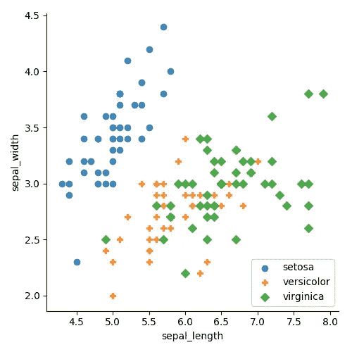

# 数据可视化散点图的所有信息

> 原文：<https://towardsdatascience.com/everything-you-need-to-know-about-scatter-plots-for-data-visualisation-924144c0bc5?source=collection_archive---------7----------------------->

> 想获得灵感？快来加入我的 [**超级行情快讯**](https://www.superquotes.co/?utm_source=mediumtech&utm_medium=web&utm_campaign=sharing) 。😎

如果你是一名数据科学家，毫无疑问，你以前处理过散点图。尽管散点图很简单，但它是可视化数据的强大工具。颜色、大小、形状和回归图等几个参数的简单变化带来了大量的选项、灵活性和表现能力。

在这里，您将了解到关于散点图可视化数据的所有知识！我们将浏览所有的参数，看看何时以及如何在代码中使用它们。您可能会发现一些可以添加到您的数据科学工具箱中的惊喜和技巧！

# 回归绘图

当我们第一次在散点图上绘制数据时，它已经给了我们一个很好的数据概览。在下面最左边的图中，我们已经可以看到大多数数据似乎聚集在一起的组，并且可以快速挑选出异常值。

但是能够看到我们的任务会变得多么复杂也是一件好事；我们可以用回归图来做。在下图中间，我们做了一个线性图。显而易见，线性函数不起作用，因为许多点离直线很远。最右边的特性使用 4 阶多项式，看起来更有前途。所以看起来我们肯定需要至少 4 阶的东西来建模这个数据集。

# 颜色和形状

颜色和形状可用于显示数据集中的不同类别。颜色和形状对人类视觉系统来说都是非常直观的。当你看一个点群有不同颜色和形状的图时，很明显这些点属于不同的群。这对我们来说很自然。这种自然的直觉总是你在创建清晰和引人注目的数据可视化时想要发挥的。让它显而易见，不言自明。

下图左侧显示了按颜色分组的类别；右图显示了按颜色和形状划分的类别。在这两种情况下，都比我们只有蓝色时更容易看到分组！我们现在知道，以较低的误差分离 *setosa* 类可能很容易，我们应该将注意力集中在如何将另外两个类彼此分离上。同样清楚的是，一个单一的线性图无法将绿色和橙色点分开；我们需要更高维的东西。

在颜色和形状之间做出选择变成了个人喜好的问题。就我个人而言，我觉得颜色更清晰和直观，但你可以自己选择！

# 边缘直方图

具有*边缘直方图*的散点图是那些在顶部和侧面绘制直方图的散点图，代表特征点沿 x 轴和 y 轴的分布。这是一个很小的增加，但对于查看我们的点的精确分布和更准确地识别我们的异常值来说是很棒的。

例如，在下图中我们可以看到，为什么轴在 3.0 附近有一个*非常*密集的点。有多集中？这在最右边的直方图中最容易看到，它显示 3.0 附近的点至少是任何其他离散范围的三倍。我们还看到，与其他范围相比，几乎没有任何高于 3.75 的点。另一方面，对于 x 轴来说，除了最右边的异常值之外，其他的都比较均匀。

# 气泡图

通过气泡图，我们可以使用几个变量来编码信息。我们将在这里添加的新参数是大小。在下图中，我们绘制了每个人吃薯条的数量与他们的身高和体重的关系。请注意，散点图只是一个 2D 可视化工具，但是使用不同的属性，我们可以表示三维信息。

这里我们使用*的颜色、位置和大小。*位置决定了人的身高体重，颜色决定了性别，大小决定了吃薯条的数量！气泡图让我们方便地将所有属性合并到一个图中，这样我们可以在一个简单的 2D 视图中看到高维信息；没什么复杂的。

# 喜欢学习？

在推特[上关注我，我会在这里发布所有最新最棒的人工智能、技术和科学！也请在 LinkedIn](https://twitter.com/GeorgeSeif94)[上与我联系！](https://www.linkedin.com/in/georgeseif/)