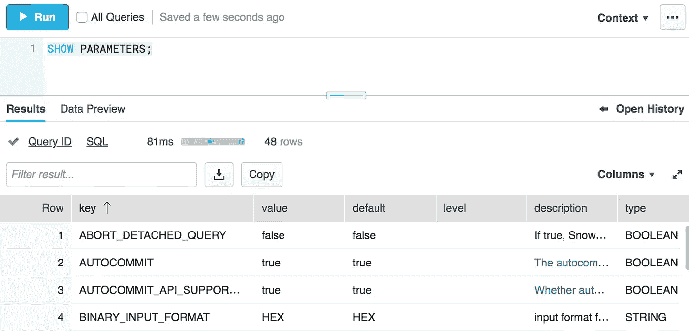
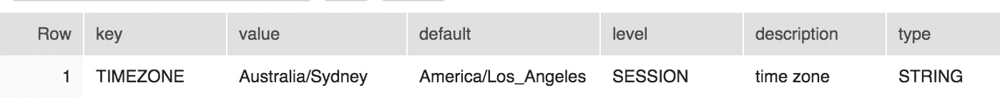
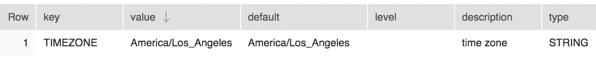

# 关于雪花参数您需要知道的一切(第 1 部分)

> 原文：<https://towardsdatascience.com/everything-you-need-to-know-about-snowflake-parameters-part-1-6224ccd7c559?source=collection_archive---------26----------------------->

## [专业数据技能](http://towardsdatascience.com/tagged/professional data skills)


Photo by [Andrea Sonda](https://unsplash.com/@andreasonda?utm_source=medium&utm_medium=referral) on [Unsplash](https://unsplash.com?utm_source=medium&utm_medium=referral)

雪花是一个非常受欢迎的云数据仓库，以其简单、强大的功能、有竞争力的价格和易于维护而闻名。来到 Snowflake 的 DBA 通常会惊喜地发现，他们只需调整很少的东西就能让它保持运行。

其中之一就是雪花参数。对于传统数据库，DBA 经常花时间微调参数以获得最佳性能。有时，这对于提高单个查询的运行速度是必要的。有几十个雪花参数，但大多数安装都可以运行得很好，而不需要调整任何参数。

然而，知道什么在运行总是好的——不仅仅是为了知道，而是因为有时它可以帮助更快地解决问题。

在这篇由两部分组成的文章中，我将讨论雪花参数及其工作原理。你将学习如何以不同的方式改变和重置它们，这样一个地方的改变不会影响到另一个地方。最后，我们将讨论有时会派上用场的重要参数。

让我们开始吧。

# 雪花参数的类型和级别

有两种方法可以识别雪花参数:参数的*类型*及其层次*级别*。

参数类型基于它所控制的资源类型。有些参数适用于整个雪花帐户，有些适用于用户会话，有些适用于雪花对象。

雪花参数有三种类型:

*   **账户**
*   **会话**
*   **对象**

一个*账户*类型参数影响整个雪花账户。这些参数是在帐户级别设置的，不能在层次结构的较低级别覆盖。只有 ACCOUNTADMIN 角色成员(对于一个参数，还有 SYSADMIN 角色成员)可以更改它们的值。一旦您设置了帐户参数，它将对所有用户及其会话可见。

接下来，我们有*会话*类型参数。这些参数主要与用户及其会话相关。它们可以在帐户级别设置，但也可以针对每个用户进行更改。在用户的会话中，它可以再次更改为不同的内容。

这是在层次结构的不同*级别*改变参数的一个例子。这里，会话*类型*参数可以在账户*级别*(层级的根级别)设置默认值。在帐户下，我们还有单独的雪花用户(层次结构的第一层)，每个用户可以有多个会话(层次结构的第二层)。创建帐户时(或之后)，可以为用户帐户更改在帐户级别设置的参数值。当用户登录时，她可以为她的会话将相同的参数更改为不同的值。换句话说，该参数现在在层次结构的三个级别上具有三个不同的值。

会话类型参数可用于满足不同的用户需求。例如，从美国连接的用户可能希望看到以“mm-dd-yyyy”格式显示的日期，而来自亚洲的用户可能希望看到以“dd/mm/yyyy”格式列出的日期。此参数的帐户级别值可以是默认的“yyyy-mm-dd”。在用户级别设置该值可确保不同的用户以他们希望的方式查看日期。

现在，假设一个来自美国的用户登录到数据仓库，但是想要查看“MMM-dd-yyyy”格式的日期。她只能为自己的会话更改参数。

ACCOUNTADMIN 和 SYSADMIN 角色成员都可以为用户分配或更改参数。如果在用户或会话级别没有对会话类型参数进行更改，则应用帐户级别的值。

最后还有*对象*类型参数。这些参数适用于雪花对象，如仓库和数据库。仓库没有任何层次结构，因此可以在帐户级别设置特定于仓库的参数，然后针对各个仓库进行更改。

类似地，可以在帐户级别设置特定于数据库的参数，然后针对每个数据库进行设置。与仓库不同，数据库有一个层次结构。在数据库中，模式可以覆盖帐户或数据库级别的参数集，而在模式中，表可以覆盖帐户、数据库或模式级别的参数集。如果在层次结构的较低级别没有进行更改，则在最近的较高级别设置的值将应用于下游。

# 使用雪花参数

那么如何看出雪花有哪些参数呢？

看你想看什么了。对于帐户或会话类型参数，您可以运行以下命令:

```
—- shows parameters defined at the account level
SHOW PARAMETERS IN ACCOUNT;—- shows parameters defined at the user level
SHOW PARAMETERS IN USER;-- shows parameters defined at the session level
SHOW PARAMETERS IN SESSION;-- shows parameters defined at the session level
SHOW PARAMETERS
```

让我们看看输出:



这里:

*   ***键*** 是参数名
*   ***值*** 是为该参数设置的当前值
*   ***默认值*** 是该参数的默认值
*   ***级别*** 是应用当前值的层级位置。如果默认值和当前值相同，则该字段为空。

以下是在会话级别更改参数的示例:

```
ALTER SESSION SET TIMEZONE=’Australia/Sydney’;
```

如果您现在运行此命令:

```
SHOW PARAMETERS LIKE ‘%TIMEZONE%’;
```

输出显示当前值是在会话级别设置的，它不同于默认值:



要查找在帐户级别设置的值，请运行以下命令:

```
SHOW PARAMETERS LIKE ‘%TIMEZONE%’ IN ACCOUNT;
```

它显示默认值在帐户级别没有改变。请注意“级别”列在这里是空的:



要将参数重置回原来的值，请运行以下命令:

```
ALTER SESSION UNSET TIMEZONE;
```

现在让我们来谈谈对象类型参数。与帐户或会话类型不同，查询对象类型参数需要指定对象类型(数据库、模式、表或仓库)和对象名称。

此代码片段显示了如何列出数据库、模式、表和仓库的对象属性:

```
-- Shows parameters set at database level
SHOW PARAMETERS IN DATABASE MYTESTDB;-- Shows parameters set at schema level
SHOW PARAMETERS IN SCHEMA MYTESTDB.TEST_SCHEMA;-- Shows parameters set at table level
SHOW PARAMETERS IN TABLE MYTESTDB.TEST_SCHEMA.MY_TEST_TABLE;-- Shows parameters set for a warehouse
SHOW PARAMETERS IN WAREHOUSE MYTESTWH;
```

假设您想要将 TEST_SCHEMA 的数据保持期更改为 0 天，这实际上关闭了它的时间旅行。运行如下命令:

```
ALTER SCHEMA MYTESTDB.TEST_SCHEMA SET DATA_RETENTION_TIME_IN_DAYS=0;
```

要将其改回默认值，请运行如下命令:

```
ALTER SCHEMA MYTESTDB.TEST_SCHEMA UNSET DATA_RETENTION_TIME_IN_DAYS;
```

这就是关于查询和设置雪花参数您需要知道的一切。

# 第 1 部分结束

这是不到十分钟的关于雪花参数的介绍。这里没有什么奇特或复杂的。然而，真正的力量来自于知道需要时可以调整哪些参数，以及调整到什么水平。这就是我们将在第 2 部分讨论的内容。敬请关注。

如果你喜欢它，请鼓掌，在 Twitter、Medium 和 LinkedIn 上关注我。