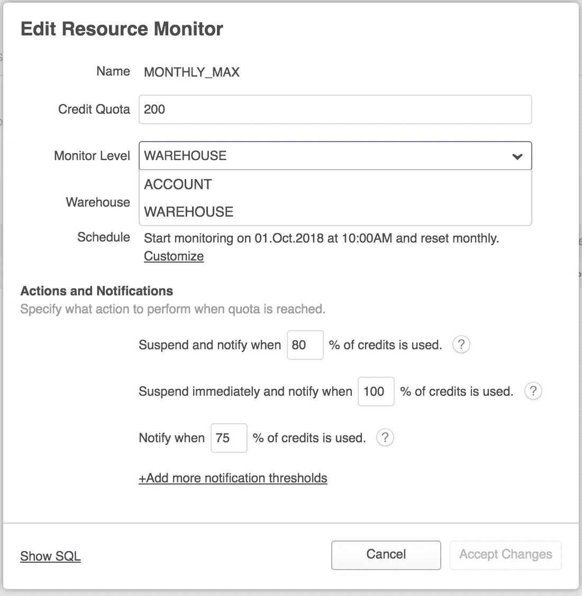

# 关于雪花参数您需要知道的一切(第 2 部分)

> 原文：<https://towardsdatascience.com/everything-you-need-to-know-about-snowflake-parameters-part-2-4bc96390ccbe?source=collection_archive---------11----------------------->

## [专业数据技能](http://towardsdatascience.com/tagged/professional%20data%20skills)


Photo by [Kai Dahms](https://unsplash.com/@dilucidus?utm_source=medium&utm_medium=referral) on [Unsplash](https://unsplash.com?utm_source=medium&utm_medium=referral)

在这个由两部分组成的文章系列的[第一部分](/everything-you-need-to-know-about-snowflake-parameters-part-1-6224ccd7c559)中，您了解了雪花云数据仓库参数是如何工作的。

合乎逻辑的下一个问题是，您应该了解哪些参数？更重要的是，你应该什么时候使用它们？

在这最后一部分，您将了解一些有用的雪花参数。

事不宜迟，这是清单。

# **中止 _ 分离 _ 查询**

该参数告诉雪花，如果客户端连接断开(浏览器窗口关闭、网络连接中断等)，它是否应该中止正在进行的查询。这是一个会话类型参数，可以在帐户、用户或会话级别设置。默认值为 FALSE，这意味着即使客户端连接断开，雪花也将继续运行查询。

作为管理员，您可能希望为人类用户将该参数设置为 TRUE，这样他们断开连接的查询就不会浪费宝贵的仓库资源。同样，对于应用程序用户帐户，该值可以设置为 FALSE。这些帐户通常运行大型聚合或冗长的数据加载。将这些帐户的参数设置为 FALSE 将确保关键数据处理任务不受连接中断的影响。

# **LOCK_TIMEOUT**

这是一个会话类型参数，它告诉 Snowflake 在超时和中止查询之前应该等待多少秒来获取资源锁。默认值是 43200 秒或 12 小时，这通常被认为太长了。

作为一个大概的数字，您也许可以将这个值降低到 30 分钟，并保留应用程序帐户的默认值。

# **数据保留时间天数**

这是一个对象类型参数。它可以设置为:

*   **帐户级别**:该值将应用于雪花帐户中的所有数据库、模式和表
*   **对象级**:该值适用于单个数据库、模式或表

**DATA _ RETENTION _ TIME _ IN _ DAYS**告诉雪花应该将历史数据保持可用多长时间，以便用户可以返回到他们数据中的特定时间点。默认值是 1 天，在雪花标准版中只能返回到这一天。对于雪花企业版和更高版本，这可以设置为最多 90 天。将该参数设置为 0 意味着对象的时间旅行已关闭。

如果您使用的是雪花企业版或更高版本，在帐户级别将该参数设置为 90 并忘记它可能很有诱惑力。在这样做之前，请考虑它将如何影响您的数据存储成本。您的帐户是否用于非生产工作并托管大量非生产数据？您的数据处理例程是否创建了大量临时表？在这种情况下，您可能希望关闭非生产数据库或表的数据保留以节省成本。

# **时区**

这是一个会话类型参数，指定雪花帐户的时区。除非有任何在用户或会话级别设置它的实际需要，否则在帐户级别设置该值并保留它。

# **使用缓存结果**

这是另一个会话类型参数，应该在帐户级别设置，不能在用户或会话级别更改。

Snowflake 尽可能使用缓存，它的大部分性能优势来自于能够在再次运行相同的查询时使用缓存的结果——无论是来自云服务层还是来自仓库层。当在缓存中找到匹配的结果集时，Snowflake 返回该结果集。这大大提高了性能，因为没有使用仓库来处理请求。

该参数的默认值为 TRUE，除非有非常特殊的用例，否则应该保持不变。在对查询性能进行故障排除时，您可能希望通过运行以下命令来仔细检查是否在会话级别启用了缓存:

```
SHOW PARAMETERS LIKE '%USE_CACHED_RESULT%'
```

# **语句 _ 超时 _ 秒**

这个参数告诉雪花在系统取消之前一个 SQL 语句可以运行多长时间。默认值为 172800 秒(48 小时)

这既是会话参数，也是对象类型参数。作为会话类型，它可以应用于帐户、用户或会话。作为一种对象类型，它可以应用于仓库。如果在两个级别都设置了，则使用最低的值。

您可以在帐户级别保留默认值，但可以根据您的仓库进行更改。例如，如果您不希望您的 ETL 仓库运行数据加载命令超过 8 小时(并且不花钱)，那么为仓库设置参数:

```
ALTER WAREHOUSE <warehouse> SET STATEMENT_TIMEOUT_IN_SECONDS = 28800
```

处理完成后，您可以重置参数:

```
ALTER WAREHOUSE <*warehouse*> UNSET STATEMENT_TIMEOUT_IN_SECONDS
```

# 语句排队超时秒数

和**STATEMENT _ time out _ IN _ SECONDS**一样，这个也是会话和对象类型参数。与该参数不同的是，它并不控制已经在运行的 SQL 语句应该允许运行多长时间，而是在系统取消它之前应该允许它在仓库队列中等待多长时间。默认值为 0，这意味着语句在得到服务之前一直保留在队列中。和前面的参数一样，如果在仓库和会话级别都设置了该参数，则使用最小值。

如果数据加载或查询在排队后超时，请检查帐户、用户和仓库级别的参数值。

# 最大并发级别

这可能是仓库最重要的参数之一。这是一个对象类型参数，可以在整个帐户范围内设置，也可以为单个仓库设置。 **MAX_CONCURRENCY_LEVEL** 告诉雪花在一个仓库中可以并行运行多少条 SQL 语句。当提交的 SQL 语句的数量达到这个阈值时，任何新的 SQL 语句可能会也可能不会被放入队列中。雪花是怎么决定这个的？以下是方法。

对于配置为自动扩展到最大集群数的多集群仓库，在达到阈值后提交的任何新 SQL 都将导致一个新集群加速运行。然后，新的 SQL 语句由新的集群提供服务。

如果多集群仓库已达到其集群的最大限制，或者如果它是单集群仓库，则新的 SQL 语句将被放入队列中。您可以通过将仓库扩大到更高的容量来避免这种情况。此外，请记住，多集群仓库是雪花企业版和更高版本的一个功能。

假设您的仓库没有扩大，也没有更多的集群可以运转。SQL 语句在队列中等待多长时间？你猜对了——它是由你在**语句 _ 排队 _ 超时 _ 秒数**参数中指定的时间决定的。

现在，从大型多集群仓库开始，并将 STATEMENT _ QUEUED _ time out _ IN _ SECONDS 参数设置为 0，这样就不会出现阻塞，这可能很有诱惑力。但是您真正应该做的是针对较小的仓库测试您的峰值负载，并查看是否有任何语句始终处于排队状态*。*如果您使用的是雪花企业版或更高版本，请从较小的多集群仓库开始。从最大集群数的保守值开始，随着测试的进行逐渐增加。对于 Snowflake Standard Edition 帐户，从一个小仓库开始，随着测试的进行逐渐增加它的大小。

此外，将该参数设置为与仓库大小成比例的值。例如，如果您为“小型”仓库将该参数设置为一个很高的值，那么查询很可能需要很长时间才能完成，因为每个查询占用的资源会更少。如果将该参数设置得太低，可能会出现不必要的排队。最佳选择是对每个峰值负载场景进行测试。

# 日期输出格式

这是一个会话类型参数。它可以在用户或会话的帐户级别设置。顾名思义，这个参数告诉雪花如何显示日期。除非需要更改报告的显示格式，否则请使用默认格式 YYYY-MM-DD。

# 网络 _ 策略

[雪花网络策略](https://docs.snowflake.net/manuals/user-guide/network-policies.html)允许(或不允许)来自特定 IP 地址或地址范围的流量。这个 IP 白名单(和黑名单)充当了雪花内部事实上的防火墙。**网络策略**参数告诉雪花哪个网络策略有效。

这是一个帐户类型参数，这意味着它不能被用户或她的会话覆盖。

对雪花的连接进行故障排除时，可以查询此参数。如果客户端连接被拒绝，即使存在网络连接，您也可以检查此参数来查找任何网络策略名称。然后，您可以从策略中找到被阻止的 IP 地址，并查看客户端的地址是否在这些被阻止的 IP 中。

# 资源 _ 监视器

[资源监视器](https://docs.snowflake.net/manuals/user-guide/resource-monitors.html)帮助控制雪花的仓库使用量。系统管理员经常创建资源监视器来跟踪雪花仓库使用的信用。如果设置了配额，雪花可以在达到阈值时发送通知，或者立即暂停仓库。可以在帐户级别创建资源监视器，在这种情况下，配额适用于帐户中所有仓库使用的总配额，也可以在仓库级别创建资源监视器，在仓库级别，配额仅适用于单个仓库。如下图所示:



**RESOURCE_MONITOR** 是一个账户类型参数，只能在账户级别设置。参数值是为帐户定义的资源监视器的名称。

这也强调了这样一个事实，即仅仅为一个帐户创建一个资源监视器是不够的——它的名称应该分配给 **RESOURCE_MONITOR** 参数。

# SAML _ 身份 _ 提供者

这是另一个帐户类型参数。只有在使用第三方身份提供者(如 Active Directory、Okta 或其他)配置单点登录(SSO)时，才需要设置此选项。

参数值应该是用单引号括起来的 JSON 文档。该 JSON 文档指定了身份提供者生成的证书名称、身份提供者的 URL、身份提供者的类型以及雪花登录页面中显示的身份提供者按钮的标签。

在大多数生产设置中，企业通常希望将雪花与他们自己的身份系统集成在一起。因此，设置这个参数需要基础设施工程师和数据库管理员的合作。

# 单点登录页面

该参数在测试单点登录时很有用。同样，这是一个帐户类型参数，只能在帐户级别设置。这是一个布尔参数，控制当启用联合身份验证时，雪花将如何显示登录页面。

*   **TRUE** 表示预览模式关闭，用户可以在雪花登录页面看到 SAML 身份提供者的 SSO 登录提示。
*   **FALSE** (默认值)表示预览模式开启，用户可以使用特定的 URL 导航到 SSO 登录页面。

URL 的格式在[雪花文档](https://docs.snowflake.net/manuals/user-guide/admin-security-fed-auth-configure-snowflake.html#step-3-test-snowflake-initiated-sso-optional)中有描述。

# 最后的话

这就结束了我们的雪花参数系列。我希望这是一个有用的介绍。不过，需要注意的是:不要在生产雪花环境中更改任何参数，除非有强有力的理由，并且该更改已经过测试和批准。对于 DBA:在创建或修改用户帐户或仓库时，考虑为这里描述的一些参数分配标准值。

如果你喜欢这篇文章，请鼓掌欢迎，并在 Medium、Twitter 和 LinkedIn 上关注我。