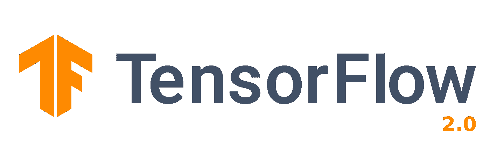
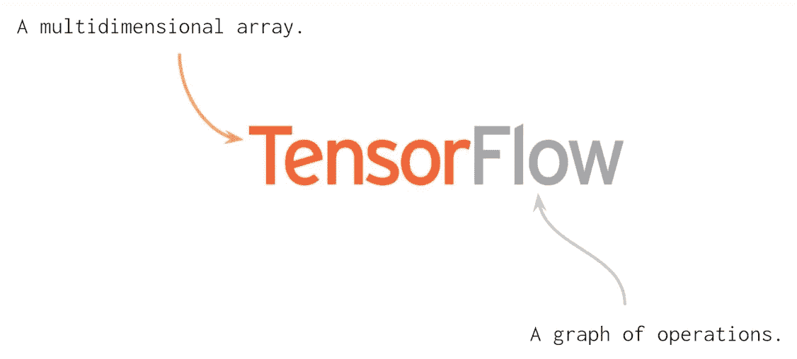
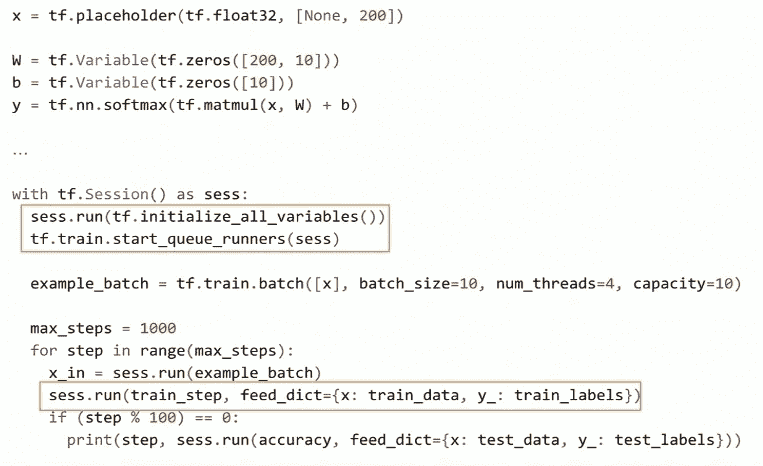
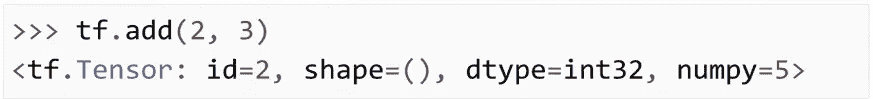
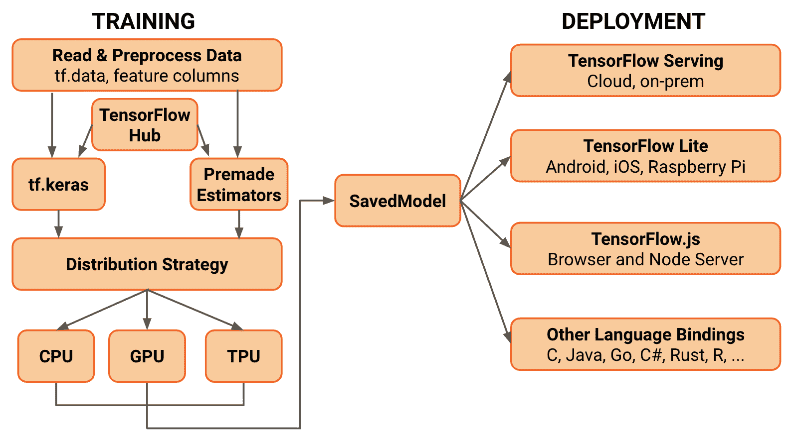

# 关于 TensorFlow 2.0 您需要了解的一切

> 原文：<https://towardsdatascience.com/everything-you-need-to-know-about-tensorflow-2-0-b0856960c074?source=collection_archive---------5----------------------->

## Keras-API、SavedModels、TensorBoard、Keras-Tuner 等等。

2019 年 6 月 26 日，我有幸在圣保罗 papis . io LATAM 大会上展示了一个 TensorFlow (TF) 2.0 工作坊。除了作为工作坊主持人代表[大坛](https://www.daitan.com/)的快乐之外，我很高兴谈论 TF 2.0。

研讨会的目的是强调与以前的 1.x 版本的 TF 相比有什么变化。在这篇课文中，你可以跟上我们将要讨论的主要话题。当然，看看[的 Colab 笔记本](https://github.com/sthalles/tensorflow2.0-papis-workshop/blob/master/Tensorflow2_0_papis_workshop.ipynb)中的实用代码。

## TensorFlow 2.0 简介

TensorFlow 是 Google 在 2015 年开源的通用高性能计算库。从一开始，它的主要焦点就是为构建神经网络(NNs)提供高性能的 API。然而，随着时间的推移和机器学习(ML)社区的兴趣，lib 已经发展成为一个完整的 ML 生态系统。

目前，该图书馆正经历着自诞生以来最大的一系列变化。TensorFlow 2.0 目前处于测试阶段，与 TF 1.x 相比，它带来了许多变化，让我们深入了解一下主要的变化。

## 默认情况下急切执行

> 首先，急切执行是运行 TF 代码的默认方式。

您可能还记得，为了在 TF 1.x 中构建一个神经网络，我们需要定义这个称为图的抽象数据结构。另外，(您可能已经尝试过)，如果我们试图打印一个图形节点，我们将看不到我们期望的值。相反，我们会看到对图形节点的引用。实际上，为了运行图表，我们需要使用一个叫做**会话**的封装。使用 *Session.run()* 方法，我们可以将 Python 数据传递给图表，并实际训练我们的模型。

TF 1.x code example.

随着急切的执行，这种情况发生了变化。现在，TensorFlow 代码可以像普通 Python 代码一样运行——急切地。这意味着操作是一次创建和评估的。

Tensorflow 2.0 code example.

因此，TensorFlow 2.0 代码看起来很像 NumPy 代码。事实上，TensorFlow 和 NumPy 对象可以很容易地从一个对象切换到另一个对象。因此，您不需要担心*占位符*、*会话*、*feed _ dictionalities*等。

## API 清理

> 许多像 tf.gans、tf.app、tf.contrib、tf.flags 这样的 API 要么消失了，要么被移动到单独的存储库。

然而，最重要的清理之一与我们如何构建模型有关。你可能还记得，在 TF 1.x 中，我们有不止一两种不同的方法来构建/训练 ML 模型。

Tf.slim、tf.layers、tf.contrib.layers、tf.keras 都是可以用来构建 NNs 的 API。TF 1 . x 中不包括排序 API 的序列。这种缺乏标准化的情况有一个很大的问题——大多数时候，不清楚为每种情况选择哪一种。

尽管这些 API 中有许多都有很好的特性，但它们似乎并没有汇聚成一种通用的开发方式。此外，如果我们用这些 API 中的一个来训练一个模型，那么使用其他 API 来重用那个代码并不直接。

> 在 TF 2.0 中，tf.keras 是推荐的高级 API。

正如我们将看到的，Keras API 试图解决所有可能的用例。

## 初学者 API

从 TF 1.x 到 2.0，初学者 API 变化不大。但是现在，Keras 是默认和推荐的高级 API。

总之，Keras 是一组层，描述了如何使用清晰的标准构建神经网络。基本上，当我们使用 pip 安装 TensorFlow 时，我们获得了完整的 Keras API 和一些附加功能。

初学者的 API 叫做 Sequential。它基本上将神经网络定义为一堆层。除了简单之外，它还有一些优点。注意，我们根据数据结构(一堆层)来定义模型。因此，它最小化了由于模型定义而产生错误的可能性。

## 喀拉斯调谐器

[Keras-tuner](https://github.com/keras-team/keras-tuner) 是一个用于 Keras 模型超参数调谐的专用库。在撰写本文时，lib 处于**的 pre-alpha** 状态，但在带有 *tf.keras* 和 Tensorflow 2.0 beta 的 Colab 上运行良好。

这是一个非常简单的概念。首先，我们需要定义一个模型构建函数，它返回一个编译过的 Keras 模型。该函数将表示调优对象的参数作为输入。使用it，我们可以定义一个候选值范围，从中对超参数值进行采样。

下面我们建立了一个简单的模型，并优化了 3 个超参数。对于隐藏单元，我们对预定义范围内的整数值进行采样。对于辍学率和学习率，我们在一些特定值之间随机选择。

然后，我们创建一个表示随机搜索策略的 tuner 对象。最后，我们可以使用 *search()* 方法开始优化——它与 *fit()* 具有相同的签名。

最后，我们可以检查调谐器摘要结果并选择最佳型号。注意，训练日志和模型检查点都保存在目录文件夹 *(my_logs)* 中。此外，最小化或最大化目标(验证准确性)的选择是自动推断的。

看看他们的 [Github 页面](https://github.com/keras-team/keras-tuner)了解更多。

## 高级 API

当你看到这种类型的实现时，它又回到了面向对象编程。这里，您的模型是一个 Python 类，它扩展了 *tf.keras.Model* 。模型子类化是由 Chainer 启发的想法，与 PyTorch 如何定义模型有很大关系。

使用模型子类化，我们在类构造函数中定义模型层。并且 *call()* 方法处理向前传递的定义和执行。

子类化有很多优点。更容易执行模型检查。例如，我们可以(使用断点调试)在给定的一行停下来，检查模型的激活或逻辑。

然而，伴随着巨大的灵活性而来的是更多的错误。

> 模型子类化需要程序员更多的关注和知识。

一般来说，你的代码更容易出错(比如模型连接)。

## 定义训练循环

在 TF 2.0 中训练模型最简单的方法是使用 *fit()* 方法。 *fit()* 支持两种类型的模型，顺序模型和子类模型。如果使用模型子类化，你需要做的唯一调整是覆盖 *compute_output_shape* ()类方法，否则，你可以通过它离开。除此之外，您应该能够将 *fit()* 与 *tf.data.Dataset* 或标准 NumPy nd-arrays 一起用作输入。

然而，如果你想清楚地了解梯度或损失的情况，你可以使用梯度带。如果你在做研究，这尤其有用。

使用梯度带，可以手动定义训练程序的每个步骤。训练神经网络的每个基本步骤，例如:

*   前进传球
*   损失函数评估
*   偶数道次
*   梯度下降步骤

单独指定。

如果你想知道神经网络是如何训练的，这就更直观了。如果您想检查模型权重或梯度向量本身的损失值，您可以将它们打印出来。

梯度胶带具有更大的灵活性。但是就像子类化和顺序化一样，更多的灵活性伴随着额外的成本。与 *fit()* 方法相比，这里我们需要手动定义一个训练循环。作为一个自然的结果，这使得代码更容易出现错误，也更难调试。我相信，与通常对开发新事物感兴趣的研究人员相比，这是代码工程师(寻找标准化代码)的理想选择。

同样，使用 *fit()* 我们可以很容易地设置 TensorBoard，如下图所示。

## 设置张量板

您可以使用 *fit()* 方法轻松设置 TensorBoard 的实例。它也适用于 Jupyter/Colab 笔记本电脑。

> 在这种情况下，您添加 TensorBoard 作为对 fit 方法的回调。

只要你使用的是 *fit()* 方法，它对顺序 API 和子类 API 都有效。

如果选择使用模型子类化，自己编写训练循环(使用评分带)，还需要手动定义 TensorBoard。它包括创建摘要文件，使用*TF . summary . create _ file _ writer()，*并指定您想要可视化的变量。

作为一个值得注意的点，有许多回调你可以使用。一些比较有用的是:

*   EarlyStopping:顾名思义，它设置了一个规则，当监控的数量停止改善时，就停止训练。
*   ReduceLROnPlateau:当指标停止改善时，降低学习率。
*   TerminateOnNaN:遇到 NaN 丢失时终止训练的回调。
*   LambdaCallback: Callback 用于动态创建简单的自定义回调。

您可以在 [TensorFlow 2.0 回调](https://www.tensorflow.org/versions/r2.0/api_docs/python/tf/keras/callbacks)查看完整列表。

## 提取您的 EagerCode 的性能

如果您选择使用渐变磁带来训练您的模型，您将会注意到性能的大幅下降。

急切地执行 TF 代码有利于理解，但在性能上失败了。为了避免这个问题，TF 2.0 引入了 *tf.function* 。

> 基本上，如果你用 tf.function 修饰一个 python 函数，你就是在要求 TensorFlow 接受你的函数并将其转换成 tf 高性能抽象。

这意味着该函数将被标记为 JIT 编译，以便 TensorFlow 将其作为图形运行。结果，您获得了 TF 1.x (graphs)的性能优势，如节点修剪、内核融合等。

简而言之，TF 2.0 的思想是你可以将你的代码设计成更小的函数。然后，您可以使用 *tf.function* 注释您想要的内容，以获得额外的性能。最好修饰代表最大计算瓶颈的函数。这些通常是训练循环或模型的向前传递。

注意，当你用 *tf.function* 来修饰一个函数时，你失去了急切执行的一些好处。换句话说，您将无法在该代码段内设置断点或使用 *print()* 。

## 保存和恢复模型

TF 1.x 中另一个严重缺乏标准化的地方是我们如何为生产保存/加载训练好的模型。TF 2.0 也试图通过定义单个 API 来解决这个问题。

> TF 2.0 没有很多保存模型的方法，而是标准化了一个叫做 SavedModel 的抽象。

这里就不多说了。如果你创建一个顺序模型或者使用 *tf.keras.Model* 扩展你的类，你的类继承自 *tf.train.Checkpoints* 。因此，您可以将模型序列化为 SavedModel 对象。

SavedModels 与 TensorFlow 生态系统相集成。换句话说，您将能够将其部署到许多不同的设备上。其中包括手机、边缘设备和服务器。

## 转换为 TF-Lite

如果您想将 SavedModel 部署到嵌入式设备，如 Raspberry Pi、Edge TPUs 或您的手机，请使用 TF Lite 转换器。

注意，在 2.0 中，TFLiteConverter 不支持冻结的 GraphDefs(通常在 TF 1.x 中生成)。如果你想转换一个冻结的 GraphDefs 来在 TF 2.0 中运行，你可以使用 tf.compat.v1.TFLiteConverter。

在部署到嵌入式设备之前执行训练后量化是非常常见的。要使用 TFLiteConverter 实现这一点，请将 optimizations 标志设置为“OPTIMIZE_FOR_SIZE”。这将把模型的权重从浮点量化到 8 位精度。它将减少模型大小并改善延迟，而模型准确性几乎没有下降。

请注意，这是一个实验性的标志，它可能会发生变化。

## 转换到 TensorFlow.js

最后，我们还可以将同一个 SavedModel 对象转换为 TensorFlow.js 格式。然后，我们可以使用 Javascript 加载它，并在浏览器上运行您的模型。

首先需要通过 pip 安装 TensorFlow.js。然后，使用 *tensorflowjs_converter* 脚本将训练好的模型转换成 Javascript 兼容代码。最后，您可以加载它并在 Javascript 中执行推理。

您也可以在浏览器上使用 Tesnorflow.js 来训练模型。

## 结论

最后，我想提一下 2.0 的一些其他功能。首先，我们已经看到，向一个顺序的或者子类化的模型中添加更多的层是非常简单的。虽然 TF 覆盖了大多数流行的层，如 Conv2D、TransposeConv2D 等；你总能发现自己处于这样一种情况，你需要一些得不到的东西。如果你正在复制一些论文或做研究，那就更是如此。

好消息是，我们可以开发自己的自定义层。遵循相同的 Keras API，我们可以创建一个类并将其扩展到 *tf.keras.Layer* 。事实上，我们可以按照非常相似的模式创建定制的激活函数、正则化层或度量。这里有一个关于它的[好资源](https://www.tensorflow.org/tutorials/eager/custom_layers)。

还有，我们可以把现有的 TensorFlow 1.x 代码转换成 TF 2.0。为此，TF 团队创建了 *tf_upgrade_v2* 实用程序。

此脚本不会将 TF 1.x 代码转换为 2.0 惯用代码。它基本上使用 *tf.compat.v1* 模块来实现名称空间发生变化的函数。此外，如果您的遗留代码使用 *tf.contrib* ，脚本将无法转换它。您可能需要使用额外的库或者使用新的 TF 2.0 版本中缺少的函数。

## 感谢阅读。