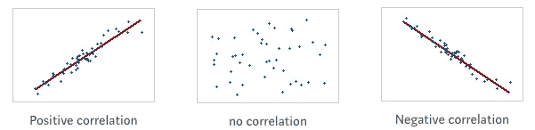
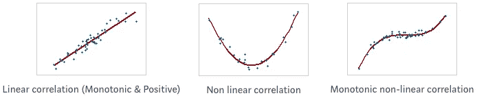
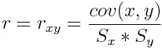
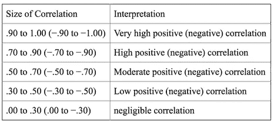
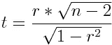
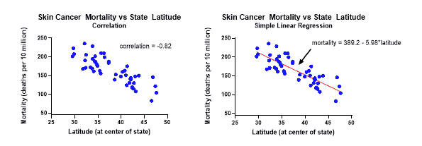

# 关于解释相关性你需要知道的一切

> 原文：<https://towardsdatascience.com/eveything-you-need-to-know-about-interpreting-correlations-2c485841c0b8?source=collection_archive---------0----------------------->

## 并非所有的相关性都是表面上看起来的那样

相关性是评估变量之间关系的最广泛使用的统计方法。然而，相关性必须谨慎使用；否则，它可能导致错误的解释和结论。

相关性可能产生误导的一个例子是当您处理样本数据时。因为样本中的明显相关性不一定存在于样本所来自的总体中，而可能只是由于偶然的巧合(随机抽样误差)。这就是为什么相关性必须伴随着显著性检验来评估其可靠性的原因。

此外，在解释关系时，应该注意不要混淆相关性和因果关系，因为尽管相关性表明两个变量之间存在关系，但它并不自动暗示一个变量导致另一个变量(因果关系)。

这篇文章将定义相关性，相关性的类型，解释如何使用相关系数测量相关性，尤其是如何使用显著性检验评估线性相关性的可靠性。如果熟悉相关，可以跳过介绍。

# **1 —相关性介绍**

相关性是一种统计度量，描述两个变量如何相关，并表明当一个变量的值发生变化时，另一个变量倾向于在特定方向上发生变化。因此，我们可以指出一些现实生活中的相关性，如收入与支出、供给与需求、缺勤与成绩下降等。

每个关联都有一个符号和一种形式，符号可以是积极的、消极的或中性的:

*   **正相关**:两个变量同向变动(即一个变量随着另一个变量的增加而增加。或者，一个随着另一个减少而减少)。
*   **负相关**:两个变量反向运动(即一个变量增加，另一个变量减少，反之亦然)
*   **中性相关**:这两个变量相互之间没有关系。

关于相关性的形式，它可以是线性的、非线性的或单调的:

*   **线性相关性**:当两个变量以恒定速率变化并满足等式 Y = aX + b 时，相关性是线性的(即，关系必须以直线绘制)。
*   **非线性相关性**:当两个变量不以恒定速率变化时，相关性是非线性的。在这种情况下，变量之间的关系不是直线，而是曲线(抛物线、双曲线等)。
*   **单调相关**:在单调关系中，变量倾向于以相同的相对方向运动，但不一定以恒定的速率运动。所以所有的线性相关都是单调的，但反过来就不一定了，因为我们也可以有单调的非线性关系。

# 2 —相关系数

正如我们在上面的图片中看到的，绘制散点图对于观察变量之间可能存在的相关性非常有用。但是为了用数值量化相关性，必须计算相关系数。

相关系数有几种类型，但最常见的是皮尔逊相关 ***r*** 。这是一种参数测试，仅当变量呈正态分布且变量之间的关系呈线性时才推荐使用。否则，应使用非参数 Kendall 和 Spearman 相关检验。

## 皮尔逊相关系数

皮尔逊相关( *r* )用于衡量两个变量之间线性关系的强度和方向。数学上，这可以通过将两个变量的协方差除以它们的标准偏差的乘积来实现。

Pearson’s correlation

***r*** 的值在-1 和 1 之间。相关性为-1 表示完全负相关，而相关性为 1 表示完全正相关。相关性为 0 表示两个变量的移动之间没有关系。

下表展示了如何解释相关系数的大小(强度)。

credits : Parvez Ahammad

# 3 —显著性检验

使用相关系数量化两个变量之间的关系只能说明问题的一半，因为它只测量了样本中的关系强度。如果我们获得不同的样本，我们将获得不同的**值，并因此可能得到不同的结论。**

**所以我们想得出关于群体的结论，而不仅仅是样本。为此，我们必须进行**统计显著性测试**。显著性检验告诉我们，我们在样本中观察到的情况在总体中是否是真实的，并且可以通过**假设检验**来进行。**

**假设检验是统计推断的核心部分。统计推断是根据人口样本对人口进行推断。**

**在开始假设检验之前，让我们用下面的公式总结一下。**

****提法****

*   **假设我们有一个 n 大小的样本数据，有两个变量 x 和 y。**
*   **x 和 y 之间的样本相关系数(r) 是已知的**(可以使用上面的公式计算)****
*   ****x 和 y 之间的总体相关系数ρ(希腊字母“rho”)是**未知**(因为我们只有样本数据)****
*   ******目标**:我们想根据 r 推断出ρ**T5 的值******

******逐步进行假设检验******

****假设检验会让我们推断总体相关系数 *ρ* 的值是接近 0 还是显著不同于 0。我们根据样本相关系数 *r* 和样本大小 *n* 来决定。****

*   ******ρ接近 0** :表示总体中 x 和 y 之间没有显著的线性相关性。****
*   ******ρ显著不同于 0 :** 表示人群中 x 和 y 之间存在显著相关性。****

****如果测试显示总体相关系数 *ρ接近于零，那么我们说没有足够的统计证据表明两个变量之间的相关性是显著的，即相关性是由于样本中的偶然巧合而发生的，并且它不存在于整个总体中。*****

****所以，事不宜迟，让我们看看如何运行测试:****

******第一步:** **假设规范******

****我们首先指定无效假设和替代假设:****

****备择假设总是我们试图证明的，在我们的例子中，我们试图证明在总体中 x 和 y 之间存在显著的相关性(即ρ≦*0)*。****

****零假设是我们试图提供证据反对的假设，在我们的例子中，我们试图提供证据反对人口中 x 和 y 之间没有显著的线性相关性的假设(即ρ = *0)*****

*   *****零假设 Ho:* ρ = *0*****
*   *****备选假设 Ha*:ρ≦*0*****

******第二步:T 检验******

****T-test 也称为**学生 T-test** 是一种推断统计，它允许测试适用于总体的假设，或者简单地说，它允许使用样本数据将假设推广到整个总体。在我们的例子中，它将帮助我们发现 x 和 y 之间的样本相关性对于整个人口是否是可重复的。****

****我们使用以下公式计算 t 检验的值:****

********

****使用:****

*   ****n 是样本量****
*   ****r 是样本相关系数****

****t 值越大，相关性可重复的可能性越大。但是多大才算“够大”？这是下一步的工作****

******第三步:** **P 值******

****每个 t 值都有一个 p 值。p 值是零假设为真的概率。在我们的例子中，它表示样本数据中 x 和 y 之间的相关性偶然发生的概率。****

****p 值为 0.05 意味着您的样本中只有 5%的结果是偶然发生的。p 值为 0.01 意味着只有 1%的机会。因此，较低的 p 值是好的，但“足够低”是多低呢？。****

****在大多数研究中，我们认为统计显著性的阈值是 p 值为 0.05 或更低，它被称为显著性水平α。因此，我们可以将显著性水平设置为 0.05 (α =0.05)，然后求出 P 值。****

****为了找到 p 值，我们需要两件东西，t 检验值(来自步骤 2)和自由度的数量，可以按如下公式计算 df = n-2(n 是样本的大小)。有了这两个值，我们可以通过下式计算 p 值:****

*   ****使用软件****
*   ****通过 t 型表查找****

******第四步:决定******

****最后，我们做出决定:****

*   ****如果*P*-值小于显著性水平(α =0.05)，我们拒绝零假设，支持备选项。我们得出结论，相关性是**静态显著的**。或者简单的说“我们得出结论，在α水平上，总体中 x 和 y 之间存在线性关系”****
*   ****如果*P*-值大于显著性水平(α =0.05)，我们无法拒绝零假设。我们得出结论，相关性是**而不是** **静态显著**。或者换句话说“我们得出结论，在总体中 x 和 y 之间没有显著的线性相关性”****

# ****3 —相关性与回归****

********

****Credits: GraphPad****

****当研究数值变量之间的关系时，了解相关和回归之间的区别是很重要的。****

****相关性是一种统计度量，它量化了两个数值变量之间关系的方向和强度。另一方面，回归是一种统计技术，它根据自变量 X 的已知值，通过公式 Y = a + bX 来预测因变量 Y 的值。****

## ****参考资料:****

*   ****[**mintab.com**]:线性、非线性和单调关系****
*   ****[ **打开课本** ]:检验相关系数的显著性****
*   ****【**janda.org**】:相关系数的显著性****