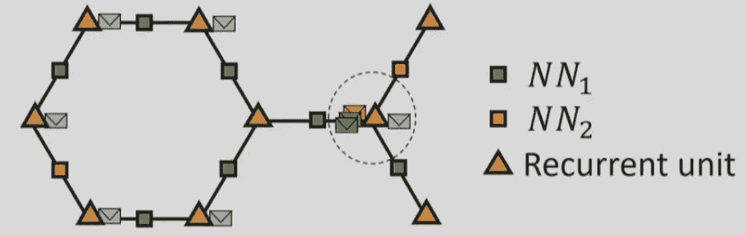
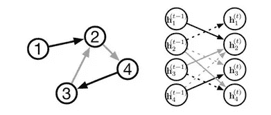
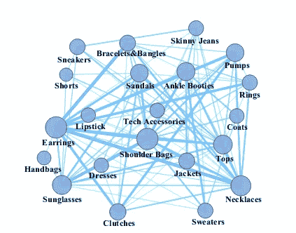

# 推荐系统中图形神经网络的发展

> 原文：<https://towardsdatascience.com/evolution-of-graph-neural-networks-for-recommender-systems-51e24d3b5bd4?source=collection_archive---------12----------------------->

## 介绍推荐系统中图神经网络的三个进展。

注*:在整篇文章中，我将偏向于时尚背景下的推荐系统。*

随着人工智能热潮在行业中兴起，以及大量公共用户数据可供我们使用，每个公司都希望通过向客户展示/推荐对他们来说似乎很有吸引力的东西来吸引他们，无论是产品还是服务。

从基本的协同过滤和购物篮分析开始，并继续使用矩阵分解的潜在因素模型，如奇异值分解和 PMF，现在已经扩展到更复杂的东西。

让我们分析一个特殊的情况。比方说，我们已经收集了一系列人群的现代流行时尚系列的数据，现在我们必须向他们推荐一套完整的时尚系列(上装、下装、手表和鞋子等)。)或一些单品来完成他们已经存在的时装系列。第一个想法是将时尚项目的一些潜在表示输入到双向 LSTM 中。但是经过进一步的思考，我们意识到 LSTMs 固有的顺序结构成了一个问题，因为不存在固定的项目顺序。套装中不同物品之间的复杂关系，如夹克和鞋子、鞋子和袜子之间的关系等。无法正确学习。

为了克服上述问题，第一个想法是以图形的形式形成某种表示，其中边可以表示被表示为节点的两个项目之间的关系。这就是 GNN(图形神经网络)的用武之地。让我们继续进行这种表示，并根据我们的目的对其进行改进

# **图形神经网络**

GNN 在建模节点之间的依赖关系方面的能力不仅是推荐系统的真正突破，也是社交网络的突破。因此，让我们分析一下 21 世纪第一个十年出现的图形神经网络的基本结构。基本上每个节点都是一个循环单元，灰色的信封表示每个节点的特征。每种边类型都有一个神经网络表示。

在任意时间步，对于一个给定的节点，我们从邻近的循环单元得到消息，就像在一个线性 RNN 网络中一样，并把它们聚集起来。我们使用 **Almeida-Pineda 算法**继续学习，该算法通过运行传播到收敛，然后基于收敛的解决方案计算梯度来工作。这样我们就可以独立地得到每个节点的**嵌入**。然后我们把这些放在一起，连接起来，得到图形的表示。

很明显，一个节点对另一个节点的**影响随着它们之间的距离**呈指数衰减。所以我们可以说，它很难在一张图中长距离传播信息。因此，门控图神经网络(GGNN)来克服这个问题。

# 门控图形神经网络

顾名思义，主要的变化是我们使用 GRUs(门控递归单元),因此我们让递归在一定数量的时间步长内发生，同时通过时间反向传播，而不是使用经典的 Almeida-Pineda 算法。

节点注释首先被复制到隐藏状态的第一个组件中，其余的用零填充。图的不同节点之间的消息流通过具有取决于边类型和方向的参数的输入和输出边来处理。然后使用隐藏状态和注释，GRU 风格的更新发生。

但是仍然在 GGNN 中，节点通过以固定的方式在边上传递它们的状态信息来与其他节点交互，这导致了它难以对灵活和复杂的节点交互进行建模的限制。因此，节点式图形神经网络应运而生。

# 节点式图形神经网络

NGNN 的目标是用节点参数对**边缘交互进行建模。NGNN 中的每个节点对应一类服装物品。**

记住不同类之间的交互，初始化不同类之间的边。**从 a 到 b 的边具有与在时尚集合中找到给定 b 的概率成比例的权重**。对于每一项，我们都找到了特征，它们被用来更新相应类节点的初始状态。

为了克服 GGNN 的问题，我们维护两个不同的权重矩阵**，分别对应于每个节点的输入和输出**，不像 GGNN 中所有边都有一个公共的权重矩阵。该输入输出权重用于寻找图中任何边的变换函数。除此之外，传播与 GGNN 相同。

在 T 个传播步骤之后，我们可以获得节点的最终状态，这也是最终的节点嵌入。

在此之上，添加了一个**注意**机制，以计算出集合中不同项目的兼容性。例如，*一双* *袜子与一套包含人字拖*的时装不兼容。由于一个节点从其他节点接收状态信息，这种注意机制很容易被合并。

A simple graph. The areas of circles and the widths of the links are proportional to the number of fashion items in the corresponding categories and the co-occurrence frequency between categories.

我参考的一些令人惊叹的论文和视频—

1.  [图形神经网络:方法与应用综述](https://arxiv.org/pdf/1812.08434.pdf)
2.  [门控图序列神经网络微软研究论文](https://arxiv.org/pdf/1511.05493.pdf)
3.  [门控图序列神经网络视频作者讲解](https://www.youtube.com/watch?v=_Uj-tNjhVDQ)
4.  [整体着装:基于节点图神经网络的服装兼容性学习](http://delivery.acm.org/10.1145/3320000/3313444/p307-cui.pdf?ip=203.110.242.4&id=3313444&acc=OPEN&key=045416EF4DDA69D9%2EA3AF15239BC08E05%2E4D4702B0C3E38B35%2E6D218144511F3437&__acm__=1559881273_71bf89562085ef7550aed4e18e6e247c)