# 机器翻译的发展

> 原文：<https://towardsdatascience.com/evolution-of-machine-translation-5524f1c88b25?source=collection_archive---------15----------------------->

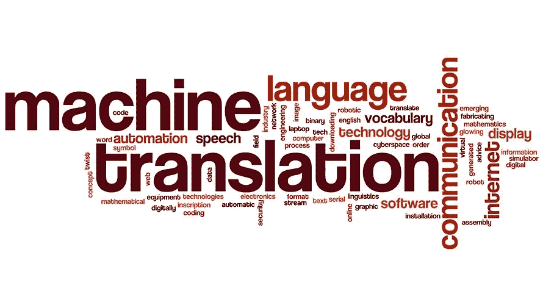

1949 年，洛克菲勒基金会的研究员沃伦·韦弗提出了一套基于机器翻译的建议，这些建议是基于信息论和第二次世界大战期间密码破译的成功。

几年后，机器翻译研究在美国许多大学开始认真进行。正如哈钦斯报告所描述的，1954 年 1 月 7 日，乔治敦-IBM 实验开始，IBM 701 计算机有史以来第一次自动将 60 个俄语句子翻译成英语。这是机器翻译系统的首次公开演示，引起了媒体和公众的极大兴趣。

ALPAC 报告指出，机器无法与人工翻译质量竞争，并建议停止对机器翻译的资助。但是几名研究人员继续研究如何使用机器来创建自动化语言翻译。这些研究大多集中在有限的语言对，有限的输入和基于规则的引擎。到 20 世纪 80 年代，大量依赖大型机技术的机器翻译引擎投入使用，如 SYSTRAN、Logos 等。

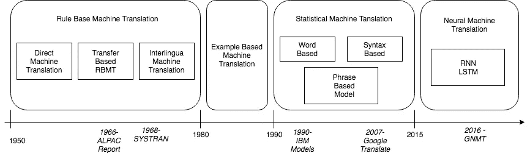

**统计机器翻译**

[布朗等人。al (1990)](http://www.aclweb.org/anthology/J90-2002) 提出在机器翻译中使用统计方法。他们提出了一种翻译过程，其中将源文本划分为一组固定位置，然后使用词汇表选择固定位置集来创建序列，最后重新排列目标固定位置中的单词以形成目标句子。他们成功地开发了自动词汇表创建和目标单词序列排列的统计技术，但未能提供翻译句子的示例。

[布朗等人。al (1993)](http://www.aclweb.org/anthology/J93-2003) 描述了翻译过程的五个统计模型，并给出了在给定一组双语句子对的情况下估计这些模型参数的算法。这些模型后来被认为是 IBM 校准模型。他们定义了一对双语句子之间的逐字对齐的概念。他们的算法为任何给定的句子对的每一个逐字对齐分配了一个概率。虽然他们的研究仅限于较小的英语和法语翻译，但这对句子中的单词间关系的对齐是一个相当大的改进。

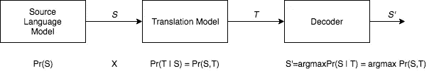

[沃格尔等人。al (1996)](http://www.aclweb.org/anthology/C96-2141) 描述了一种使用一阶隐马尔可夫模型的统计机器翻译中的单词对齐的新模型，因为它解决了语音识别的时间对齐问题。该模型背后的主要思想是使逐词对齐概率取决于对齐位置而不是绝对位置。基于 HMM 的模型产生与混合对齐模型相当的翻译概率，并且在基于 HMM 的模型中位置对齐更加平滑。

[Och et。al (1999)](http://www.aclweb.org/anthology/W99-0604) 描述了一种确定用于统计机器翻译的双语词类的方法。他们开发了一种基于最大似然法的优化标准，并进一步描述了一种聚类算法。他们的实验结果表明，双语词类的使用显著改善了统计机器翻译。

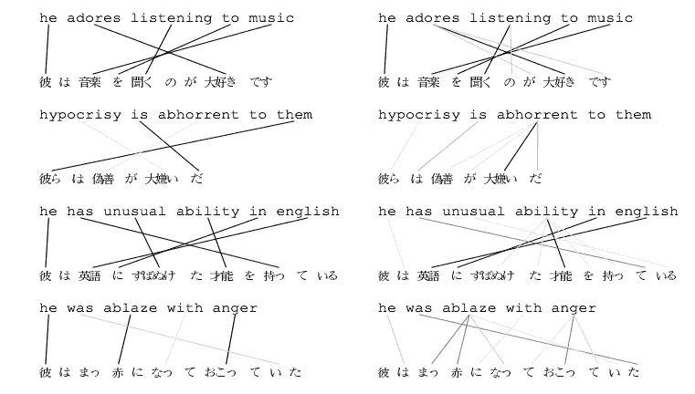

基于句法的统计翻译模型是由 [Yamada 等人提出的。艾尔(2001)](http://www.aclweb.org/anthology/P01-1067) 。他们的模型通过在每个节点应用随机操作，将源语言解析树转换成目标语言字符串。这些操作捕捉到了语言上的差异，如词序和大小写标记。该模型产生的单词排列比 IBM Model 5 产生的单词排列更好。

Koehn 等人提出了一种新的基于短语的翻译模型和解码算法。al(2003) 这使得他们能够评估和比较几种先前提出的基于短语的翻译模型。他们设计了一个统一的框架来比较不同的其他翻译模型。科恩等人提出的模型。al(2003)基于噪声信道模型 Brown 等人。al(1993)和他们使用贝叶斯规则来重新表述将法语中的外国句子翻译成英语的翻译概率。

[蒋等人。al(2005)](https://www3.nd.edu/~dchiang/papers/chiang-acl05.pdf) 提出了一个基于短语的机器翻译模型，该模型使用分层短语——包含子短语的短语。他们建议使用由单词和子短语组成的分级短语来解决这个问题。他们的模型基于加权同步上下文无关文法。该模型使用分层短语构建部分翻译，然后在标准的基于短语的模型中连续组合它们。他们没有使用传统的噪声信道方法，而是使用了更通用的对数线性模型。

**神经机器翻译**

2013 年，[Kalchbrenner&blun som(2013)](https://www.aclweb.org/anthology/D13-1176)提出了一种新的用于机器翻译的端到端编解码器结构。他们引入了一类称为循环连续翻译模型的概率连续翻译模型，该模型完全基于单词、短语和句子的连续表示，不依赖于对齐或短语翻译单元。

[Sutskever et al.(2014)](https://arxiv.org/abs/1409.3215) 提出了使用深度神经网络依次进行机器翻译的序列学习。他们的方法使用多层长短期记忆(LSTM)将输入序列映射到固定维度的向量，然后使用另一个深度 LSTM 从向量中解码目标序列。他们的结果表明，具有大深度 LSTM 和有限词汇的神经机器翻译系统可以胜过标准的基于 SMT 的系统。

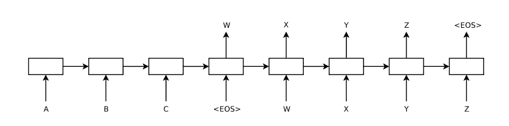

[秋等人。al (2014)](https://arxiv.xn--org%20%20cs-4t3f/) 提出了一种新的神经网络模型，采用两个递归神经网络(RNN)作为编码器和解码器。一个 RNN 将符号序列编码成固定长度的向量表示，而另一个将该表示解码成另一个符号序列。他们的结果表明，RNN 编码器-解码器能够捕捉短语的语义和句法结构。

[巴赫达瑙等人。al (2014)](https://arxiv.org/pdf/1409.0473) 提出了一种方法，该方法允许模型自动软搜索源句子中与预测目标单词相关的部分，而不必将这些部分显式地形成为硬段。通过这种方法，他们在英语到法语的翻译任务中获得了与现有的最先进的基于短语的系统相当的翻译性能。

[Luong 等人。al (2015)](https://arxiv.org/pdf/1508.04025) 提出了两种有效的注意机制，一种是始终关注所有源词的全局方法，另一种是每次只关注源词子集的局部方法。他们使用不同注意力架构的集成模型在 WMT 的 15 英德翻译任务中建立了一个新的最先进的结果，25.9 BLEU 点。

Jozefowicz 等人。al (2016) 在不同规模的语料库上对不同的神经网络模型进行了实验，他们的实验表明，RNNs 可以在大量数据上进行训练，并且它们优于包括精心调整的 N-grams 在内的竞争模型。他们的实验表明，大型正则化 LSTM LM(具有投影图层，并使用具有重要性采样的真实 Softmax 的近似值进行训练)的性能比 N 元模型好得多。

在第一届机器翻译会议(WMT'16)的研究结果中，参与 WMT 评估的神经机器翻译系统比基于短语的统计机器翻译系统高出多达 3 BLEU 评分( [Bojar 等人。al 2016](http://www.aclweb.org/anthology/W16-2302) 。

菲利普·科恩写道，*“神经机器翻译(NMT)是一种令人兴奋和充满希望的机器翻译新方法。然而，尽管这项技术很有前途，但我们仍有一段路要走，才能在所有用例中与基于规则的机器翻译(RBMT)和统计机器翻译(SMT)相媲美。一些业内人士最近声称，我们所有人都即将达到接近人类的质量，这可能有点过于简单化了。”*。他认为，即使神经机器翻译系统产生了高质量的结果，也很难在工业规模上实现这种系统，因为它需要在处理翻译的基础设施上进行巨额投资。

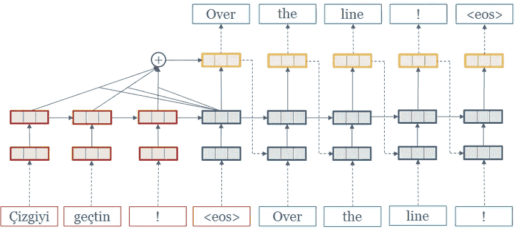

**谷歌的神经机器翻译**

[吴等(2016)](https://arxiv.org/pdf/1609.08144) 提出了一个遵循通用序列间学习框架的模型 [Sutskever 等(2014)](https://arxiv.org/abs/1409.3215) 注意 [Bahdanau 等。铝(2014)](https://arxiv.org/pdf/1409.0473) 。该模型由三部分组成:编码网络、解码网络和注意网络。编码器网络将源句子转换成向量列表，每个输入符号一个向量。当这个向量列表被传递到解码器网络时，它一次产生一个符号，直到遇到特殊的句尾符号(EOS)。编码器和解码器通过注意模块连接，注意模块允许解码器在解码过程中关注源句子的不同区域。

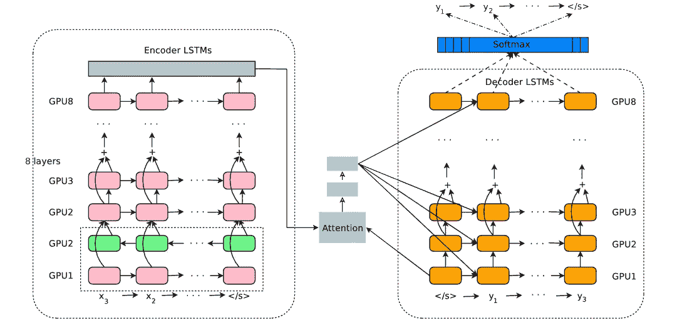

[吴等(2016)](https://arxiv.org/pdf/1609.08144) 架构描述如下。左边是编码器网络，右边是解码器网络，中间是注意力模块。底部的编码器层是双向的:粉色节点从左到右收集信息，而绿色节点从右到左收集信息。编码器的其他层是单向的。剩余连接从编码器和解码器中倒数第三层开始。该模型被划分为多个 GPU 以加速训练。在他们的设置中，有 8 个编码器 LSTM 层(1 个双向层和 7 个单向层)和 8 个解码器层。通过这种设置，一个模型副本被分成 8 个部分，并放置在通常属于一台主机的 8 个不同的 GPU 上。在训练期间，底部双向编码器层首先并行计算。一旦两者都完成，单向编码器层开始计算，每个都在单独的 GPU 上。为了在运行解码器层期间保持尽可能多的并行性，他们仅使用底层解码器层输出来获得循环注意上下文，该上下文被直接发送到所有剩余的解码器层。softmax 层也被分区并放置在多个 GPU 上。根据输出词汇的大小，他们要么让它们在与编码器和解码器网络相同的 GPU 上运行，要么让它们在一组单独的专用 GPU 上运行。

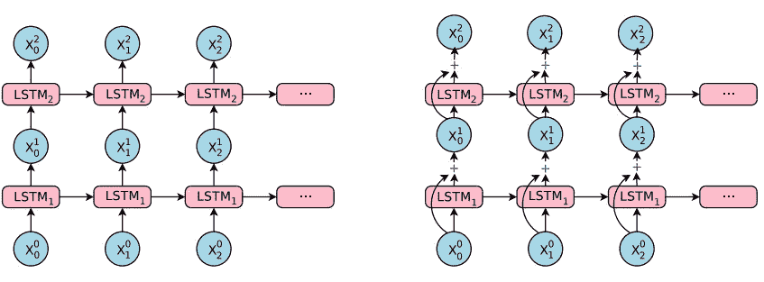

他们的解码器网络实现为 RNN 网络和 softmax 层的合并。解码器 RNN 网络为要预测的下一个符号创建隐藏状态，然后通过 softmax 层生成候选输出符号的概率分布。在他们的实验中，作者发现神经机器翻译系统必须具有用于编码器和解码器网络的深度 rnn，以实现良好的准确性，它们需要捕捉源语言和目标语言中的微小不规则性。他们在研究中实施的注意力模型类似于 [Bahdanau 等人。铝(2014)](https://arxiv.org/pdf/1409.0473) 。

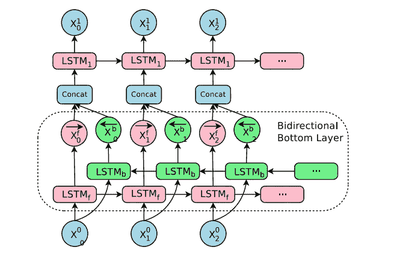

[吴等(2016)](https://arxiv.org/pdf/1609.08144) 承认了这样一个事实，即简单地增加更多的层会使网络更慢且难以训练，可能是由于爆炸和消失梯度问题。他们在堆栈中的 LSTM 层之间引入了剩余连接。剩余连接极大地改善了反向传递中的梯度流，这允许他们用 8 个 LSTM 层来训练他们的编码器和解码器网络。他们将双向连接用于底部编码器层，同时保持其他层单向连接，以在计算过程中实现最大的并行化。

[Wu et al (2016)](https://arxiv.org/pdf/1609.08144) 使用两个公开可用的语料库 14 的英语到法语和英语到德语作为他们的神经机器翻译系统的基准。除了这些公开可用的语料库，他们还使用了谷歌的翻译产品语料库，对于给定的语言对，这个语料库比 WMT 语料库大得多。WMT En- > Fr 包含 36M 个句子对，而 En- > De 包含 5M 个句子对。他们通过与标准 BLEU 评分标准一起进行并排的人类评估来评估他们的模型。并列评分从 0 到 6 不等，0 分表示“完全无意义的翻译”，6 分表示“完美的翻译:译文的意思与原文完全一致，语法正确”。他们使用在 TensorFlow 中实现的系统来训练模型。他们在实验中使用了基于单词、基于字符、基于混合字符和几种不同词汇量的单词模型。表格总结了他们在 WMT En - > Fr 数据集上取得的结果。他们的最佳型号 WPM-32K 获得了 38.95 的 BLEU 评分。WMT En - > De 比 En- > Fr 要困难得多，这是因为训练数据的规模更小，并且德语是一种形态更丰富的语言，需要词汇作为单词模型。他们最好的型号 WPM-32K 取得了 24.61 的 BLEU 分数。

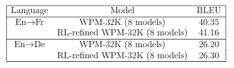

他们进一步使用 RL 训练来微调正常最大似然训练后的句子 BLEU 分数。他们集成了 8 个 RL-refined 模型，并在 WMT En->Fr 数据集上获得了 41.6 BLEU 点的最先进结果。他们在 WMT En->De 数据集上获得了 26.30 BLEU 点的最新结果。这四个翻译是:1)从 statmt 网站下载的最佳基于短语的翻译，2)8ML 训练的模型的集合，3)8ML 训练然后 RL 精炼的模型的集合，以及 4)直接从测试数据获得的参考人类翻译。结果显示在表中。实验结果清楚地表明，尽管 RL 细化可以获得更好的 BLEU 评分，但它几乎没有改善人们对翻译质量的印象。

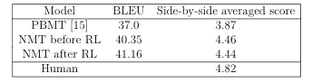

谷歌的 NMT 是机器翻译的最新水平。

如需 www.ibidemgroup.com[T2 的西班牙语翻译或西班牙语翻译，请点击此处。](https://www.ibidemgroup.com/edu/evolucion-traduccion-automatica/)