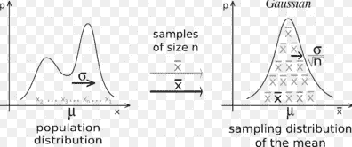
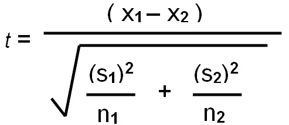
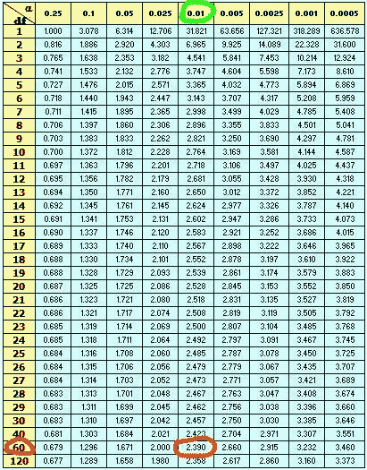
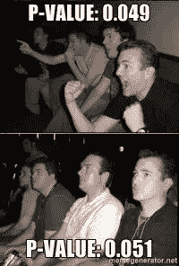
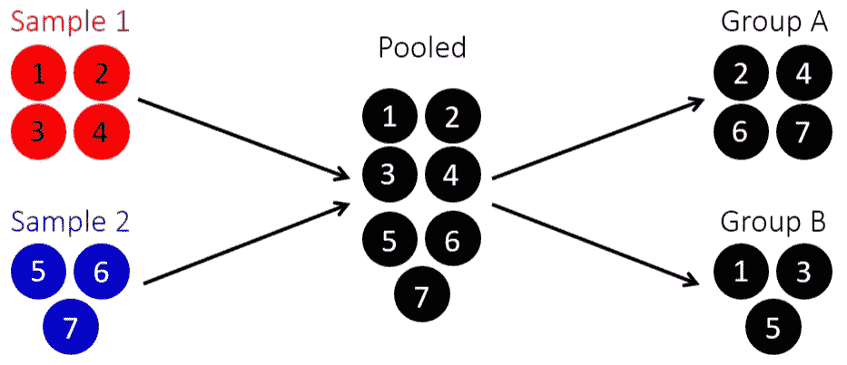
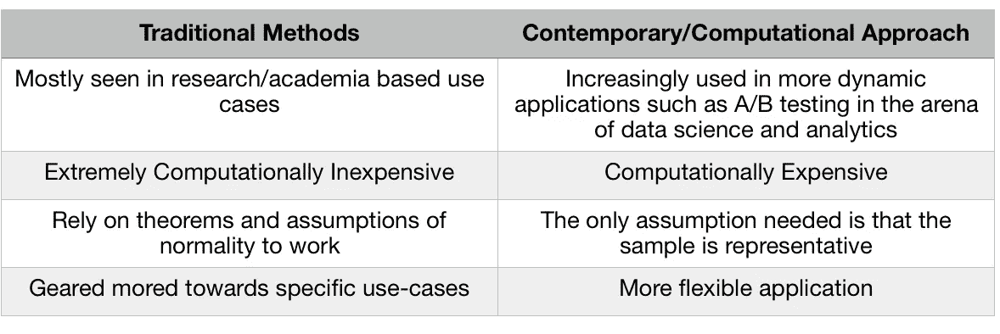

# 数据时代传统统计检验的演变

> 原文：<https://towardsdatascience.com/evolution-of-traditional-statistical-tests-in-the-age-of-data-326300caa65a?source=collection_archive---------25----------------------->

基于研究/学术起源的显著性测试与基于数据科学和分析的更动态应用角色的显著性测试之间的差异

让我们从统计学中显著性检验的简单定义开始。

> 统计显著性测试表明所观察到的感兴趣变量的差异(不同样本/组之间)是否表明了一些真正的差异(通常在应用了一种处理方法之后),或者这些差异是否仅仅是由于偶然因素/采样误差。

定义显著性检验的方法还有很多。所有的人或多或少都在说同样的话。

***注意:*** *这不是掌握显著性检验的教程。外面有很多这样的人。这是在更多基于研究/学术领域的显著性测试中使用的不同方法的概述，因为它仍然在大学课程中教授(至少在我的经验中)，而不是在数据科学和分析的更多基于应用的领域中的演变。希望这篇文章也能表明，不完全熟悉前者并不影响一个人与后者合作的能力。*

# 序言

假设我有一个改变的想法。这种改变可能是一种向高中生教授数学的新方法，我相信这将有助于他们在 AP 考试中取得更好的成绩。这种变化可能会使我的电子商务网站的登录页面看起来略有不同，我相信这会导致访问者在我的网站上花更多的时间。不管是什么想法，我需要一种方法来测试它是否会引发我认为会发生的变化。

继续以电子商务网站为例，我**随机**挑选访问者并将他们分成两组，A 组和 B 组。我向 A 组(这是我的对照组)的访问者展示旧的登录页面，向 B 组(这是我的治疗组)的访问者展示据称是新的和改进的登录页面。然后我测量每组访问者在我的网站上花费的平均时间，你瞧！B 组访问者在我的网站上停留的平均时间高于 A 组访问者！

现在，我需要做的就是排除这种由于偶然发生的群体间花费在我的网站上的平均时间的差异的可能性。可能我的新页面与这种差异没有任何关系，我只是运气好，不管登陆页面看起来怎么样，我都分配了平均会在我的网站上花更多时间的访问者。

*输入*显著性测试

# 显著性检定

在我们讨论进行显著性测试的不同方法之前，重要的是要记住我们感兴趣的变量不是每个访问者在我们网站上花费的时间，甚至不是每组访问者在我们网站上花费的平均时间。这是 A 组和 b 组的访问者在我们网站上停留的平均时间的**差异**，这是一个叫做我们的**测试统计**的小东西。

Our Test Statistic

现在我们已经准备好了，来看看我们两组之间的平均时间差异是否是偶然发生的。为此，我们需要进行一个显著性测试，这需要经历以下一般步骤

*   **宣布零假设**:这只是我们假设自己错了的一种奇特说法。在我们的例子中，这意味着假设我们的登陆页面对访问者在我们网站上停留的时间没有影响。我们的差异只是由于一个幸运的样本，而 A 组和 B 组访问者在我们网站上花费的平均时间之间的真正差异应该是 0。
*   **模拟零假设下的数据收集**:这里我们需要创建一种假设现实，其中零假设为真。在这个现实中，A 组和 b 组的访客在平均时间上没有区别。我们需要查看我们在这个现实中收集的数据，这就是问题所在—
    *这是这个假设现实的创造，其中基于研究/学术的方法与你可能在数据科学和分析应用中看到的更注重计算的方法分道扬镳。*
*   **计算 P 值**:最后，我们计算当我们收集数据时，我们最初观察到的一个测试统计数据出现极端情况的概率。我们在假设的现实中这样做，其中零假设为真，以计算 me 偶然看到我们的结果的频率。这是我们的 p 值。

## 传统方法

**t 检验**是一种非常常见的方法，用于进行涉及均值差异的显著性检验。t 测试已经存在很长时间了，远在计算机成为主流之前。因此，在缺乏我们习以为常的便捷计算能力的情况下，我们如何模拟零假设下的数据收集呢？很简单，我们使用一个定理，并基于它做一个假设。

*输入*中心极限定理

特别是，传统方法使用 C **中心极限定理的含义。**用最通俗的术语来说，中心极限定理表明

*如果我* *从一个总体中反复抽取样本并取每个样本的平均值，那么给定足够的样本，所有那些* ***意味着*** *将遵循一个近似的* ***正态分布*** *而不管总体本身遵循的分布*。

Visual Representation of The Central Limit Theorem

统计理论还指出，任何正态分布的线性组合也是正态分布的。使用这些信息，我们可以**假设******如果**(我不会真的去做)我会一遍又一遍地重复进行我的实验，并从两组访问者那里收集我的测试统计数据，那么我所有的测试统计数据将会遵循一个近似正态分布。不需要很大的计算能力，因为我实际上没有一遍又一遍地做实验。我在假设如果我做了，我会看到什么样的分布。现在有了这个假设，我可以继续从我的测试统计量中计算我的**标准化** t 统计量，以获得零假设下我的观察值的 t 得分。**

*****注意:*** *现在我确信* *你们中的一些人可能会奇怪为什么我们不计算 z 统计量来获得 z 得分，因为这是我们标准化正态分布时得到的结果。其原因是，为了获得标准正态分布和 z 值，我们需要总体标准差，但我们也不知道。我们只知道我们收集的 A 组和 B 组两个样本的标准差。因此，在没有总体标准偏差的情况下，为了处理样本标准偏差，我们将使用正态分布的近似值，称为具有不同自由度的 t 分布，因此也就是 t 得分。有趣的事实是，我们的自由度越高(取决于我们的样本大小)，我们就越接近标准的正态分布(当然是渐近分布)。***

**下面是计算 t 统计量的公式。这个小公式是在零假设下得出的，即每个样本的真实总体均值没有差异(在我们的例子中，这意味着每组访问者在我们网站上花费的平均时间是相同的)。也就是说，它们的差值为 0，这正是我们试图得到 t 统计量的假设(我们的假设现实还记得吗！)**

****

**T-statistic under the null hypothesis**

**我们只需插入现有的值，然后弹出我们的 t 统计量。X1 是我的治疗组的样本平均值，X2 是我的对照组的样本平均值，S 是样本标准偏差，n 是样本大小。**

**一旦我们有了 t 统计量，我们所要做的就是用适当的自由度查看它在 t 分布曲线上的位置，并计算看到如此极端结果的概率，这将是我们的 p 值。**

**自由度的计算只需使用我们的样本大小，方法如下。**

****

**Degrees of Freedom Calculation**

**让我们假设，对于我们的电子商务网站，我们的 t 统计量约为 2.39，基于我们的样本大小，我们的自由度等于 60。从这里开始，我甚至不需要计算器来计算我的 p 值。我可以使用一个简单的 t 分布查找表。**

****

**Look up table for the t-distribution**

**根据该表，在下面曲线的右尾下的面积，是在零假设下，看到均值差异至少与我们在实验中观察到的差异一样极端的概率，偶然约为 1%。换句话说，我们的 p 值是 0.01**

****

**Area under the curve for a one-sided t-test**

**现在，我们可以使用这个结果来拒绝零假设，并得出结论，我们的新页面确实有助于增加每个访问者在我们网站上花费的时间，或者我们可以得出结论，我们看到我们的原始结果是偶然的。通常在大多数研究/学术领域，你会看到 p 值低于 5%意味着我们可以拒绝零假设，这就是我们的例子。**

**这里有一个小的统计迷因去它，给你。**

****

## **计算/当代方法**

**如果在宣布零假设后，我们有办法在零假设下模拟我们实验的结果很多次(记住，是为了创造我们的假设现实)，这样我们就不必依赖于定理、假设和标准正态分布的近似值来告诉我们，如果我们真的重复实验很多次，我们会看到什么。**

***输入*计算机**

**幸运的是，与过去不同，我们有计算能力在几秒钟内对实验结果进行数十万甚至数百万次的重新采样。手工做起来不太容易甚至不可行的事情，尤其是在计算机出现之前的时代。**

**这意味着，使用某些有效的重采样技术，我们可以模拟我们的假设现实，而不依赖于任何定理、正态性假设，也不必考虑我们对总体标准差的了解。**

**回到我们的两个组的例子，A 组(对照组)和 B 组(治疗组)，我们可以使用某些简单的重采样技术来模拟零假设下的数据收集。**

**假设我们有两组数组。A 组是一个数组，其中包含每个被展示旧登录页面的访问者在我们的网站上花费的时间。类似地，B 组是一个数组，显示了每个被展示了新登录页面的访问者在我们网站上花费的时间。假设这两个数组的大小都是 31。我们还可以说，当我们进行实验时，我们发现 B 组的访问者在我们的网站上花费的平均时间比 a 组的访问者多大约 30 秒。为了在零假设下刺激数据收集，我们需要创建两个数组的平均值没有差异的条件。下面介绍两种重采样技术如何实现这一点。**

****排列重采样****

*   **将两个数组连接成一个大数组。对于我们来说，这应该是 62，因为我们的两个数组都是 31。**
*   **打乱整个数组，所以现在每个组的观察值随机分布在整个数组中，而不是从中间分开。**
*   **从中间任意分割数组，将数组的前 31 个索引中结束的观察值分配给 B 组，其余的分配给 a 组。**
*   **从新组 b 的平均值中减去这个新组 A 的平均值。**
*   **这将给我们一个排列测试统计。**

**这是一个排列重采样的可视化展示—**

****

**Assume Observations 1,2,3,4 originally belonged to Group A and observations 5,6,7 originally belonged to Group B**

**通过混合两种样本，然后将它们混在一起，我们消除了它们分布的差异。我们创造了我们的假设现实，他们来自同一个群体，没有使用任何定理或衍生的标准化统计。**

**我们重复上述步骤数十万次，并计算数十万个排列测试统计。然后，我们简单地看一下，在我们计算的总排列测试统计数据中，我们计算的排列测试统计数据的比例至少与我们在 30 秒内的原始差异一样高。瞧啊。这是我们的 p 值。不需要近似的正态分布或查找表。**

****自举重采样****

**Bootstrap 重采样就是通过替换从分布中进行重采样的过程。这意味着我们可能会对一个值进行多次重采样，对多个值进行多次重采样，对没有值的情况进行多次重采样，甚至可能会有一些值从未出现的样本。一切都很好。这是一个自举重采样的可视化展示**

****

**3 different bootstrap resamples from the same sample**

**在我们开始进行 bootstrap 重采样之前，我们仍然需要为我们的零假设创造条件，以便在。我们可以通过以下步骤做到这一点—**

*   **考虑具有 B 组(治疗组)观察值的阵列**
*   **从数组中的每个元素中减去 B 组的平均值**
*   **将 A 组(对照组)的平均值加到数组中的每个元素上。这是我们的新数组，有一个移动的平均值。**
*   **从此数组中取出相同大小的引导程序重新采样。**
*   **计算该引导重采样的平均值与 A 组(对照组)观察值的原始阵列平均值的差值**
*   **这将给我们一个自举测试统计**

**在这里，我们简单地将 B 组在我们的网站上花费的平均时间更长的观察结果转移到 a 组，再次创建我们的现实，其中这两个数组具有相同的平均值，以收集数据。然后，我们从这个移位的数组中取出几十万个自举重采样，以计算几十万个自举测试统计，其余的与我们对置换重采样所做的相同。我们简单地计算我们收集的总的 bootstrap 统计数据中 bootstrap 统计数据的比例，该比例至少与我们获得 p 值的 30 秒原始差值一样高。同样，不需要近似的正态分布或查找表。**

# **摘要**

****

# **结论**

**有大量的资源可以帮助你掌握显著性测试及其相关概念。这也可能意味着，当你在不同的方法、教程和指南中导航，以决定你想专注于哪一个时，有时很容易感到困惑。希望这篇文章能让你对显著性测试的本质有一个好的认识，以及在两个领域实现其目标的不同方式。在显著性检验中有许多相关的重要概念，如 I 型误差、II 型误差、效应大小、功效..等等，我没有涉及，但你会发现，无论你决定把重点放在资源和应用，现在你知道区别。快乐学习。**

**如果我遗漏了什么，或者有什么不准确的地方，或者如果你有任何反馈，请在评论中告诉我。我将非常感激。谢谢你。**