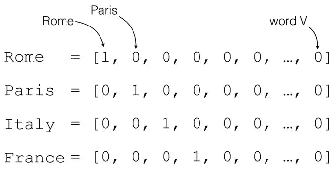
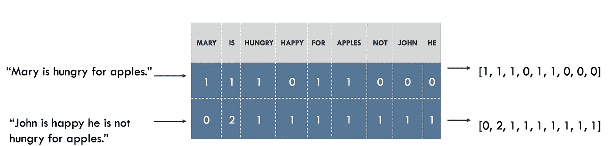
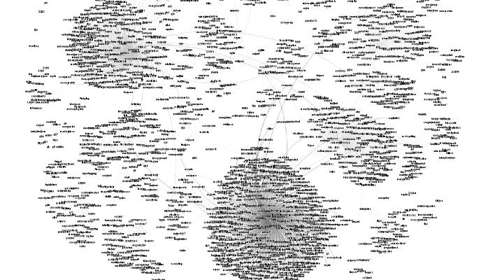
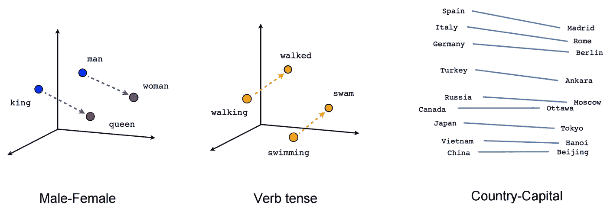

# 自然语言处理中文本表示的演变

> 原文：<https://towardsdatascience.com/evolution-of-word-representations-in-nlp-d4483fe23e93?source=collection_archive---------32----------------------->

## 在自然语言处理的背景下，文本的表达是如何发展的，每种方法的优点是什么。

Photo by [Conor Luddy](https://unsplash.com/@opticonor?utm_source=unsplash&utm_medium=referral&utm_content=creditCopyText) on [Unsplash](https://unsplash.com/s/photos/language?utm_source=unsplash&utm_medium=referral&utm_content=creditCopyText)

信息可以用多种方式表示，同时保持相同的含义。我们可以通过多种语言传递信息，我们可以用数学表达式或图画来表达一些东西。我们选择更适合传达我们想要传递的信息的表征。在自然语言处理中，我们必须将文本数据转换成机器可以处理的东西。数字！有许多方法可以实现这种转换。一个简单的方法是给文本中的每个单词一个特定的 id。但是，并不是所有的表示都是相同的，有些表示比其他表示更复杂，携带的信息更多，这将影响 NLP 模型的性能。

凭借当今的计算能力，我们有能力构建能够执行非常复杂的任务和处理大量数据的 ML 模型。我们想给我们的模型提供尽可能多的信息。

## 一键编码

Source :(Marco Bonzanini, 2017)

最简单的表示形式之一是一键编码。它们将一个单词转换成一个 N 维的向量，向量中充满了 0 和一个 1 的单个(热)位置。

向量是正在使用的字典的大小，每个位置代表一个单词，带有 1 的位置代表单词向量所映射的单词。这个概念很简单，并且在 NLP 的早期阶段使用过。它很便宜，只需要很少的计算能力就可以将文本数据转换成一个热编码数据，并且很容易实现。

但是，它没有携带任何关于数据的额外信息，是一种极其臃肿的表示。这种表示只是一大堆识别单词的 1 和 0，NLP 模型需要从零开始学习每个向量的意思。

## 一袋单词

[Image source](https://blog.insightdatascience.com/how-to-solve-90-of-nlp-problems-a-step-by-step-guide-fda605278e4e)

单词包是一种简化的表示，它将文本表示为一个多重集(包)。文本被转换成字典大小的向量，每个索引代表一个单词，索引处的值是该单词在文本中出现的次数。表象背后的直觉是，词语本身携带着理解所需要的信息。

但是，并非每个句子都是如此。句子中单词的顺序可能会改变它的意思。单词包不考虑句子的顺序，这是它不如单词嵌入强大的原因之一。它也没有给出每个单词意味着什么的任何信息，模型被给予很少的先验知识。

## 单词嵌入

[Image Source](https://blog.insightdatascience.com/how-to-solve-90-of-nlp-problems-a-step-by-step-guide-fda605278e4e)

单词嵌入是单词到向量的映射。

一个单词被转换成一个 N 维的向量，其中每一维都有一个潜在的含义。单词与这些潜在含义的关系将定义维度的值。

二维的单词嵌入可以如下映射单词:

男人→ [0.85，0.05 ]

狗→ [ 0.9，0.1 ]

苹果→ [ 0.12，0.9 ]

香蕉→ [0.06，0.95 ]

猕猴桃→ [ 0.48，0.56 ]

在这个例子中，我们注意到第一维对于狗和人有一个高值，而第二维对于苹果和香蕉有一个高值。这可能意味着第一维与动物有关，第二维与水果有关。还要注意 kiwi 在两个维度上都有一个中间值。

二维空间太小了，不足以表达单词的意思，除非我们想要一种嵌入的方式来提供不同于动物的水果。嵌入通常有 50、300、600 或 900 个维度。

## **嵌入的魔力。**

嵌入本身是非常令人惊奇的，可以做一些可爱的把戏。

我们可以想象，在嵌入中,“男人”和“女人”这两个词的表征之间的差异是一个解释性别差异的值。“国王”和“王后”也是如此。因此，我们知道:

<man>——<woman>=<king>——</king></woman></man>

[https://www.tensorflow.org](https://tensorflow.org)

因此，如果我们有“男人”、“女人”和“男孩”的向量，我们可以预期 <woman>+ <boy>— <man>将产生<girl>。这意味着单词嵌入的维度学习单词的意思，并且能够辨别“女人”和“男人”代表相似的实体。</girl></man></boy></woman>

**如何训练一个单词嵌入？**

单词嵌入通常是通过用大语料库在无监督的任务中训练模型来产生的。比如试图预测句子中缺失的单词。

训练嵌入在计算上是昂贵的。对于大多数问题，下载可用的经过训练的嵌入是最好的选择。如果你的语料库过于具体(例如。有很多行话)你可能想训练自己的嵌入。

正如我们在单词 kiwi 的例子中看到的，嵌入不知道如何处理有多重含义的单词。嵌入会将含义平均到单个向量中，在数据集上出现频率较高的含义会获得较高的权重。

单词嵌入也达不到它以前从未见过的单词，如新词、拼写错误和词汇以外的单词。

## 扩展嵌入

为了补救单词嵌入的一些问题，目前大多数流行的模型通过分成“特征”来标记单词，并使用这些特征而不是单词本身来训练嵌入。

记号赋予器可以将单词“google”分成“goog”和“le ”,嵌入将学习这些特征。它可能会对过去分词中的动词做类似的事情，例如:' watched' → 'watch '，' ed '。现在，假设单词“googled”不在嵌入的训练集中。记号赋予器可以将单词分割成特征:“goog”、“le”、“ed”，所有这些特征嵌入之前都见过，并且每个特征都有适当的特征向量。因此，嵌入即使以前没有见过这样的单词，它仍然可以给它一个很好的表示。

这种直觉可以应用于拼写错误、新词和词外词汇，并且极大地提高了词嵌入的性能。

## 结论

复杂的单词表示是给 NLP 模型更多先验知识的一种廉价方式，对于数据稀缺且难以收集的任务非常有用。由于这个原因，我们看到了一系列越来越复杂的单词表示法。

单词嵌入非常强大，在 NLP 中已经无处不在。我们探索了单词嵌入和更原始的单词表示背后的一些直觉，我们看到了为什么一些可能比另一些更有利。