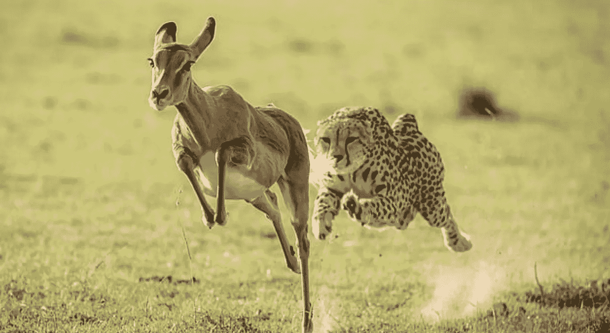
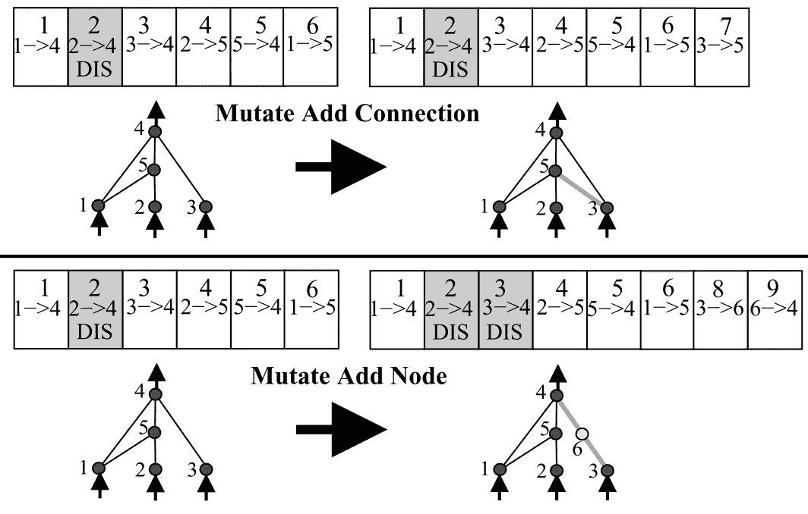
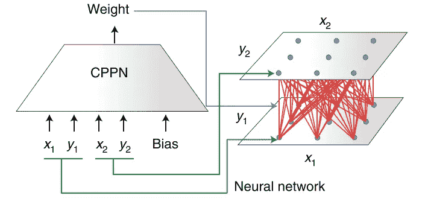
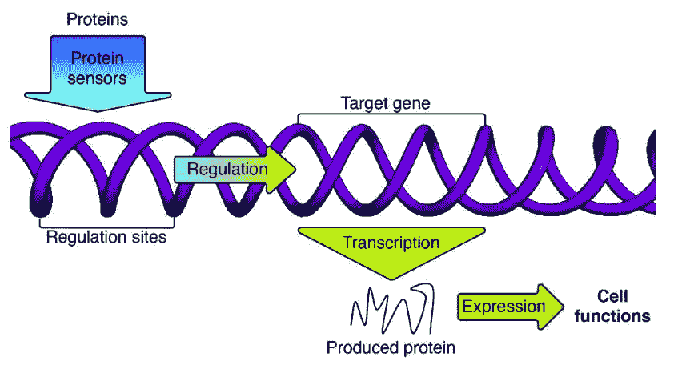

# 人工智能的进化方法:过去、现在和未来

> 原文：<https://towardsdatascience.com/evolutionary-approaches-towards-ai-past-present-and-future-b23ccb424e98?source=collection_archive---------5----------------------->

## 达尔文主义能给 AI 带来革命吗？

Open environments and competition among species are two driving forces of Darwinian evolution that are largely absent in recent works on evolutionary approaches toward AI models. Within a given generation, faster impalas and faster cheetahs are more likely to survive (and reproduce) than their slower counterparts — leading to the evolution of faster and faster impalas and cheetahs over time. Can these and other principles of genetics and natural selection guide us towards major advances in AI?

# 目录

*   **简介**
*   **遗传和自然选择**
*   **进化计算**
*   — *进化策略*
*   — *采用直接编码的遗传算法*
*   — *采用间接编码的遗传算法*
*   — *开放式*(这才是真正有趣的地方！)
*   — *还缺什么？*
*   **结论**
*   **参考文献**

# 介绍

自大约 2012 年[1]以来，人工智能的爆炸式增长几乎完全由反向传播(backprop)训练的神经网络(深度学习)模型驱动。这包括图像分类、自动语音识别、语言翻译、机器人和可以玩单人或多人游戏的自主代理的模型。

然而，正如在生物学中所观察到的，越来越多的模型是使用基于进化方面的方法构建的。这种方法出现在深度学习时代之前，但直到最近才被扩大到可以与反向训练的深度学习模型相竞争的程度。

在这篇博文中，我们讨论了其中的一些进化方法，将它们与生物进化和有机体发展进行了比较和对比，并推测它们如何最终带来比传统深度学习模型具有更大(或更多)能力和能效的人工智能模型。

# 遗传学和自然选择

简而言之，达尔文的理论认为进化是由被自然选择放大的特征的微小变化驱动的。与具有有害特征的生物相比，具有有益特征的生物更有可能繁殖，从而将这些特征传递给后代。

达尔文不知道特征是如何从父母传递给后代的(这让他的见解更加令人印象深刻)，但我们现在知道生物体的基因型及其发育环境决定了其表型(身体和行为特征)。一般来说，新的基因型通过父母 DNA 的随机突变、来自多个父母的基因混合(有性生殖)或两者而出现在后代中。

# 进化计算

科学家对生物进化的理解产生了受进化启发的计算优化模型。其中最简单的是*进化策略*。在*遗传算法*中发现了更大和更多样的建模复杂性。在这两种情况下，目标都是优化一个*适应度函数*，该函数旨在测量人工有机体在某些特定任务上的表现。另一种方法是放弃适应度函数，转而利用一个或多个物种的多个智能体的丰富、开放的环境，其中智能体只为生存和繁殖而竞争。

## 进化策略

进化策略是一类优化算法，其中，在每次迭代(世代)中，参数向量(基因型)的群体被扰动(突变)，并且它们的适应函数值被评估[2，3]。然后，最高得分的参数向量被重新组合以形成下一代的种群，并且该过程被重复，直到目标被完全优化。在协方差矩阵自适应进化策略(CMA-ES)中，模型参数的分布由协方差矩阵表示。在每一代中，个体代理的模型参数从分布中提取。在确定了哪些代理具有最高的适合度分数之后，基于那些最佳代理的参数值来更新协方差矩阵。想要一个很棒的二维可视化，请看这篇很棒的 [Otoro 博客文章](http://blog.otoro.net/2017/10/29/visual-evolution-strategies/)。

尽管这种方法很简单，但有时它可以与用强化学习方法训练的相对现代的大规模深度学习模型竞争，如 OpenAI [4]所示，并在这篇[帖子](https://openai.com/blog/evolution-strategies/)中描述。进化策略方法相对于强化学习方法具有一些好的特性，因为进化策略易于实现并跨核心/CPU 扩展，模型训练快速，并且该方法不利用梯度(当使用基于梯度的方法时，对具有离散输出的任务的训练是困难的)。

Above are a few videos of 3D humanoid walkers trained with evolution strategies by OpenAI (videos taken from their [blog post](https://openai.com/blog/evolution-strategies/)). Results have quite a bit of variety, based on which local minimum the optimization ends up converging into. As will be noted later in this post, however, none of movements look very natural in contrast to those of biological animals, some of which begin fluid walking and running within minutes or hours after birth.

## 直接编码的遗传算法

虽然术语*遗传算法*可能被不同的研究者和从业者以不同的方式使用，但是我们在这里以非常一般的方式使用它。在每一代中，算法:(1)基于适应度函数从大小为 P (N < P)的群体中选择前 N 个代理，(2)通过从这些顶级代理单独(无性)或成对(有性)繁殖产生新一代代理，以及(3)在繁殖期间，后代基因通过突变、交叉(混合两个伙伴父母的基因)或两者而变化。

进化策略和遗传算法之间的另一个区别是，在进化策略中，群体的基因组由概率分布来表示。典型地，这意味着在给定世代中群体的所有成员将在参数(基因组)空间内的单个聚类中被发现。相比之下，在遗传算法下，对种群没有这样的约束。然而，在实践中，除非环境或额外的算法组件促进种群多样性(在这种情况下，可能出现多个“物种”)，否则单个种群集群通常会进化。

在遗传算法的许多应用中，基因型到表现型是*直接*的，这意味着每个基因直接编码代理模型的一个参数。事实上，基因及其表型表达可能是相同的，例如，代表深度学习模型中的权重或偏差项的数值。如上一节所述，使用进化策略训练的模型使用直接编码。

相比之下，生物学是基于*间接*编码的。例如，由 DNA 组成的基因并不直接编码大脑神经元之间突触的强度。相反，它们为蛋白质编码，这些蛋白质共同发挥作用，实现大脑(及其突触)的发展，并根据有机体的经验学习突触增强或减弱的规则。我们将在下一节回到人工智能的间接编码的例子。

2017 年，Ken Stanley 和 Jeff Clune——进化神经网络参数的“神经进化”方法的长期倡导者——展示了直接编码的遗传算法在众多 Atari 游戏中表现良好的潜力，包括难以通过强化学习(Q-learning 或策略梯度)解决的游戏[5]。他们在优步人工智能实验室的团队使用了一种简单的遗传算法，通过向父网络的参数添加高斯噪声，将基因突变引入无性繁殖的后代。

In addition to evolving agents to play Atari games, the team from Uber AI Labs evolved agents to complete a relatively simple maze, albeit one with two different “traps.” Agents trained with an evolution strategy (ES) consistently get stuck by Trap 1 and never evolve further. Agents trained with a genetic algorithm (GA) do better, but get stuck in Trap 2\. When agents are chosen for reproduction based not only on their fitness score but also their display of *novel* behaviors (GA-NS), the species ultimately evolves the ability to complete the maze. Agents trained with two different reinforcement learning methods (A2C and DQN) do not learn to complete the maze.

优步团队还额外检验了奖励表现出*新奇行为*的代理人(允许他们繁殖)的效果。他们证明，尽管这样的代理人通常在传统的适应度函数上得分很低，但随着时间的推移(几代人)，这种方法使整个人群受益。为行为新颖性赋值的遗传算法是一种质量多样性算法【6】，这种算法是一个活跃的研究领域。这种观点认为，在整个种群中维持一个多样化的行为库提供了一个新的、更复杂的行为库，这些行为可能会产生有益于后代有机体的新的、更复杂的行为，尽管复杂行为所基于的更简单的行为的价值很小甚至是负面的。【*请注意，这在很大程度上是一种启发式方法，因为尚不清楚什么样的自然力会促进“无价值”行为表型的跨代保留。* ]

另外，优步团队使用了一种创造性的有效方法来保留数千个大型代理的基因型(每个代理有数百万个神经网络参数)。也就是说，他们保存了一份记录，记录了用于创建最初一代代理的随机数生成器种子，以及用于创建每组突变的种子。因此，可以从种子向量中重新创建单个代理，并且可以这样存储代理，而不是直接存储代理的模型参数。

## 间接编码的遗传算法

一般来说，利用间接编码模型的遗传算法没有直接编码模型成功(在现代大规模问题上)。尽管如此，间接编码模型可能被证明是非常强大的，因为它们有可能对复杂的、精密的模型进行紧凑的编码。例如，虽然一个生物体中的一组基因可能是固定的，但基因的蛋白质产物可以以组合的方式跨越时间和空间(在生物体中)相互作用，从而允许几乎无限的可能性。下面我们着重介绍两个间接编码的例子。

***超整齐***

到目前为止讨论的进化计算方法有一个固定大小的基因组。即固定架构的神经网络。基因定义了这种固定结构的参数，但没有定义该结构的任何方面，因此遗传算法无法增长、收缩或修改该结构。2002 年，Stanley 和 Miikkulainen 引入了扩充拓扑的神经进化(NEAT) [7]。NEAT 定义了基因和神经网络内的连接之间的映射，并且可以适应定义新连接或节点的*新基因*的进化添加。

NEAT defines rules that map genes to a network architecture in addition to values of network weight and bias terms. Under a genetic algorithm, the network can grow by adding connections and nodes.

然而，NEAT 是一个直接编码模型，每个基因定义两个节点之间的连接权重。虽然一些基因可以呈现“禁用”状态，但这可以被视为编码零权重值。这将我们带到超净。

在 HyperNEAT [8]下，NEAT 训练的网络的输出定义了二级网络的权重。该辅助网络是用于执行所需任务的网络。在最简单的版本中，该次级“任务”网络具有排列在二维空间中的节点，使得每个节点可以通过其(x，y)坐标来识别。第一个网络被称为复合模式生成网络(CPPN)，它采用四个输入来定义任务网络中两个节点( *i* 和 *j* )的位置:(x *i* ，y *i* )和(x *j* ，y *j* )。CPPN 的输出是连接这两个节点的权重值。因此，NEAT 可以用来发展一个指导任务网络“开发”的 CPPN。任务网络，而不是 CPPN，由适应度函数来评估。

使用超净方法，相对较小的 CPPN 网络可以定义任意规模和密度的复杂任务网络。作为 CPPNs 可进化性的证明，模型已经[进化到产生复杂的二维图像](http://picbreeder.org/)。虽然进化的任务网络的性能落后于最近的模型，但 HyperNEAT 已经被用来训练模型玩 Atari 游戏[9](大约在同一时间，DeepMind 展示了这种通过强化学习训练的模型[10])。

In this HyperNEAT example, the task network (*right*) is a two-layered network in which neurons connect between the lower and upper layer, but not within layers. The CPPN network (*left*) defines connection strengths of the task layer for a given pair of task network nodes. The CPPN is a neural network defined by the NEAT genome-to-network mapping, and can be evolved using a genetic algorithm, with a fitness function applied to the task network defined by a given CPPN instantiation.

***机体发育***

生物进化不直接建立成熟(成年)生物的表型。相反，基因通过发育(例如，产前、婴儿期、青春期)间接建立生物体表型。基因也在成年期对生物体环境的反应中发挥作用(例如，在从低海拔向高海拔移动的生物体中产生更多的红细胞)。虽然 NEAT 进化出一群神经网络，但这些网络实际上并不是从基因组“生长”出来的。相反，它们是直接实例化的，因为纯网络是直接编码的。

研究人员如 Jordan Pollack 和他的前博士后 Sylvain Cussat-Blanc，正在探索包含生物体发育时期的进化计算方法。在 2015 年的一项研究[11]中，他们使用与 NEAT 相关的遗传算法进化出了基因调控网络(grn)的模型。一般来说，grn 是基因(和非基因 DNA、RNA 和蛋白质)控制其他基因表达(翻译成蛋白质)的网络。不同的基因在不同的发育时期和不同的环境条件下表达。因此，进化的不是生物体本身，而是它们发展的方式。作者证明了优于标准遗传算法。然而，计算复杂性很高，并且不太可能使用今天的标准硬件扩展到更具挑战性的现代人工智能任务。

Rather then evolve a genome that directly encoded a neural network (such as NEAT), Pollack and colleagues [11] evolved a gene regulatory network that controlled the development of a neural network, much like biological genomes direct human growth from embryo to adult.

最近，Miller 等人[12]构建了神经网络中神经元([体细胞](https://en.wikipedia.org/wiki/Soma_(biology))及其[树突](https://en.wikipedia.org/wiki/Dendrite))的发育模型。发展模型由计算机程序来表示，这些程序可以使用 [*遗传编程*](https://en.wikipedia.org/wiki/Genetic_programming) 来进化。遗传编程明显不同于遗传算法，我们让读者在其他地方探索这个主题。尽管如此，Miller 和他的同事采用了一种进化计算方法来创建开发模型，构建有用的神经网络。结果是网络可以生长新的树突和神经连接，以学习新的任务。

## 开放性

到目前为止，我们已经讨论了利用适应度函数对个体代理的表现进行明确评分并确定哪个代理将为下一代产生后代的进化方法。显然自然没有明确的适应度函数。(然而，它确实有一种隐含的反向适应度函数——如果生物 X 比生物 Y 产生更多的后代，那么生物 X 可能比生物 Y 具有更高的适应度。)也就是说，在没有外部指导的情况下，自然界的进化产生了非常聪明的物种(人类)，以及具有独特而迷人的身体和先天行为特征的物种。

这一观察推动了人工生命和 T2 的研究领域。人工生命是指在真实或人工环境中研究人工有机体，这些环境密切反映了自然环境的某些或许多方面。研究人员用这种方法来研究我们所知的生命，但也研究其他可能的生命。开放式进化研究通常会纳入类似于人工生命研究中的人工生物，并在类似于产生生物进化的条件下观察这些生物的进化——即基于环境内直接行动的繁殖(寻找配偶，获得足够的食物以生存和繁殖，躲避捕食者等)。)而不是基于明确的适合度测量。与深度学习领域相比，开放式进化领域相对较小，但实际上是一个非常古老的领域，查尔斯·奥弗里亚(Charles Ofria)、乔丹·波拉克(Jordan Pollack)、里斯托·米库拉宁(Risto Miikkulainen)和他们的学生(其中几位现在是该领域的领导者)等先驱研究人员已经在战壕中度过了几十年。关于开放的历史和前景的更完整的描述，请看来自雷曼、斯坦利和索罗斯的这篇[文章](https://www.oreilly.com/radar/open-endedness-the-last-grand-challenge-youve-never-heard-of/)，以及杰夫·克鲁恩的这篇[论文](https://arxiv.org/pdf/1905.10985.pdf)。

***在开放环境中进化出的人工生物能否导致 AI 模型(智能体)的进步？我们认为答案是肯定的，但这至少取决于两个因素:(1)物种的共同进化和(2)丰富、多样和动态环境中的进化。(关于这个问题的不同观点，请参见丽莎·索罗斯的博士论文。)***

针对第一个因素，环境必须容纳具有不同需求和能力的不同物种的多种代理，以便物种的共同进化可能导致物种内的合作——这可能是人类智能进化的先决条件。虽然共同进化已经导致猎豹和黑斑羚越来越快，但它也导致了狼的智能社会行为，正如[在群体中协调狩猎](https://www.youtube.com/watch?v=8wl8ZxAaB2E)所展示的那样。

Due in part to co-evolution, wolves have evolved a social intelligence that allows them to hunt in packs — thereby killing animals much larger than themselves and earning a food reward that benefits the entire pack, not just individual wolves.

事实上，OpenAI 最近的一项[研究表明，尽管奖励系统看似贫乏，但经过强化学习训练的代理之间出现了复杂的互动行为。值得注意的是，奖励是根据团队(类似于物种)的表现给予的，而不是个人表现——就像一群狼在完成一次大屠杀后都会得到奖励一样。](https://openai.com/blog/emergent-tool-use/)

Given the simple task of playing hide-and-seek, these agents learn to collaborate to perform complex task that at first blush, seem to have little to do with the primary hide-and-seek objective. Competition between teams is a driving factor in the emergence of these collaborative within-team behaviors. Note that these agents were trained by reinforcement learning rather than evolutionary computation. However, the relevant point is that competition between teams of agents (or species) can promote novel and complex behaviors.

这里应该提到强化学习和进化计算之间的一个重要对比。事实上，强化学习是动物一生中学习*的一个模型。当动物的行为得到奖励时(通过食物、住所、交配等)。)更有可能重复这种行为，希望对其有益。然而，许多动物的能力是通过进化获得的，并在出生前的发育过程中或出生后不久就被赋予了。例如，人类生来就有几乎与生俱来的“物体感”(尽管不是“物体恒定性”)——婴儿不需要学习空间接近的“像素”(视网膜上的光子)更有可能是同一物体的一部分。一个与生俱来的极端例子是一些动物出生后获得复杂运动控制的速度(几分钟内)。底线是生物有机体对于许多能力是预先设定好。深度学习模型通常从零开始训练(“白板”)，并严格针对特定应用。构建具有更一般的真实世界能力的 AI 智能体可能通过首先进化智能体以具有基本的先天知识(物理、情感、基本欲望等)来实现。)在“出生”。代理随后可以通过强化学习机制(在理想情况下，这种机制已经发展成为代理——例如，元学习)学习执行特定的任务*

Baby wildebeests gain agile muscle control and navigation abilities with minutes of birth. Clearly evolution has given them an innate sense of gravity, physics, objectness, and an advanced sensorimotor control system. They do no need to learn these concepts and capabilities through their reinforcement learning system.

如前所述，我们认为进化智能代理的第二个关键因素是一个丰富、多样和动态的环境。这种环境包含跨越时间和空间的生态位条件，某些基因突变可能在其中被证明是有利的，但如果环境是同质的，则在随后的世代中会从物种中被洗掉。反过来，突变的有利表型也可能在不同的小生境环境中被证明是有利的，由于自我驱动的运动或由于其局部环境的变化(例如，真实世界中的气候变化)，生物体可能会遇到这种不同的小生境环境。这有点类似于前面讨论的遗传算法中的质量多样性方法。

# 还缺什么？

除了已经陈述的以外，我们在这里列出了智能体、智能体环境和遗传算法的几个方面，我们推测这些方面可以促进智能体的进化，其能力超过当前的人工智能模型。如果条件支持，列出的一些智能体方面可能会自然进化，但它们也可以被直接强加，以加速向通用人工智能最终目标的进化。

***代理人和环境***

*   *养育和长期发展时期*:强迫生殖代理在发展时期照顾无助的后代，可能会促进社会互动、交流(语言)、合作(给定后代的父母之间、父母与子女之间，甚至非亲属父母与子女之间——[养育一个孩子需要一个村庄](https://en.wikipedia.org/wiki/It_takes_a_village))等。
*   *个体识别*:智能体应该能够识别同一物种的其他个体智能体(通过“视觉”或其他每个智能体独有的特征，并从智能体的基因组中获得)。如果代理人能够区分彼此，那么他们可以将单个代理人与该代理人的行为联系起来，潜在地允许信任、合作、关怀等的发展。(但也包括不信任、欺骗和勾结)。
*   *通信媒介*:环境应该允许一些模态，通过这些模态代理可以进化出一种通信方式(一种语言)。这在本质上可以是听觉的、视觉的，甚至是触觉的。这可能是代理进化复杂的社会互动和合作所必需的。

***基因和遗传算法***

*   *用组合基因进行间接编码*:使用相互作用的基因来产生更高水平的产物(例如，蛋白质，或对蛋白质产生的控制)可以允许紧凑但高表达的基因组，其可以比每个基因映射到一个且仅一个模型参数或表型性状的基因模型更有效地进化。此外，这种组合方面可以限制由于基因突变或交叉而导致后代完全不能存活(从而浪费模拟/评估时间)的可能性。
*   *指导发育的基因*:与上述相关，编码生物体发育的基因，而不是最终的、成熟的生物体，可能更紧凑和可进化(如在超净中)。如果发展也是由基因和环境之间的相互作用驱动的，这可能会对基因提供额外的选择压力，从而促进进化。
*   能够在大小上进化的基因组:行为复杂的生物可能比那些行为简单的生物需要更多的基因来定义它们的表现型(或它们的发展)。然而，从简单物种和小基因组开始的进化过程可能比基因组在进化过程开始时就很大的物种更快地进化成行为复杂的大基因组物种。在具有大基因组的简单物种中，单个基因的选择压力可能很弱，因为任何一个基因对生物体表型的影响都很小，从而减缓了进化。
*   *再生和死亡代理的结构化选择*:在利用适应度函数的算法中，典型的方法是选择表现最好的代理进行再生，并杀死该代中剩余的代理。然而，在这种方法下，为药物提供适合度优势的新突变基因仍可能因物种间的遗传漂变而丢失。最近的工作[15]表明，当另一个因子繁殖时，策略性地选择杀死哪个因子(其规则由结构化的“进化图”表示)，可以促进新的有利基因在整个物种中的“扩增”，并降低有利基因丢失的可能性。在富裕、开放的环境中，这种结构可能是环境间接强加的。

# 结论

近年来，深度学习无疑带来了巨大的人工智能进步，而且很可能会有更多进步。尽管如此，我们相信人工智能的进化计算方法在历史上一直没有得到充分研究，最终将在人工智能能力方面产生类似的飞跃——要么建立在深度学习提供的基础上，要么提供全新的能力。

最后，我们推测进化计算方法可能会产生计算效率高的人工智能。通过在给定的硬件平台上进化代理，并适当地设计基因到指令的映射，可以选择加速任务完成的基因，从而优化该平台上的性能。

# 参考

1.  Krizhevsky，a .，Sutskever，I .，和 Hinton，G. E,《用深度卷积神经网络进行图像网络分类》。NIPS，第 1106–1114 页，2012 年。
2.  列亨伯格和艾根。进化策略:生物进化的最佳技术体系。1973 年，斯图加特。
3.  H.-P .施威费尔。进化战略的计算机模型的数值优化，1977
4.  进化策略作为强化学习的可扩展替代方案。arXiv 预印本 [arXiv:1703.03864](https://arxiv.org/abs/1703.03864) ，2017。
5.  费利佩·彼得罗斯基·瑟奇、瓦希斯特·马德哈万、爱德华多·孔蒂、乔尔·雷曼、肯尼斯·斯坦利和杰夫·克伦。深度神经进化:遗传算法是训练深度神经网络进行强化学习的一种有竞争力的替代方法。arXiv 预印本 [arXiv:1712.06567](https://arxiv.org/abs/1712.06567) ，2017。
6.  贾斯汀·K·普格、丽莎·B·索罗斯和肯尼斯·O·斯坦利。进化计算的新前沿。*机器人和人工智能的前沿*，2016 年 3:40。
7.  通过扩充拓扑进化神经网络。 *Evol。计算*。10, 99–127 (2002).
8.  肯尼思·斯坦利；戴维·安布罗休；杰森·高西(2009 年 1 月 14 日)。“进化大规模神经网络的超立方体编码”。*人工生命*。**15**(2):185–212。
9.  Hausknecht，m .，Lehman，j .，Miikkulainen，r .和 Stone，p.《一般雅达利游戏的神经进化方法》. *IEEE Trans。计算机。智能。*人工智能游戏 6，355–366(2014)。
10.  通过深度强化学习进行人类水平的控制。*性质* 518，529–533(2015)。
11.  通过扩充拓扑结构的基因调控网络进化。 *IEEE Trans。Evolut。计算*。19, 823–837 (2015).
12.  Miller，J.F .，Wilson，D.G .，Cussat-Blanc，s:《为解决多重问题建立神经网络的进化发展程序》。在:班扎夫，w。斯佩克特，l。谢尼曼 l。(编辑。遗传程序设计理论与实践第十六章。待定。斯普林格(2019)。
13.  杰夫·克伦。AI-GAs:人工智能生成算法，产生一般人工智能的替代范例。arXiv 预印本 [arXiv:1905.10985](https://arxiv.org/abs/1905.10985) ，2019。
14.  索罗斯，丽莎，“开放式进化的必要条件”(2018)。电子论文和学位论文。5965.[https://stars.library.ucf.edu/etd/5965](https://stars.library.ucf.edu/etd/5965/)。
15.  Pavlogiannis A，Tkadlec J，Chatterjee K，Nowak MA。用进化图论构造自然选择的任意强放大器。*通讯生物学*。2018;1(1):71.