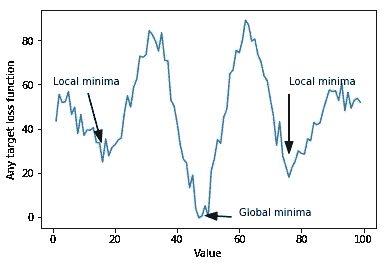
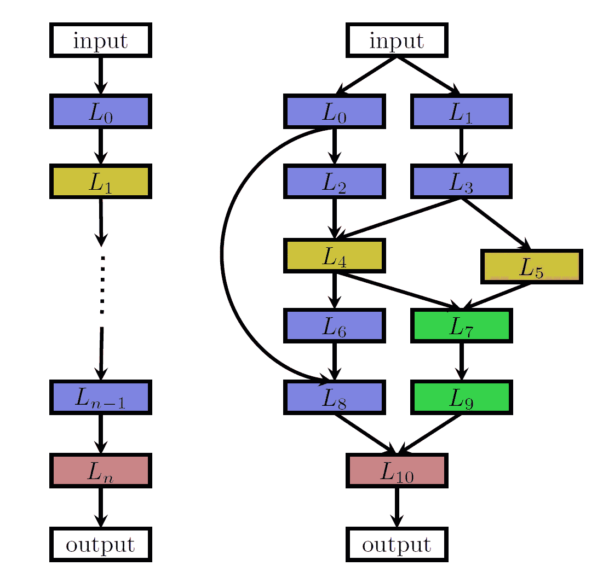

# 进化深度神经网络

> 原文：<https://towardsdatascience.com/evolving-deep-neural-networks-ceb8d135d74d?source=collection_archive---------12----------------------->

Photo by [Johannes Plenio](https://unsplash.com/@jplenio?utm_source=medium&utm_medium=referral) on [Unsplash](https://unsplash.com?utm_source=medium&utm_medium=referral)

近年来，我们许多人都看到深度学习在各个领域取得了巨大的成功，其中大部分来自于他们通过从数据中学习“分层特征提取器”来自动化经常繁琐和困难的特征工程阶段的能力[2]。此外，由于架构设计(即创建神经网络的形状和功能的过程)碰巧是一个漫长而困难的过程，主要由人工完成，创新性有限，大多数进展来自旧算法，这些算法在当今的计算资源和数据下表现非常好[13]。另一个问题是，深度神经网络主要通过梯度跟踪算法进行优化(例如， [SGD](https://en.wikipedia.org/wiki/Stochastic_gradient_descent) ， [RMSProp](https://en.wikipedia.org/wiki/Stochastic_gradient_descent#RMSProp) )，这些算法是约束搜索空间的重要资源，但容易陷入局部最优、鞍点和噪声梯度，特别是在强化学习等密集解决方案领域[6]。

Illustration of a function with noisy gradients and several local minima. A gradient following algorithm such as SGD will get easily trapped by the local minima if it is initialized in a low (0–30) or high (65–100) value.

这篇文章回顾了进化算法是如何被提出并被测试为解决上述问题的一个有竞争力的选择。

# 神经结构搜索

随着深度神经网络(DNN)变得更加成功，对允许更好性能的架构工程的需求一直在上升。随着 DNN 复杂性的增加，人类手动设计它们的能力受到限制，因此神经架构搜索( **NAS** )方法变得越来越重要。当考虑到萨顿的惨痛教训[15]时，这个问题变得特别有趣:

> 从 70 年的人工智能研究中可以得出的最大教训是，利用计算的一般方法最终是最有效的，而且是最有效的。

进化算法(EA)已被证明在这件事上是有用的[10]。

人们可能会认为 NAS 是一个三维过程[2]。第一个维度是他们的**搜索空间**，它定义了算法可能表示的可能架构。自然，更大的搜索空间意味着要测试更多可能的组合。为了使问题可解，一些约束直接在层上实现:

1.  选择最大层数。
2.  它们只能以链式(顺序)或多分支结构连接。
3.  图层类型的构建块是预定义的，但是它们的超参数可以调整。

Chain connected (left) and multi-branch neural network (right) examples. Each node represents a layer and each arrow symbolizes the connection between them. Reprinted from Elsken et al. [2].

接下来是**搜索策略**，它定义了如何探索搜索空间。一些常见的替代方法是随机搜索、贝叶斯优化、强化学习、基于梯度的优化和神经进化方法。进化 NAS 的第一种方法来自 Miller 等人[7]，他们使用遗传方法提出架构和反向传播来优化权重。然后，Stanley 和 Risto [12]提出了增强拓扑的神经进化(NEAT)，这是一种用于进化人工神经网络(ANN)的遗传算法(GA)，它不仅可以优化解决方案，还可以通过考虑适应性和多样性来使解决方案复杂化。最近，Real 等人[9]发现进化在准确性方面表现得与强化学习一样好，但它开发了更好的中期性能和更小的模型(下面给出了对这种情况的进一步描述)。

即便如此，遗传算法和 DNN 都以要求高资源而闻名，大约需要几千个 GPU 日。因此，为了使 NAS 成为一种可承受的策略，性能评估必须在比实际性能更低的可信度(即，通过使用近似值，确定性更低)上进行。这方面的一些例子是[11]，它使用人工神经网络来预测候选网络的性能，逼近帕累托最优前沿，以及[8]，通过实施性能估计策略，其中 LSTM 神经网络用于估计另一个候选神经网络的验证分数，仅给定几个时期的训练。一些方法不是进行估计，而是试图保持神经网络的功能，同时改变其结构，从而加快训练。Auto-Keras [5]就是基于这种方法构建的。

NAS 在传统神经网络结构中的应用已经在过去几年中进行了研究，产生了最新的技术成果。举例来说，Rawal 等人[8]提出了一种基于树的 DNN 编码，该编码通过遗传编程进行搜索，并基于标准语言建模(即预测大型语言语料库中的下一个单词)将 LSTM 性能提高了 0.9 个[困惑点](https://en.wikipedia.org/wiki/Perplexity)(即新模型现在更好地估计了目标语言分布)。此外，在图像分类方面，Real 等人[9]发展了 AmoebaNet-A，以实现 83.9%的 top-1 和 96.6%的 top-5 ImageNet 准确性，从而建立了一个新的技术状态。有人提出，通过利用遗传算法群体中固有的多样性来放大当前的集成方法，甚至通过直接奖励群体中的集成而不是直接模型，可以进一步发展这些结果。

# 进化强化学习

神经进化算法可分为同时进化权重和架构的算法(例如 NAS)和仅试图优化 DNN 权重的算法。进化算法与强化学习的结合通常是一种单一权重的实现。

在一般基于梯度的算法中，如随机梯度下降(SGD)约束探索梯度跟踪，它们的搜索空间变得有些线性，局部最小值成为一个问题[1]。此外，深度强化学习(Deep RL)带来了两个额外的问题:当回报稀少时，很难将行动与回报相关联，过早地收敛于局部最优(即，它们仅在做出一系列决策后发生，也称为时间信用分配)[14]，并且它们对超参数选择非常敏感[3]。

在 DRL，遗传算法被提出作为解决这些问题的方法。这样等人[13]用基于种群的无梯度遗传算法改进了 DNN 的权重，并发现它在困难的深度 RL 问题上表现良好，如 Atari 和人形运动。通过将他们的结果与随机搜索(RS)进行比较，他们发现 **GA 总是优于 RS，并且 RS 有时优于 RL** ，这表明局部最优、鞍点和噪声梯度正在阻碍基于梯度的方法的进展，并且在某些情况下，在原点周围区域的密集采样足以优于基于梯度的方法。他们还发现遗传算法的挂钟速度比 Q 学习快得多。

Such 等人[13]还指出，一个未知的问题是，在早期阶段使用遗传算法采样，然后切换到梯度搜索的混合方法是否会获得更好更快的结果。这正是 Khadka 等人[6]在**进化强化学习(ERL)** 中提出的，这是一种混合算法，它使用来自 EA 的群体来训练 RL 代理，并将代理重新插入群体中进行适应性评估。他们提出遗传算法是解决之前提到的深层 RL 问题的一个很好的替代方案，但它也很难优化大量的参数。因此，GA 的探索性和时间信用分配能力与来自深度 RL 的梯度相结合，以实现更快的学习。因此，**进化 RL 能够解决比深度确定性策略梯度(DDPG)更多的任务，并且比简单 GA 更快。**

# 底线

像[6]和[9]这样的实践研究已经证明了进化深度学习应用是一种推动技术发展的有用方法。然而，在采用的方法中仍然存在许多限制，就像在 ERL 使用预定义的 NAS 构建块和非交叉或非变异。此外，值得注意的是，进化算法被视为黑盒优化方法，因此它们很少提供为什么性能高的理解。

进一步的研究将决定人工智能在深度学习中的未来，但迄今为止，至少在中长期内，它们似乎将成为解决特定学习问题的重要工具。

# **参考文献**

1.  *Aly，Ahmed，David Weikersdorfer，Claire Delaunay (2019)，“用多重搜索神经进化优化深度神经网络。”更正，abs/1901.05988。*
2.  *埃尔斯肯，托马斯，简·亨德里克·梅岑和弗兰克·哈特(2018)，“神经架构搜索:一项调查。”更正，abs/1808.05377。*
3.  *Henderson、Peter、Riashat Islam、Philip Bachman、Joelle Pineau、Doina Precup 和 David Meger (2018 年)，“重要的深度强化学习。”在第三十二届 AAAI 人工智能会议上。*
4.  格雷戈里·霍恩比(2006)，“阿尔卑斯山:减少过早收敛问题的年龄分层人口结构。”《第八届遗传和进化计算年会论文集》, 815–822，ACM。
5.  *金，海峰，宋清泉，胡希贵(2018)，“Auto-keras:基于网络态射的高效神经结构搜索”*
6.  *Khadka、Shauharda 和 Kagan Tumer (2018 年)，“强化学习中进化导向的政策梯度。”在 NeurIPS。*
7.  *米勒、杰弗里·f、彼得·m·托德和沙伊莱什·u·黑格德(1989)，“使用遗传算法设计神经网络”在 ICGA。*
8.  *Rawal，Aditya 和 Risto Miikkulainen (2018)，“从节点到网络:进化的递归神经网络。”更正，abs/1803.04439。*
9.  *Real，Esteban，Alok Aggarwal，黄雁萍和 Quoc V Le (2019)，“图像分类器架构搜索的正则化进化”arXiv 预印本 arXiv:1802.01548。*
10.  *萨利曼斯、蒂姆、乔纳森·何、陈曦和伊利亚·苏茨基弗(2017)，“进化策略作为强化学习的可扩展替代方案。”更正，abs/1703.03864。*
11.  *史密森、肖恩·c、杨光、沃伦·j·格罗斯和布雷特·h·迈耶(2016)，“神经网络设计神经网络:多目标超参数优化。”2016 年 IEEE/ACM 计算机辅助设计国际会议(ICCAD)，1–8。*
12.  斯坦利，肯尼斯·o .和里斯托·米库拉宁(2002)，“通过扩充拓扑进化神经网络。”进化计算，10，99–127。
13.  费利佩·彼得罗斯基、瓦希什特·马德哈万、爱德华多·孔蒂、乔尔·雷曼、肯尼斯·o·斯坦利和杰夫·克鲁恩(2017)，“深度神经进化:遗传算法是训练深度神经网络进行强化学习的一种有竞争力的替代方法。”更正，abs/1712.06567。
14.  *萨顿、理查德·S、安德鲁·G·巴尔托等(1998)，《强化学习导论》，第 135 卷。麻省理工学院出版社剑桥。*
15.  理查德·萨顿(2019)。惨痛的教训。可在:【http://www.incompleteideas.net/IncIdeas/BitterLesson.html 【13/05/19 访问】
16.  *Zoph，Barret，Vijay Vasudevan，黄邦贤·施伦斯和 Quoc V . Le(2018)，“学习可扩展图像识别的可转移架构。”IEEE 计算机视觉和模式识别会议论文集，8697–8710。*